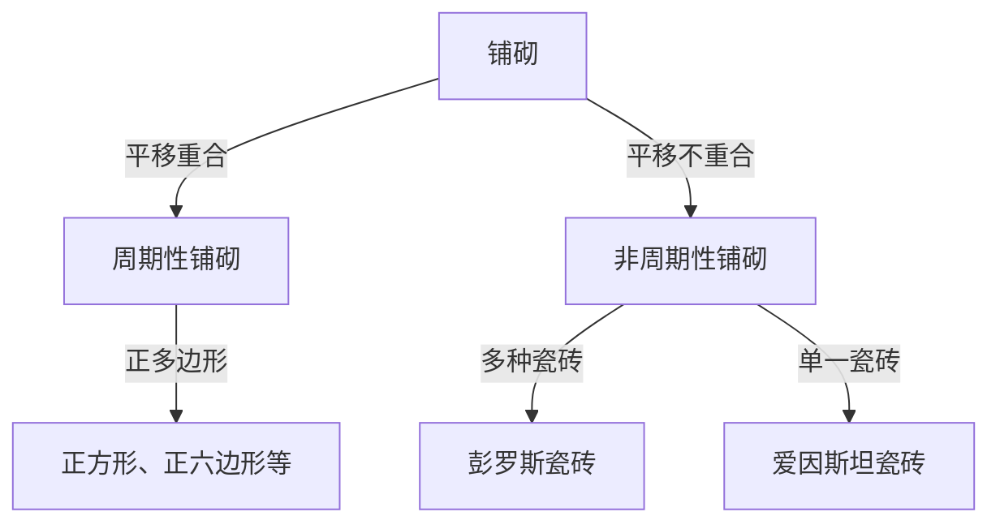

在数学世界中，存在一些看似简单却困扰了数学家几个世纪的未解之谜。“铺砌（Tessellation）”问题便是其中之一，它不仅局限于纯粹的几何学，还对物理学和材料科学产生了深远的影响。在本文中，我们将深入探讨非周期铺砌的历史以及它给结晶学带来的范式转变。

## 铺砌问题基础

用几何图形无缝隙、无重叠地覆盖一个平面被称为“铺砌”。最简单的例子是使用正方形或正三角形的“周期性”铺砌，其中的图案通过在特定方向上平移而无限重复。

## 探索非周期铺砌

1961年，数学家王浩提出了“王氏瓷砖”，引发了关于非周期铺砌可能性的讨论。随后在20世纪70年代，罗杰·彭罗斯发现，仅用两种形状（风筝和飞镖）就可以完全非周期性地覆盖平面，这就是“彭罗斯瓷砖”。这一发现具有令人惊叹的数学特性，如局部同构和随处可见的黄金分割率。

## 结晶学的范式转变：准晶体的发现

长期以来，彭罗斯瓷砖一直被视为数学游戏。然而，在1982年，丹·谢赫特曼在铝锰合金中发现了一种呈现“十重对称性”的衍射图样。这种在周期性结构中不可能出现的对称性，恰好与三维非周期铺砌的结构相吻合。由于发现了“准晶体”，谢赫特曼获得了2011年诺贝尔化学奖。

## 爱因斯坦问题与2023年的重大突破

在彭罗斯的发现之后，一个新问题被提出：“能否仅用一种形状的瓷砖，非周期性地铺满整个平面？”这被称为“爱因斯坦问题”（源自德语“ein stein”，意为“一块石头”）。几十年来这一问题一直悬而未决，直到2023年，大卫·史密斯及其团队发现了一种被称为“帽子（The Hat）”的十三边形瓷砖，终于证明了这一点。几个月后，他们又发现了无需镜像翻转的“幽灵（Spectre）”瓷砖，在几何学历史上留下了新的一页。

这些数学发现不仅仅是谜题；它们为开发新型超材料和具有未知物理特性的新材料带来了可能。
