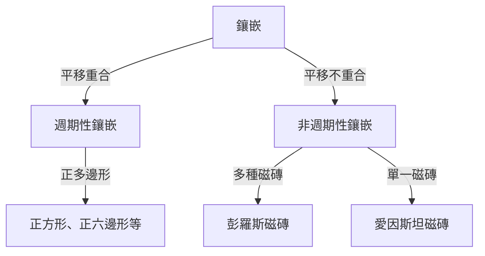

在數學世界中，存在一些看似簡單卻困擾了數學家幾個世紀的未解之謎。「鑲嵌（Tessellation）」問題便是其中之一，它不僅侷限於純粹的幾何學，還對物理學和材料科學產生了深遠的影響。在本文中，我們將深入探討非週期鑲嵌的歷史以及它給結晶學帶來的典範轉移。

## 鑲嵌問題基礎

用幾何圖形無縫隙、無重疊地覆蓋一個平面被稱為「鑲嵌」。最簡單的例子是使用正方形或正三角形的「週期性」鑲嵌，其中的圖案透過在特定方向上平移而無限重複。

## 探索非週期鑲嵌

1961年，數學家王浩提出了「王氏磁磚」，引發了關於非週期鑲嵌可能性的討論。隨後在20世紀70年代，羅傑·彭羅斯發現，僅用兩種形狀（風箏和飛鏢）就可以完全非週期性地覆蓋平面，這就是「彭羅斯磁磚」。這一發現具有令人驚嘆的數學特性，如局部同構和隨處可見的黃金分割率。

## 結晶學的典範轉移：準晶體的發現

長期以來，彭羅斯磁磚一直被視為數學遊戲。然而，在1982年，丹·謝赫特曼在鋁錳合金中發現了一種呈現「十重對稱性」的繞射圖樣。這種在週期性結構中不可能出現的對稱性，恰好與三維非週期鑲嵌的結構相吻合。由於發現了「準晶體」，謝赫特曼獲得了2011年諾貝爾化學獎。

## 愛因斯坦問題與2023年的重大突破

在彭羅斯的發現之後，一個新問題被提出：「能否僅用一種形狀的磁磚，非週期性地鋪滿整個平面？」這被稱為「愛因斯坦問題」（源自德語「ein stein」，意為「一塊石頭」）。幾十年來這一問題一直懸而未決，直到2023年，大衛·史密斯及其團隊發現了一種被稱為「帽子（The Hat）」的十三邊形磁磚，終於證明了這一點。幾個月後，他們又發現了無需鏡像翻轉的「幽靈（Spectre）」磁磚，在幾何學歷史上留下了新的一頁。

這些數學發現不僅僅是謎題；它們為開發新型超材料和具有未知物理特性的新材料帶來了可能。
