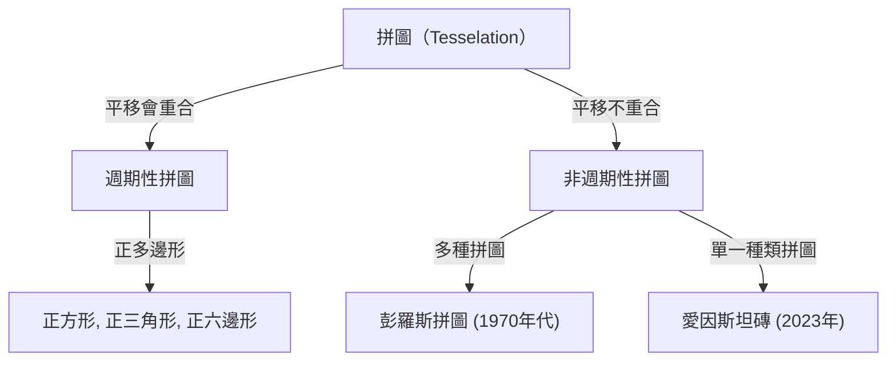
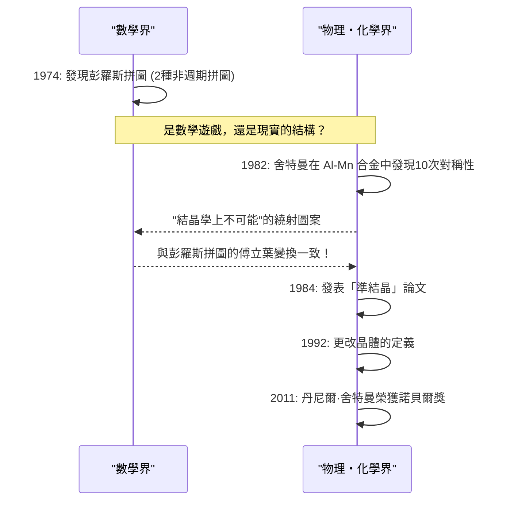

在數學的世界裡，存在著許多看似簡單，卻數世紀以來一直困擾著數學家們大腦的未解問題。其中關於「拼圖（Tesselation / Tiling，鑲嵌）」的問題，超越了純粹的幾何學範疇，對物理學、材料科學，甚至藝術都產生了深遠的影響。

本文將從非週期拼圖的基礎開始，深入探討羅傑·彭羅斯（Roger Penrose）的「彭羅斯拼圖（Penrose tiling）」、丹尼爾·舍特曼（Dan Shechtman）獲得諾貝爾獎的「準結晶」發現，以及2023年震驚世界的「愛因斯坦磚（非週期單一拼圖，Aperiodic monotile）」發現，徹底挖掘數學與結晶學交會的宏大故事。

## 1. 拼圖問題的基礎與週期性

將平面無縫隙且不重疊地用圖形填滿稱為「拼圖（鑲嵌）」。最簡單的例子是使用正方形、正三角形、正六邊形進行拼圖。這些被稱為「週期性」拼圖，某個圖案朝特定方向平移便會無限重複。

### 週期性與對稱性

在結晶學中，長期以來人們相信填滿空間的原子排列是「週期性」的。週期性結構可以具有2次、3次、4次或6次旋轉對稱性，但數學上已證明具有**5次對稱性**或**8次以上對稱性**的週期性結構是不可能的（結晶學限制定理）。



## 2. 探索非週期拼圖：王氏磚

1961年，數學家王浩發明了被稱為「王氏磚（Wang tiles）」的邊緣塗有顏色的正方形拼圖。他推測「如果任何一組拼圖能填滿平面，那麼它就能夠進行週期性拼圖」。然而，他的學生羅伯特·伯格（Robert Berger）在1966年推翻了這個猜想，發現了一組**「只能以非週期性」**填滿平面的拼圖集合（最初是20,426塊，後來減少到104塊）。

## 3. 彭羅斯拼圖的衝擊

1970年代，英國物理學家兼數學家羅傑·彭羅斯（2020年諾貝爾物理學獎得主）成功地將非週期拼圖所需的拼圖種類大幅減少。他僅使用**2種**拼圖（「風箏（kite）」和「飛鏢（dart）」，或者兩種菱形），就發現了只能以非週期性填滿平面的「彭羅斯拼圖」。

### 數學性質

彭羅斯拼圖具有以下驚人的性質：
1. **非週期性**：無論截取多大範圍並進行平移，都永遠無法與原來的圖案完全重合。
2. **局部同構性**：任何有限大小的圖案，都會在無限延伸的拼圖中無限次出現。
3. **黃金比例**：2種拼圖的比例、圖案的面積比等，黃金比例 $\phi = \frac{1 + \sqrt{5}}{2}$ 無處不在。

$$ \lim_{R \to \infty} \frac{N_{kite}(R)}{N_{dart}(R)} = \phi \approx 1.618 $$

### 使用 Python 的簡單碎形生成概念

彭羅斯拼圖可以使用「膨脹規則（Inflation rules）」進行遞迴生成。以下是使用 Python 的概念性遞迴分割範例。

```python
import matplotlib.pyplot as plt
import numpy as np

# 黃金比例
PHI = (1 + np.sqrt(5)) / 2

class Triangle:
    def __init__(self, color, p1, p2, p3):
        self.color = color
        self.p1 = p1
        self.p2 = p2
        self.p3 = p3

def inflate(triangles):
    new_triangles = []
    for t in triangles:
        if t.color == 0: # Half-kite
            # 分割計算 (概念)
            p4 = t.p1 + (t.p2 - t.p1) / PHI
            new_triangles.append(Triangle(1, p4, t.p3, t.p1))
            new_triangles.append(Triangle(0, t.p2, t.p3, p4))
        else: # Half-dart
            p4 = t.p1 + (t.p2 - t.p1) / PHI
            p5 = t.p3 + (t.p2 - t.p3) / PHI
            new_triangles.append(Triangle(1, p4, p5, t.p1))
            # 為了簡化而省略部分程式碼
    return new_triangles

# 雖然省略了繪圖處理等實作，
# 但像這樣透過遞迴的分割（膨脹），可以生成無限的非週期圖案。
```

## 4. 結晶學的典範轉移：發現準結晶

彭羅斯拼圖長期以來被認為是「數學玩具」。然而在1982年，以色列材料科學家丹尼爾·舍特曼在觀察鋁和錳合金的電子繞射圖案時，發現了令人難以置信的現象。

那是一種**「具有清晰的繞射斑點（顯示高度有序性），同時呈現10次對稱性（週期結構中不可能出現的對稱性）」**的物質。

### 科學界的反彈與諾貝爾獎

在當時結晶學的常識中，晶體被定義為具有週期性原子排列的物質。「非週期卻具有高度秩序」的狀態被認為是矛盾的，因此舍特曼的發現起初被強烈批評為雙重繞射等實驗錯誤。就連萊納斯·鮑林（Linus Pauling）這樣偉大的化學家也曾嘲笑說：「沒有準結晶這種東西，只有準科學家。」

然而，隨後詳細的研究證明了舍特曼的發現是真實的。這種物質的原子排列，擁有與3維空間中的彭羅斯拼圖（非週期拼圖）完全相同的數學結構。這種物質被命名為**「準結晶（Quasicrystal）」**，國際結晶學聯合會（IUCr）在1992年不得不將晶體的定義從「週期性」更改為「呈現離散繞射圖形（discrete diffraction diagram）的物質」。舍特曼因這項成就，於2011年榮獲諾貝爾化學獎。



## 5. 愛因斯坦問題：追求非週期單一拼圖

彭羅斯拼圖證明了用「2種」拼圖可以實現非週期拼圖。於是數學家們提出了下一個終極疑問。

**「是否可能僅用1種拼圖，就只能以非週期性填滿平面？」**

德語中的 "ein stein" 意思是「一塊石頭」，因此這個問題被稱為**「愛因斯坦問題（Einstein problem）」**，而滿足該條件的假想拼圖則被稱為「愛因斯坦磚（Einstein tile）」。

數十年來，許多數學家挑戰了這個問題，但一直未能解決。雖然有像泰勒-索科洛六邊形（Taylor-Socolar hexagonal tile，1999年）這樣的發現，但需要相鄰規則或圖案的限制。純粹依靠形狀就能成為愛因斯坦磚的多邊形，長久以來一直未被發現。

## 6. 2023年的重大突破：「帽子」與「幽靈」

然後在2023年3月，令人震驚的消息傳遍了世界。由業餘數學愛好者大衛·史密斯（David Smith）以及克雷格·卡普蘭（Craig Kaplan）、約瑟夫·邁爾斯（Joseph Myers）、查伊姆·古德曼-斯特勞斯（Chaim Goodman-Strauss）組成的研究團隊，證明了一種被稱為**「帽子（The Hat）」**的13邊形單一拼圖就是愛因斯坦磚。

### 「帽子（The Hat）」磚的幾何學

帽子磚的形狀像是將8個以正六邊形為基礎的「風箏（kite）」組合在一起（polykite）。這塊拼圖包含其鏡像（翻轉的形狀）在內，可以完全且僅以非週期性的方式填滿平面。

$$ \text{Hat Tile} = 8 \times \text{Kites from a Hexagon} $$

### 嚴格的手性非週期單一拼圖「幽靈」

「帽子」的發現本身已經是歷史性的壯舉，但一些數學家指出：「允許使用鏡像（翻轉），實際上不就等於使用了2種拼圖嗎？」

對此，同一個研究團隊在短短幾個月後的2023年5月，發表了一種名為**「幽靈（The Spectre）」**的新拼圖。幽靈完全不使用鏡像（無需翻轉），純粹只靠平移和旋轉就能實現非週期拼圖，是「嚴格的非週期單一拼圖」。至此，跨越數十年的「愛因斯坦問題」獲得了最完美的解答。

## 7. 結論：幾何學開拓的未來

從王浩的猜想到彭羅斯的直覺、舍特曼的不屈精神，再到史密斯等人的最新突破，非週期拼圖的歷史，是一連串顛覆了人們認為「不可能」之事的過程。

這些數學發現不僅僅是謎題。準結晶已經被應用在平底鍋的塗層、手術用手術刀、以及提升 LED 效率等方面。這次發現的「帽子」與「幽靈」，未來也有潛力應用於設計新的超材料，或開發具有未知物理性質的新材質。

抽象的數學探索如何與物理的現實世界緊密相連，並改寫我們對宇宙的理解。非週期拼圖的故事，可以說是其中最美麗、也最強而有力的證明之一。
