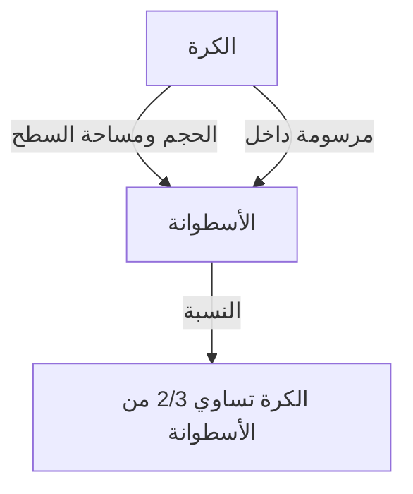
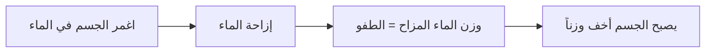

# 1. مقدمة: أعظم عقل في العالم القديم

كان أرخميدس (حوالي 287 ق.م - حوالي 212 ق.م) عالم رياضيات وفيزياء ومهندسًا ومخترعًا وفلكيًا يونانيًا قديمًا. يُعترف به على نطاق واسع كواحد من أعظم العلماء في العالم القديم، وأرست إنجازاته الأساس للعلوم والرياضيات الحديثة. وُلد في سرقوسة (على جزيرة صقلية الحديثة، إيطاليا)، حيث قضى معظم حياته، وأظهر موهبة استثنائية في كل من الاستكشاف الرياضي البحت والاختراعات الهندسية العملية.

في هذا المقال، سنتعمق في عبقريته، من الحكايات الدرامية عن حياته إلى الإنجازات الرياضية والفيزيائية المذهلة التي تركها وراءه. من خلال تتبع [مسار](/ar/p/windows-%E3%81%A7%D9%85%D8%B3%D8%A7%D8%B1%E3%81%AE%E9%80%9A%E3%81%A3%E3%81%9F%D9%85%D9%84%D9%81-%D8%AA%D9%86%D9%81%D9%8A%D8%B0%D9%8A%E3%81%AE%E5%A0%B4%E6%89%80%E3%82%92%E8%A6%8B%E3%81%A4%E3%81%91%E3%82%8B%E6%96%B9%E6%B3%95/) تفكيره، يمكننا أن نفهم كيف ترتبط المعرفة القديمة بالعلم الحديث. مساهماته ليست مجرد آثار تاريخية، بل تمثل الموقف ذاته المتمثل في استكشاف الحقائق العالمية التي تتدفق تحت أسس العلم والتكنولوجيا الحديثة.

# 2. حياته وحكاياته الأسطورية

تم ترك الكثير من السجلات المتعلقة بحياة أرخميدس من قبل المؤرخين القدماء مثل بلوتارخ وتيتوس ليفيوس. حياته مليئة بالعديد من الحكايات الأسطورية.

## 2.1 التاج الذهبي و"يوريكا!"

الحكاية الأكثر شهرة المرتبطة بأرخميدس هي التحقق من التاج، والمعروفة بكلمة "يوريكا!" (وجدتها!). أعطى الملك هيرو الثاني ملك سرقوسة صائغًا ذهبًا خالصًا لصنع تاج، لكنه اشتبه في أن الحرفي قد خدعه بخلط الفضة بالذهب. أمر الملك أرخميدس بإيجاد طريقة لكشف هذا الاحتيال دون إتلاف التاج.

في أحد الأيام، أثناء نزوله إلى حوض استحمام في حمام عام، لاحظ أرخميدس أن مستوى الماء يرتفع كلما غاص جسده. أدرك أن هذه الظاهرة يمكن استخدامها لقياس حجم التاج بدقة. يُقال إنه كان يغمره الفرح لدرجة أنه نسي أن يرتدي ملابسه واندفع إلى الشوارع عارياً، يركض ويصرخ: "يوريكا! يوريكا!"

تطور هذا الاكتشاف لاحقًا إلى المبدأ الأساسي في الهيدروستاتيكا المعروف باسم "مبدأ أرخميدس".

## 2.2 الدفاع عن سرقوسة والأسلحة العجيبة

خلال الحرب البونيقية الثانية (218 ق.م - 201 ق.م)، حاصر الجنرال الروماني ماركوس كلاوديوس مارسيليوس سرقوسة. في هذا الوقت، كان أرخميدس، الذي كان متقدماً في السن بالفعل، يعذب الجيش الروماني بشكل كبير باستخدام العديد من الأسلحة التي اخترعها.

تشمل الأسلحة التي يُقال إنه ابتكرها ما يلي:

- **مخلب أرخميدس** (The Claw of [Archimedes](https://kenji.blog/ar/p/archimedes/)): آلة عملاقة تشبه الرافعة يُقال إنها رفعت سفن العدو من البحر وقلبتها.
- **شعاع الحرارة** (Heat Ray): أسطورة تقول إنه استخدم عددًا كبيرًا من المرايا لجمع ضوء الشمس وتركيزه على السفن الحربية الرومانية، مما تسبب في اشتعال النار فيها. لا تزال صحة هذا الأمر موضع نقاش حتى اليوم.
- **المنجنيقات القوية** (Catapults): كانت تقذف الحجارة الضخمة بدقة من مسافة بعيدة، وتدمر تشكيلات العدو.

بفضل هذه الأسلحة الدفاعية، أمضى الجيش الروماني عدة سنوات في محاولة الاستيلاء على سرقوسة.

## 2.3 نهاية مأساوية: "لا تزعج دوائري!"

في عام 212 ق.م، سقطت سرقوسة أخيرًا في يد الجيش الروماني. كان الجنرال مارسيليوس يقدّر عبقرية أرخميدس تقديراً عالياً وأعطى أوامر صارمة للقبض عليه حياً.

ومع ذلك، عندما دخل جندي روماني منزل أرخميدس، كان منغمساً في الأشكال الهندسية المرسومة على الرمل. عندما أمره الجندي بذكر اسمه، رفض الامتثال، قائلاً: "لا تزعج دوائري! (Noli turbare circulos meos!)" وقُتل على يد الجندي الغاضب. حزن مارسيليوس بشدة على هذا الموت، وبناءً على وصية أرخميدس، يُقال إنه بنى قبراً نُقش عليه شكل كرة مرسومة داخل أسطوانة.

# 3. إنجازات رياضية مذهلة

تكمن العظمة الحقيقية لأرخميدس في بصيرته الرياضية. لقد وسع حدود الرياضيات في ذلك الوقت بشكل كبير، تاركاً تأثيراً هائلاً على علماء الرياضيات في المستقبل.

## 3.1 تقريب قيمة باي ("قياس الدائرة")

حدد أرخميدس تقريبًا دقيقًا لقيمة باي ($\pi$)، وهي نسبة محيط الدائرة إلى قطرها. استخدم "طريقة الاستنفاد"، والتي تضمنت حصر محيط الدائرة من أعلى ومن أسفل باستخدام مضلعات منتظمة محاطة ومحيطة.

بدأ بسداسي منتظم وضاعف عدد الأضلاع على التوالي، وقام في النهاية بإجراء الحساب باستخدام مضلع منتظم مكون من 96 ضلعًا. ونتيجة لذلك، أثبت أن قيمة باي $\pi$ تقع ضمن النطاق التالي:

$$
3 \frac{10}{71} < \pi < 3 \frac{1}{7}
$$

معبراً عنها بكسور، تكون تقريباً كما يلي:

$$
\frac{223}{71} < \pi < \frac{22}{7}
$$

أي أن $3.1408 < \pi < 3.1429$، وكان قد استنتج قيمة دقيقة إلى منزلتين عشريتين. يمكن النظر إلى هذه الطريقة على أنها مقدمة لمفهوم النهايات في حساب التفاضل والتكامل.

## 3.2 نظرية الكرة والأسطوانة ("عن الكرة والأسطوانة")

كان الإنجاز الذي افتخر به أرخميدس أكثر من غيره هو اكتشاف النظريات المتعلقة بمساحة سطح وحجم الكرة. أثبت أن هناك علاقة رياضية جميلة بين الكرة والأسطوانة المحيطة بها (أسطوانة ارتفاعها وقطر قاعدتها يساوي قطر الكرة).

باعتبار أن نصف القطر هو $r$، فإن حجم الكرة $V_{\text{الكرة}}$ وحجم الأسطوانة $V_{\text{الأسطوانة}}$ يكونان كما يلي:

$$
V_{\text{الكرة}} = \frac{4}{3}\pi r^3
$$
$$
V_{\text{الأسطوانة}} = \pi r^2 \cdot (2r) = 2\pi r^3
$$

لذلك، حجم الكرة يساوي بالضبط $\frac{2}{3}$ من حجم الأسطوانة المحيطة.

قام بإجراء حساب مماثل لمساحة السطح. مساحة سطح الكرة $S_{\text{الكرة}}$ ومساحة السطح الإجمالية للأسطوانة $S_{\text{الأسطوانة}}$، والتي تجمع بين مساحتها الجانبية والقاعدة، هي كما يلي:

$$
S_{\text{الكرة}} = 4\pi r^2
$$
$$
S_{\text{الأسطوانة}} = 2\pi r \cdot (2r) + 2 \cdot (\pi r^2) = 4\pi r^2 + 2\pi r^2 = 6\pi r^2
$$

هنا أيضًا، مساحة سطح الكرة هي $\frac{2}{3}$ من مساحة سطح الأسطوانة المحيطة. كان فخوراً للغاية بهذه الصدفة الرائعة، وترك تعليمات مكتوبة لنقش هذا الشكل على شاهد قبره.

## 3.3 تربيع القطع المكافئ ("تربيع القطع المكافئ")

طور أرخميدس أيضًا طرقًا لإيجاد المساحة المحصورة بالمنحنيات. أثبت أن مساحة الجزء المكافئ المتشكل عن طريق تقاطع قطع مكافئ مع خط مستقيم هي $\frac{4}{3}$ أضعاف مساحة مثلث له نفس القاعدة والارتفاع.

يتم استخدام مفهوم مجموع متسلسلة هندسية لانهائية في هذا الإثبات. قام برسم عدد لا نهائي من المثلثات داخل الجزء المكافئ وحسب مجموع مساحاتها.

$$
\sum_{n=0}^{\infty} \left(\frac{1}{4}\right)^n = 1 + \frac{1}{4} + \frac{1}{16} + \frac{1}{64} + \dots = \frac{4}{3}
$$

هذا هو أحد الأمثلة الأولى في تاريخ الرياضيات حيث تم حساب متسلسلة لانهائية بدقة.

## 3.4 استكشاف الأرقام العملاقة ("حاسب الرمال")

في اليونان القديمة، كان النظام المتبع للتعبير عن الأعداد الكبيرة غير ملائم، وكان "الميرياد" (10000) هو أكبر وحدة أساسية. في حين اعتقد بعض الناس أن "عدد حبات الرمل التي تملأ الكون لا نهائي"، كتب أرخميدس عملاً يسمى "حاسب الرمال" لدحض ذلك.

ابتكر نظامًا رقميًا جديدًا للتعبير عن الأرقام العملاقة بمفرده وافترض نموذجًا عملاقًا للكون يعتمد على نظرية مركزية الشمس لأريستارخوس. ثم قام بحساب عدد حبات الرمل المطلوبة لملء هذا الكون دون أي فجوات.

ونتيجة لذلك، أظهر أن العدد لن يتجاوز $8 \times 10^{63}$ (بالتدوين الحديث). ميّز هذا العمل بوضوح بين اللانهائي والمحدود، وكان قطعة رائدة قدمت مفهومًا أسيًا للتعامل مع الأعداد الكبيرة.

## 3.5 فجر حساب التفاضل والتكامل ("المنهج")

في عام 1906، تم اكتشاف مخطوطة طرس (مخطوطة كُشط نصها وأعيد استخدامها) تحتوي على العديد من أعمال أرخميدس المفقودة في القسطنطينية (إسطنبول الحديثة). احتوت هذه "مخطوطة أرخميدس" على أطروحة لا تقدر بثمن بعنوان "منهج النظريات الميكانيكية".

في هذا العمل، يكشف أرخميدس عن "عملية تفكيره" حول كيفية وصوله إلى العديد من الاكتشافات الهندسية. قسّم الأشكال إلى مجموعات من "الخطوط" أو "المستويات" الرفيعة بشكل لا نهائي وخمّن مساحاتها وأحجامها باستخدام نموذج ميكانيكي لموازنتها على ميزان. هذا النهج هو في الأساس نفس "حساب التفاضل والتكامل التكاملي" الذي تم تأسيسه في عصور لاحقة من قبل [إسحاق نيوتن](https://kenji.blog/ar/p/newton/) وغوتفريد لايبنيز، مما يدل على أن أرخميدس كان قد وصل إلى خطوات قليلة من مفهوم حساب التفاضل والتكامل.

## 3.6 مجسمات أرخميدس

وسع أرخميدس المجسمات الأفلاطونية (متعددات الوجوه المنتظمة) واكتشف 13 نوعًا من متعددات الوجوه شبه المنتظمة (مجسمات أرخميدس) التي تتكون من أنواع متعددة من المضلعات المنتظمة ولها نفس التكوين الرأسي في كل مكان. على الرغم من فقدان عمله الأصلي، فقد تم الاستشهاد به لاحقًا من قبل علماء الرياضيات مثل بابوس. وتلعب هذه الأشكال أيضًا دورًا مهمًا في علم البلورات والكيمياء الحديث (على سبيل المثال، هيكل جزيء الفوليرين).

# 4. مساهمات في الفيزياء والهندسة

لم يقم أرخميدس باكتشافات رائدة في الرياضيات فحسب، بل في مجالات الفيزياء والهندسة أيضًا. كانت أبحاثه دمجًا رائعًا بين النظرية والتطبيق.

## 4.1 مبدأ أرخميدس (الهيدروستاتيكا)

فيما يتعلق بحلقة "يوريكا" المذكورة أعلاه، فقد صاغ القانون الأساسي فيما يتعلق بالطفو الذي تعاني منه الأجسام في الموائع في عمل بعنوان "عن الأجسام الطافية".

> **مبدأ أرخميدس** : أي جسم مغمور كليًا أو جزئيًا في مائع (سائل أو غاز)، يتعرض لقوة دفع إلى أعلى تساوي وزن المائع الذي أزاحه الجسم.

لا يزال هذا المبدأ نظرية أساسية لا غنى عنها في ميكانيكا الموائع الحديثة، كما هو الحال في تصميم السفن والتحكم في طفو الغواصات.

## 4.2 قانون الرافعة ومركز الثقل

أرسى أرخميدس أيضًا الأساس للميكانيكا. في "عن توازن المستويات"، أثبت رياضيًا "قانون الرافعة". وصاغ الشروط الخاصة بتوازن الأجسام المعلقة على طرفي رافعة، ويُقال إنه ترك الكلمات الشهيرة التالية:

"أعطني مكانًا أقف فيه، وسأحرك الأرض."

كما أسس طرقًا دقيقة لحساب "مركز الثقل" للأشكال الهندسية المختلفة. هذا مفهوم حاسم يشكل أساس الميكانيكا الإنشائية والهندسة المعمارية الحديثة.

## 4.3 برغي أرخميدس (مضخة المياه)

كان أكثر اختراعاته الهندسية انتشارًا هو "برغي أرخميدس" (مضخة لولبية). يحيط هذا الجهاز بشفرة لولبية داخل أسطوانة عملاقة. عن طريق إمالة وتدوير الأسطوانة، يمكن ضخ المياه من مكان منخفض إلى مكان أعلى.

يُقال إنه تم اختراعه أثناء إقامته في مصر لضخ المياه من نهر النيل للري. لا تزال هذه الآلية البسيطة والفعالة مستخدمة حتى اليوم في الزراعة ومرافق معالجة مياه الصرف الصحي في جميع أنحاء العالم، ويتم تطبيقها أيضًا لنقل المساحيق والحبوب.

# 5. التأثير على الأجيال القادمة والإرث

أصبحت الأعمال التي تركها أرخميدس بمثابة كتاب مقدس للعلماء من العصر الهلنستي إلى العصر الروماني، ولاحقًا في العالم العربي في العصور الوسطى وأوروبا في عصر النهضة. أشاد غاليليو غاليلي بأرخميدس ووصفه بأنه "شخصية خارقة" ودرس أساليبه بحماس. كما تأثر يوهانس كيبلر و[رينيه ديكارت](https://kenji.blog/ar/p/descartes/) ونيوتن، الذي أتقن حساب التفاضل والتكامل، بشكل كبير بكتابات أرخميدس، بشكل مباشر وغير مباشر.

تستمر روح البحث والمنهجية لديه في التألق ليس فقط كآثار قديمة، ولكن كنموذج أولي للتفكير العلمي. أرخميدس هو الشخص الذي جسد بمفرده الركائز الثلاث للعلم الحديث: الإثبات الصارم في الرياضيات، والنمذجة الرياضية للظواهر الفيزيائية، والتطوير التكنولوجي العملي الذي يطبق النظرية.

# 6. خاتمة

كان أرخميدس، عبقري سرقوسة، يمتلك عقلاً جباراً لا مثيل له في العالم القديم. لا تزال صرخته "يوريكا" تنتقل كعبارة ترمز إلى بهجة الاكتشاف العلمي. تغطي إنجازاته نطاقًا واسعًا، بدءًا من الحساب الدقيق لقيمة باي، واكتشاف العلاقة الجميلة بين الكرة والأسطوانة، وتوقع مفاهيم حساب التفاضل والتكامل، إلى إرساء أسس الهيدروستاتيكا والميكانيكا.

كلماته الأخيرة، "لا تزعج دوائري"، تتحدث عن هوسه النقي وغير العادي بالسعي وراء الحقيقة. حتى اليوم، وبعد مرور أكثر من 2000 عام، تستمر المعرفة والإلهام اللذان تركهما أرخميدس في دعم أسس مجتمعنا كعلامة إرشادية أبدية تنير تطور العلم والرياضيات.
