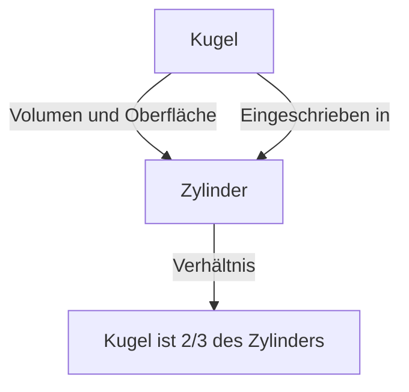

# 1. Einleitung: Der größte Intellekt der antiken Welt

[Archimedes](https://kenji.blog/de/p/archimedes/) (ca. 287 v. Chr. - ca. 212 v. Chr.) war ein antiker griechischer Mathematiker, Physiker, Ingenieur, Erfinder und Astronom. Er gilt weithin als einer der bedeutendsten Wissenschaftler der antiken Welt, und seine Errungenschaften legten den Grundstein für die moderne Wissenschaft und Mathematik. Geboren in Syrakus (auf der heutigen Insel Sizilien, Italien), wo er den größten Teil seines Lebens verbrachte, zeigte er außergewöhnliches Talent sowohl in der rein mathematischen Erforschung als auch bei praktischen technischen Erfindungen.

In diesem Artikel werden wir tief in sein Genie eintauchen, von den dramatischen Anekdoten seines Lebens bis zu den erstaunlichen mathematischen und physikalischen Errungenschaften, die er hinterlassen hat. Indem wir den Verlauf seines Denkens nachzeichnen, können wir verstehen, wie altes Wissen mit der modernen Wissenschaft verbunden ist. Seine Beiträge sind nicht bloß historische Relikte, sondern repräsentieren genau jene Haltung der Erforschung universeller Wahrheiten, die das Fundament der modernen Wissenschaft und Technologie bildet.

# 2. Leben und legendäre Episoden

Ein Großteil der Aufzeichnungen über das Leben des [Archimedes](https://kenji.blog/de/p/archimedes/) wurde von antiken Historikern wie Plutarch und Livius hinterlassen. Sein Leben ist von zahlreichen legendären Episoden geprägt.

## 2.1 Die goldene Krone und "Heureka!"

Die berühmteste Anekdote im Zusammenhang mit [Archimedes](https://kenji.blog/de/p/archimedes/) ist die Überprüfung einer Krone, bekannt durch das Wort "Heureka!" (Ich hab's gefunden!). König Hieron II. von Syrakus gab einem Goldschmied reines Gold, um eine Krone anzufertigen, verdächtigte den Handwerker jedoch, betrogen zu haben, indem er dem Gold Silber beimischte. Der König befahl [Archimedes](https://kenji.blog/de/p/archimedes/), einen Weg zu finden, diesen Betrug aufzudecken, ohne die Krone zu beschädigen.

Als [Archimedes](https://kenji.blog/de/p/archimedes/) eines Tages in einem öffentlichen Badehaus in eine Wanne stieg, bemerkte er, dass der Wasserspiegel stieg, als sein Körper in das Wasser eintauchte. Er erkannte, dass dieses Phänomen genutzt werden konnte, um das Volumen der Krone genau zu messen. Es wird erzählt, dass er so außer sich vor Freude war, dass er vergaß, sich anzuziehen, und nackt auf die Straße stürmte, während er schrie: "Heureka! Heureka!"

Diese Entdeckung entwickelte sich später zu dem als "Archimedisches Prinzip" bekannten Grundprinzip der Hydrostatik.

## 2.2 Die Verteidigung von Syrakus und wundersame Waffen

Während des Zweiten Punischen Krieges (218 v. Chr. - 201 v. Chr.) wurde Syrakus von dem römischen General Marcus Claudius Marcellus belagert. Zu dieser Zeit quälte der bereits betagte [Archimedes](https://kenji.blog/de/p/archimedes/) die römische Armee mit zahlreichen von ihm erfundenen Waffen.

Zu den Waffen, die er erfunden haben soll, gehören folgende:

- **Die Kralle des [Archimedes](https://kenji.blog/de/p/archimedes/)** (The Claw of [Archimedes](https://kenji.blog/de/p/archimedes/)): Eine riesige kranähnliche Maschine, die angeblich feindliche Schiffe aus dem Meer hob und zum Kentern brachte.
- **Hitzestrahl** (Heat Ray): Eine Legende besagt, dass er eine große Anzahl von Spiegeln benutzte, um Sonnenlicht zu bündeln und auf römische Kriegsschiffe zu richten, wodurch diese in Brand gerieten. Der Wahrheitsgehalt dieser Legende wird bis heute debattiert.
- **Leistungsstarke Katapulte** (Catapults): Sie schleuderten riesige Steine präzise aus der Ferne und zerstörten feindliche Formationen.

Dank dieser Verteidigungswaffen verbrachte die römische Armee mehrere Jahre mit dem Versuch, Syrakus einzunehmen.

## 2.3 Ein tragisches Ende: "Störe meine Kreise nicht!"

Im Jahr 212 v. Chr. fiel Syrakus schließlich an die römische Armee. General Marcellus schätzte das Genie des [Archimedes](https://kenji.blog/de/p/archimedes/) sehr und gab den strengen Befehl, ihn lebend gefangen zu nehmen.

Als jedoch ein römischer Soldat das Haus des [Archimedes](https://kenji.blog/de/p/archimedes/) betrat, war dieser in geometrische Figuren vertieft, die er in den Sand gezeichnet hatte. Als der Soldat ihm befahl, seinen Namen zu nennen, weigerte er sich und sagte: "Störe meine Kreise nicht! (Noli turbare circulos meos!)" und wurde von dem wütenden Soldaten getötet. Marcellus trauerte zutiefst um diesen Tod und soll dem Testament des [Archimedes](https://kenji.blog/de/p/archimedes/) folgend ein Grabmal errichtet haben, in das die Figur einer in einen Zylinder eingeschriebenen Kugel eingraviert war.

# 3. Erstaunliche mathematische Errungenschaften

Die wahre Größe des [Archimedes](https://kenji.blog/de/p/archimedes/) liegt in seiner mathematischen Einsicht. Er erweiterte die Grenzen der damaligen Mathematik enorm und hinterließ einen massiven Einfluss auf künftige Mathematiker.

## 3.1 Näherung von Pi ("Kreismessung")

[Archimedes](https://kenji.blog/de/p/archimedes/) bestimmte eine genaue Näherung für Pi ($\pi$), das Verhältnis des Umfangs eines Kreises zu seinem Durchmesser. Er benutzte die "Exhaustionsmethode" (Ausschöpfungsmethode), bei der der Umfang des Kreises von oben und unten mit ein- und umbeschriebenen regelmäßigen Polygonen eingeschlossen wurde.

Er begann mit einem regelmäßigen Sechseck und verdoppelte sukzessive die Anzahl der Seiten, bis er die Berechnung schließlich mit einem regelmäßigen 96-Eck durchführte. Als Ergebnis bewies er, dass der Wert von Pi $\pi$ in den folgenden Bereich fällt:

$$
3 \frac{10}{71} < \pi < 3 \frac{1}{7}
$$

Als Brüche ausgedrückt, sieht es ungefähr so aus:

$$
\frac{223}{71} < \pi < \frac{22}{7}
$$

Das heißt, $3.1408 < \pi < 3.1429$, und er hatte damit einen auf zwei Dezimalstellen genauen Wert abgeleitet. Diese Methode kann als Vorläufer des Grenzwertkonzepts in der Infinitesimalrechnung angesehen werden.

## 3.2 Der Satz von Kugel und Zylinder ("Über Kugel und Zylinder")

Die Errungenschaft, auf die [Archimedes](https://kenji.blog/de/p/archimedes/) selbst am meisten stolz war, war die Entdeckung von Sätzen über die Oberfläche und das Volumen einer Kugel. Er bewies, dass es eine schöne mathematische Beziehung zwischen einer Kugel und einem umbeschriebenen Zylinder (einem Zylinder, dessen Höhe und Grundflächendurchmesser dem Durchmesser der Kugel entsprechen) gibt.

Sei der Radius $r$, das Volumen der Kugel $V_{\text{Kugel}}$ und das Volumen des Zylinders $V_{\text{Zylinder}}$ sind wie folgt:

$$
V_{\text{Kugel}} = \frac{4}{3}\pi r^3
$$
$$
V_{\text{Zylinder}} = \pi r^2 \cdot (2r) = 2\pi r^3
$$

Daher beträgt das Volumen der Kugel genau $\frac{2}{3}$ des Volumens des umbeschriebenen Zylinders.

Er führte eine ähnliche Berechnung für die Oberfläche durch. Die Oberfläche der Kugel $S_{\text{Kugel}}$ und die gesamte Oberfläche des Zylinders $S_{\text{Zylinder}}$, die aus Mantel- und Grundflächen besteht, sind wie folgt:

$$
S_{\text{Kugel}} = 4\pi r^2
$$
$$
S_{\text{Zylinder}} = 2\pi r \cdot (2r) + 2 \cdot (\pi r^2) = 4\pi r^2 + 2\pi r^2 = 6\pi r^2
$$

Auch hier beträgt die Oberfläche der Kugel $\frac{2}{3}$ der Oberfläche des umbeschriebenen Zylinders. Er war über diesen bemerkenswerten Zufall äußerst stolz und hinterließ schriftliche Anweisungen, diese Figur auf seinem Grabstein einzugravieren.

## 3.3 Quadratur der Parabel ("Die Quadratur der Parabel")

[Archimedes](https://kenji.blog/de/p/archimedes/) entwickelte auch Methoden zur Bestimmung der von Kurven eingeschlossenen Flächen. Er bewies, dass die Fläche eines Parabelsegments, das durch das Schneiden einer Parabel mit einer Geraden entsteht, das $\frac{4}{3}$-fache der Fläche eines Dreiecks mit gleicher Grundfläche und Höhe beträgt.

Bei diesem Beweis wird das Konzept der Summe einer unendlichen geometrischen Reihe verwendet. Er schrieb eine unendliche Anzahl von Dreiecken in das Parabelsegment ein und berechnete die Summe ihrer Flächen.

$$
\sum_{n=0}^{\infty} \left(\frac{1}{4}\right)^n = 1 + \frac{1}{4} + \frac{1}{16} + \frac{1}{64} + \dots = \frac{4}{3}
$$

Dies ist eines der ersten Beispiele in der Geschichte der Mathematik, bei dem eine unendliche Reihe exakt berechnet wurde.

## 3.4 Erforschung gigantischer Zahlen ("Der Sandrechner")

Im antiken Griechenland war das System zur Darstellung großer Zahlen unzureichend, und die "Myriade" (10.000) war die größte Basiseinheit. Da einige Menschen glaubten, dass "die Anzahl der Sandkörner, die das Universum füllen, unendlich ist", schrieb [Archimedes](https://kenji.blog/de/p/archimedes/) ein Werk namens "Der Sandrechner", um dies zu widerlegen.

Er entwarf selbst ein neues Zahlensystem, um gigantische Zahlen auszudrücken, und ging von einem riesigen Universumsmodell aus, das auf der heliozentrischen Theorie von Aristarchos basierte. Anschließend berechnete er die Anzahl der Sandkörner, die erforderlich wären, um dieses Universum lückenlos zu füllen.

Als Ergebnis zeigte er, dass die Zahl (in moderner Notation) nicht größer als $8 \times 10^{63}$ sein würde. Dieses Werk unterschied klar zwischen dem Unendlichen und dem Endlichen und war ein bahnbrechendes Stück, das ein exponentielles Konzept für den Umgang mit großen Zahlen präsentierte.

## 3.5 Die Anfänge der Infinitesimalrechnung ("Die Methode")

Im Jahr 1906 wurde in Konstantinopel (dem heutigen Istanbul) ein Palimpsest (ein Manuskript, dessen Text abgekratzt und wiederverwendet wurde) entdeckt, das viele der verlorenen Werke des [Archimedes](https://kenji.blog/de/p/archimedes/) enthielt. Dieses "[Archimedes](https://kenji.blog/de/p/archimedes/)-Palimpsest" enthielt eine unschätzbare Abhandlung mit dem Titel "Die Methode der mechanischen Lehrsätze".

In diesem Werk offenbart [Archimedes](https://kenji.blog/de/p/archimedes/) seinen "Denkprozess", wie er zu zahlreichen geometrischen Entdeckungen gelangte. Er zerlegte Figuren in Ansammlungen unendlich dünner "Linien" oder "Ebenen" und schätzte ihre Flächen und Volumen mithilfe eines mechanischen Modells ab, bei dem sie auf einer Waage balanciert wurden. Dieser Ansatz entspricht im Wesentlichen der "Integralrechnung", die in späteren Epochen von Isaac Newton und Gottfried Leibniz etabliert wurde, und zeigt, dass [Archimedes](https://kenji.blog/de/p/archimedes/) dem Konzept der Infinitesimalrechnung sehr nahe gekommen war.

## 3.6 Archimedische Körper

[Archimedes](https://kenji.blog/de/p/archimedes/) erweiterte die platonischen Körper (regelmäßige Polyeder) und entdeckte 13 Arten von halbregelmäßigen Polyedern (Archimedische Körper), die aus verschiedenen Arten regelmäßiger Polygone bestehen und an allen Ecken die gleiche Konfiguration aufweisen. Obwohl sein Originalwerk verloren ging, wurde es später von Mathematikern wie Pappos zitiert. Auch diese spielen in der modernen Kristallographie und Chemie (beispielsweise in der Struktur des Fullerenmoleküls) eine wichtige Rolle.

# 4. Beiträge zur Physik und Ingenieurwissenschaft

[Archimedes](https://kenji.blog/de/p/archimedes/) machte bahnbrechende Entdeckungen nicht nur in der Mathematik, sondern auch in den Bereichen Physik und Ingenieurwesen. Seine Forschung war eine großartige Verschmelzung von Theorie und Praxis.

## 4.1 Das Archimedische Prinzip (Hydrostatik)

Im Zusammenhang mit der oben erwähnten "Heureka"-Episode formulierte er in seinem Werk "Über schwimmende Körper" das grundlegende Gesetz bezüglich des Auftriebs, den Körper in Flüssigkeiten erfahren.

> **Archimedisches Prinzip** : Ein Körper, der ganz oder teilweise in ein Fluid (Flüssigkeit oder Gas) eintaucht, erfährt eine Auftriebskraft, die gleich der Gewichtskraft des vom Körper verdrängten Fluids ist.

Dieses Prinzip ist nach wie vor eine unverzichtbare grundlegende Theorie in der modernen Strömungsmechanik, wie etwa beim Schiffbau und bei der Auftriebskontrolle von U-Booten.

## 4.2 Das Hebelgesetz und der Schwerpunkt

[Archimedes](https://kenji.blog/de/p/archimedes/) legte auch den Grundstein für die Mechanik. In "Über das Gleichgewicht ebener Flächen" bewies er das "Hebelgesetz" mathematisch. Er formulierte die Bedingungen, unter denen Gegenstände an beiden Enden eines Hebels im Gleichgewicht sind, und soll folgende berühmte Worte hinterlassen haben:

"Gebt mir einen festen Punkt, und ich werde die Erde aus den Angeln heben."

Er etablierte auch präzise Methoden zur Berechnung des "Schwerpunkts" verschiedener geometrischer Figuren. Dies ist ein entscheidendes Konzept, das die Grundlage der modernen Strukturmechanik und Architektur bildet.

## 4.3 Die Archimedische Schraube (Wasserpumpe)

Die am weitesten verbreitete seiner technischen Erfindungen war die "Archimedische Schraube" (Schneckenpumpe). Diese Vorrichtung umschließt ein spiralförmiges Blatt in einem riesigen Zylinder. Durch Neigen und Drehen des Zylinders kann Wasser von einem niedrigeren an einen höheren Ort gepumpt werden.

Sie soll erfunden worden sein, als er sich in Ägypten aufhielt, um Wasser aus dem Nil zur Bewässerung zu pumpen. Dieser einfache und effiziente Mechanismus wird noch heute in der Landwirtschaft und in Kläranlagen weltweit eingesetzt und findet auch beim Transport von Pulvern und Getreide Anwendung.

# 5. Einfluss auf die Nachwelt und Vermächtnis

Die von [Archimedes](https://kenji.blog/de/p/archimedes/) hinterlassenen Werke wurden zu einer Bibel für Gelehrte von der hellenistischen Periode bis zur römischen Ära und später in der mittelalterlichen arabischen Welt und im Europa der Renaissance. Galileo Galilei lobte Archimedes als "übermenschliche Figur" und studierte dessen Methoden mit Begeisterung. Johannes Kepler, René Descartes und Newton, der die Infinitesimalrechnung perfektionierte, wurden ebenfalls direkt und indirekt stark von [Archimedes](https://kenji.blog/de/p/archimedes/)' Schriften beeinflusst.

Sein Forschergeist und seine Methodik strahlen nicht nur als antike Relikte weiter, sondern als Archetyp des wissenschaftlichen Denkens. [Archimedes](https://kenji.blog/de/p/archimedes/) ist die Person, die im Alleingang die drei Säulen der modernen Wissenschaft verkörperte: strenge Beweisführung in der Mathematik, mathematische Modellierung physikalischer Phänomene und praktische technologische Entwicklung unter Anwendung der Theorie.

# 6. Fazit

[Archimedes](https://kenji.blog/de/p/archimedes/), das Genie von Syrakus, besaß einen überwältigenden Intellekt, der in der antiken Welt seinesgleichen suchte. Sein Ausruf "Heureka" wird noch heute als Phrase weitergegeben, die die Freude an wissenschaftlichen Entdeckungen symbolisiert. Seine Errungenschaften umfassen ein breites Spektrum, von der präzisen Berechnung von Pi über die Entdeckung der schönen Beziehung zwischen Kugel und Zylinder bis hin zur Vorwegnahme von Konzepten der Infinitesimalrechnung und der Etablierung der Grundlagen von Hydrostatik und Mechanik.

Seine letzten Worte "Störe meine Kreise nicht" zeugen von seiner reinen und außergewöhnlichen Besessenheit von der Suche nach Wahrheit. Auch heute, über 2.000 Jahre später, stützen das Wissen und die Inspiration, die [Archimedes](https://kenji.blog/de/p/archimedes/) hinterlassen hat, weiterhin das Fundament unserer Gesellschaft als ewiger Wegweiser, der die Entwicklung von Wissenschaft und Mathematik beleuchtet.
