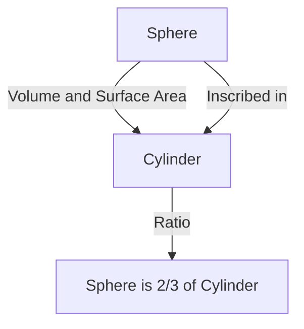

# 1. Introduction: The Greatest Intellect of the Ancient World

[Archimedes](https://kenji.blog/en/p/archimedes/) (c. 287 BC - c. 212 BC) was an ancient Greek mathematician, physicist, engineer, inventor, and astronomer. He is widely recognized as one of the greatest scientists in the ancient world, and his achievements laid the foundation for modern science and mathematics. Born in Syracuse (on the modern-day island of Sicily, Italy), where he spent most of his life, he demonstrated extraordinary talent in both pure mathematical exploration and practical engineering inventions.

In this article, we will delve deeply into his genius, from the dramatic anecdotes of his life to the astonishing mathematical and physical achievements he left behind. By tracing the trajectory of his thought, we can understand how ancient knowledge is connected to modern science. His contributions are not merely historical relics but represent the very attitude of exploring universal truths that flow beneath the foundation of modern science and technology.

# 2. Life and Legendary Episodes

Much of the record regarding [Archimedes](https://kenji.blog/en/p/archimedes/)' life was left by ancient historians such as Plutarch and Livy. His life is colored by numerous legendary episodes.

## 2.1 The Golden Crown and "Eureka!"

The most famous anecdote associated with [Archimedes](https://kenji.blog/en/p/archimedes/) is the authentication of a crown, known for the word "Eureka!" (I have found it!). King Hiero II of Syracuse gave a goldsmith pure gold to make a crown, but suspected that the craftsman had cheated by mixing silver into the gold. The king ordered [Archimedes](https://kenji.blog/en/p/archimedes/) to find a way to expose this fraud without damaging the crown.

One day, while stepping into a bath at a public bathhouse, [Archimedes](https://kenji.blog/en/p/archimedes/) noticed that the water level rose as his body sank. He realized that this phenomenon could be used to accurately measure the volume of the crown. It is said that he was so overjoyed that he forgot to put on his clothes and rushed out into the streets naked, running around shouting, "Eureka! Eureka!"

This discovery later developed into the fundamental principle of hydrostatics known as "[Archimedes](https://kenji.blog/en/p/archimedes/)' Principle."

## 2.2 The Defense of Syracuse and Marvelous Weapons

During the Second Punic War (218 BC - 201 BC), Syracuse was besieged by the Roman Republic general Marcus Claudius Marcellus. At this time, [Archimedes](https://kenji.blog/en/p/archimedes/), who was already elderly, greatly tormented the Roman army using numerous weapons he had invented.

The weapons he is said to have devised include the following:

- **The Claw of [Archimedes](https://kenji.blog/en/p/archimedes/)**: A giant crane-like machine that is said to have lifted enemy ships out of the sea and capsized them.
- **Heat Ray**: A legend that he used a large number of mirrors to collect sunlight and focus it on Roman warships, causing them to catch fire. The authenticity of this continues to be debated today.
- **Powerful Catapults**: They threw massive stones accurately from a distance, destroying enemy formations.

Thanks to these defensive weapons, the Roman army spent several years trying to capture Syracuse.

## 2.3 A Tragic End: "Do Not Disturb My Circles!"

In 212 BC, Syracuse finally fell to the Roman army. General Marcellus highly valued [Archimedes](https://kenji.blog/en/p/archimedes/)' genius and gave strict orders to capture him alive.

However, when a Roman soldier entered [Archimedes](https://kenji.blog/en/p/archimedes/)' house, he was absorbed in geometric figures drawn in the sand. When the soldier ordered him to state his name, he refused to comply, saying, "Do not disturb my circles! (Noli turbare circulos meos!)" and was killed by the enraged soldier. Marcellus deeply mourned this death and, following [Archimedes](https://kenji.blog/en/p/archimedes/)' will, is said to have built a tomb engraved with a figure of a sphere inscribed within a cylinder.

# 3. Astonishing Mathematical Achievements

[Archimedes](https://kenji.blog/en/p/archimedes/)' true greatness lies in his mathematical insight. He vastly expanded the boundaries of mathematics at the time, leaving a massive impact on future mathematicians.

## 3.1 Approximation of Pi ("Measurement of a Circle")

[Archimedes](https://kenji.blog/en/p/archimedes/) determined an accurate approximation for Pi ($\pi$), the ratio of a circle's circumference to its diameter. He used the "method of exhaustion," which involved squeezing the circle's circumference from above and below using inscribed and circumscribed regular polygons.

He started with a regular hexagon and successively doubled the number of sides, eventually performing the calculation using a regular 96-gon. As a result, he proved that the value of Pi $\pi$ falls within the following range:

$$
3 \frac{10}{71} < \pi < 3 \frac{1}{7}
$$

Expressed as fractions, it is roughly as follows:

$$
\frac{223}{71} < \pi < \frac{22}{7}
$$

That is, $3.1408 < \pi < 3.1429$, and he had derived an accurate value to two decimal places. This method can be seen as a precursor to the concept of limits in calculus.

## 3.2 The Theorem of the Sphere and Cylinder ("On the Sphere and Cylinder")

The achievement [Archimedes](https://kenji.blog/en/p/archimedes/) himself was most proud of was the discovery of theorems concerning the surface area and volume of a sphere. He proved that there is a beautiful mathematical relationship between a sphere and a circumscribed cylinder (a cylinder with a height and base diameter equal to the sphere's diameter).

Letting the radius be $r$, the volume of the sphere $V_{\text{sphere}}$ and the volume of the cylinder $V_{\text{cylinder}}$ are as follows:

$$
V_{\text{sphere}} = \frac{4}{3}\pi r^3
$$
$$
V_{\text{cylinder}} = \pi r^2 \cdot (2r) = 2\pi r^3
$$

Therefore, the volume of the sphere is exactly $\frac{2}{3}$ of the volume of the circumscribed cylinder.

He performed a similar calculation for the surface area. The surface area of the sphere $S_{\text{sphere}}$ and the total surface area of the cylinder $S_{\text{cylinder}}$, which combines its lateral and base areas, are as follows:

$$
S_{\text{sphere}} = 4\pi r^2
$$
$$
S_{\text{cylinder}} = 2\pi r \cdot (2r) + 2 \cdot (\pi r^2) = 4\pi r^2 + 2\pi r^2 = 6\pi r^2
$$

Here too, the surface area of the sphere is $\frac{2}{3}$ of the surface area of the circumscribed cylinder. He was extremely proud of this remarkable coincidence, leaving written instructions to engrave this figure on his tombstone.

## 3.3 Quadrature of the Parabola ("The Quadrature of the Parabola")

[Archimedes](https://kenji.blog/en/p/archimedes/) also developed methods for finding the area bounded by curves. He proved that the area of a parabolic segment formed by intersecting a parabola with a line is $\frac{4}{3}$ times the area of a triangle with the same base and height.

The concept of the sum of an infinite geometric series is used in this proof. He inscribed an infinite number of triangles within the parabolic segment and calculated the sum of their areas.

$$
\sum_{n=0}^{\infty} \left(\frac{1}{4}\right)^n = 1 + \frac{1}{4} + \frac{1}{16} + \frac{1}{64} + \dots = \frac{4}{3}
$$

This is one of the first examples in the history of mathematics where an infinite series was accurately calculated.

## 3.4 Exploration of Gigantic Numbers ("The Sand Reckoner")

In ancient Greece, the system for expressing large numbers was inadequate, and the "myriad" (10,000) was the largest base unit. While some people thought that "the number of grains of sand filling the universe is infinite," [Archimedes](https://kenji.blog/en/p/archimedes/) wrote a work called "The Sand Reckoner" to refute this.

He devised a new numeral system to express gigantic numbers on his own and assumed a giant universe model based on the heliocentric theory of Aristarchus. He then calculated the number of grains of sand required to fill that universe without any gaps.

As a result, he showed that the number would not exceed $8 \times 10^{63}$ (in modern notation). This work clearly distinguished between the infinite and the finite, and was a groundbreaking piece that presented an exponential concept for handling large numbers.

## 3.5 The Dawn of Calculus ("The Method")

In 1906, a palimpsest (a manuscript whose text was scraped off and reused) containing many of [Archimedes](https://kenji.blog/en/p/archimedes/)' lost works was discovered in Constantinople (modern-day Istanbul). This "[Archimedes](https://kenji.blog/en/p/archimedes/) Palimpsest" contained an invaluable treatise titled "Method of Mechanical Theorems."

In this work, [Archimedes](https://kenji.blog/en/p/archimedes/) reveals his "thought process" on how he arrived at numerous geometric discoveries. He divided figures into collections of infinitely thin "lines" or "planes" and guessed their areas and volumes using a mechanical model of balancing them on a scale. This approach is essentially the same as the "integral calculus" established in later eras by [Isaac Newton](https://kenji.blog/en/p/newton/) and [Gottfried Leibniz](https://kenji.blog/en/p/leibniz/), showing that [Archimedes](https://kenji.blog/en/p/archimedes/) had arrived just a few steps short of the concept of calculus.

## 3.6 Archimedean Solids

[Archimedes](https://kenji.blog/en/p/archimedes/) expanded upon the Platonic solids (regular polyhedra) and discovered 13 types of semi-regular polyhedra (Archimedean solids) that are composed of multiple types of regular polygons and have the same vertex configuration everywhere. Although his original work was lost, it was later cited by mathematicians like Pappus. These also play an important role in modern crystallography and chemistry (for example, the structure of the fullerene molecule).

# 4. Contributions to Physics and Engineering

[Archimedes](https://kenji.blog/en/p/archimedes/) made groundbreaking discoveries not only in mathematics but also in the fields of physics and engineering. His research was a magnificent fusion of theory and practice.

## 4.1 [Archimedes](https://kenji.blog/en/p/archimedes/)' Principle (Hydrostatics)

Related to the aforementioned "Eureka" episode, he formulated the fundamental law regarding buoyancy experienced by objects in fluids in a work titled "On Floating Bodies."

> **[Archimedes](https://kenji.blog/en/p/archimedes/)' Principle** : Any object, wholly or partially immersed in a fluid (liquid or gas), is buoyed up by a force equal to the weight of the fluid displaced by the object.

This principle remains an indispensable foundational theory in modern fluid mechanics, such as in ship design and buoyancy control of submarines.

## 4.2 The Law of the Lever and Center of Gravity

[Archimedes](https://kenji.blog/en/p/archimedes/) also laid the foundation for mechanics. In "On the Equilibrium of Planes," he mathematically proved the "Law of the Lever." He formulated the conditions for objects suspended on both ends of a lever to balance and is said to have left the following famous words:

"Give me a place to stand, and I shall move the Earth."

He also established precise methods for calculating the "center of gravity" of various geometric figures. This is a crucial concept that forms the foundation of modern structural mechanics and architecture.

## 4.3 The [Archimedes](https://kenji.blog/en/p/archimedes/)' Screw (Water Pump)

The most widely adopted of his engineering inventions was the "[Archimedes](https://kenji.blog/en/p/archimedes/)' Screw" (Archimedean screw pump). This device encloses a spiral blade inside a giant cylinder. By tilting and rotating the cylinder, water can be pumped from a lower location to a higher one.

It is said to have been invented while he was staying in Egypt to pump water from the Nile River for irrigation. This simple and efficient mechanism is still used today in agriculture and sewage treatment facilities worldwide, and is also applied for transporting powders and grains.

# 5. Influence on Posterity and Legacy

The works left by [Archimedes](https://kenji.blog/en/p/archimedes/) became a bible for scholars from the Hellenistic period to the Roman era, and later in the medieval Arabic world and Renaissance Europe. Galileo Galilei praised [Archimedes](https://kenji.blog/en/p/archimedes/) as a "superhuman figure" and enthusiastically studied his methods. Johannes Kepler, [René Descartes](https://kenji.blog/en/p/descartes/), and Newton, who perfected calculus, were also greatly influenced by [Archimedes](https://kenji.blog/en/p/archimedes/)' writings, directly and indirectly.

His spirit of inquiry and methodology continue to shine not merely as ancient relics, but as the archetype of scientific thought. [Archimedes](https://kenji.blog/en/p/archimedes/) is the very person who single-handedly embodied the three pillars of modern science: rigorous proof in mathematics, mathematical modeling of physical phenomena, and practical technological development applying theory.

# 6. Conclusion

[Archimedes](https://kenji.blog/en/p/archimedes/), the genius of Syracuse, possessed an overwhelming intellect unparalleled in the ancient world. His cry of "Eureka" is still passed down as a phrase symbolizing the joy of scientific discovery. His achievements span a wide range, from the precise calculation of Pi, the discovery of the beautiful relationship between the sphere and cylinder, the anticipation of calculus concepts, and the establishment of the foundations of hydrostatics and mechanics.

His final words, "Do not disturb my circles," speak to his pure and extraordinary obsession with the pursuit of truth. Even today, more than 2,000 years later, the knowledge and inspiration left by [Archimedes](https://kenji.blog/en/p/archimedes/) continue to support the foundation of our society as an eternal guidepost illuminating the development of science and mathematics.
