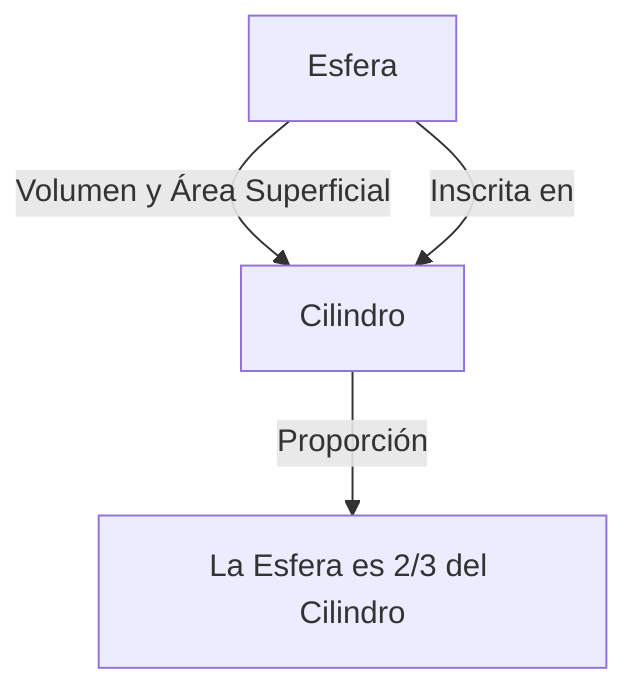

# 1. Introducción: El Mayor Intelecto del Mundo Antiguo

Arquímedes (c. 287 a.C. - c. 212 a.C.) fue un matemático, físico, ingeniero, inventor y astrónomo griego antiguo. Es ampliamente reconocido como uno de los científicos más grandes del mundo antiguo, y sus logros sentaron las bases de la ciencia y las matemáticas modernas. Nacido en Siracusa (en la actual isla de Sicilia, Italia), donde pasó la mayor parte de su vida, demostró un talento extraordinario tanto en la exploración matemática pura como en inventos de ingeniería práctica.

En este artículo, profundizaremos en su genio, desde las dramáticas anécdotas de su vida hasta los asombrosos logros matemáticos y físicos que dejó. Al rastrear la trayectoria de su pensamiento, podemos entender cómo el conocimiento antiguo está conectado con la ciencia moderna. Sus contribuciones no son meras reliquias históricas, sino que representan la actitud misma de explorar verdades universales que fluyen bajo los cimientos de la ciencia y la tecnología modernas.

# 2. Vida y Episodios Legendarios

Gran parte de los registros sobre la vida de Arquímedes fueron dejados por historiadores antiguos como Plutarco y Tito Livio. Su vida está llena de numerosos episodios legendarios.

## 2.1 La Corona de Oro y "¡Eureka!"

La anécdota más famosa asociada con Arquímedes es la autenticación de una corona, conocida por la palabra "¡Eureka!" (¡Lo he encontrado!). El rey Hierón II de Siracusa le dio a un orfebre oro puro para hacer una corona, pero sospechó que el artesano había engañado mezclando plata en el oro. El rey ordenó a Arquímedes encontrar una manera de exponer este fraude sin dañar la corona.

Un día, al entrar en una bañera en un baño público, Arquímedes notó que el nivel del agua subía a medida que su cuerpo se hundía. Se dio cuenta de que este fenómeno podría usarse para medir con precisión el volumen de la corona. Se dice que estaba tan rebosante de alegría que olvidó ponerse la ropa y salió corriendo a las calles desnudo, gritando "¡Eureka! ¡Eureka!"

Este descubrimiento se desarrolló más tarde en el principio fundamental de la hidrostática conocido como el "Principio de Arquímedes".

## 2.2 La Defensa de Siracusa y Armas Maravillosas

Durante la Segunda Guerra Púnica (218 a.C. - 201 a.C.), Siracusa fue sitiada por el general de la República Romana Marco Claudio Marcelo. En este momento, Arquímedes, que ya era un anciano, atormentó enormemente al ejército romano utilizando numerosas armas que había inventado.

Las armas que se dice que ideó incluyen las siguientes:

- **La Garra de Arquímedes** (The Claw of [Archimedes](https://kenji.blog/es/p/archimedes/)): Una máquina gigante parecida a una grúa que se dice que levantaba barcos enemigos del mar y los volcaba.
- **Rayo de Calor** (Heat Ray): Una leyenda de que usó una gran cantidad de espejos para recoger la luz solar y enfocarla en los buques de guerra romanos, provocando que se incendiaran. La autenticidad de esto sigue siendo objeto de debate hoy en día.
- **Catapultas Poderosas** (Catapults): Lanzaban enormes piedras con precisión desde la distancia, destruyendo las formaciones enemigas.

Gracias a estas armas defensivas, el ejército romano pasó varios años intentando capturar Siracusa.

## 2.3 Un Final Trágico: "¡No Perturbes mis Círculos!"

En el 212 a.C., Siracusa finalmente cayó ante el ejército romano. El general Marcelo valoraba mucho el genio de Arquímedes y dio órdenes estrictas de capturarlo vivo.

Sin embargo, cuando un soldado romano entró en la casa de Arquímedes, él estaba absorto en figuras geométricas dibujadas en la arena. Cuando el soldado le ordenó decir su nombre, se negó a cumplir, diciendo: "¡No perturbes mis círculos! (Noli turbare circulos meos!)" y fue asesinado por el enfurecido soldado. Marcelo lloró profundamente esta muerte y, siguiendo la voluntad de Arquímedes, se dice que construyó una tumba grabada con la figura de una esfera inscrita en un cilindro.

# 3. Asombrosos Logros Matemáticos

La verdadera grandeza de Arquímedes radica en su perspicacia matemática. Amplió enormemente los límites de las matemáticas de la época, dejando un impacto masivo en los futuros matemáticos.

## 3.1 Aproximación de Pi ("Sobre la Medida del Círculo")

Arquímedes determinó una aproximación precisa para Pi ($\pi$), la relación entre la circunferencia de un círculo y su diámetro. Utilizó el "método de exhaución", que consistía en apretar la circunferencia del círculo desde arriba y desde abajo utilizando polígonos regulares inscritos y circunscritos.

Comenzó con un hexágono regular y duplicó sucesivamente el número de lados, realizando finalmente el cálculo utilizando un polígono regular de 96 lados. Como resultado, demostró que el valor de Pi $\pi$ cae dentro del siguiente rango:

$$
3 \frac{10}{71} < \pi < 3 \frac{1}{7}
$$

Expresado como fracciones, es aproximadamente el siguiente:

$$
\frac{223}{71} < \pi < \frac{22}{7}
$$

Es decir, $3.1408 < \pi < 3.1429$, y había derivado un valor preciso a dos decimales. Este método puede verse como un precursor del concepto de límites en el cálculo.

## 3.2 El Teorema de la Esfera y el Cilindro ("Sobre la Esfera y el Cilindro")

El logro del que el propio Arquímedes estaba más orgulloso fue el descubrimiento de teoremas sobre el área superficial y el volumen de una esfera. Demostró que existe una hermosa relación matemática entre una esfera y un cilindro circunscrito (un cilindro con una altura y diámetro de la base iguales al diámetro de la esfera).

Siendo el radio $r$, el volumen de la esfera $V_{\text{esfera}}$ y el volumen del cilindro $V_{\text{cilindro}}$ son los siguientes:

$$
V_{\text{esfera}} = \frac{4}{3}\pi r^3
$$
$$
V_{\text{cilindro}} = \pi r^2 \cdot (2r) = 2\pi r^3
$$

Por lo tanto, el volumen de la esfera es exactamente $\frac{2}{3}$ del volumen del cilindro circunscrito.

Realizó un cálculo similar para el área superficial. El área superficial de la esfera $S_{\text{esfera}}$ y el área superficial total del cilindro $S_{\text{cilindro}}$, que combina sus áreas lateral y de las bases, son las siguientes:

$$
S_{\text{esfera}} = 4\pi r^2
$$
$$
S_{\text{cilindro}} = 2\pi r \cdot (2r) + 2 \cdot (\pi r^2) = 4\pi r^2 + 2\pi r^2 = 6\pi r^2
$$

Aquí también, el área superficial de la esfera es $\frac{2}{3}$ del área superficial del cilindro circunscrito. Estaba extremadamente orgulloso de esta notable coincidencia, dejando instrucciones escritas para grabar esta figura en su lápida.

## 3.3 Cuadratura de la Parábola ("La Cuadratura de la Parábola")

Arquímedes también desarrolló métodos para encontrar el área delimitada por curvas. Demostró que el área de un segmento parabólico formado al cruzar una parábola con una línea recta es $\frac{4}{3}$ veces el área de un triángulo con la misma base y altura.

El concepto de la suma de una serie geométrica infinita se utiliza en esta demostración. Inscribió un número infinito de triángulos dentro del segmento parabólico y calculó la suma de sus áreas.

$$
\sum_{n=0}^{\infty} \left(\frac{1}{4}\right)^n = 1 + \frac{1}{4} + \frac{1}{16} + \frac{1}{64} + \dots = \frac{4}{3}
$$

Este es uno de los primeros ejemplos en la historia de las matemáticas donde se calculó con precisión una serie infinita.

## 3.4 Exploración de Números Gigantescos ("El Arenario")

En la antigua Grecia, el sistema para expresar números grandes era inadecuado, y la "miríada" (10.000) era la unidad base más grande. Mientras que algunas personas pensaban que "el número de granos de arena que llenan el universo es infinito", Arquímedes escribió una obra llamada "El Arenario" para refutar esto.

Ideó un nuevo sistema numérico para expresar números gigantescos por su cuenta y asumió un modelo gigante del universo basado en la teoría heliocéntrica de Aristarco. Luego calculó el número de granos de arena requeridos para llenar ese universo sin ningún espacio vacío.

Como resultado, demostró que el número no excedería $8 \times 10^{63}$ (en notación moderna). Este trabajo distinguió claramente entre lo infinito y lo finito, y fue una pieza innovadora que presentó un concepto exponencial para manejar números grandes.

## 3.5 El Amanecer del Cálculo ("El Método")

En 1906, se descubrió en Constantinopla (la actual Estambul) un palimpsesto (un manuscrito cuyo texto fue raspado y reutilizado) que contenía muchas de las obras perdidas de Arquímedes. Este "Palimpsesto de Arquímedes" contenía un tratado invaluable titulado "El Método de los Teoremas Mecánicos".

En esta obra, Arquímedes revela su "proceso de pensamiento" sobre cómo llegó a numerosos descubrimientos geométricos. Dividió las figuras en colecciones de "líneas" o "planos" infinitamente delgados y adivinó sus áreas y volúmenes utilizando un modelo mecánico de equilibrarlos en una balanza. Este enfoque es esencialmente el mismo que el "cálculo integral" establecido en épocas posteriores por [Isaac Newton](https://kenji.blog/es/p/newton/) y [Gottfried Leibniz](https://kenji.blog/es/p/leibniz/), mostrando que Arquímedes había llegado a solo unos pasos del concepto de cálculo.

## 3.6 Sólidos Arquimedianos

Arquímedes amplió los sólidos platónicos (poliedros regulares) y descubrió 13 tipos de poliedros semirregulares (sólidos arquimedianos) que están compuestos por múltiples tipos de polígonos regulares y tienen la misma configuración de vértices en todas partes. Aunque su obra original se perdió, más tarde fue citada por matemáticos como Pappo de Alejandría. Estos también juegan un papel importante en la cristalografía y química modernas (por ejemplo, la estructura de la molécula de fullereno).

# 4. Contribuciones a la Física y la Ingeniería

Arquímedes hizo descubrimientos innovadores no solo en matemáticas, sino también en los campos de la física y la ingeniería. Su investigación fue una magnífica fusión de teoría y práctica.

## 4.1 El Principio de Arquímedes (Hidrostática)

Relacionado con el mencionado episodio de "Eureka", formuló la ley fundamental sobre la flotabilidad experimentada por los objetos en fluidos en una obra titulada "Sobre los Cuerpos Flotantes".

> **Principio de Arquímedes** : Todo cuerpo, total o parcialmente sumergido en un fluido (líquido o gas), es empujado hacia arriba por una fuerza igual al peso del fluido desplazado por el cuerpo.

Este principio sigue siendo una teoría fundamental indispensable en la mecánica de fluidos moderna, como en el diseño de barcos y el control de flotabilidad de submarinos.

## 4.2 La Ley de la Palanca y el Centro de Gravedad

Arquímedes también sentó las bases de la mecánica. En "Sobre el Equilibrio de los Planos", demostró matemáticamente la "Ley de la Palanca". Formuló las condiciones para que los objetos suspendidos en ambos extremos de una palanca se equilibren y se dice que dejó las siguientes palabras famosas:

"Dadme un punto de apoyo, y moveré la Tierra."

También estableció métodos precisos para calcular el "centro de gravedad" de varias figuras geométricas. Este es un concepto crucial que forma la base de la mecánica estructural y la arquitectura modernas.

## 4.3 El Tornillo de Arquímedes (Bomba de Agua)

El más ampliamente adoptado de sus inventos de ingeniería fue el "Tornillo de Arquímedes" (bomba de tornillo arquimediano). Este dispositivo encierra una hoja en espiral dentro de un cilindro gigante. Al inclinar y girar el cilindro, el agua se puede bombear desde una ubicación inferior a una superior.

Se dice que fue inventado mientras estaba en Egipto para bombear agua del río Nilo para riego. Este mecanismo simple y eficiente todavía se usa hoy en día en la agricultura y las instalaciones de tratamiento de aguas residuales en todo el mundo, y también se aplica para transportar polvos y granos.

# 5. Influencia en la Posteridad y Legado

Las obras dejadas por Arquímedes se convirtieron en una biblia para los eruditos desde el período helenístico hasta la época romana, y más tarde en el mundo árabe medieval y la Europa renacentista. Galileo Galilei elogió a Arquímedes como una "figura sobrehumana" y estudió con entusiasmo sus métodos. Johannes Kepler, [René Descartes](https://kenji.blog/es/p/descartes/) y Newton, que perfeccionó el cálculo, también se vieron muy influenciados por los escritos de Arquímedes, directa e indirectamente.

Su espíritu de investigación y metodología continúan brillando no simplemente como reliquias antiguas, sino como el arquetipo del pensamiento científico. Arquímedes es la persona que por sí sola encarnó los tres pilares de la ciencia moderna: demostración rigurosa en matemáticas, modelado matemático de fenómenos físicos y desarrollo tecnológico práctico aplicando la teoría.

# 6. Conclusión

Arquímedes, el genio de Siracusa, poseía un intelecto abrumador sin igual en el mundo antiguo. Su grito de "Eureka" todavía se transmite como una frase que simboliza la alegría del descubrimiento científico. Sus logros abarcan una amplia gama, desde el cálculo preciso de Pi, el descubrimiento de la hermosa relación entre la esfera y el cilindro, la anticipación de los conceptos de cálculo, y el establecimiento de los fundamentos de la hidrostática y la mecánica.

Sus últimas palabras, "No perturbes mis círculos", hablan de su obsesión pura y extraordinaria con la búsqueda de la verdad. Incluso hoy, más de 2.000 años después, el conocimiento y la inspiración dejados por Arquímedes continúan apoyando la base de nuestra sociedad como un poste indicador eterno que ilumina el desarrollo de la ciencia y las matemáticas.
