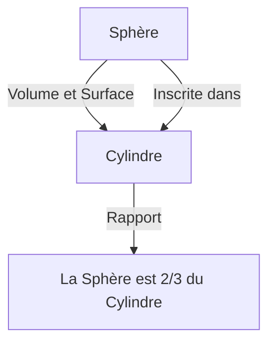

# 1. Introduction : Le Plus Grand Intellect du Monde Antique

Archimède (env. 287 av. J.-C. - env. 212 av. J.-C.) était un mathématicien, physicien, ingénieur, inventeur et astronome de la Grèce antique. Il est largement reconnu comme l'un des plus grands scientifiques du monde antique, et ses réalisations ont jeté les bases de la science et des mathématiques modernes. Né à Syracuse (sur l'actuelle île de Sicile, en Italie), où il a passé la majeure partie de sa vie, il a fait preuve d'un talent extraordinaire tant dans l'exploration mathématique pure que dans les inventions d'ingénierie pratiques.

Dans cet article, nous plongerons profondément dans son génie, des anecdotes dramatiques de sa vie aux étonnantes réalisations mathématiques et physiques qu'il a laissées derrière lui. En retraçant la trajectoire de sa pensée, nous pouvons comprendre comment les connaissances anciennes sont liées à la science moderne. Ses contributions ne sont pas de simples reliques historiques, mais représentent l'attitude même d'explorer les vérités universelles qui coulent sous les fondations de la science et de la technologie modernes.

# 2. Vie et Épisodes Légendaires

Une grande partie des archives concernant la vie d'Archimède a été laissée par des historiens antiques tels que Plutarque et Tite-Live. Sa vie est colorée par de nombreux épisodes légendaires.

## 2.1 La Couronne d'Or et « Eurêka ! »

L'anecdote la plus célèbre associée à Archimède est l'authentification d'une couronne, connue pour le mot « Eurêka ! » (J'ai trouvé !). Le roi Hiéron II de Syracuse avait donné de l'or pur à un orfèvre pour fabriquer une couronne, mais soupçonnait l'artisan d'avoir triché en mélangeant de l'argent à l'or. Le roi ordonna à Archimède de trouver un moyen de démasquer cette fraude sans endommager la couronne.

Un jour, en entrant dans un bain public, Archimède remarqua que le niveau de l'eau montait à mesure que son corps s'enfonçait. Il réalisa que ce phénomène pouvait être utilisé pour mesurer avec précision le volume de la couronne. On dit qu'il était si fou de joie qu'il oublia de s'habiller et se précipita nu dans les rues, courant en criant : « Eurêka ! Eurêka ! »

Cette découverte s'est ensuite développée en ce principe fondamental de l'hydrostatique connu sous le nom de « Poussée d'Archimède ».

## 2.2 La Défense de Syracuse et les Armes Merveilleuses

Pendant la deuxième guerre punique (218 av. J.-C. - 201 av. J.-C.), Syracuse fut assiégée par le général de la République romaine Marcus Claudius Marcellus. À cette époque, Archimède, qui était déjà âgé, tourmenta grandement l'armée romaine à l'aide de nombreuses armes qu'il avait inventées.

Les armes qu'il aurait conçues comprennent les suivantes :

- **La Griffe d'Archimède** (The Claw of [Archimedes](https://kenji.blog/fr/p/archimedes/)) : Une machine géante en forme de grue qui aurait soulevé les navires ennemis hors de la mer et les aurait fait chavirer.
- **Rayon Ardent** (Heat Ray) : Une légende selon laquelle il aurait utilisé un grand nombre de miroirs pour collecter la lumière du soleil et la concentrer sur les navires de guerre romains, les faisant prendre feu. L'authenticité de cela continue d'être débattue aujourd'hui.
- **Catapultes Puissantes** (Catapults) : Elles projetaient d'énormes pierres avec précision à distance, détruisant les formations ennemies.

Grâce à ces armes défensives, l'armée romaine passa plusieurs années à tenter de capturer Syracuse.

## 2.3 Une Fin Tragique : « Ne Dérangez Pas mes Cercles ! »

En 212 av. J.-C., Syracuse tomba finalement aux mains de l'armée romaine. Le général Marcellus appréciait grandement le génie d'Archimède et donna des ordres stricts pour le capturer vivant.

Cependant, lorsqu'un soldat romain entra dans la maison d'Archimède, celui-ci était absorbé par des figures géométriques dessinées dans le sable. Lorsque le soldat lui ordonna de décliner son nom, il refusa d'obtempérer en disant : « Ne dérangez pas mes cercles ! (Noli turbare circulos meos!) » et fut tué par le soldat enragé. Marcellus pleura profondément cette mort et, suivant la volonté d'Archimède, aurait fait construire un tombeau gravé d'une figure d'une sphère inscrite dans un cylindre.

# 3. Réalisations Mathématiques Étonnantes

La véritable grandeur d'Archimède réside dans sa perspicacité mathématique. Il a considérablement repoussé les limites des mathématiques de l'époque, laissant un impact massif sur les futurs mathématiciens.

## 3.1 Approximation de Pi (« De la Mesure du Cercle »)

Archimède a déterminé une approximation précise pour Pi ($\pi$), le rapport entre la circonférence d'un cercle et son diamètre. Il a utilisé la « méthode d'exhaustion », qui consistait à encadrer la circonférence du cercle par le haut et par le bas à l'aide de polygones réguliers inscrits et circonscrits.

Il a commencé avec un hexagone régulier et a successivement doublé le nombre de côtés, effectuant finalement le calcul à l'aide d'un polygone régulier à 96 côtés. En conséquence, il a prouvé que la valeur de Pi $\pi$ se situe dans la fourchette suivante :

$$
3 \frac{10}{71} < \pi < 3 \frac{1}{7}
$$

Exprimé sous forme de fractions, cela donne à peu près ce qui suit :

$$
\frac{223}{71} < \pi < \frac{22}{7}
$$

C'est-à-dire, $3.1408 < \pi < 3.1429$, et il avait dérivé une valeur précise à deux décimales. Cette méthode peut être considérée comme un précurseur du concept de limites en calcul infinitésimal.

## 3.2 Le Théorème de la Sphère et du Cylindre (« De la Sphère et du Cylindre »)

La réalisation dont Archimède lui-même était le plus fier était la découverte de théorèmes concernant la surface et le volume d'une sphère. Il a prouvé qu'il existe une belle relation mathématique entre une sphère et un cylindre circonscrit (un cylindre dont la hauteur et le diamètre de la base sont égaux au diamètre de la sphère).

Soit le rayon $r$, le volume de la sphère $V_{\text{sphère}}$ et le volume du cylindre $V_{\text{cylindre}}$ sont les suivants :

$$
V_{\text{sphère}} = \frac{4}{3}\pi r^3
$$
$$
V_{\text{cylindre}} = \pi r^2 \cdot (2r) = 2\pi r^3
$$

Par conséquent, le volume de la sphère est exactement $\frac{2}{3}$ du volume du cylindre circonscrit.

Il a effectué un calcul similaire pour la surface. La surface de la sphère $S_{\text{sphère}}$ et la surface totale du cylindre $S_{\text{cylindre}}$, qui combine ses surfaces latérale et de base, sont les suivantes :

$$
S_{\text{sphère}} = 4\pi r^2
$$
$$
S_{\text{cylindre}} = 2\pi r \cdot (2r) + 2 \cdot (\pi r^2) = 4\pi r^2 + 2\pi r^2 = 6\pi r^2
$$

Ici aussi, la surface de la sphère est de $\frac{2}{3}$ de la surface du cylindre circonscrit. Il était extrêmement fier de cette coïncidence remarquable, laissant des instructions écrites pour graver cette figure sur sa pierre tombale.

## 3.3 Quadrature de la Parabole (« La Quadrature de la Parabole »)

Archimède a également développé des méthodes pour trouver l'aire délimitée par des courbes. Il a prouvé que l'aire d'un segment parabolique formé en croisant une parabole avec une ligne droite est de $\frac{4}{3}$ fois l'aire d'un triangle ayant la même base et la même hauteur.

Le concept de la somme d'une série géométrique infinie est utilisé dans cette preuve. Il a inscrit un nombre infini de triangles dans le segment parabolique et a calculé la somme de leurs aires.

$$
\sum_{n=0}^{\infty} \left(\frac{1}{4}\right)^n = 1 + \frac{1}{4} + \frac{1}{16} + \frac{1}{64} + \dots = \frac{4}{3}
$$

C'est l'un des premiers exemples dans l'histoire des mathématiques où une série infinie a été calculée avec précision.

## 3.4 Exploration de Nombres Gigantesques (« L'Arénaire »)

Dans la Grèce antique, le système d'expression des grands nombres était inadéquat, et la « myriade » (10 000) était la plus grande unité de base. Alors que certaines personnes pensaient que « le nombre de grains de sable remplissant l'univers est infini », Archimède écrivit un ouvrage intitulé « L'Arénaire » pour réfuter cela.

Il a conçu lui-même un nouveau système de numération pour exprimer des nombres gigantesques et a supposé un modèle d'univers géant basé sur la théorie héliocentrique d'Aristarque. Il a ensuite calculé le nombre de grains de sable nécessaires pour remplir cet univers sans aucun espace vide.

En conséquence, il a montré que ce nombre ne dépasserait pas $8 \times 10^{63}$ (en notation moderne). Cet ouvrage distinguait clairement l'infini du fini, et constituait une œuvre révolutionnaire qui présentait un concept exponentiel pour manipuler de grands nombres.

## 3.5 L'Aube du Calcul Infinitésimal (« La Méthode »)

En 1906, un palimpseste (un manuscrit dont le texte a été gratté et réutilisé) contenant bon nombre des œuvres perdues d'Archimède a été découvert à Constantinople (aujourd'hui Istanbul). Ce « Palimpseste d'Archimède » contenait un traité inestimable intitulé « La Méthode des Théorèmes Mécaniques ».

Dans cet ouvrage, Archimède révèle son « processus de pensée » sur la façon dont il est parvenu à de nombreuses découvertes géométriques. Il divisait les figures en collections de « lignes » ou de « plans » infiniment minces et devinait leurs aires et volumes à l'aide d'un modèle mécanique consistant à les équilibrer sur une balance. Cette approche est essentiellement la même que le « calcul intégral » établi à des époques ultérieures par [Isaac Newton](https://kenji.blog/fr/p/newton/) et [Gottfried Leibniz](https://kenji.blog/fr/p/leibniz/), montrant qu'Archimède était arrivé à quelques pas seulement du concept de calcul infinitésimal.

## 3.6 Solides d'Archimède

Archimède a élargi les solides platoniciens (polyèdres réguliers) et découvert 13 types de polyèdres semi-réguliers (solides d'Archimède) qui sont composés de plusieurs types de polygones réguliers et ont la même configuration de sommets partout. Bien que son œuvre originale ait été perdue, elle a ensuite été citée par des mathématiciens comme Pappus d'Alexandrie. Ceux-ci jouent également un rôle important dans la cristallographie et la chimie modernes (par exemple, la structure de la molécule de fullerène).

# 4. Contributions à la Physique et à l'Ingénierie

Archimède a fait des découvertes révolutionnaires non seulement en mathématiques, mais aussi dans les domaines de la physique et de l'ingénierie. Ses recherches constituaient une magnifique fusion de théorie et de pratique.

## 4.1 La Poussée d'Archimède (Hydrostatique)

En lien avec l'épisode « Eurêka » susmentionné, il a formulé la loi fondamentale concernant la flottabilité ressentie par les objets dans les fluides dans un ouvrage intitulé « Des Corps Flottants ».

> **Principe d'Archimède** : Tout corps plongé dans un fluide (liquide ou gaz), subit une force verticale, dirigée de bas en haut et égale au poids du volume de fluide déplacé.

Ce principe reste une théorie fondamentale indispensable en mécanique des fluides moderne, comme dans la conception des navires et le contrôle de la flottabilité des sous-marins.

## 4.2 La Loi du Levier et le Centre de Gravité

Archimède a également jeté les bases de la mécanique. Dans « De l'Équilibre des Figures Planes », il a prouvé mathématiquement la « Loi du Levier ». Il a formulé les conditions pour que des objets suspendus aux deux extrémités d'un levier s'équilibrent et aurait laissé les célèbres paroles suivantes :

« Donnez-moi un point d'appui, et je soulèverai le monde. »

Il a également établi des méthodes précises pour calculer le « centre de gravité » de diverses figures géométriques. C'est un concept crucial qui constitue la base de la mécanique structurelle et de l'architecture modernes.

## 4.3 La Vis d'Archimède (Pompe à Eau)

La plus largement adoptée de ses inventions d'ingénierie fut la « Vis d'Archimède » (pompe à vis). Ce dispositif enferme une lame spirale à l'intérieur d'un cylindre géant. En inclinant et en faisant tourner le cylindre, l'eau peut être pompée d'un endroit inférieur vers un endroit supérieur.

On dit qu'elle a été inventée pendant qu'il séjournait en Égypte pour pomper l'eau du Nil pour l'irrigation. Ce mécanisme simple et efficace est encore utilisé aujourd'hui dans l'agriculture et les stations d'épuration du monde entier, et est également appliqué pour le transport de poudres et de grains.

# 5. Influence sur la Postérité et Héritage

Les œuvres laissées par Archimède sont devenues une bible pour les savants de la période hellénistique à l'époque romaine, et plus tard dans le monde arabe médiéval et l'Europe de la Renaissance. Galilée a salué Archimède comme une « figure surhumaine » et a étudié ses méthodes avec enthousiasme. Johannes Kepler, [René Descartes](https://kenji.blog/fr/p/descartes/) et Newton, qui a perfectionné le calcul, ont également été grandement influencés par les écrits d'Archimède, directement et indirectement.

Son esprit de recherche et sa méthodologie continuent de briller non pas simplement comme des reliques antiques, mais comme l'archétype de la pensée scientifique. Archimède est la personne qui a incarné à elle seule les trois piliers de la science moderne : la démonstration rigoureuse en mathématiques, la modélisation mathématique des phénomènes physiques et le développement technologique pratique appliquant la théorie.

# 6. Conclusion

Archimède, le génie de Syracuse, possédait un intellect écrasant sans égal dans le monde antique. Son cri d'« Eurêka » est toujours transmis comme une expression symbolisant la joie de la découverte scientifique. Ses réalisations couvrent un large éventail, du calcul précis de Pi, à la découverte de la belle relation entre la sphère et le cylindre, à l'anticipation des concepts de calcul, et à l'établissement des fondements de l'hydrostatique et de la mécanique.

Ses dernières paroles, « Ne dérangez pas mes cercles », témoignent de son obsession pure et extraordinaire pour la poursuite de la vérité. Même aujourd'hui, plus de 2 000 ans plus tard, les connaissances et l'inspiration laissées par Archimède continuent de soutenir les fondements de notre société en tant que guide éternel illuminant le développement de la science et des mathématiques.
