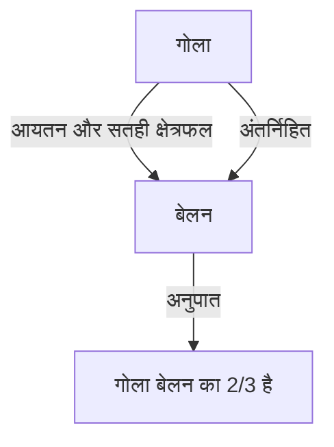

# 1. परिचय: प्राचीन विश्व की सबसे महान बुद्धि

आर्किमिडीज़ (लगभग 287 ईसा पूर्व - लगभग 212 ईसा पूर्व) एक प्राचीन यूनानी गणितज्ञ, भौतिक विज्ञानी, इंजीनियर, आविष्कारक और खगोलशास्त्री थे। उन्हें प्राचीन विश्व के सबसे महान वैज्ञानिकों में से एक के रूप में व्यापक रूप से मान्यता प्राप्त है, और उनकी उपलब्धियों ने आधुनिक विज्ञान और गणित की नींव रखी। उनका जन्म सिराक्यूज़ (आधुनिक इटली के सिसिली द्वीप पर) में हुआ था, जहाँ उन्होंने अपना अधिकांश जीवन बिताया, और उन्होंने शुद्ध गणितीय अन्वेषण और व्यावहारिक इंजीनियरिंग आविष्कारों दोनों में असाधारण प्रतिभा का प्रदर्शन किया।

इस लेख में, हम उनके जीवन के नाटकीय किस्सों से लेकर उनके द्वारा छोड़ी गई आश्चर्यजनक गणितीय और भौतिक उपलब्धियों तक, उनकी प्रतिभा की गहराई में जाएंगे। उनके विचारों के प्रक्षेपवक्र का पता लगाकर, हम समझ सकते हैं कि प्राचीन ज्ञान आधुनिक विज्ञान से कैसे जुड़ा है। उनके योगदान केवल ऐतिहासिक अवशेष नहीं हैं, बल्कि आधुनिक विज्ञान और प्रौद्योगिकी की नींव के नीचे बहने वाले सार्वभौमिक सत्य की खोज के उसी दृष्टिकोण का प्रतिनिधित्व करते हैं।

# 2. जीवन और पौराणिक प्रसंग

आर्किमिडीज़ के जीवन के बारे में अधिकांश विवरण प्लूटार्क और लिवी जैसे प्राचीन इतिहासकारों द्वारा छोड़े गए थे। उनका जीवन कई पौराणिक प्रसंगों से रंगा हुआ है।

## 2.1 सोने का मुकुट और "यूरेका!"

आर्किमिडीज़ से जुड़ा सबसे प्रसिद्ध किस्सा एक मुकुट के प्रमाणीकरण का है, जिसे "यूरेका!" (मुझे मिल गया!) शब्द के लिए जाना जाता है। सिराक्यूज़ के राजा हीरो द्वितीय ने एक सुनार को मुकुट बनाने के लिए शुद्ध सोना दिया, लेकिन उन्हें संदेह था कि कारीगर ने सोने में चांदी मिलाकर धोखा दिया है। राजा ने आर्किमिडीज़ को मुकुट को नुकसान पहुंचाए बिना इस धोखाधड़ी को उजागर करने का तरीका खोजने का आदेश दिया।

एक दिन, एक सार्वजनिक स्नानागार में बाथटब में कदम रखते समय, आर्किमिडीज़ ने देखा कि जैसे-जैसे उनका शरीर पानी में डूबता है, पानी का स्तर बढ़ता जाता है। उन्होंने महसूस किया कि इस घटना का उपयोग मुकुट की मात्रा (वॉल्यूम) को सटीक रूप से मापने के लिए किया जा सकता है। कहा जाता है कि वह खुशी से इतने पागल हो गए कि कपड़े पहनना भूल गए और "यूरेका! यूरेका!" चिल्लाते हुए नंगे ही सड़कों पर दौड़ पड़े।

यही खोज बाद में हाइड्रोस्टैटिक्स (द्रव-स्थैतिकी) के मौलिक सिद्धांत के रूप में विकसित हुई जिसे "आर्किमिडीज़ का सिद्धांत" कहा जाता है।

## 2.2 सिराक्यूज़ की रक्षा और अद्भुत हथियार

द्वितीय प्यूनिक युद्ध (218 ईसा पूर्व - 201 ईसा पूर्व) के दौरान, सिराक्यूज़ को रोमन गणराज्य के जनरल मार्कस क्लॉडियस मार्सेलस ने घेर लिया था। इस समय, आर्किमिडीज़, जो पहले से ही बुजुर्ग थे, ने अपने द्वारा आविष्कृत कई हथियारों का उपयोग करके रोमन सेना को बहुत परेशान किया।

कहा जाता है कि उनके द्वारा बनाए गए हथियारों में निम्नलिखित शामिल हैं:

- **आर्किमिडीज़ का पंजा** (The Claw of Archimedes): एक विशाल क्रेन जैसी मशीन जिसके बारे में कहा जाता है कि उसने दुश्मन के जहाजों को समुद्र से बाहर उठा लिया और उन्हें पलट दिया।
- **हीट रे** (Heat Ray): एक किंवदंती है कि उन्होंने सूर्य के प्रकाश को इकट्ठा करने और रोमन युद्धपोतों पर केंद्रित करने के लिए बड़ी संख्या में दर्पणों का उपयोग किया, जिससे उनमें आग लग गई। इसकी प्रामाणिकता पर आज भी बहस जारी है।
- **शक्तिशाली गुलेल** (Catapults): उन्होंने दूर से सटीक रूप से बड़े पत्थरों को फेंका, जिससे दुश्मन की संरचनाएं नष्ट हो गईं।

इन रक्षात्मक हथियारों के कारण, रोमन सेना ने सिराक्यूज़ पर कब्ज़ा करने की कोशिश में कई साल बिता दिए।

## 2.3 एक दुखद अंत: "मेरे वृत्तों को परेशान मत करो!"

212 ईसा पूर्व में, अंततः सिराक्यूज़ रोमन सेना के हाथों गिर गया। जनरल मार्सेलस आर्किमिडीज़ की प्रतिभा को बहुत महत्व देते थे और उन्होंने उन्हें जीवित पकड़ने के सख्त आदेश दिए थे।

हालाँकि, जब एक रोमन सैनिक आर्किमिडीज़ के घर में दाखिल हुआ, तो वे रेत पर खींची गई ज्यामितीय आकृतियों में तल्लीन थे। जब सैनिक ने उन्हें अपना नाम बताने का आदेश दिया, तो उन्होंने यह कहते हुए मना कर दिया, "मेरे वृत्तों को परेशान मत करो! (Noli turbare circulos meos!)" और क्रोधित सैनिक द्वारा मार दिए गए। मार्सेलस ने इस मौत पर गहरा शोक व्यक्त किया और आर्किमिडीज़ की इच्छा के अनुसार, कहा जाता है कि उन्होंने एक मकबरा बनवाया जिस पर एक बेलन के भीतर उत्कीर्ण एक गोले की आकृति उकेरी गई थी।

# 3. आश्चर्यजनक गणितीय उपलब्धियां

आर्किमिडीज़ की वास्तविक महानता उनकी गणितीय अंतर्दृष्टि में निहित है। उन्होंने उस समय के गणित की सीमाओं का बहुत विस्तार किया, और भविष्य के गणितज्ञों पर एक व्यापक प्रभाव छोड़ा।

## 3.1 पाई का सन्निकटन ("वृत्त का मापन")

आर्किमिडीज़ ने पाई ($\pi$) के लिए एक सटीक सन्निकटन निर्धारित किया, जो किसी वृत्त की परिधि और उसके व्यास का अनुपात है। उन्होंने "एग्जॉस्टशन विधि" (Method of Exhaustion) का उपयोग किया, जिसमें खुदे हुए और परिगत नियमित बहुभुजों (inscribed and circumscribed regular polygons) का उपयोग करके ऊपर और नीचे से वृत्त की परिधि को सिकोड़ना शामिल था।

उन्होंने एक नियमित षट्भुज से शुरुआत की और क्रमिक रूप से भुजाओं की संख्या दोगुनी कर दी, और अंततः एक नियमित 96-भुज का उपयोग करके गणना की। परिणामस्वरूप, उन्होंने सिद्ध किया कि पाई $\pi$ का मान निम्नलिखित सीमा के भीतर आता है:

$$
3 \frac{10}{71} < \pi < 3 \frac{1}{7}
$$

भिन्नों के रूप में व्यक्त करने पर, यह लगभग इस प्रकार है:

$$
\frac{223}{71} < \pi < \frac{22}{7}
$$

अर्थात्, $3.1408 < \pi < 3.1429$, और उन्होंने दो दशमलव स्थानों तक एक सटीक मान प्राप्त कर लिया था। इस पद्धति को कैलकुलस में सीमा (लिमिट) की अवधारणा के अग्रदूत के रूप में देखा जा सकता है।

## 3.2 गोले और बेलन का प्रमेय ("गोले और बेलन पर")

आर्किमिडीज़ को जिस उपलब्धि पर सबसे अधिक गर्व था, वह थी गोले के सतही क्षेत्रफल और आयतन (वॉल्यूम) से संबंधित प्रमेयों की खोज। उन्होंने सिद्ध किया कि एक गोले और एक परिगत बेलन (एक बेलन जिसकी ऊंचाई और आधार का व्यास गोले के व्यास के बराबर हो) के बीच एक सुंदर गणितीय संबंध है।

यदि त्रिज्या $r$ है, तो गोले का आयतन $V_{\text{गोला}}$ और बेलन का आयतन $V_{\text{बेलन}}$ इस प्रकार हैं:

$$
V_{\text{गोला}} = \frac{4}{3}\pi r^3
$$
$$
V_{\text{बेलन}} = \pi r^2 \cdot (2r) = 2\pi r^3
$$

इसलिए, गोले का आयतन परिगत बेलन के आयतन का ठीक $\frac{2}{3}$ है।

उन्होंने सतही क्षेत्रफल के लिए भी इसी तरह की गणना की। गोले का सतही क्षेत्रफल $S_{\text{गोला}}$ और बेलन का कुल सतही क्षेत्रफल $S_{\text{बेलन}}$, जो इसके पार्श्व और आधार क्षेत्रों को जोड़ता है, इस प्रकार हैं:

$$
S_{\text{गोला}} = 4\pi r^2
$$
$$
S_{\text{बेलन}} = 2\pi r \cdot (2r) + 2 \cdot (\pi r^2) = 4\pi r^2 + 2\pi r^2 = 6\pi r^2
$$

यहाँ भी, गोले का सतही क्षेत्रफल परिगत बेलन के सतही क्षेत्रफल का $\frac{2}{3}$ है। उन्हें इस उल्लेखनीय संयोग पर अत्यधिक गर्व था, और उन्होंने इस आकृति को अपने मकबरे पर उकेरने के लिए लिखित निर्देश छोड़े थे।

## 3.3 परवलय का क्षेत्रफलन ("परवलय का क्षेत्रफलन")

आर्किमिडीज़ ने वक्रों से घिरे क्षेत्रफल को खोजने के तरीके भी विकसित किए। उन्होंने सिद्ध किया कि एक परवलय (parabola) को एक सीधी रेखा के साथ प्रतिच्छेद करने से बनने वाले परवलयिक खंड का क्षेत्रफल उसी आधार और ऊंचाई वाले त्रिभुज के क्षेत्रफल का $\frac{4}{3}$ गुना होता है।

इस प्रमाण में एक अनंत गुणोत्तर श्रेणी के योग की अवधारणा का उपयोग किया गया है। उन्होंने परवलयिक खंड के भीतर अनंत संख्या में त्रिभुज अंकित किए और उनके क्षेत्रफलों के योग की गणना की।

$$
\sum_{n=0}^{\infty} \left(\frac{1}{4}\right)^n = 1 + \frac{1}{4} + \frac{1}{16} + \frac{1}{64} + \dots = \frac{4}{3}
$$

गणित के इतिहास में यह उन पहले उदाहरणों में से एक है जहां एक अनंत श्रेणी की सटीक गणना की गई थी।

## 3.4 विशाल संख्याओं की खोज ("सैंड रेकनर")

प्राचीन यूनान में, बड़ी संख्याओं को व्यक्त करने की प्रणाली अपर्याप्त थी, और "मिरियड" (10,000) सबसे बड़ी आधार इकाई थी। जबकि कुछ लोगों का मानना था कि "ब्रह्मांड को भरने वाले रेत के कणों की संख्या अनंत है," आर्किमिडीज़ ने इसका खंडन करने के लिए "द सैंड रेकनर" (रेत गणक) नामक एक कृति लिखी।

उन्होंने विशाल संख्याओं को व्यक्त करने के लिए स्वयं एक नई संख्या प्रणाली तैयार की और अरिस्तार्कस के सूर्य-केंद्रित सिद्धांत (हेलियोसेंट्रिक सिद्धांत) के आधार पर एक विशाल ब्रह्मांड मॉडल की कल्पना की। फिर उन्होंने उस ब्रह्मांड को बिना किसी खाली स्थान के भरने के लिए आवश्यक रेत के कणों की संख्या की गणना की।

परिणामस्वरूप, उन्होंने दिखाया कि संख्या $8 \times 10^{63}$ (आधुनिक अंकन में) से अधिक नहीं होगी। यह कार्य अनंत और परिमित के बीच स्पष्ट रूप से अंतर करता है, और यह एक अभूतपूर्व कार्य था जिसने बड़ी संख्याओं को संभालने के लिए एक घातीय अवधारणा (exponential concept) प्रस्तुत की।

## 3.5 कैलकुलस का उदय ("विधि")

1906 में, कॉन्स्टेंटिनोपल (आधुनिक इस्तांबुल) में एक पालिम्पसेस्ट (एक पांडुलिपि जिसका मूल पाठ खुरच कर हटा दिया गया था और फिर से उपयोग किया गया था) की खोज की गई थी, जिसमें आर्किमिडीज़ के कई खोए हुए कार्य शामिल थे। इस "आर्किमिडीज़ पालिम्पसेस्ट" में "यांत्रिक प्रमेयों की विधि" नामक एक अमूल्य ग्रंथ शामिल था।

इस कार्य में, आर्किमिडीज़ अपनी "विचार प्रक्रिया" का खुलासा करते हैं कि वह कई ज्यामितीय खोजों तक कैसे पहुंचे। उन्होंने आकृतियों को असीम रूप से पतली "रेखाओं" या "विमानों" (planes) के संग्रह में विभाजित किया और तराजू पर उन्हें संतुलित करने के एक यांत्रिक मॉडल का उपयोग करके उनके क्षेत्रफल और आयतन का अनुमान लगाया। यह दृष्टिकोण अनिवार्य रूप से उसी "समाकलन" (integral calculus) के समान है जो बाद के युगों में [आइजैक न्यूटन](https://kenji.blog/hi/p/newton/) और गॉटफ्राइड लाइबनिज द्वारा स्थापित किया गया था, जो दर्शाता है कि आर्किमिडीज़ कैलकुलस की अवधारणा से कुछ ही कदम दूर थे।

## 3.6 आर्किमिडीज़ के ठोस

आर्किमिडीज़ ने प्लेटोनिक ठोसों (नियमित बहुफलक) का विस्तार किया और 13 प्रकार के अर्ध-नियमित बहुफलक (आर्किमिडीयन ठोस) की खोज की, जो कई प्रकार के नियमित बहुभुजों से बने होते हैं और हर जगह समान शीर्ष विन्यास (vertex configuration) रखते हैं। हालाँकि उनका मूल कार्य खो गया था, बाद में इसे पप्पस (Pappus) जैसे गणितज्ञों द्वारा उद्धृत किया गया था। ये आधुनिक क्रिस्टलोग्राफी और रसायन विज्ञान (उदाहरण के लिए, फुलरीन अणु की संरचना) में भी महत्वपूर्ण भूमिका निभाते हैं।

# 4. भौतिकी और इंजीनियरिंग में योगदान

आर्किमिडीज़ ने न केवल गणित में बल्कि भौतिकी और इंजीनियरिंग के क्षेत्र में भी अभूतपूर्व खोजें कीं। उनका शोध सिद्धांत और व्यवहार का एक शानदार संलयन था।

## 4.1 आर्किमिडीज़ का सिद्धांत (हाइड्रोस्टैटिक्स)

उपर्युक्त "यूरेका" प्रसंग से संबंधित, उन्होंने "फ्लोटिंग बॉडीज़" नामक एक कृति में तरल पदार्थों में वस्तुओं द्वारा अनुभव किए जाने वाले उत्प्लावक बल (buoyancy) से संबंधित मौलिक नियम तैयार किया।

> **आर्किमिडीज़ का सिद्धांत** : किसी द्रव (तरल या गैस) में पूरी तरह या आंशिक रूप से डूबी हुई वस्तु, उस वस्तु द्वारा विस्थापित द्रव के भार के बराबर ऊपर की ओर एक बल (उत्प्लावक बल) का अनुभव करती है।

यह सिद्धांत आधुनिक द्रव यांत्रिकी (fluid mechanics) में एक अपरिहार्य आधारभूत सिद्धांत बना हुआ है, जैसे कि जहाजों के डिजाइन और पनडुब्बियों के उत्प्लावकता नियंत्रण में।

## 4.2 लीवर का नियम और गुरुत्वाकर्षण का केंद्र

आर्किमिडीज़ ने यांत्रिकी की नींव भी रखी। "समतलों के संतुलन पर" नामक पुस्तक में, उन्होंने "लीवर के नियम" को गणितीय रूप से सिद्ध किया। उन्होंने लीवर के दोनों सिरों पर लटकी हुई वस्तुओं को संतुलित करने के लिए शर्तें तैयार कीं और कहा जाता है कि उन्होंने निम्नलिखित प्रसिद्ध शब्द छोड़े हैं:

"मुझे खड़े होने की जगह दो, और मैं पृथ्वी को हिला दूंगा।"

उन्होंने विभिन्न ज्यामितीय आकृतियों के "गुरुत्वाकर्षण के केंद्र" (center of gravity) की सटीक गणना करने के तरीके भी स्थापित किए। यह एक महत्वपूर्ण अवधारणा है जो आधुनिक संरचनात्मक यांत्रिकी और वास्तुकला की नींव बनाती है।

## 4.3 आर्किमिडीज़ का पेंच (वाटर पंप)

उनके इंजीनियरिंग आविष्कारों में सबसे व्यापक रूप से अपनाया गया "आर्किमिडीज़ का पेंच" (पेंच पंप) था। यह उपकरण एक विशाल बेलन के अंदर एक सर्पिल ब्लेड को घेरता है। बेलन को झुकाकर और घुमाकर, पानी को निचले स्थान से ऊंचे स्थान पर पंप किया जा सकता है।

कहा जाता है कि इसका आविष्कार उस समय किया गया था जब वे मिस्र में थे, सिंचाई के लिए नील नदी से पानी पंप करने के लिए। यह सरल और कुशल तंत्र आज भी दुनिया भर में कृषि और सीवेज उपचार सुविधाओं में उपयोग किया जाता है, और इसका उपयोग पाउडर और अनाज के परिवहन के लिए भी किया जाता है।

# 5. भावी पीढ़ियों पर प्रभाव और विरासत

आर्किमिडीज़ द्वारा छोड़ी गई कृतियां हेलेनिस्टिक काल से रोमन युग तक और बाद में मध्यकालीन अरब दुनिया और पुनर्जागरण यूरोप में विद्वानों के लिए एक बाइबिल बन गईं। गैलीलियो गैलीली ने आर्किमिडीज़ को "अतिमानवीय व्यक्ति" के रूप में सराहा और उत्साहपूर्वक उनके तरीकों का अध्ययन किया। जोहान्स केपलर, [रेने डेसकार्टेस](https://kenji.blog/hi/p/descartes/) और न्यूटन, जिन्होंने कैलकुलस को सिद्ध किया, भी आर्किमिडीज़ के लेखन से प्रत्यक्ष और अप्रत्यक्ष रूप से बहुत प्रभावित थे।

उनकी अन्वेषण की भावना और कार्यप्रणाली न केवल प्राचीन अवशेषों के रूप में, बल्कि वैज्ञानिक सोच के मूल रूप के रूप में चमकती रहती है। आर्किमिडीज़ वह व्यक्ति हैं जिन्होंने अकेले ही आधुनिक विज्ञान के तीन स्तंभों को मूर्त रूप दिया: गणित में कठोर प्रमाण, भौतिक घटनाओं का गणितीय मॉडलिंग, और सिद्धांत को लागू करने वाले व्यावहारिक तकनीकी विकास।

# 6. निष्कर्ष

सिराक्यूज़ के प्रतिभाशाली आर्किमिडीज़ के पास एक ऐसी जबरदस्त बुद्धि थी जिसका प्राचीन विश्व में कोई मुकाबला नहीं था। उनकी "यूरेका" की पुकार आज भी एक ऐसे वाक्यांश के रूप में पारित की जाती है जो वैज्ञानिक खोज की खुशी का प्रतीक है। उनकी उपलब्धियां एक विस्तृत श्रृंखला को कवर करती हैं, पाई की सटीक गणना से लेकर गोले और बेलन के बीच सुंदर संबंध की खोज तक, कैलकुलस अवधारणाओं की प्रत्याशा, और हाइड्रोस्टैटिक्स और यांत्रिकी की नींव की स्थापना तक।

उनके अंतिम शब्द, "मेरे वृत्तों को परेशान मत करो," सत्य की खोज के प्रति उनके शुद्ध और असाधारण जुनून को बयां करते हैं। आज भी, 2,000 से अधिक वर्षों के बाद, आर्किमिडीज़ द्वारा छोड़े गए ज्ञान और प्रेरणा हमारे समाज की नींव को एक शाश्वत मार्गदर्शक के रूप में समर्थन करना जारी रखते हैं जो विज्ञान और गणित के विकास को रोशन करता है।
