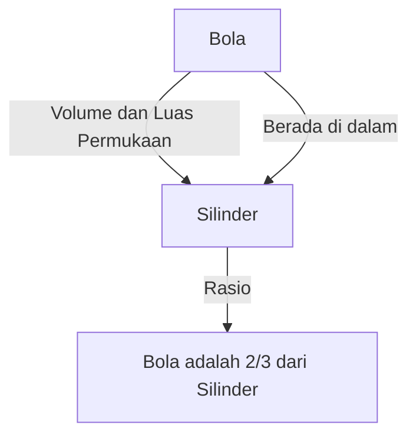

# 1. Pendahuluan: Intelektual Terbesar Dunia Kuno

Archimedes (sekitar 287 SM - 212 SM) adalah seorang matematikawan, fisikawan, insinyur, penemu, dan astronom Yunani kuno. Ia secara luas diakui sebagai salah satu ilmuwan terhebat di dunia kuno, dan pencapaiannya meletakkan dasar bagi sains dan matematika modern. Lahir di Sirakusa (di pulau Sisilia, Italia modern), tempat ia menghabiskan sebagian besar hidupnya, ia menunjukkan bakat luar biasa baik dalam eksplorasi matematika murni maupun penemuan teknik praktis.

Dalam artikel ini, kita akan menyelami kejeniusannya lebih dalam, dari anekdot dramatis kehidupannya hingga pencapaian matematika dan fisika menakjubkan yang ia tinggalkan. Dengan menelusuri lintasan pemikirannya, kita dapat memahami bagaimana pengetahuan kuno terhubung dengan sains modern. Kontribusinya bukan sekadar peninggalan sejarah, melainkan mewakili sikap eksplorasi kebenaran universal yang mengalir di bawah fondasi sains dan teknologi modern.

# 2. Kehidupan dan Episode Legendaris

Sebagian besar catatan mengenai kehidupan Archimedes ditinggalkan oleh para sejarawan kuno seperti Plutarch dan Livy. Kehidupannya diwarnai oleh berbagai episode legendaris.

## 2.1 Mahkota Emas dan "Eureka!"

Anekdot paling terkenal yang terkait dengan Archimedes adalah otentikasi sebuah mahkota, yang dikenal dengan kata "Eureka!" (Aku menemukannya!). Raja Hiero II dari Sirakusa memberi emas murni kepada seorang pandai emas untuk membuat mahkota, tetapi curiga bahwa pengrajin tersebut telah curang dengan mencampurkan perak ke dalam emas. Sang raja memerintahkan Archimedes untuk mencari cara membongkar penipuan ini tanpa merusak mahkota tersebut.

Suatu hari, saat melangkah ke bak mandi di tempat pemandian umum, Archimedes memperhatikan bahwa permukaan air naik saat tubuhnya tenggelam. Ia menyadari bahwa fenomena ini dapat digunakan untuk mengukur volume mahkota secara akurat. Dikatakan bahwa ia sangat gembira sehingga lupa memakai pakaiannya dan berlari telanjang ke jalan-jalan, berteriak, "Eureka! Eureka!"

Penemuan ini kemudian berkembang menjadi prinsip dasar hidrostatika yang dikenal sebagai "Prinsip Archimedes".

## 2.2 Pertahanan Sirakusa dan Senjata Luar Biasa

Selama Perang Punik Kedua (218 SM - 201 SM), Sirakusa dikepung oleh jenderal Republik Romawi Marcus Claudius Marcellus. Pada saat ini, Archimedes, yang sudah lanjut usia, sangat menyiksa tentara Romawi menggunakan berbagai senjata yang ia temukan.

Senjata yang konon ia ciptakan meliputi yang berikut ini:

- **Cakar Archimedes** (The Claw of Archimedes): Sebuah mesin raksasa mirip bangau yang konon mengangkat kapal musuh dari laut dan membalikkannya.
- **Sinar Panas** (Heat Ray): Sebuah legenda bahwa ia menggunakan sejumlah besar cermin untuk mengumpulkan sinar matahari dan memfokuskannya pada kapal perang Romawi, sehingga kapal-kapal itu terbakar. Keaslian hal ini masih diperdebatkan hingga hari ini.
- **Ketapel Kuat** (Catapults): Mereka melemparkan batu-batu besar secara akurat dari kejauhan, menghancurkan formasi musuh.

Berkat senjata pertahanan ini, tentara Romawi menghabiskan beberapa tahun mencoba merebut Sirakusa.

## 2.3 Akhir yang Tragis: "Jangan Ganggu Lingkaranku!"

Pada 212 SM, Sirakusa akhirnya jatuh ke tangan tentara Romawi. Jenderal Marcellus sangat menghargai kejeniusan Archimedes dan memberikan perintah tegas untuk menangkapnya hidup-hidup.

Namun, ketika seorang tentara Romawi memasuki rumah Archimedes, ia sedang asyik mempelajari figur-figur geometri yang digambar di atas pasir. Ketika prajurit itu memerintahkannya untuk menyebutkan namanya, ia menolak untuk mematuhinya, dengan mengatakan, "Jangan ganggu lingkaranku! (Noli turbare circulos meos!)" dan ia pun dibunuh oleh prajurit yang marah itu. Marcellus sangat meratapi kematian ini dan, mengikuti wasiat Archimedes, konon membangun sebuah makam yang diukir dengan figur sebuah bola yang berada di dalam sebuah silinder.

# 3. Pencapaian Matematika yang Menakjubkan

Kebesaran sejati Archimedes terletak pada wawasan matematikanya. Ia sangat memperluas batas-batas matematika pada masa itu, meninggalkan dampak yang sangat besar pada matematikawan masa depan.

## 3.1 Perkiraan Pi ("Pengukuran Lingkaran")

Archimedes menentukan perkiraan akurat untuk Pi ($\pi$), rasio keliling lingkaran dengan diameternya. Ia menggunakan "metode kelelahan" (method of exhaustion), yang melibatkan penekanan keliling lingkaran dari atas dan bawah menggunakan poligon beraturan di dalam dan di luar lingkaran.

Ia mulai dengan segi enam beraturan dan secara berturut-turut menggandakan jumlah sisinya, dan akhirnya melakukan perhitungan menggunakan segi 96 beraturan. Hasilnya, ia membuktikan bahwa nilai Pi $\pi$ berada dalam kisaran berikut:

$$
3 \frac{10}{71} < \pi < 3 \frac{1}{7}
$$

Dinyatakan sebagai pecahan, kira-kira sebagai berikut:

$$
\frac{223}{71} < \pi < \frac{22}{7}
$$

Yaitu, $3.1408 < \pi < 3.1429$, dan ia telah memperoleh nilai yang akurat hingga dua tempat desimal. Metode ini dapat dilihat sebagai pendahulu konsep limit dalam kalkulus.

## 3.2 Teorema Bola dan Silinder ("Tentang Bola dan Silinder")

Pencapaian yang paling dibanggakan Archimedes sendiri adalah penemuan teorema mengenai luas permukaan dan volume sebuah bola. Ia membuktikan bahwa terdapat hubungan matematika yang indah antara bola dan silinder yang melingkupinya (sebuah silinder dengan tinggi dan diameter alas sama dengan diameter bola).

Misalkan jari-jari adalah $r$, volume bola $V_{\text{bola}}$ dan volume silinder $V_{\text{silinder}}$ adalah sebagai berikut:

$$
V_{\text{bola}} = \frac{4}{3}\pi r^3
$$
$$
V_{\text{silinder}} = \pi r^2 \cdot (2r) = 2\pi r^3
$$

Oleh karena itu, volume bola adalah tepat $\frac{2}{3}$ dari volume silinder yang melingkupinya.

Ia melakukan perhitungan serupa untuk luas permukaan. Luas permukaan bola $S_{\text{bola}}$ dan luas permukaan total silinder $S_{\text{silinder}}$, yang menggabungkan luas sisi dan luas alasnya, adalah sebagai berikut:

$$
S_{\text{bola}} = 4\pi r^2
$$
$$
S_{\text{silinder}} = 2\pi r \cdot (2r) + 2 \cdot (\pi r^2) = 4\pi r^2 + 2\pi r^2 = 6\pi r^2
$$

Di sini juga, luas permukaan bola adalah $\frac{2}{3}$ dari luas permukaan silinder yang melingkupinya. Ia sangat bangga akan kebetulan yang luar biasa ini, meninggalkan instruksi tertulis untuk mengukir figur ini di batu nisannya.

## 3.4 Eksplorasi Angka Raksasa ("Penghitung Pasir")

Di Yunani kuno, sistem untuk mengekspresikan angka besar tidak memadai, dan "segudang" (myriad, 10.000) adalah unit dasar terbesar. Walaupun sebagian orang menganggap bahwa "jumlah butiran pasir yang mengisi alam semesta tidak terhingga," Archimedes menulis sebuah karya yang disebut "Penghitung Pasir" untuk membantah hal ini.

Ia merancang sistem bilangan baru untuk mengekspresikan angka raksasa sendiri dan mengasumsikan model alam semesta raksasa berdasarkan teori heliosentris Aristarchus. Ia kemudian menghitung jumlah butiran pasir yang dibutuhkan untuk mengisi alam semesta tersebut tanpa ada ruang kosong.

Hasilnya, ia menunjukkan bahwa angka tersebut tidak akan melebihi $8 \times 10^{63}$ (dalam notasi modern). Karya ini dengan jelas membedakan antara yang tak terhingga dan yang terhingga, dan merupakan karya terobosan yang menyajikan konsep eksponensial untuk menangani angka besar.

## 3.5 Fajar Kalkulus ("Metode")

Pada tahun 1906, sebuah palimpsest (sebuah manuskrip yang teksnya dikikis dan digunakan kembali) yang memuat banyak karya Archimedes yang hilang ditemukan di Konstantinopel (kini Istanbul). "Palimpsest Archimedes" ini memuat risalah tak ternilai yang berjudul "Metode Teorema Mekanik".

Dalam karya ini, Archimedes mengungkapkan "proses berpikirnya" tentang bagaimana ia sampai pada banyak penemuan geometri. Ia membagi benda-benda ke dalam kumpulan "garis" atau "bidang" yang sangat tipis dan menebak luas dan volumenya menggunakan model mekanis dengan menyeimbangkannya di atas timbangan. Pendekatan ini pada dasarnya sama dengan "kalkulus integral" yang ditetapkan pada era selanjutnya oleh [Isaac Newton](https://kenji.blog/id/p/newton/) dan [Gottfried Leibniz](https://kenji.blog/id/p/leibniz/), menunjukkan bahwa Archimedes telah tiba beberapa langkah lagi dari konsep kalkulus.

## 3.6 Padatan Archimedes

Archimedes memperluas Padatan Platonik (polihedra beraturan) dan menemukan 13 jenis polihedra semireguler (padatan Archimedes) yang tersusun dari beberapa jenis poligon beraturan dan memiliki konfigurasi titik sudut yang sama di mana-mana. Walaupun karya aslinya hilang, karya tersebut kemudian dikutip oleh matematikawan seperti Pappus. Hal ini juga memainkan peran penting dalam kristalografi dan kimia modern (misalnya, struktur molekul fullerene).

# 4. Kontribusi pada Fisika dan Teknik

Archimedes membuat penemuan inovatif tidak hanya di bidang matematika tetapi juga di bidang fisika dan teknik. Penelitiannya merupakan perpaduan luar biasa antara teori dan praktik.

## 4.1 Prinsip Archimedes (Hidrostatika)

Terkait dengan episode "Eureka" yang disebutkan di atas, ia merumuskan hukum dasar mengenai daya apung yang dialami oleh benda dalam fluida dalam sebuah karya berjudul "Tentang Benda Terapung".

> **Prinsip Archimedes** : Benda apa pun, seluruhnya atau sebagian terendam dalam cairan (cairan atau gas), didorong oleh gaya apung yang sama dengan berat cairan yang dipindahkan oleh benda tersebut.

Prinsip ini tetap menjadi teori dasar yang sangat diperlukan dalam mekanika fluida modern, seperti dalam desain kapal dan kontrol daya apung kapal selam.

## 4.2 Hukum Tuas dan Pusat Gravitasi

Archimedes juga meletakkan dasar bagi mekanika. Dalam "Tentang Keseimbangan Bidang," ia secara matematis membuktikan "Hukum Tuas". Ia merumuskan kondisi bagi benda-benda yang digantung di kedua ujung tuas agar seimbang dan konon meninggalkan kata-kata terkenal berikut:

"Beri saya tempat untuk berdiri, dan saya akan menggerakkan Bumi."

Ia juga menetapkan metode presisi untuk menghitung "pusat gravitasi" dari berbagai bangun geometri. Ini adalah konsep krusial yang membentuk dasar mekanika struktural dan arsitektur modern.

## 4.3 Sekrup Archimedes (Pompa Air)

Penemuan tekniknya yang paling banyak diadopsi adalah "Sekrup Archimedes" (pompa sekrup ulir). Perangkat ini melingkupi bilah spiral di dalam silinder raksasa. Dengan memiringkan dan memutar silinder, air dapat dipompa dari lokasi yang lebih rendah ke lokasi yang lebih tinggi.

Konon alat ini diciptakan saat ia tinggal di Mesir untuk memompa air dari Sungai Nil untuk irigasi. Mekanisme sederhana dan efisien ini masih digunakan hingga kini dalam pertanian dan fasilitas pengolahan limbah di seluruh dunia, dan juga diterapkan untuk mengangkut bubuk dan biji-bijian.

# 5. Pengaruh pada Anak Cucu dan Warisan

Karya-karya yang ditinggalkan oleh Archimedes menjadi semacam Alkitab bagi para sarjana dari periode Helenistik hingga era Romawi, dan kemudian di dunia Arab abad pertengahan dan Eropa Renaisans. Galileo Galilei memuji Archimedes sebagai "sosok manusia super" dan dengan antusias mempelajari metode-metodenya. Johannes Kepler, [René Descartes](https://kenji.blog/id/p/descartes/), dan Newton, yang menyempurnakan kalkulus, juga sangat terpengaruh oleh tulisan-tulisan Archimedes, baik secara langsung maupun tidak langsung.

Semangat penyelidikan dan metodologinya terus bersinar bukan sekadar peninggalan kuno, melainkan sebagai pola dasar pemikiran ilmiah. Archimedes adalah orang yang dengan usahanya sendiri mewujudkan tiga pilar ilmu pengetahuan modern: pembuktian ketat dalam matematika, pemodelan matematis untuk fenomena fisik, dan pengembangan teknologi praktis yang menerapkan teori.

# 6. Kesimpulan

Archimedes, sang jenius dari Sirakusa, memiliki kecerdasan luar biasa yang tak tertandingi di dunia kuno. Teriakannya "Eureka" masih diwariskan sebagai ungkapan yang melambangkan kegembiraan penemuan ilmiah. Pencapaiannya mencakup banyak hal, mulai dari perhitungan presisi Pi, penemuan hubungan yang indah antara bola dan silinder, antisipasi konsep kalkulus, dan pembentukan fondasi hidrostatika dan mekanika.

Kata-kata terakhirnya, "Jangan ganggu lingkaranku," berbicara tentang obsesinya yang murni dan luar biasa terhadap pencarian kebenaran. Bahkan saat ini, lebih dari 2.000 tahun kemudian, pengetahuan dan inspirasi yang ditinggalkan oleh Archimedes terus menopang fondasi masyarakat kita sebagai penunjuk jalan abadi yang menerangi perkembangan sains dan matematika.
