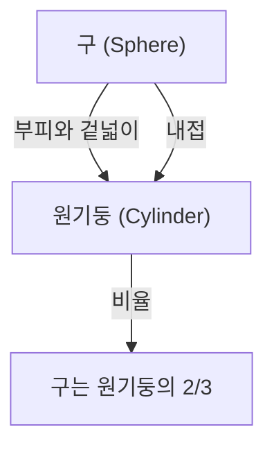

# 1. 서론: 고대 세계 최고의 지성

아르키메데스(기원전 약 287년 - 기원전 약 212년)는 고대 그리스의 수학자, 물리학자, 기술자, 발명가이자 천문학자입니다. 그는 고대 세계에서 가장 위대한 과학자 중 한 명으로 널리 인정받고 있으며, 그의 업적은 현대 과학과 수학의 기초를 닦았습니다. 시라쿠사(현재의 이탈리아 시칠리아 섬)에서 태어나 생애 대부분을 그곳에서 보낸 그는 순수 수학적 탐구와 실용적인 공학적 발명 모두에서 탁월한 재능을 발휘했습니다.

이 글에서는 아르키메데스의 극적인 생애에 얽힌 일화부터 그가 남긴 경이로운 수학적, 물리적 업적까지 그의 천재성을 깊이 있게 탐구할 것입니다. 그의 사고의 궤적을 추적함으로써 우리는 고대의 지식이 어떻게 현대 과학으로 연결되는지 이해할 수 있습니다. 그의 공헌은 단순한 역사적 유물이 아니라, 현대 과학 기술의 근저에 흐르는 보편적 진리를 탐구하는 태도 그 자체를 나타냅니다.

# 2. 생애와 전설적인 일화들

아르키메데스의 생애에 대한 기록의 상당 부분은 플루타르코스와 리비우스와 같은 고대 역사가들에 의해 남겨졌습니다. 그의 삶은 수많은 전설적인 일화들로 채워져 있습니다.

## 2.1 황금 왕관과 "유레카!"

아르키메데스와 관련된 가장 유명한 일화는 "유레카!"(알아냈다!)라는 말로 잘 알려진 왕관의 감정에 관한 것입니다. 시라쿠사의 히에론 2세 왕은 금세공인에게 순금을 주어 왕관을 만들게 했지만, 장인이 금에 은을 섞어 속이지 않았을까 의심했습니다. 왕은 아르키메데스에게 왕관을 손상시키지 않고 이 사기를 밝혀낼 방법을 찾으라고 명령했습니다.

어느 날, 대중목욕탕에서 욕조에 들어간 아르키메데스는 자신의 몸이 가라앉음에 따라 수위가 상승하는 것을 발견했습니다. 그는 이 현상을 이용하면 왕관의 부피를 정확하게 측정할 수 있다는 것을 깨달았습니다. 너무나 기쁜 나머지 그는 옷 입는 것도 잊은 채 벌거벗은 채로 거리로 뛰쳐나가 "유레카! 유레카!"라고 외치며 뛰어다녔다고 전해집니다.

이 발견은 훗날 "아르키메데스의 원리" 로 알려진 유체정역학의 기본 원리로 발전했습니다.

## 2.2 시라쿠사 방어전과 놀라운 무기들

제2차 포에니 전쟁(기원전 218년 - 기원전 201년) 동안, 시라쿠사는 로마 공화국의 장군 마르쿠스 클라우디우스 마르켈루스에 의해 포위되었습니다. 이때 이미 고령이었던 아르키메데스는 자신이 발명한 수많은 무기를 사용하여 로마군을 크게 괴롭혔습니다.

그가 고안했다고 전해지는 무기에는 다음과 같은 것들이 있습니다:

- **아르키메데스의 갈고리** (The Claw of [Archimedes](https://kenji.blog/ko/p/archimedes/)): 거대한 기중기 같은 기계로, 바다에서 적선을 들어 올려 전복시켰다고 합니다.
- **열광선** (Heat Ray): 수많은 거울을 사용하여 햇빛을 모아 로마 군함에 초점을 맞춰 불을 냈다는 전설입니다. 이것의 진위 여부는 오늘날까지도 논쟁이 되고 있습니다.
- **강력한 투석기** (Catapults): 먼 거리에서 거대한 돌을 정확하게 투척하여 적의 진형을 파괴했습니다.

이러한 방어 무기들 덕분에 로마군은 시라쿠사를 함락시키기 위해 몇 년을 소비해야 했습니다.

## 2.3 비극적인 최후: "내 원을 밟지 마라!"

기원전 212년, 시라쿠사는 마침내 로마군에 의해 함락되었습니다. 마르켈루스 장군은 아르키메데스의 천재성을 높이 평가하여 그를 생포하라는 엄명을 내렸습니다.

그러나 한 로마 병사가 아르키메데스의 집에 들어갔을 때, 그는 모래 위에 그려진 기하학 도형에 몰두하고 있었습니다. 병사가 이름을 말하라고 명령했지만, 그는 "내 원을 밟지 마라! (Noli turbare circulos meos!)" 라며 거부했고, 격분한 병사에 의해 살해당하고 말았습니다. 마르켈루스는 이 죽음을 깊이 슬퍼했으며, 아르키메데스의 유언에 따라 원기둥에 내접하는 구의 도형이 새겨진 무덤을 세워주었다고 전해집니다.

# 3. 경이로운 수학적 업적

아르키메데스의 진정한 위대함은 그의 수학적 통찰력에 있습니다. 그는 당시 수학의 한계를 크게 넓혔으며, 후대의 수학자들에게 엄청난 영향을 미쳤습니다.

## 3.1 원주율의 근사치 (『원의 측정』)

아르키메데스는 원의 둘레와 지름의 비율인 원주율($\pi$)의 정확한 근사치를 구했습니다. 그는 원에 내접하는 정다각형과 외접하는 정다각형을 사용하여 위아래에서 원의 둘레를 좁혀가는 "실진법(method of exhaustion)" 을 사용했습니다.

그는 정육각형에서 시작하여 변의 수를 계속해서 두 배로 늘려나갔고, 최종적으로 정96각형을 사용하여 계산을 수행했습니다. 그 결과, 원주율 $\pi$ 의 값이 다음 범위 안에 있다는 것을 증명했습니다.

$$
3 \frac{10}{71} < \pi < 3 \frac{1}{7}
$$

분수로 나타내면 대략 다음과 같습니다.

$$
\frac{223}{71} < \pi < \frac{22}{7}
$$

즉, $3.1408 < \pi < 3.1429$ 이며, 소수점 이하 두 자리까지 정확한 값을 도출해냈던 것입니다. 이 방법은 미적분학에서 극한 개념의 선구자라고 할 수 있습니다.

## 3.2 구와 원기둥의 정리 (『구와 원기둥에 대하여』)

아르키메데스 자신이 가장 자랑스럽게 생각했던 업적은 구의 겉넓이와 부피에 관한 정리의 발견입니다. 그는 구와 그 구에 외접하는 원기둥(높이와 밑면의 지름이 구의 지름과 같은 원기둥) 사이에 아름다운 수학적 관계가 있음을 증명했습니다.

반지름을 $r$ 이라고 할 때, 구의 부피 $V_{\text{구}}$ 와 원기둥의 부피 $V_{\text{원기둥}}$ 은 다음과 같습니다.

$$
V_{\text{구}} = \frac{4}{3}\pi r^3
$$
$$
V_{\text{원기둥}} = \pi r^2 \cdot (2r) = 2\pi r^3
$$

따라서 구의 부피는 외접하는 원기둥 부피의 정확히 $\frac{2}{3}$ 가 됩니다.

마찬가지로 겉넓이에 대해서도 계산을 수행했습니다. 구의 겉넓이 $S_{\text{구}}$ 와 원기둥의 옆넓이와 밑넓이를 합친 전체 겉넓이 $S_{\text{원기둥}}$ 은 다음과 같습니다.

$$
S_{\text{구}} = 4\pi r^2
$$
$$
S_{\text{원기둥}} = 2\pi r \cdot (2r) + 2 \cdot (\pi r^2) = 4\pi r^2 + 2\pi r^2 = 6\pi r^2
$$

여기서도 구의 겉넓이는 외접하는 원기둥 겉넓이의 $\frac{2}{3}$ 가 됩니다. 그는 이 놀라운 일치를 매우 자랑스러워했으며, 자신의 묘비에 이 도형을 새겨 넣도록 유언을 남겼습니다.

## 3.3 포물선의 구적법 (『포물선의 구적법』)

아르키메데스는 곡선으로 둘러싸인 면적을 구하는 방법도 개발했습니다. 그는 포물선과 직선이 교차하여 생기는 활꼴의 넓이가 밑변과 높이가 같은 삼각형 넓이의 $\frac{4}{3}$ 배가 된다는 것을 증명했습니다.

이 증명에는 무한등비급수의 합 개념이 사용되었습니다. 그는 활꼴 안에 무한히 많은 삼각형을 내접시키고 그 면적의 합을 계산했습니다.

$$
\sum_{n=0}^{\infty} \left(\frac{1}{4}\right)^n = 1 + \frac{1}{4} + \frac{1}{16} + \frac{1}{64} + \dots = \frac{4}{3}
$$

이것은 수학의 역사에서 무한급수가 정확하게 계산된 최초의 사례 중 하나입니다.

## 3.4 거대한 수의 탐구 (『모래 계산자』)

고대 그리스에서는 큰 수를 표현하는 체계가 불완전하여 "미리아드(10,000)" 가 가장 큰 기본 단위였습니다. 어떤 사람들은 "우주를 채우는 모래의 수는 무한하다" 라고 생각했지만, 아르키메데스는 이를 반박하기 위해 『모래 계산자』 라는 저서를 썼습니다.

그는 독자적으로 거대한 수를 표현하는 새로운 기수법을 고안했고, 아리스타르코스의 태양중심설(지동설)에 기반한 거대한 우주 모델을 가정했습니다. 그런 다음 그 우주를 빈틈없이 채우는 데 필요한 모래알의 수를 계산했습니다.

그 결과, 그는 그 수가 $8 \times 10^{63}$ (현대 표기법으로) 을 넘지 않음을 보여주었습니다. 이 저서는 무한과 유한의 차이를 명확히 하고, 큰 수를 다루기 위한 지수적인 개념을 제시한 획기적인 것이었습니다.

## 3.5 미적분학의 싹 (『방법』)

1906년, 콘스탄티노플(현재의 이스탄불)에서 아르키메데스의 잃어버린 저술 다수를 포함한 팰림프세스트(양피지의 글자를 긁어내고 재사용한 사본)가 발견되었습니다. 이 "아르키메데스 팰림프세스트" 에는 『기계적 정리의 방법』 이라는 귀중한 논문이 포함되어 있었습니다.

이 논문에서 아르키메데스는 자신이 어떻게 수많은 기하학적 발견에 이르렀는지에 대한 "사고 과정" 을 밝히고 있습니다. 그는 도형을 무한히 얇은 "선" 이나 "면" 의 집합으로 쪼개고, 그것들을 저울에 올려 평형을 이루게 하는 역학적인 모델을 사용하여 넓이나 부피를 추측했습니다. 이는 후대에 [아이작 뉴턴](https://kenji.blog/ko/p/newton/)이나 [고트프리트 라이프니츠](https://kenji.blog/ko/p/leibniz/)가 확립하는 "적분법(integral calculus)" 과 본질적으로 같은 접근 방식이며, 아르키메데스가 미적분학의 개념에 거의 다다랐음을 보여줍니다.

## 3.6 아르키메데스의 다면체

아르키메데스는 플라톤의 다면체(정다면체)를 확장하여, 여러 종류의 정다각형으로 구성되고 모든 꼭짓점의 형태가 같은 반정다면체(아르키메데스의 다면체) 13종을 발견했습니다. 그의 원본 저서는 소실되었지만, 훗날 파푸스 등의 수학자가 그 업적을 인용하였습니다. 이들은 현대의 결정학이나 화학(예를 들어 풀러렌 분자의 구조 등)에서도 중요한 역할을 하고 있습니다.

# 4. 물리학과 공학에 대한 공헌

아르키메데스는 수학뿐만 아니라 물리학이나 공학 분야에서도 획기적인 발견을 했습니다. 그의 연구는 이론과 실제가 멋지게 융합된 것이었습니다.

## 4.1 아르키메데스의 원리 (유체정역학)

앞서 언급한 "유레카" 일화와 관련하여, 그는 『부체에 대하여』 라는 저서에서 유체 속의 물체가 받는 부력에 관한 기본 법칙을 공식화했습니다.

> **아르키메데스의 원리** : 유체(액체나 기체) 속에 전체 또는 부분적으로 잠긴 물체는, 그 물체가 밀어낸 유체의 무게와 같은 크기의 부력을 위쪽으로 받는다.

이 원리는 선박의 설계나 잠수함의 부력 제어 등 현대 유체역학에서도 없어서는 안 될 기초 이론이 되고 있습니다.

## 4.2 지렛대의 원리와 무게중심

아르키메데스는 역학의 기초도 다졌습니다. 『평면의 균형에 대하여』 에서 그는 "지렛대의 원리" 를 수학적으로 증명했습니다. 그는 지렛대의 양 끝에 매달린 물체가 평형을 이루기 위한 조건을 공식화했으며, 다음과 같은 유명한 말을 남겼다고 전해집니다.

"내게 설 자리를 다오, 그러면 지구를 움직여 보이겠다."

그는 또한 다양한 기하학 도형의 "무게중심(center of gravity)" 을 정확하게 계산하는 방법을 확립했습니다. 이는 현대의 구조 역학이나 건축학의 기초가 되는 중요한 개념입니다.

## 4.3 아르키메데스 나선 양수기 (워터 펌프)

공학적인 발명 중에서 가장 널리 보급된 것이 "아르키메데스 나선 양수기(스크류 펌프)" 입니다. 이것은 거대한 원통 안에 나선형 깃을 넣은 것으로, 원통을 기울여 회전시킴으로써 낮은 곳에 있는 물을 높은 곳으로 퍼 올릴 수 있습니다.

이집트에 머물렀을 때 나일강의 물을 관개용으로 퍼 올리기 위해 발명되었다고 합니다. 이 단순하고 효율적인 기구는 현재에도 전 세계의 농업이나 하수 처리 시설 등에서 사용되고 있으며, 분말이나 곡물의 운반에도 응용되고 있습니다.

# 5. 후세에 미친 영향과 유산

아르키메데스가 남긴 저서는 헬레니즘 시대부터 로마 시대에 걸쳐, 그리고 중세 아라비아 세계와 르네상스 시대 유럽에서 학자들의 바이블이 되었습니다. 갈릴레오 갈릴레이는 아르키메데스를 "초인적인 인물" 이라고 찬사하며 그의 방법을 열정적으로 연구했습니다. 또한 요하네스 케플러나 [르네 데카르트](https://kenji.blog/ko/p/descartes/), 그리고 미적분학을 완성한 뉴턴 등도 아르키메데스의 저서로부터 직간접적으로 지대한 영향을 받았습니다.

그의 탐구심과 방법론은 단순히 고대의 유물로서가 아니라 과학적 사고의 원형으로서 지금도 여전히 빛나고 있습니다. 수학에서의 엄밀한 증명, 물리 현상의 수학적 모델화, 그리고 이론을 응용한 실용적인 기술 개발이라는 현대 과학의 세 기둥을 혼자서 체현한 인물이 바로 아르키메데스인 것입니다.

# 6. 결론

시라쿠사의 천재 아르키메데스는 고대 세계에서 견줄 자가 없는 압도적인 지성의 소유자였습니다. 그의 "유레카" 라는 외침은 과학적 발견의 기쁨을 상징하는 말로서 지금도 전해져 내려오고 있습니다. 원주율의 정교한 계산, 구와 원기둥의 아름다운 관계의 발견, 미적분학 개념의 선취, 그리고 유체정역학과 역학의 기초 확립 등 그의 업적은 다방면에 걸쳐 있습니다.

"내 원을 밟지 마라" 라는 마지막 말은 진리 탐구에 대한 그의 순수하고도 남다른 집념을 이야기해줍니다. 2000년 이상이 지난 현대에 있어서도 아르키메데스가 남긴 지식과 영감은 과학과 수학의 발전을 비추는 영원한 이정표로서 우리 사회의 기반을 계속해서 지탱하고 있습니다.
