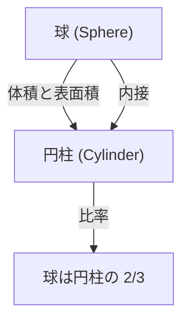

# 1. はじめに：古代世界最大の知性

[アルキメデス](https://kenji.blog/p/archimedes/)（紀元前287年 - 紀元前212年）は、古代ギリシャの数学者、物理学者、技術者、発明家、そして天文学者です。彼は古代世界において最も偉大な科学者の一人として広く認められており、その業績は現代の科学や数学の基礎を築くものでした。シラクサ（現在のイタリア・シチリア島）に生まれ、生涯の大部分をそこで過ごした彼は、純粋な数学的探求と実用的な工学的発明の両方において卓越した才能を発揮しました。

この記事では、[アルキメデス](https://kenji.blog/p/archimedes/)の劇的な生涯の逸話から、彼が遺した驚異的な数学的・物理学的業績まで、彼の天才性を深く探求していきます。彼の思考の軌跡をたどることで、古代の知識がいかにして現代の科学へと繋がっているのかを理解することができるでしょう。彼の功績は、単なる歴史的な遺物ではなく、現代の科学技術の根底に流れる普遍的な真理を探求する姿勢そのものです。

# 2. 生涯と伝説的なエピソード

[アルキメデス](https://kenji.blog/p/archimedes/)の生涯については、プルタルコスやリウィウスなどの古代の歴史家たちによって多くの記録が残されています。彼の人生は、数々の伝説的なエピソードに彩られています。

## 2.1 王冠と「エウレカ！」

[アルキメデス](https://kenji.blog/p/archimedes/)にまつわる最も有名な逸話は、「エウレカ（分かった！）」という言葉で知られる王冠の鑑定に関するものです。シラクサの王ヒエロン2世は、金細工職人に純金を与えて王冠を作らせましたが、職人が銀を混ぜて金を誤魔化したのではないかと疑いました。王は[アルキメデス](https://kenji.blog/p/archimedes/)に、王冠を壊さずにこの不正を見破る方法を考えるよう命じました。

ある日、公衆浴場で湯船に入った[アルキメデス](https://kenji.blog/p/archimedes/)は、自分の体が沈むにつれて水位が上昇することに気づきました。この現象を利用すれば、王冠の体積を正確に測定できると閃いたのです。彼はあまりの喜びに、服を着るのも忘れて裸のまま街へ飛び出し、「エウレカ！ エウレカ！」と叫びながら走り回ったと伝えられています。

この発見は、後に「[アルキメデス](https://kenji.blog/p/archimedes/)の原理」として知られる流体静力学の基本原理へと発展しました。

## 2.2 シラクサ防衛と驚異の兵器

第二次ポエニ戦争（紀元前218年 - 紀元前201年）中、シラクサはローマ共和国の将軍マルクス・クラウディウス・マルケッルスによって包囲されました。この時、すでに高齢であった[アルキメデス](https://kenji.blog/p/archimedes/)は、自身の発明した数々の兵器を用いてローマ軍を大いに苦しめました。

彼が考案したとされる兵器には、以下のようなものがあります。

- **[アルキメデス](https://kenji.blog/p/archimedes/)の鉤爪** (The Claw of [Archimedes](https://kenji.blog/p/archimedes/)): 巨大なクレーンのような機械で、海上の敵船を持ち上げて転覆させたとされます。
- **熱光線** (Heat Ray): 多数の鏡を用いて太陽光を集め、ローマの軍船に焦点を合わせて火災を発生させたという伝説です。この真偽については現代でも議論が続いています。
- **強力な投石機** (Catapults): 遠距離から正確に巨大な石を投擲し、敵の陣形を破壊しました。

これらの防衛兵器により、ローマ軍はシラクサの攻略に数年を費やすことになりました。

## 2.3 悲劇的な最期：「私の円を乱すな！」

紀元前212年、ついにシラクサはローマ軍によって陥落しました。マルケッルス将軍は、[アルキメデス](https://kenji.blog/p/archimedes/)の才能を高く評価しており、彼を生け捕りにするよう厳命していました。

しかし、一人のローマ兵が[アルキメデス](https://kenji.blog/p/archimedes/)の家に入ってきたとき、彼は砂の上に描いた幾何学の図形に没頭していました。兵士が名前を名乗るよう命じても、彼は「私の円を乱すな！（Noli turbare circulos meos!）」と言って従わなかったため、激怒した兵士によって殺害されてしまいました。マルケッルスはこの死を深く悼み、彼の遺言に従って、球が円柱に内接する図形を刻んだ墓を建てたとされています。

# 3. 驚異的な数学的業績

[アルキメデス](https://kenji.blog/p/archimedes/)の真の偉大さは、その数学的な洞察力にあります。彼は当時の数学の限界を大きく押し広げ、後世の数学者たちに多大な影響を与えました。

## 3.1 円周率の近似値（『円の測定』）

[アルキメデス](https://kenji.blog/p/archimedes/)は、円の周長と直径の比である円周率（$\pi$）の正確な近似値を求めました。彼は、円に内接する正多角形と外接する正多角形を用いて、円の周長を上下から挟み込む「取り尽くし法（method of exhaustion）」を使用しました。

彼は正六角形から始めて、辺の数を次々と倍増させ、最終的に正96角形を用いて計算を行いました。その結果、円周率 $\pi$ の値が以下の範囲にあることを証明しました。

$$
3 \frac{10}{71} < \pi < 3 \frac{1}{7}
$$

分数で表すと、おおよそ以下のようになります。

$$
\frac{223}{71} < \pi < \frac{22}{7}
$$

すなわち、 $3.1408 < \pi < 3.1429$ であり、小数点以下2桁まで正確な値を導き出していました。この手法は、微分積分学の極限の概念の先駆けと言えます。

## 3.2 球と円柱の定理（『球と円柱について』）

[アルキメデス](https://kenji.blog/p/archimedes/)自身が最も誇りに思っていた業績が、球の表面積と体積に関する定理の発見です。彼は、球とその球に外接する円柱（高さと底面の直径が等しい円柱）の間に、美しい数学的関係があることを証明しました。

半径を $r$ とすると、球の体積 $V_{\text{sphere}}$ と円柱の体積 $V_{\text{cylinder}}$ は以下のようになります。

$$
V_{\text{sphere}} = \frac{4}{3}\pi r^3
$$
$$
V_{\text{cylinder}} = \pi r^2 \cdot (2r) = 2\pi r^3
$$

したがって、球の体積は外接する円柱の体積のちょうど $\frac{2}{3}$ になります。

同様に、表面積についても計算を行いました。球の表面積 $S_{\text{sphere}}$ と、円柱の側面積と底面積を合わせた全表面積 $S_{\text{cylinder}}$ は以下のようになります。

$$
S_{\text{sphere}} = 4\pi r^2
$$
$$
S_{\text{cylinder}} = 2\pi r \cdot (2r) + 2 \cdot (\pi r^2) = 4\pi r^2 + 2\pi r^2 = 6\pi r^2
$$

ここでも、球の表面積は外接する円柱の表面積の $\frac{2}{3}$ になります。この驚くべき一致を彼は非常に誇りにしており、自身の墓石にこの図形を刻むよう書き残しました。

## 3.3 放物線の求積（『放物線の求積法』）

[アルキメデス](https://kenji.blog/p/archimedes/)は、曲線で囲まれた面積を求める方法も開発しました。彼は、放物線と直線を交差させたときにできる弓形の面積が、同じ底辺と高さを持つ三角形の面積の $\frac{4}{3}$ 倍になることを証明しました。

この証明には、無限等比級数の和の概念が用いられています。彼は、弓形の中に無限に多くの三角形を内接させていき、その面積の和を計算しました。

$$
\sum_{n=0}^{\infty} \left(\frac{1}{4}\right)^n = 1 + \frac{1}{4} + \frac{1}{16} + \frac{1}{64} + \dots = \frac{4}{3}
$$

これは、数学の歴史において無限級数が正確に計算された最初の例の一つです。

## 3.4 巨大な数の探求（『砂の計算者』）

古代ギリシャでは、大きな数を表現するシステムが不十分であり、「ミリアド（10,000）」が最大の基本単位でした。一部の人々は「宇宙を満たす砂の数は無限である」と考えていましたが、[アルキメデス](https://kenji.blog/p/archimedes/)はこれに反論するため、『砂の計算者』という著作を記しました。

彼は、独自に巨大な数を表現する新しい記数法を考案し、アリスタルコスの太陽中心説（地動説）に基づく巨大な宇宙モデルを仮定しました。そして、その宇宙を隙間なく埋め尽くすために必要な砂粒の数を計算しました。

結果として、彼はその数が $8 \times 10^{63}$ （現代の表記法で）を超えないことを示しました。この著作は、無限と有限の違いを明確にし、大きな数を扱うための指数的な概念を提示した画期的なものでした。

## 3.5 微積分の萌芽（『方法』）

1906年、コンスタンティノープル（現在のイスタンブール）で、[アルキメデス](https://kenji.blog/p/archimedes/)の失われた著作の多くを含むパリンプセスト（羊皮紙の文字を削り取って再利用された写本）が発見されました。この「[アルキメデス](https://kenji.blog/p/archimedes/)・パリンプセスト」には、『機械的定理の方法（Method of Mechanical Theorems）』という貴重な論文が含まれていました。

この中で[アルキメデス](https://kenji.blog/p/archimedes/)は、彼がどのようにして数々の幾何学的な発見に至ったかという「思考プロセス」を明かしています。彼は、図形を無限に細い「線」や「面」の集まりに分割し、それらを天秤にかけて釣り合わせるという、力学的なモデルを用いて面積や体積を推測していました。これは、後の時代に[アイザック・ニュートン](/p/newton/)や[ゴットフリート・ライプニッツ](/p/leibniz/)が確立する「積分法（integral calculus）」と本質的に同じアプローチであり、[アルキメデス](https://kenji.blog/p/archimedes/)が微積分の概念の数歩手前まで到達していたことを示しています。

## 3.6 [アルキメデス](https://kenji.blog/p/archimedes/)の立体

[アルキメデス](https://kenji.blog/p/archimedes/)はプラトン立体（正多面体）を拡張し、複数の種類の正多角形で構成され、すべての頂点の形状が同じである半正多面体（[アルキメデス](https://kenji.blog/p/archimedes/)の立体）を13種類発見しました。彼のオリジナルの著作は失われてしまいましたが、後にパップスなどの数学者がその業績を引用しています。これらは現代の結晶学や化学（例えばフラーレン分子の構造など）においても重要な役割を果たしています。

# 4. 物理学と工学への貢献

[アルキメデス](https://kenji.blog/p/archimedes/)は、数学だけでなく物理学や工学の分野でも画期的な発見をしました。彼の研究は、理論と実践が見事に融合したものでした。

## 4.1 [アルキメデス](https://kenji.blog/p/archimedes/)の原理（流体静力学）

前述の「エウレカ」のエピソードに関連して、彼は『浮体について』という著作で、流体中の物体が受ける浮力に関する基本法則を定式化しました。

> **[アルキメデス](https://kenji.blog/p/archimedes/)の原理** : 流体（液体や気体）の中に全体または部分的に沈められた物体は、その物体が押しのけた流体の重さに等しい大きさの浮力を、上向きに受ける。

この原理は、船舶の設計や潜水艦の浮力制御など、現代の流体力学においても不可欠な基礎理論となっています。

## 4.2 てこの原理と重心

[アルキメデス](https://kenji.blog/p/archimedes/)は力学の基礎も築きました。『平面の釣合について』の中で、彼は「てこの原理」を数学的に証明しました。彼は、てこの両端に吊るされた物体が釣り合うための条件を定式化し、次のような有名な言葉を残したと伝えられています。

「私に支点を与えよ。そうすれば地球を動かしてみせよう（Give me a place to stand, and I shall move the Earth.）」

彼はまた、様々な幾何学図形の「重心（center of gravity）」を正確に計算する方法を確立しました。これは、現代の構造力学や建築学の基礎となる重要な概念です。

## 4.3 アルキメディアン・スクリュー（揚水ポンプ）

工学的な発明の中で最も広く普及したのが「アルキメディアン・スクリュー（[アルキメデス](https://kenji.blog/p/archimedes/)の螺旋揚水機）」です。これは、巨大な円筒の中に螺旋状の羽根を収めたもので、円筒を傾けて回転させることで、低い場所にある水を高い場所へと汲み上げることができます。

エジプトに滞在していた際に、ナイル川の水を灌漑用に汲み上げるために発明されたと言われています。このシンプルで効率的な機構は、現在でも世界中の農業や下水処理施設などで使用されており、粉体や穀物の運搬にも応用されています。

# 5. 後世への影響と遺産

[アルキメデス](https://kenji.blog/p/archimedes/)が残した著作は、ヘレニズム時代からローマ時代にかけて、そして中世のアラビア世界やルネサンス期のヨーロッパにおいて、学者たちのバイブルとなりました。ガリレオ・ガリレイはアルキメデスを「超人的な人物」と称賛し、彼の手法を熱心に研究しました。また、ヨハネス・ケプラーや[ルネ・デカルト](/p/descartes/)、そして微積分を完成させたニュートンらも、[アルキメデス](https://kenji.blog/p/archimedes/)の著作から直接的・間接的に多大な影響を受けました。

彼の探求心と方法論は、単に古代の遺物としてではなく、科学的思考の原型として今もなお輝き続けています。数学における厳密な証明、物理現象の数学的モデル化、そして理論を応用した実用的な技術開発という、現代科学の三本柱を一人で体現した人物こそが、[アルキメデス](https://kenji.blog/p/archimedes/)なのです。

# 6. まとめ

シラクサの天才[アルキメデス](https://kenji.blog/p/archimedes/)は、古代世界において並ぶ者のない圧倒的な知性の持ち主でした。彼の「エウレカ」の叫びは、科学的発見の喜びを象徴する言葉として今も語り継がれています。円周率の精緻な計算、球と円柱の美しい関係の発見、微積分の概念の先取り、そして流体静力学や力学の基礎の確立など、彼の業績は多岐にわたります。

「私の円を乱すな」という最後の言葉は、真理の探求に対する彼の純粋で並々ならぬ執念を物語っています。2000年以上が経過した現代においても、[アルキメデス](https://kenji.blog/p/archimedes/)の遺した知識とインスピレーションは、科学と数学の発展を照らす永遠の道標として、私たちの社会の基盤を支え続けているのです。
