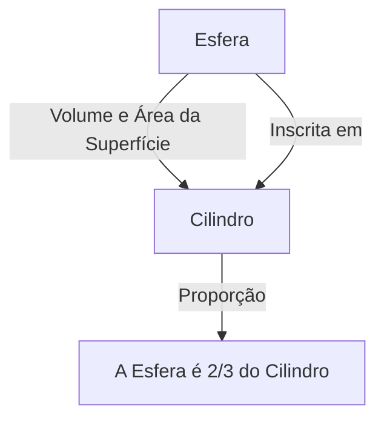

# 1. Introdução: O Maior Intelecto do Mundo Antigo

Arquimedes (c. 287 a.C. - c. 212 a.C.) foi um antigo matemático, físico, engenheiro, inventor e astrônomo grego. Ele é amplamente reconhecido como um dos maiores cientistas do mundo antigo, e suas realizações lançaram as bases para a ciência e a matemática modernas. Nascido em Siracusa (na atual ilha da Sicília, Itália), onde passou a maior parte de sua vida, ele demonstrou um talento extraordinário tanto na exploração matemática pura quanto em invenções práticas de engenharia.

Neste artigo, vamos mergulhar profundamente em seu gênio, desde as anedotas dramáticas de sua vida até as surpreendentes realizações matemáticas e físicas que ele deixou para trás. Ao traçar a trajetória de seu pensamento, podemos entender como o conhecimento antigo está conectado à ciência moderna. Suas contribuições não são meras relíquias históricas, mas representam a própria atitude de explorar verdades universais que fluem sob os alicerces da ciência e tecnologia modernas.

# 2. Vida e Episódios Lendários

Grande parte do registro sobre a vida de Arquimedes foi deixado por historiadores antigos, como Plutarco e Tito Lívio. Sua vida é colorida por numerosos episódios lendários.

## 2.1 A Coroa de Ouro e "Eureka!"

A anedota mais famosa associada a Arquimedes é a autenticação de uma coroa, conhecida pela palavra "Eureka!" (Encontrei!). O rei Hierão II de Siracusa deu ouro puro a um ourives para fazer uma coroa, mas suspeitou que o artesão o havia enganado misturando prata ao ouro. O rei ordenou a Arquimedes que encontrasse uma maneira de expor essa fraude sem danificar a coroa.

Um dia, ao entrar em uma banheira em um balneário público, Arquimedes notou que o nível da água subia à medida que seu corpo afundava. Ele percebeu que esse fenômeno poderia ser usado para medir com precisão o volume da coroa. Diz-se que ele ficou tão cheio de alegria que se esqueceu de se vestir e saiu correndo nu pelas ruas, gritando "Eureka! Eureka!"

Essa descoberta mais tarde se desenvolveu no princípio fundamental da hidrostática conhecido como "Princípio de Arquimedes".

## 2.2 A Defesa de Siracusa e Armas Maravilhosas

Durante a Segunda Guerra Púnica (218 a.C. - 201 a.C.), Siracusa foi sitiada pelo general da República Romana Marco Cláudio Marcelo. Neste momento, Arquimedes, que já era idoso, atormentou muito o exército romano usando numerosas armas que havia inventado.

As armas que se diz ter idealizado incluem as seguintes:

- **A Garra de Arquimedes** (The Claw of Archimedes): Uma máquina gigante semelhante a um guindaste que supostamente erguia navios inimigos do mar e os virava.
- **Raio de Calor** (Heat Ray): Uma lenda de que ele usou um grande número de espelhos para coletar a luz do sol e focá-la em navios de guerra romanos, fazendo-os pegar fogo. A autenticidade disso continua sendo debatida hoje.
- **Catapultas Poderosas** (Catapults): Lançavam enormes pedras com precisão à distância, destruindo as formações inimigas.

Graças a essas armas defensivas, o exército romano passou vários anos tentando capturar Siracusa.

## 2.3 Um Final Trágico: "Não Perturbe Meus Círculos!"

Em 212 a.C., Siracusa finalmente caiu para o exército romano. O general Marcelo valorizava muito o gênio de Arquimedes e deu ordens estritas para capturá-lo vivo.

No entanto, quando um soldado romano entrou na casa de Arquimedes, ele estava absorto em figuras geométricas desenhadas na areia. Quando o soldado ordenou que ele dissesse seu nome, ele se recusou a obedecer, dizendo: "Não perturbe meus círculos! (Noli turbare circulos meos!)" e foi morto pelo soldado enfurecido. Marcelo lamentou profundamente essa morte e, seguindo a vontade de Arquimedes, diz-se que construiu um túmulo gravado com a figura de uma esfera inscrita em um cilindro.

# 3. Surpreendentes Realizações Matemáticas

A verdadeira grandeza de Arquimedes reside em sua intuição matemática. Ele expandiu vastamente os limites da matemática da época, deixando um impacto enorme nos futuros matemáticos.

## 3.1 Aproximação de Pi ("Sobre a Medida do Círculo")

Arquimedes determinou uma aproximação precisa para Pi ($\pi$), a razão entre a circunferência de um círculo e seu diâmetro. Ele usou o "método da exaustão", que envolvia espremer a circunferência do círculo de cima e de baixo usando polígonos regulares inscritos e circunscritos.

Ele começou com um hexágono regular e sucessivamente dobrou o número de lados, realizando finalmente o cálculo usando um polígono regular de 96 lados. Como resultado, ele provou que o valor de Pi $\pi$ cai dentro da seguinte faixa:

$$
3 \frac{10}{71} < \pi < 3 \frac{1}{7}
$$

Expresso como frações, é aproximadamente o seguinte:

$$
\frac{223}{71} < \pi < \frac{22}{7}
$$

Ou seja, $3.1408 < \pi < 3.1429$, e ele havia derivado um valor preciso com duas casas decimais. Esse método pode ser visto como um precursor do conceito de limites no cálculo.

## 3.2 O Teorema da Esfera e do Cilindro ("Sobre a Esfera e o Cilindro")

A realização de que o próprio Arquimedes mais se orgulhava foi a descoberta de teoremas sobre a área da superfície e o volume de uma esfera. Ele provou que existe uma bela relação matemática entre uma esfera e um cilindro circunscrito (um cilindro com altura e diâmetro da base iguais ao diâmetro da esfera).

Sendo o raio $r$, o volume da esfera $V_{\text{esfera}}$ e o volume do cilindro $V_{\text{cilindro}}$ são os seguintes:

$$
V_{\text{esfera}} = \frac{4}{3}\pi r^3
$$
$$
V_{\text{cilindro}} = \pi r^2 \cdot (2r) = 2\pi r^3
$$

Portanto, o volume da esfera é exatamente $\frac{2}{3}$ do volume do cilindro circunscrito.

Ele realizou um cálculo semelhante para a área da superfície. A área da superfície da esfera $S_{\text{esfera}}$ e a área total da superfície do cilindro $S_{\text{cilindro}}$, que combina suas áreas laterais e de base, são as seguintes:

$$
S_{\text{esfera}} = 4\pi r^2
$$
$$
S_{\text{cilindro}} = 2\pi r \cdot (2r) + 2 \cdot (\pi r^2) = 4\pi r^2 + 2\pi r^2 = 6\pi r^2
$$

Aqui também, a área da superfície da esfera é $\frac{2}{3}$ da área da superfície do cilindro circunscrito. Ele estava extremamente orgulhoso dessa notável coincidência, deixando instruções escritas para gravar essa figura em sua lápide.

## 3.3 Quadratura da Parábola ("A Quadratura da Parábola")

Arquimedes também desenvolveu métodos para encontrar a área delimitada por curvas. Ele provou que a área de um segmento parabólico formado pelo cruzamento de uma parábola com uma linha reta é $\frac{4}{3}$ vezes a área de um triângulo com a mesma base e altura.

O conceito da soma de uma série geométrica infinita é usado nesta prova. Ele inscreveu um número infinito de triângulos dentro do segmento parabólico e calculou a soma de suas áreas.

$$
\sum_{n=0}^{\infty} \left(\frac{1}{4}\right)^n = 1 + \frac{1}{4} + \frac{1}{16} + \frac{1}{64} + \dots = \frac{4}{3}
$$

Este é um dos primeiros exemplos na história da matemática em que uma série infinita foi calculada com precisão.

## 3.4 Exploração de Números Gigantescos ("O Contador de Areia")

Na Grécia Antiga, o sistema para expressar números grandes era inadequado e a "miríade" (10.000) era a maior unidade base. Embora algumas pessoas pensassem que "o número de grãos de areia que enchem o universo é infinito", Arquimedes escreveu uma obra chamada "O Contador de Areia" para refutar isso.

Ele concebeu um novo sistema numérico para expressar números gigantescos por conta própria e assumiu um modelo de universo gigante baseado na teoria heliocêntrica de Aristarco. Em seguida, calculou o número de grãos de areia necessários para preencher esse universo sem deixar espaços vazios.

Como resultado, ele mostrou que o número não excederia $8 \times 10^{63}$ (em notação moderna). Este trabalho distinguiu claramente entre o infinito e o finito, e foi uma peça inovadora que apresentou um conceito exponencial para lidar com números grandes.

## 3.5 O Amanhecer do Cálculo ("O Método")

Em 1906, foi descoberto em Constantinopla (hoje Istambul) um palimpsesto (um manuscrito cujo texto foi raspado e reutilizado) contendo muitas das obras perdidas de Arquimedes. Este "Palimpsesto de Arquimedes" continha um tratado inestimável intitulado "O Método dos Teoremas Mecânicos".

Nesta obra, Arquimedes revela seu "processo de pensamento" sobre como ele chegou a inúmeras descobertas geométricas. Ele dividiu as figuras em coleções de "linhas" ou "planos" infinitamente finos e adivinhou suas áreas e volumes usando um modelo mecânico de equilibrá-los em uma balança. Esta abordagem é essencialmente a mesma que o "cálculo integral" estabelecido em épocas posteriores por Isaac Newton e Gottfried Leibniz, mostrando que Arquimedes havia chegado a poucos passos do conceito de cálculo.

## 3.6 Sólidos Arquimedianos

Arquimedes expandiu os sólidos platônicos (poliedros regulares) e descobriu 13 tipos de poliedros semirregulares (sólidos arquimedianos) que são compostos por vários tipos de polígonos regulares e têm a mesma configuração de vértices em todos os lugares. Embora seu trabalho original tenha sido perdido, ele foi posteriormente citado por matemáticos como Papo de Alexandria. Estes também desempenham um papel importante na cristalografia e química modernas (por exemplo, na estrutura da molécula de fulereno).

# 4. Contribuições para a Física e Engenharia

Arquimedes fez descobertas inovadoras não apenas na matemática, mas também nas áreas de física e engenharia. Sua pesquisa foi uma magnífica fusão de teoria e prática.

## 4.1 O Princípio de Arquimedes (Hidrostática)

Relacionado ao episódio "Eureka" mencionado acima, ele formulou a lei fundamental sobre o empuxo experimentado por objetos em fluidos em uma obra intitulada "Sobre os Corpos Flutuantes".

> **Princípio de Arquimedes** : Todo corpo total ou parcialmente imerso em um fluido (líquido ou gás) é submetido a uma força de empuxo, dirigida para cima, igual ao peso do volume de fluido deslocado pelo corpo.

Este princípio continua sendo uma teoria fundamental indispensável na mecânica dos fluidos moderna, como no design de navios e no controle de flutuabilidade de submarinos.

## 4.2 A Lei da Alavanca e Centro de Gravidade

Arquimedes também lançou as bases da mecânica. Em "Sobre o Equilíbrio dos Planos", ele provou matematicamente a "Lei da Alavanca". Ele formulou as condições para que objetos suspensos em ambas as extremidades de uma alavanca se equilibrassem e diz-se que deixou as seguintes palavras famosas:

"Dê-me um ponto de apoio e moverei a Terra."

Ele também estabeleceu métodos precisos para calcular o "centro de gravidade" de várias figuras geométricas. Este é um conceito crucial que forma a base da mecânica estrutural e da arquitetura modernas.

## 4.3 O Parafuso de Arquimedes (Bomba de Água)

A mais amplamente adotada de suas invenções de engenharia foi o "Parafuso de Arquimedes" (bomba de parafuso). Este dispositivo encerra uma lâmina espiral dentro de um cilindro gigante. Ao inclinar e girar o cilindro, a água pode ser bombeada de um local mais baixo para um mais alto.

Diz-se que foi inventado enquanto ele estava no Egito para bombear água do rio Nilo para irrigação. Este mecanismo simples e eficiente ainda é usado hoje na agricultura e em instalações de tratamento de esgoto em todo o mundo, e também é aplicado para o transporte de pós e grãos.

# 5. Influência na Posteridade e Legado

As obras deixadas por Arquimedes tornaram-se uma bíblia para estudiosos do período helenístico à era romana e, mais tarde, no mundo árabe medieval e na Europa renascentista. Galileu Galilei elogiou Arquimedes como uma "figura sobre-humana" e estudou com entusiasmo seus métodos. Johannes Kepler, René Descartes e Newton, que aperfeiçoou o cálculo, também foram muito influenciados pelos escritos de Arquimedes, direta e indiretamente.

Seu espírito de investigação e metodologia continuam brilhando não apenas como relíquias antigas, mas como o arquétipo do pensamento científico. Arquimedes é a pessoa que, sozinho, incorporou os três pilares da ciência moderna: prova rigorosa em matemática, modelagem matemática de fenômenos físicos e desenvolvimento tecnológico prático aplicando a teoria.

# 6. Conclusão

Arquimedes, o gênio de Siracusa, possuía um intelecto avassalador sem paralelo no mundo antigo. Seu grito de "Eureka" ainda é transmitido como uma frase que simboliza a alegria da descoberta científica. Suas realizações abrangem uma ampla gama, desde o cálculo preciso de Pi, a descoberta da bela relação entre a esfera e o cilindro, a antecipação dos conceitos de cálculo, até o estabelecimento dos fundamentos da hidrostática e da mecânica.

Suas últimas palavras, "Não perturbe meus círculos", falam de sua obsessão pura e extraordinária com a busca da verdade. Mesmo hoje, mais de 2.000 anos depois, o conhecimento e a inspiração deixados por Arquimedes continuam a apoiar as fundações de nossa sociedade como um guia eterno iluminando o desenvolvimento da ciência e da matemática.
