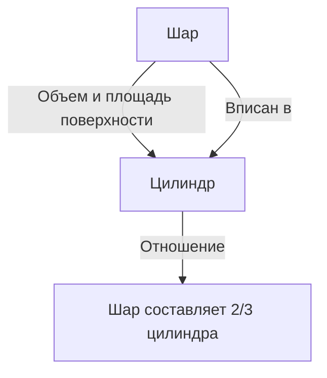
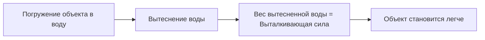

# 1. Введение: Величайший интеллект Древнего мира

Архимед (около 287 г. до н.э. – около 212 г. до н.э.) был древнегреческим математиком, физиком, инженером, изобретателем и астрономом. Он широко признан одним из величайших ученых древнего мира, и его достижения заложили основу для современной науки и математики. Родившись в Сиракузах (на территории современной Сицилии, Италия), где он провел большую часть своей жизни, он продемонстрировал выдающийся талант как в чисто математических исследованиях, так и в практических инженерных изобретениях.

В этой статье мы глубоко погрузимся в его гений, начиная с драматических эпизодов его жизни и заканчивая поразительными математическими и физическими достижениями, которые он оставил после себя. Прослеживая траекторию его мысли, мы сможем понять, как древние знания связаны с современной наукой. Его вклад — это не просто исторические реликвии; он олицетворяет сам подход к поиску универсальных истин, лежащий в основе современной науки и техники.

# 2. Жизнь и легендарные эпизоды

Многие сведения о жизни Архимеда были оставлены античными историками, такими как Плутарх и Тит Ливий. Его жизнь изобилует множеством легендарных эпизодов.

## 2.1 Золотая корона и «Эврика!»

Самый известный эпизод, связанный с Архимедом, касается проверки подлинности короны и знаменитого возгласа «Эврика!» (Я нашел!). Царь Сиракуз Гиерон II поручил ювелиру изготовить корону из чистого золота, но заподозрил, что мастер схитрил, подмешав в золото серебро. Царь приказал Архимеду найти способ разоблачить этот обман, не повредив при этом корону.

Однажды, погружаясь в ванну в общественных банях, Архимед заметил, что уровень воды поднимается по мере того, как его тело опускается в воду. Он понял, что это явление можно использовать для точного измерения объема короны. Говорят, что он был настолько вне себя от радости, что забыл одеться и выбежал голым на улицу, с криками: «Эврика! Эврика!»

Это открытие позже переросло в фундаментальный принцип гидростатики, известный как «Закон Архимеда».

## 2.2 Оборона Сиракуз и удивительные машины

Во время Второй Пунической войны (218 г. до н.э. – 201 г. до н.э.) Сиракузы были осаждены римским полководцем Марком Клавдием Марцеллом. В это время Архимед, будучи уже в преклонном возрасте, доставил огромные неприятности римской армии с помощью множества изобретенных им машин.

Считается, что он создал следующее оружие:

- **Коготь Архимеда** (The Claw of Archimedes): Гигантская машина, похожая на кран, которая, как утверждается, поднимала вражеские корабли из воды и переворачивала их.
- **Тепловой луч** (Heat Ray): Легенда гласит, что он использовал множество зеркал, чтобы собрать солнечный свет и сфокусировать его на римских военных кораблях, заставляя их загораться. Достоверность этого факта обсуждается и по сей день.
- **Мощные катапульты** (Catapults): Они точно метали огромные камни с большого расстояния, разрушая вражеский строй.

Благодаря этим оборонительным машинам римская армия потратила несколько лет на попытки захватить Сиракузы.

## 2.3 Трагический конец: «Не трогай моих чертежей!»

В 212 году до н.э. Сиракузы наконец пали под натиском римской армии. Генерал Марцелл высоко ценил гений Архимеда и отдал строгий приказ захватить его живым.

Однако, когда римский солдат вошел в дом Архимеда, тот был поглощен изучением геометрических фигур, начерченных на песке. Когда солдат приказал ему назвать свое имя, он отказался повиноваться, сказав: «Не трогай моих чертежей! (Noli turbare circulos meos!)», и был убит разгневанным солдатом. Марцелл глубоко оплакивал эту смерть и, следуя завещанию Архимеда, как говорят, построил гробницу, на которой была выгравирована фигура шара, вписанного в цилиндр.

# 3. Поразительные математические достижения

Истинное величие Архимеда заключается в его математической проницательности. Он значительно расширил границы математики своего времени, оказав колоссальное влияние на будущих математиков.

## 3.1 Приближение числа Пи («Измерение круга»)

Архимед определил точное приближение для числа Пи ($\pi$), отношения длины окружности к ее диаметру. Он использовал «метод исчерпывания», который заключался в оценке длины окружности сверху и снизу с помощью вписанных и описанных правильных многоугольников.

Он начал с правильного шестиугольника и последовательно удваивал число сторон, в итоге выполнив расчет с использованием правильного 96-угольника. В результате он доказал, что значение числа Пи $\pi$ находится в следующем диапазоне:

$$
3 \frac{10}{71} < \pi < 3 \frac{1}{7}
$$

Выраженное в виде дробей, это примерно выглядит так:

$$
\frac{223}{71} < \pi < \frac{22}{7}
$$

То есть, $3.1408 < \pi < 3.1429$, и он вывел точное значение до двух знаков после запятой. Этот метод можно рассматривать как предшественник концепции пределов в математическом анализе.

## 3.2 Теорема о шаре и цилиндре («О шаре и цилиндре»)

Достижением, которым Архимед гордился больше всего, было открытие теорем, касающихся площади поверхности и объема шара. Он доказал, что существует красивая математическая связь между шаром и описанным вокруг него цилиндром (цилиндром с высотой и диаметром основания, равными диаметру шара).

Пусть радиус равен $r$, тогда объем шара $V_{\text{шар}}$ и объем цилиндра $V_{\text{цилиндр}}$ равны:

$$
V_{\text{шар}} = \frac{4}{3}\pi r^3
$$
$$
V_{\text{цилиндр}} = \pi r^2 \cdot (2r) = 2\pi r^3
$$

Следовательно, объем шара равен ровно $\frac{2}{3}$ объема описанного цилиндра.

Аналогичный расчет он выполнил и для площади поверхности. Площадь поверхности шара $S_{\text{шар}}$ и общая площадь поверхности цилиндра $S_{\text{цилиндр}}$, которая складывается из площади боковой поверхности и оснований, равны:

$$
S_{\text{шар}} = 4\pi r^2
$$
$$
S_{\text{цилиндр}} = 2\pi r \cdot (2r) + 2 \cdot (\pi r^2) = 4\pi r^2 + 2\pi r^2 = 6\pi r^2
$$

Здесь также площадь поверхности шара составляет $\frac{2}{3}$ площади поверхности описанного цилиндра. Он невероятно гордился этим удивительным совпадением, оставив письменные инструкции выгравировать эту фигуру на своем надгробии.

## 3.3 Квадратура параболы («Квадратура параболы»)

Архимед также разработал методы нахождения площади, ограниченной кривыми. Он доказал, что площадь параболического сегмента, образованного пересечением параболы с прямой, в $\frac{4}{3}$ раза больше площади треугольника с тем же основанием и высотой.

В этом доказательстве используется концепция суммы бесконечной геометрической прогрессии. Он вписал бесконечное количество треугольников внутрь параболического сегмента и вычислил сумму их площадей.

$$
\sum_{n=0}^{\infty} \left(\frac{1}{4}\right)^n = 1 + \frac{1}{4} + \frac{1}{16} + \frac{1}{64} + \dots = \frac{4}{3}
$$

Это один из первых примеров в истории математики, когда была точно вычислена бесконечная сумма.

## 3.4 Исследование гигантских чисел («Исчисление песчинок»)

В Древней Греции система выражения больших чисел была несовершенной, и «мириада» (10 000) была самой большой базовой единицей. В то время как некоторые люди думали, что «количество песчинок, заполняющих вселенную, бесконечно», Архимед написал труд под названием «Исчисление песчинок», чтобы опровергнуть это.

Он самостоятельно разработал новую систему счисления для выражения гигантских чисел и взял за основу гигантскую модель вселенной, основанную на гелиоцентрической теории Аристарха. Затем он вычислил количество песчинок, необходимых для заполнения этой вселенной без каких-либо пустот.

В результате он показал, что это число не превысит $8 \times 10^{63}$ (в современных обозначениях). Эта работа четко разграничила бесконечное и конечное, и стала новаторским трудом, представившим экспоненциальную концепцию для работы с большими числами.

## 3.5 Зарождение математического анализа («Метод»)

В 1906 году в Константинополе (современный Стамбул) был обнаружен палимпсест (рукопись, текст которой был соскоблен и использован повторно), содержащий многие утерянные труды Архимеда. Этот «Палимпсест Архимеда» содержал бесценный трактат под названием «Послание к Эратосфену о методе» (Метод механических теорем).

В этом труде Архимед раскрывает свой «мыслительный процесс» о том, как он пришел к многочисленным геометрическим открытиям. Он разбивал фигуры на совокупности бесконечно тонких «линий» или «плоскостей» и угадывал их площади и объемы, используя механическую модель балансировки их на весах. Этот подход по сути является тем же самым «интегральным исчислением», созданным в более поздние эпохи Исааком Ньютоном и Готфридом Лейбницем, и показывает, что Архимед подошел вплотную к концепции математического анализа.

## 3.6 Архимедовы тела

Архимед расширил платоновы тела (правильные многогранники) и открыл 13 типов полуправильных многогранников (архимедовы тела), которые состоят из нескольких типов правильных многоугольников и имеют одинаковую конфигурацию вершин повсюду. Хотя его оригинальный труд был утерян, позже на него ссылались математики, такие как Папп Александрийский. Они также играют важную роль в современной кристаллографии и химии (например, структура молекулы фуллерена).

# 4. Вклад в физику и инженерию

Архимед совершил революционные открытия не только в математике, но и в области физики и инженерии. Его исследования представляли собой великолепный синтез теории и практики.

## 4.1 Закон Архимеда (Гидростатика)

В связи с вышеупомянутым эпизодом «Эврики», в труде «О плавающих телах» он сформулировал фундаментальный закон, касающийся выталкивающей силы, действующей на объекты в жидкостях.

> **Закон Архимеда** : На любое тело, полностью или частично погруженное в жидкость (или газ), действует выталкивающая сила, равная весу жидкости, вытесненной этим телом.

Этот принцип остается незаменимой фундаментальной теорией в современной гидродинамике, например, при проектировании кораблей и управлении плавучестью подводных лодок.

## 4.2 Закон рычага и центр тяжести

Архимед также заложил основы механики. В трактате «О равновесии плоских фигур» он математически доказал «Закон рычага». Он сформулировал условия, при которых объекты, подвешенные на обоих концах рычага, находятся в равновесии, и, как говорят, оставил следующие знаменитые слова:

«Дайте мне точку опоры, и я переверну Землю».

Он также установил точные методы расчета «центра тяжести» различных геометрических фигур. Это важнейшая концепция, которая формирует основу современной строительной механики и архитектуры.

## 4.3 Архимедов винт (Водяной насос)

Самым широко распространенным из его инженерных изобретений стал «Архимедов винт» (винтовой насос). Это устройство представляет собой спиралевидную лопасть, заключенную внутри гигантского цилиндра. При наклоне и вращении цилиндра воду можно перекачивать с более низкого места на более высокое.

Считается, что он был изобретен во время его пребывания в Египте для перекачки воды из реки Нил для орошения. Этот простой и эффективный механизм до сих пор используется в сельском хозяйстве и на очистных сооружениях по всему миру, а также применяется для транспортировки порошков и зерна.

# 5. Влияние на потомков и наследие

Труды, оставленные Архимедом, стали библией для ученых от эллинистического периода до римской эпохи, а позднее в средневековом арабском мире и Европе эпохи Возрождения. Галилео Галилей превозносил Архимеда как «сверхчеловека» и с энтузиазмом изучал его методы. Иоганн Кеплер, [Рене Декарт](https://kenji.blog/p/descartes/) и Ньютон, который довел до совершенства математический анализ, также находились под сильным влиянием трудов Архимеда, прямо или косвенно.

Его исследовательский дух и методология продолжают сиять не просто как древние реликвии, но как архетип научного мышления. Архимед — это человек, который в одиночку воплотил в себе три столпа современной науки: строгое доказательство в математике, математическое моделирование физических явлений и практическое развитие технологий с применением теории.

# 6. Заключение

Архимед, гений из Сиракуз, обладал подавляющим интеллектом, которому не было равных в древнем мире. Его крик «Эврика» до сих пор передается из поколения в поколение как фраза, символизирующая радость научного открытия. Его достижения охватывают широкий спектр областей: от точного вычисления числа Пи до открытия красивой связи между шаром и цилиндром, от предвосхищения концепций математического анализа до создания основ гидростатики и механики.

Его последние слова, «Не трогай моих чертежей», говорят о его чистой и необычайной одержимости поиском истины. Даже сегодня, спустя более 2000 лет, знания и вдохновение, оставленные Архимедом, продолжают служить фундаментом нашего общества как вечный ориентир, освещающий развитие науки и математики.
