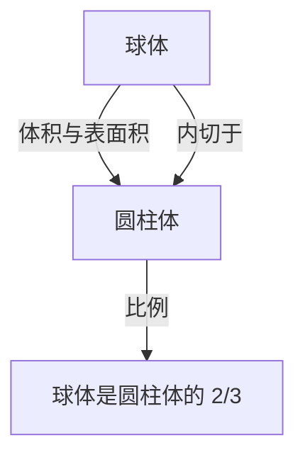

# 1. 引言：古代世界最伟大的智慧

阿基米德（公元前287年 - 公元前212年）是古希腊的数学家、物理学家、工程师、发明家和天文学家。他被广泛认为是古代世界最伟大的科学家之一，他的成就是现代科学和数学的基础。他出生于叙拉古（位于现代意大利西西里岛），并在那里度过了他一生的大部分时光。他在纯数学探索和实用的工程发明方面都展示了非凡的才华。

在这篇文章中，我们将深入探讨他的天才之处，从他一生中充满戏剧性的轶事到他留下的惊人数学和物理成就。通过追寻他的思想轨迹，我们可以理解古代知识是如何与现代科学相连的。他的贡献不仅仅是历史的遗物，更代表了探索普遍真理的态度，而这种态度正是现代科学技术发展的基石。

# 2. 生平与传奇轶事

关于阿基米德生平的许多记录都是由普鲁塔克和李维等古代历史学家留下的。他的一生充满了许多传奇的轶事。

## 2.1 金王冠与“尤里卡！”

与阿基米德有关的最著名的轶事是鉴定王冠的真伪，并因“尤里卡！”（我找到了！）这个词而闻名。叙拉古的国王希伦二世交给金匠一块纯金让他打造一顶王冠，但他怀疑工匠在金子中掺了银子来欺骗他。国王命令阿基米德找到一种在不损坏王冠的情况下揭露这种欺诈行为的方法。

有一天，当阿基米德走进公共浴池的浴缸时，他注意到水位随着身体的下沉而上升。他意识到可以利用这种现象来准确测量王冠的体积。据说他高兴得忘记了穿衣服，赤身裸体地冲到街上，跑着大喊：“尤里卡！尤里卡！”

这一发现后来发展成为了被称为“阿基米德原理”的流体静力学基本原理。

## 2.2 叙拉古保卫战与神奇的武器

在第二次布匿战争（公元前218年 - 公元前201年）期间，叙拉古遭到了罗马共和国将军马库斯·克劳狄乌斯·马塞卢斯的围攻。此时，年事已高的阿基米德使用他发明的众多武器，让罗马军队吃尽了苦头。

据说他发明的武器包括以下几种：

- **阿基米德之爪** (The Claw of [Archimedes](https://kenji.blog/zh-cn/p/archimedes/))：一种巨大的类似起重机的机械，据说能将敌船从海里吊起并将其倾覆。
- **热射线** (Heat Ray)：传说他使用大量镜子收集阳光，并将其聚焦在罗马军舰上，导致它们起火。这个故事的真实性至今仍有争议。
- **强大的投石机** (Catapults)：它们可以从远处精确地投掷巨石，摧毁敌人的阵型。

多亏了这些防御武器，罗马军队花了好几年的时间才攻下叙拉古。

## 2.3 悲剧的结局：“不要弄坏我的圆！”

公元前212年，叙拉古最终被罗马军队攻陷。马塞卢斯将军非常看重阿基米德的天才，并下达了严格的命令要活捉他。

然而，当一名罗马士兵进入阿基米德的房子时，他正全神贯注于画在沙子上的几何图形。当士兵命令他报上名来时，他拒绝服从，并说道：“不要弄坏我的圆！ (Noli turbare circulos meos!)”，结果被愤怒的士兵杀死。马塞卢斯对他的死感到非常悲痛，并按照阿基米德的遗愿，据说为他建造了一座刻有圆柱体内切球体图形的坟墓。

# 3. 惊人的数学成就

阿基米德真正的伟大之处在于他的数学洞察力。他极大地扩展了当时数学的边界，对后世的数学家产生了深远的影响。

## 3.1 圆周率的近似值（《圆的测量》）

阿基米德确定了圆周率（$\pi$）的准确近似值，即圆的周长与其直径的比值。他使用了“穷竭法”，即使用内接和外切正多边形从上下两面夹逼圆的周长。

他从正六边形开始，连续将边数翻倍，最终使用正96边形进行计算。结果，他证明了圆周率 $\pi$ 的值落在以下范围内：

$$
3 \frac{10}{71} < \pi < 3 \frac{1}{7}
$$

用分数表示，大致如下：

$$
\frac{223}{71} < \pi < \frac{22}{7}
$$

也就是说， $3.1408 < \pi < 3.1429$ ，他推导出了精确到小数点后两位的数值。这种方法可以被看作是微积分中极限概念的先驱。

## 3.2 球体与圆柱体定理（《论球与圆柱》）

阿基米德自己最引以为豪的成就是发现了关于球体表面积和体积的定理。他证明了一个球体与它的外接圆柱体（高度和底面直径等于球体直径的圆柱体）之间存在着美丽的数学关系。

假设半径为 $r$ ，球体的体积 $V_{\text{球体}}$ 和圆柱体的体积 $V_{\text{圆柱体}}$ 如下：

$$
V_{\text{球体}} = \frac{4}{3}\pi r^3
$$
$$
V_{\text{圆柱体}} = \pi r^2 \cdot (2r) = 2\pi r^3
$$

因此，球体的体积恰好是外接圆柱体体积的 $\frac{2}{3}$ 。

他对表面积也进行了类似的计算。球体的表面积 $S_{\text{球体}}$ 和圆柱体的总表面积 $S_{\text{圆柱体}}$（包括其侧面积和底面积）如下：

$$
S_{\text{球体}} = 4\pi r^2
$$
$$
S_{\text{圆柱体}} = 2\pi r \cdot (2r) + 2 \cdot (\pi r^2) = 4\pi r^2 + 2\pi r^2 = 6\pi r^2
$$

在这里，球体的表面积也是外接圆柱体表面积的 $\frac{2}{3}$ 。他对这个惊人的巧合感到非常自豪，并留下书面遗嘱，要求将这个图形刻在自己的墓碑上。

## 3.3 抛物线的求积（《抛物线求积法》）

阿基米德还开发了寻找由曲线包围的面积的方法。他证明了由抛物线与直线相交形成的抛物线弓形的面积是具有相同底和高的三角形面积的 $\frac{4}{3}$ 倍。

在这个证明中使用了无穷等比数列求和的概念。他在抛物线弓形内内接了无限多个三角形，并计算了它们的面积之和。

$$
\sum_{n=0}^{\infty} \left(\frac{1}{4}\right)^n = 1 + \frac{1}{4} + \frac{1}{16} + \frac{1}{64} + \dots = \frac{4}{3}
$$

这是数学史上精确计算无穷级数的首批例子之一。

## 3.4 对巨大数字的探索（《数沙者》）

在古希腊，表达大数的系统是不完善的，“万”（10,000）是最大的基本单位。虽然有些人认为“填满宇宙的沙子数量是无限的”，但阿基米德写了一部名为《数沙者》的著作来反驳这一点。

他自己设计了一种新的数字系统来表达巨大的数字，并假设了一个基于阿里斯塔克斯日心说的巨大宇宙模型。然后，他计算了填满那个宇宙（不留任何缝隙）所需的沙粒数量。

结果，他表明这个数字不会超过 $8 \times 10^{63}$ （用现代记数法表示）。这项工作明确区分了无限和有限，是一部开创性的著作，提出了处理大数的指数概念。

## 3.5 微积分的萌芽（《方法论》）

1906年，在君士坦丁堡（现伊斯坦布尔）发现了一份羊皮纸手稿（一种文字被刮掉并重复使用的手稿），其中包含许多阿基米德失传的著作。这份“阿基米德羊皮纸手稿”包含了一篇名为《机械定理的方法》的无价论文。

在这部著作中，阿基米德揭示了他得出众多几何发现的“思考过程”。他将图形分割成无限薄的“线”或“面”的集合，并使用在天平上平衡它们的力学模型来猜测它们的面积和体积。这种方法在本质上与后来[艾萨克·牛顿](https://kenji.blog/zh-cn/p/newton/)和[戈特弗里德·莱布尼茨](https://kenji.blog/zh-cn/p/leibniz/)建立的“积分学”相同，这表明阿基米德离微积分的概念只有一步之遥。

## 3.6 阿基米德立体

阿基米德扩展了柏拉图立体（正多面体），并发现了13种半正多面体（阿基米德立体）。这些立体由多种类型的正多边形组成，并且各处的顶点结构都相同。虽然他的原著失传了，但后来被帕普斯等数学家引用。它们在现代结晶学和化学（例如富勒烯分子的结构）中也发挥着重要作用。

# 4. 对物理学和工程学的贡献

阿基米德不仅在数学上，而且在物理学和工程学领域也做出了突破性的发现。他的研究是理论与实践的完美结合。

## 4.1 阿基米德原理（流体静力学）

与前面提到的“尤里卡”轶事相关，他在题为《论浮体》的著作中，系统地阐述了关于物体在流体中所受浮力的基本定律。

> **阿基米德原理** ：浸在流体（液体或气体）中的物体（全部或部分），受到向上的浮力，其大小等于该物体所排开流体的重量。

这一原理仍然是现代流体力学中不可或缺的基础理论，例如在船舶设计和潜艇的浮力控制中。

## 4.2 杠杆原理与重心

阿基米德还奠定了力学的基础。在《论平面的平衡》中，他从数学上证明了“杠杆原理”。他阐明了挂在杠杆两端的物体保持平衡的条件，并据说留下了以下名言：

“给我一个支点，我就能撬动地球。”

他还建立了精确计算各种几何图形“重心”的方法。这是构成现代结构力学和建筑学基础的关键概念。

## 4.3 阿基米德螺旋泵（抽水机）

在他所有的工程发明中，应用最广泛的是“阿基米德螺旋泵”。这种装置在巨大的圆柱体内装有一个螺旋状的叶片。通过倾斜并旋转圆柱体，可以将水从低处抽到高处。

据说这是他在埃及逗留期间发明的，用于将尼罗河的水抽上来灌溉。这种简单而高效的机械至今仍被广泛应用于世界各地的农业和污水处理设施中，也用于粉末和谷物的运输。

# 5. 对后世的影响与遗产

阿基米德留下的著作成为从希腊化时期到罗马时代，以及后来在中世纪阿拉伯世界和文艺复兴时期欧洲学者的圣经。伽利略·伽利莱称赞阿基米德为“超人”，并热情地研究了他的方法。约翰内斯·开普勒、[勒内·笛卡尔](https://kenji.blog/zh-cn/p/descartes/)，以及完善了微积分的牛顿，也都直接或间接地受到了阿基米德著作的极大影响。

他的探索精神和方法论不仅仅作为古代遗物，而是作为科学思想的典范继续闪耀着光芒。阿基米德是凭借一己之力体现了现代科学三大支柱的人：数学中的严格证明、物理现象的数学建模，以及应用理论的实用技术开发。

# 6. 结论

叙拉古的天才阿基米德拥有在古代世界无与伦比的压倒性智慧。他的那句“尤里卡”至今仍被作为象征科学发现之喜悦的短语传承下来。他的成就涵盖了广泛的领域，从精确计算圆周率、发现球体和圆柱体之间优美的关系、预见微积分的概念，到奠定流体静力学和力学的基础。

他最后的话，“不要弄坏我的圆”，诉说着他对追求真理的纯粹和非凡的执着。即使在2000多年后的今天，阿基米德留下的知识和灵感继续支撑着我们社会的基石，成为照亮科学和数学发展的永恒路标。
