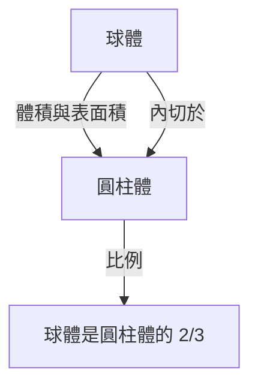
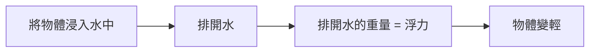

# 1. 引言：古代世界最偉大的智慧

阿基米德（公元前287年 - 公元前212年）是古希臘的數學家、物理學家、工程師、發明家和天文學家。他被廣泛認為是古代世界最偉大的科學家之一，他的成就是現代科學和數學的基礎。他出生於敘拉古（位於現代義大利西西里島），並在那裡度過了他一生的大部分時光。他在純數學探索和實用的工程發明方面都展示了非凡的才華。

在這篇文章中，我們將深入探討他的天才之處，從他一生中充滿戲劇性的軼事到他留下的驚人數學和物理成就。透過追尋他的思想軌跡，我們可以理解古代知識是如何與現代科學相連的。他的貢獻不僅僅是歷史的遺物，更代表了探索普遍真理的態度，而這種態度正是現代科學技術發展的基石。

# 2. 生平與傳奇軼事

關於阿基米德生平的許多記錄都是由普魯塔克和李維等古代歷史學家留下的。他的一生充滿了許多傳奇的軼事。

## 2.1 金王冠與「尤里卡！」

與阿基米德有關的最著名的軼事是鑑定王冠的真偽，並因「尤里卡！」（我找到了！）這個詞而聞名。敘拉古的國王希倫二世交給金匠一塊純金讓他打造一頂王冠，但他懷疑工匠在金子中摻了銀子來欺騙他。國王命令阿基米德找到一種在不損壞王冠的情況下揭露這種欺詐行為的方法。

有一天，當阿基米德走進公共浴池的浴缸時，他注意到水位隨著身體的下沉而上升。他意識到可以利用這種現象來準確測量王冠的體積。據說他高興得忘記了穿衣服，赤身裸體地衝到街上，跑著大喊：「尤里卡！尤里卡！」

這一發現後來發展成為了被稱為「阿基米德原理」的流體靜力學基本原理。

## 2.2 敘拉古保衛戰與神奇的武器

在第二次布匿戰爭（公元前218年 - 公元前201年）期間，敘拉古遭到了羅馬共和國將軍馬庫斯·克勞狄烏斯·馬塞盧斯的圍攻。此時，年事已高的阿基米德使用他發明的眾多武器，讓羅馬軍隊吃盡了苦頭。

據說他發明的武器包括以下幾種：

- **阿基米德之爪** (The Claw of [Archimedes](https://kenji.blog/zh-tw/p/archimedes/))：一種巨大的類似起重機的機械，據說能將敵船從海裡吊起並將其傾覆。
- **熱射線** (Heat Ray)：傳說他使用大量鏡子收集陽光，並將其聚焦在羅馬軍艦上，導致它們起火。這個故事的真實性至今仍有爭議。
- **強大的投石機** (Catapults)：它們可以從遠處精確地投擲巨石，摧毀敵人的陣型。

多虧了這些防禦武器，羅馬軍隊花了好幾年的時間才攻下敘拉古。

## 2.3 悲劇的結局：「不要弄壞我的圓！」

公元前212年，敘拉古最終被羅馬軍隊攻陷。馬塞盧斯將軍非常看重阿基米德的天才，並下達了嚴格的命令要活捉他。

然而，當一名羅馬士兵進入阿基米德的房子時，他正全神貫注於畫在沙子上的幾何圖形。當士兵命令他報上名來時，他拒絕服從，並說道：「不要弄壞我的圓！ (Noli turbare circulos meos!)」，結果被憤怒的士兵殺死。馬塞盧斯對他的死感到非常悲痛，並按照阿基米德的遺願，據說為他建造了一座刻有圓柱體內切球體圖形的墳墓。

# 3. 驚人的數學成就

阿基米德真正的偉大之處在於他的數學洞察力。他極大地擴展了當時數學的邊界，對後世的數學家產生了深遠的影響。

## 3.1 圓周率的近似值（《圓的測量》）

阿基米德確定了圓周率（$\pi$）的準確近似值，即圓的周長與其直徑的比值。他使用了「窮竭法」，即使用內接和外切正多邊形從上下兩面夾逼圓的周長。

他從正六邊形開始，連續將邊數翻倍，最終使用正96邊形進行計算。結果，他證明了圓周率 $\pi$ 的值落在以下範圍內：

$$
3 \frac{10}{71} < \pi < 3 \frac{1}{7}
$$

用分數表示，大致如下：

$$
\frac{223}{71} < \pi < \frac{22}{7}
$$

也就是說， $3.1408 < \pi < 3.1429$ ，他推導出了精確到小數點後兩位的數值。這種方法可以被看作是微積分中極限概念的先驅。

## 3.2 球體與圓柱體定理（《論球與圓柱》）

阿基米德自己最引以為豪的成就是發現了關於球體表面積和體積的定理。他證明了一個球體與它的外接圓柱體（高度和底面直徑等於球體直徑的圓柱體）之間存在著美麗的數學關係。

假設半徑為 $r$ ，球體的體積 $V_{\text{球體}}$ 和圓柱體的體積 $V_{\text{圓柱體}}$ 如下：

$$
V_{\text{球體}} = \frac{4}{3}\pi r^3
$$
$$
V_{\text{圓柱體}} = \pi r^2 \cdot (2r) = 2\pi r^3
$$

因此，球體的體積恰好是外接圓柱體體積的 $\frac{2}{3}$ 。

他對表面積也進行了類似的計算。球體的表面積 $S_{\text{球體}}$ 和圓柱體的總表面積 $S_{\text{圓柱體}}$（包括其側面積和底面積）如下：

$$
S_{\text{球體}} = 4\pi r^2
$$
$$
S_{\text{圓柱體}} = 2\pi r \cdot (2r) + 2 \cdot (\pi r^2) = 4\pi r^2 + 2\pi r^2 = 6\pi r^2
$$

在這裡，球體的表面積也是外接圓柱體表面積的 $\frac{2}{3}$ 。他對這個驚人的巧合感到非常自豪，並留下書面遺囑，要求將這個圖形刻在自己的墓碑上。

## 3.3 拋物線的求積（《拋物線求積法》）

阿基米德還開發了尋找由曲線包圍的面積的方法。他證明了由拋物線與直線相交形成的拋物線弓形的面積是具有相同底和高的三角形面積的 $\frac{4}{3}$ 倍。

在這個證明中使用了無窮等比數列求和的概念。他在拋物線弓形內內接了無限多個三角形，並計算了它們的面積之和。

$$
\sum_{n=0}^{\infty} \left(\frac{1}{4}\right)^n = 1 + \frac{1}{4} + \frac{1}{16} + \frac{1}{64} + \dots = \frac{4}{3}
$$

這是數學史上精確計算無窮級數的首批例子之一。

## 3.4 對巨大數字的探索（《數沙者》）

在古希臘，表達大數的系統是不完善的，「萬」（10,000）是最大的基本單位。雖然有些人認為「填滿宇宙的沙子數量是無限的」，但阿基米德寫了一部名為《數沙者》的著作來反駁這一點。

他自己設計了一種新的數字系統來表達巨大的數字，並假設了一個基於阿里斯塔克斯日心說的巨大宇宙模型。然後，他計算了填滿那個宇宙（不留任何縫隙）所需的沙粒數量。

結果，他表明這個數字不會超過 $8 \times 10^{63}$ （用現代記數法表示）。這項工作明確區分了無限和有限，是一部開創性的著作，提出了處理大數的指數概念。

## 3.5 微積分的萌芽（《方法論》）

1906年，在君士坦丁堡（現伊斯坦布爾）發現了一份羊皮紙手稿（一種文字被刮掉並重複使用的手稿），其中包含許多阿基米德失傳的著作。這份「阿基米德羊皮紙手稿」包含了一篇名為《機械定理的方法》的無價論文。

在這部著作中，阿基米德揭示了他得出眾多幾何發現的「思考過程」。他將圖形分割成無限薄的「線」或「面」的集合，並使用在天平上平衡它們的力學模型來猜測它們的面積和體積。這種方法在本質上與後來[艾薩克·牛頓](https://kenji.blog/zh-tw/p/newton/)和[戈特弗里德·萊布尼茨](https://kenji.blog/zh-tw/p/leibniz/)建立的「積分學」相同，這表明阿基米德離微積分的概念只有一步之遙。

## 3.6 阿基米德立體

阿基米德擴展了柏拉圖立體（正多面體），並發現了13種半正多面體（阿基米德立體）。這些立體由多種類型的正多邊形組成，並且各處的頂點結構都相同。雖然他的原著失傳了，但後來被帕普斯等數學家引用。它們在現代結晶學和化學（例如富勒烯分子的結構）中也發揮著重要作用。

# 4. 對物理學和工程學的貢獻

阿基米德不僅在數學上，而且在物理學和工程學領域也做出了突破性的發現。他的研究是理論與實踐的完美結合。

## 4.1 阿基米德原理（流體靜力學）

與前面提到的「尤里卡」軼事相關，他在題為《論浮體》的著作中，系統地闡述了關於物體在流體中所受浮力的基本定律。

> **阿基米德原理** ：浸在流體（液體或氣體）中的物體（全部或部分），受到向上的浮力，其大小等於該物體所排開流體的重量。

這一原理仍然是現代流體力學中不可或缺的基礎理論，例如在船舶設計和潛艇的浮力控制中。

## 4.2 槓桿原理與重心

阿基米德還奠定了力學的基礎。在《論平面的平衡》中，他從數學上證明了「槓桿原理」。他闡明了掛在槓桿兩端的物體保持平衡的條件，並據說留下了以下名言：

「給我一個支點，我就能撬動地球。」

他還建立了精確計算各種幾何圖形「重心」的方法。這是構成現代結構力學和建築學基礎的關鍵概念。

## 4.3 阿基米德螺旋泵（抽水機）

在他所有的工程發明中，應用最廣泛的是「阿基米德螺旋泵」。這種裝置在巨大的圓柱體內裝有一個螺旋狀的葉片。透過傾斜並旋轉圓柱體，可以將水從低處抽到高處。

據說這是他在埃及逗留期間發明的，用於將尼羅河的水抽上來灌溉。這種簡單而高效的機械至今仍被廣泛應用於世界各地的農業和污水處理設施中，也用於粉末和穀物的運輸。

# 5. 對後世的影響與遺產

阿基米德留下的著作成為從希臘化時期到羅馬時代，以及後來在中世紀阿拉伯世界和文藝復興時期歐洲學者的聖經。伽利略·伽利萊稱讚阿基米德為「超人」，並熱情地研究了他的方法。約翰內斯·克卜勒、勒內·笛卡爾，以及完善了微積分的牛頓，也都直接或間接地受到了阿基米德著作的極大影響。

他的探索精神和方法論不僅僅作為古代遺物，而是作為科學思想的典範繼續閃耀著光芒。阿基米德是憑藉一己之力體現了現代科學三大支柱的人：數學中的嚴格證明、物理現象的數學建模，以及應用理論的實用技術開發。

# 6. 結論

敘拉古的天才阿基米德擁有在古代世界無與倫比的壓倒性智慧。他的那句「尤里卡」至今仍被作為象徵科學發現之喜悅的短語傳承下來。他的成就涵蓋了廣泛的領域，從精確計算圓周率、發現球體和圓柱體之間優美的關係、預見微積分的概念，到奠定流體靜力學和力學的基礎。

他最後的話，「不要弄壞我的圓」，訴說著他對追求真理的純粹和非凡的執著。即使在2000多年後的今天，阿基米德留下的知識和靈感繼續支撐著我們社會的基石，成為照亮科學和數學發展的永恆路標。
