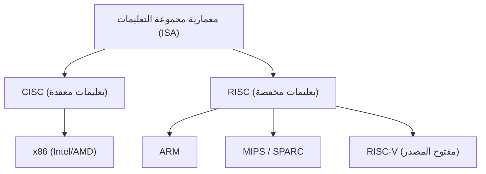
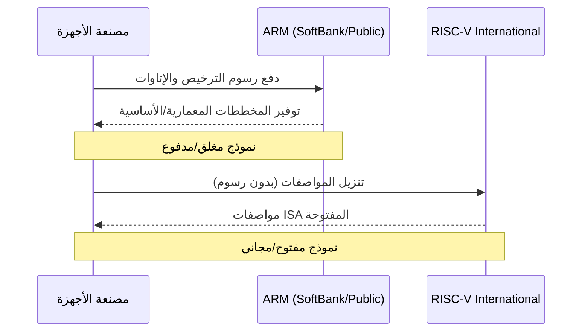

## مقدمة: الصراع المستمر على هيمنة السيليكون

تاريخ صناعة أشباه الموصلات هو نفسه تاريخ الصراع على الهيمنة حول "معمارية مجموعة التعليمات" (ISA: Instruction Set Architecture). منذ الفجر في السبعينيات وحتى الوقت الحاضر، حددت هذه القاعدة الأساسية، المتمثلة في كيفية قيام المعالج بتفسير التعليمات من البرامج وتنفيذها على الأجهزة، اتجاه تطور التكنولوجيا.

في الماضي، سيطرت معمارية x86، الممثلة بـ Intel و AMD، تمامًا على سوق أجهزة الكمبيوتر الشخصية والخوادم، وأقامت إمبراطورية لا تتزعزع تعرف باسم "Wintel (Windows + Intel)". ومع ذلك، مع تحول العالم من أجهزة الكمبيوتر الشخصية إلى الأجهزة المحمولة، بدأ نظام الهيمنة هذا يتزعزع تدريجياً. وهنا برزت معمارية ARM، التي سعت إلى تحقيق أقصى قدر من كفاءة الطاقة.

لم يكن ظهور ARM وانتشارها مجرد تغيير تقني للأجيال، بل كان تحولًا جذريًا في نموذج الأعمال نفسه. واليوم، ما يهدد معقل ARM هو "RISC-V"، الذي وُلد كمصدر مفتوح بالكامل. في هذه المقالة، سنتعمق في الملحمة العظيمة لمعمارية أشباه الموصلات التي تتجه من CISC إلى RISC، ومن المغلق إلى المفتوح، وذلك من خلال استعراض تاريخ شركات التكنولوجيا العملاقة مثل Intel و AMD و Apple و NVIDIA.

## الفصل الأول: ولادة x86 والعصر الذهبي لـ CISC

### 1.1 التطور من Intel 4004 إلى 8086

في عام 1971، أعلنت Intel عن أول معالج دقيق في العالم "4004". تم تطويره في الأصل للآلات الحاسبة لشركة Busicom اليابانية، ولكنه أصبح نقطة البداية للنمو الهائل اللاحق لصناعة أشباه الموصلات. بعد ذلك، استمر التطور مع 8008 و 8080، وفي عام 1978 وُلدت التحفة التاريخية "8086". هذه هي بداية سلالة معمارية "x86" التي تستمر حتى يومنا هذا.

كان 8086 معالجًا بـ 16 بت، وبفضل اعتماده في أجهزة IBM PC اللاحقة، أسس لنفسه مكانة كمعيار فعلي للصناعة (de facto standard). في ذلك الوقت، كانت الذاكرة باهظة الثمن للغاية، وسعة التخزين محدودة. لذلك، كان من الضروري الحفاظ على حجم البرامج صغيرًا قدر الإمكان، وكان نهج "CISC (Complex Instruction Set Computer)"، الذي يمكنه تنفيذ عمليات معقدة بتعليمة واحدة، منطقيًا.

### 1.2 تأسيس إمبراطورية Wintel وتحدي AMD

من أواخر الثمانينيات إلى التسعينيات، سيطر المزيج المكون من نظام التشغيل Windows من Microsoft ومعالجات Intel، والمعروف باسم "Wintel"، تمامًا على سوق أجهزة الكمبيوتر. طرحت Intel منتجات جديدة بقوة مثل سلسلة 80286 و 80386 و i486 و Pentium، مما أدى إلى تحسين الأداء بشكل كبير من خلال زيادة سرعة الساعة وتوسيع التعليمات.

أما الشركة التي واصلت تحدي هيمنة Intel بجرأة فكانت AMD (Advanced Micro Devices). على الرغم من أن AMD بدأت كمصدر ثانٍ (شركة مصنعة بديلة) لشركة Intel، إلا أنها طورت تدريجياً معالجات مصممة بشكل مستقل واشتركت في منافسة شرسة على الأسعار والأداء (ما يسمى "سباق الميجاهرتز") مع Intel. وعلى وجه الخصوص، تجاوز معالج "Athlon" الذي تم الإعلان عنه في عام 1999 أداء معالج Pentium III من Intel مؤقتًا، وأظهر القوة التقنية لشركة AMD للعالم.

ومع ذلك، كانت المعركة بين Intel و AMD تدور في إطار المعيار ذاته (ISA) وهو "x86". لقد سعوا إلى تحسين الأداء من خلال دمج نهج يشبه RISC، حيث حافظوا على مجموعة التعليمات المعقدة لمعمارية CISC، لكنهم داخليًا قاموا بتقسيم التعليمات إلى عمليات مصغرة بسيطة لتنفيذها.

## الفصل الثاني: صعود RISC ونموذج أعمال ARM

### 2.1 ولادة فلسفة RISC

مع استمرار معمارية CISC في الازدياد تعقيدًا، تم اقتراح نهج جديد تمامًا في أوائل الثمانينيات. كان هذا هو "RISC (Reduced Instruction Set Computer)". هذا البحث، بقيادة جون كوك من IBM وديفيد باترسون وآخرين في جامعة كاليفورنيا ببيركلي، كان يعتمد على فكرة أنه "يتم تنفيذ التعليمات البسيطة والمستخدمة بشكل متكرر فقط على الأجهزة، ويتم تحقيق العمليات المعقدة من خلال دمجها (في البرامج)".

هدف RISC إلى تبسيط فك تشفير التعليمات وجعل معالجة خطوط الأنابيب أكثر كفاءة، وبالتالي تحسين الأداء العام. ظهرت معماريات مثل SPARC من Sun Microsystems و MIPS من MIPS Technologies، وحققت مستوى معينًا من النجاح، بشكل رئيسي في أسواق محطات العمل والخوادم.

### 2.2 ولادة Acorn Computers و ARM

وصلت موجة RISC أيضًا إلى "Acorn Computers"، وهي شركة كمبيوتر صغيرة في المملكة المتحدة. بدأوا في تطوير معالج RISC الخاص بهم من أجل خليفة لجهاز الكمبيوتر التعليمي "BBC Micro". يتميز "ARM (Acorn RISC Machine، لاحقًا Advanced RISC Machines)" الذي تم تطويره بميزانية وموظفين محدودين، بأنه بسيط للغاية ويستهلك طاقة قليلة جدًا.

في عام 1990، تأسست "ARM Ltd." كمشروع مشترك بين ثلاث شركات: Acorn Computers و Apple و VLSI Technology. كانت Apple في ذلك الوقت تطور المساعد الرقمي الشخصي (PDA) المبتكر "Newton"، وكانت تبحث عن معالج منخفض استهلاك الطاقة وعالي الأداء.

### 2.3 التحول من شركة بدون مصنع (Fabless) إلى ترخيص الملكية الفكرية (IP)

يمكن القول إن الابتكار الحقيقي لـ ARM كان في نموذج أعمالها أكثر من معماريتها نفسها. في ذلك الوقت، تبنت العديد من شركات تصنيع أشباه الموصلات نموذجًا متكاملًا رأسيًا (IDM)، حيث يقومون بتصميم الرقائق داخليًا وتصنيعها في مصانعهم الخاصة (fabs). ومع ذلك، لم تكن ARM تمتلك مصنعًا خاصًا بها، بل ولم تقم حتى ببيع الرقائق.

لقد تبنوا نموذج عمل غير مسبوق حيث يقومون فقط بإنشاء "مخططات المعالج (الملكية الفكرية: IP)" وترخيصها لشركات تصنيع أشباه الموصلات الأخرى. تمكنت الشركات العميلة (المرخص لهم) من تطوير وتصنيع رقائق مخصصة (SoC: System on a Chip) تجمع بين أفضل الميزات لمنتجاتهم، بناءً على المخططات التي توفرها ARM.

يتطابق نموذج ترخيص الملكية الفكرية هذا تمامًا مع متطلبات سوق الأجهزة المحمولة سريع التوسع. احتاجت الشركات المصنعة للهواتف المحمولة إلى تحقيق أقصى قدر من الأداء ضمن سعة البطارية المحدودة، وكانت معمارية ARM منخفضة استهلاك الطاقة مثالية. بدأت شركات مثل Texas Instruments (TI) و Qualcomm تباعاً في تبني ترخيص ARM، ونمت ARM لتصبح "الحاكم في الظل" في سوق الهواتف المحمولة.

## الفصل الثالث: ثورة الهاتف المحمول وصدمة Apple Silicon

### 3.1 الانتشار الهائل للهواتف الذكية وهيمنة ARM

في عام 2007، عندما أعلنت Apple عن "iPhone"، وصل العالم إلى نقطة تحول حاسمة. تم تجهيز أول جهاز iPhone بمعالج يعتمد على ARM من تصنيع شركة Samsung. بعد ذلك، ظهر نظام التشغيل Android بقيادة Google، وأظهر انتشار الهواتف الذكية زخمًا هائلاً.

في ثورة الهاتف المحمول هذه، كان الفائز الأكبر بلا شك هو ARM. تم اعتماد معمارية ARM كعقل لكل جهاز محمول، بما في ذلك الهواتف الذكية والأجهزة اللوحية والساعات الذكية. طرحت Intel أيضًا معالج "Atom" للأجهزة المحمولة، في محاولة لإدخال x86 إلى عالم الأجهزة المحمولة، لكنها هُزمت أمام كفاءة الطاقة الهائلة لـ ARM والنظام البيئي القوي الذي تم تشكيله بالفعل.

### 3.2 تاريخ Apple في التحول المعماري

هنا، نريد أن نلفت الانتباه إلى التاريخ الفريد لشركة Apple. تعد Apple شركة نادرة قامت بتغيير معمارية المعالج، التي تشكل قلب منتجاتها الرئيسية، تمامًا ثلاث مرات في تاريخها.

1. **من 68k إلى PowerPC (1994)**: الانتقال من سلسلة 68000 لشركة Motorola إلى PowerPC بالشراكة مع IBM/Motorola.
2. **من PowerPC إلى Intel x86 (2006)**: واجهت تحسينات أداء PowerPC طريقًا مسدودًا (خاصة مشاكل استهلاك الطاقة لأجهزة الكمبيوتر المحمولة)، واتخذ ستيف جوبز قرارًا بالانتقال الكامل إلى معمارية x86 لشركة Intel.
3. **من Intel x86 إلى Apple Silicon (ARM) (2020)**: وكانت نقطة التحول الكبرى هي الانتقال إلى "Apple Silicon".

### 3.3 ما أثبتته شريحة Apple Silicon (شريحة M1)

لسنوات عديدة، قامت Apple بتراكم المعرفة في تصميم شرائح مخصصة تعتمد على ARM من خلال سلسلة شرائح "A" الخاصة بأجهزة iPhone و iPad. تحسن أدائها مع كل جيل، ووصلت أخيرًا إلى المستوى الذي يهدد معالجات Intel لأجهزة الكمبيوتر.

في عام 2020، أعلنت Apple عن شريحة "M1" المطورة ذاتيًا لأجهزة Mac. وهي عبارة عن نظام على شريحة (SoC) يعتمد على معمارية ARM مع تخصيصات متقدمة وفريدة من Apple. قدمت شريحة M1 أداءً يتجاوز معالجات x86 المتطورة في ذلك الوقت، مع استهلاك طاقة منخفض بشكل مذهل.

أحدث نجاح Apple Silicon صدمتين حاسمتين في الصناعة. أولاً، حطم التحيز الذي طال أمده بأن "معمارية ARM هي أداء منخفض للأجهزة المحمولة"، وأثبت أنه يمكن أن يتنافس (أو حتى يتفوق) مع x86 في أجهزة الكمبيوتر المكتبية ومحطات العمل المتطورة. ثانيًا، أظهر التفوق الهائل لشركة تقنية عملاقة في "ترخيص الملكية الفكرية (IP) وتصميم السيليكون المخصص الخاص بها داخليًا".

## الفصل الرابع: طموحات NVIDIA ومعمارية عصر الذكاء الاصطناعي

### 4.1 من وحدات معالجة الرسومات (GPU) إلى قلب الذكاء الاصطناعي

بينما كانت ARM تغزو سوق الأجهزة المحمولة، كانت هناك معمارية مهمة أخرى تتطور بهدوء. وهي وحدة معالجة الرسومات (GPU) بقيادة NVIDIA. تم إنشاء GPU في الأصل كشريحة مخصصة لتسريع عرض الرسومات في الألعاب ثلاثية الأبعاد، ولكن الباحثين الذين لاحظوا قوة قدراتها على المعالجة المتوازية بدأوا في تطبيقها في الحوسبة العلمية (GPGPU).

منذ ظهور "AlexNet" في عام 2012، حققت تقنية التعلم العميق تقدمًا كبيرًا، مما أدى إلى طفرة في الذكاء الاصطناعي. أظهرت وحدات معالجة الرسومات من NVIDIA أداءً هائلاً في تدريب الشبكات العصبية التي تتطلب حسابات مصفوفة ضخمة، وأصبحت المنصة القياسية الفعلية في تطوير الذكاء الاصطناعي.

### 4.2 فشل استحواذ NVIDIA على ARM

كان لدى الرئيس التنفيذي لشركة NVIDIA، جنسن هوانغ، الذي بنى مكانة مطلقة في مجال الذكاء الاصطناعي، طموحات أكبر. في سبتمبر 2020، أعلنت NVIDIA أنها ستستحوذ على ARM من SoftBank Group مقابل ما يصل إلى 40 مليار دولار.

لو اكتمل هذا الاستحواذ، لتم دمج "أقوى منصة للذكاء الاصطناعي في العالم (NVIDIA)" مع "النظام البيئي للمعالجات الأكثر انتشارًا في العالم (ARM)"، ولتم إعادة رسم خريطة القوة في صناعة أشباه الموصلات بالكامل. خططت NVIDIA لتطوير معالجات مراكز بيانات الذكاء الاصطناعي من الجيل التالي من خلال دمج تقنية GPU الخاصة بها مع تقنية CPU من ARM.

ومع ذلك، قوبلت هذه الصفقة الضخمة بمعارضة شرسة من شركات أشباه الموصلات والمنظمين في جميع أنحاء العالم. يكمن أساس نموذج أعمال ARM في "الحياد (مثل سويسرا)"، ولم يكن سيطرة شركة معينة مثل NVIDIA على ARM أمرًا مقبولًا للشركات المنافسة (مثل Qualcomm و Google و Microsoft). في النهاية، لم تتمكن من الحصول على موافقة سلطات مكافحة الاحتكار في مختلف البلدان، وتم إلغاء خطة الاستحواذ في فبراير 2022.

أظهرت هذه الحادثة مدى أهمية ARM كـ "سلعة عامة" في صناعة التكنولوجيا الحديثة، وفي الوقت نفسه أبرزت الحذر الشديد من احتكار التكنولوجيا من قبل شركة معينة.

## الفصل الخامس: القطب الثالث وولادة ثورة "RISC-V"

### 5.1 ما هو RISC-V؟

مع انتشار تداعيات محاولة استحواذ NVIDIA على ARM في الصناعة، بدأ "RISC-V (ريسك فايف)" يجذب الانتباه بسرعة. RISC-V هي معمارية مجموعة تعليمات (ISA) مفتوحة المصدر بدأ تطويرها في عام 2010 من قبل فريق بحثي في جامعة كاليفورنيا ببيركلي (UC Berkeley).

أهم ميزة في RISC-V، كما هو الحال مع البرمجيات مفتوحة المصدر مثل Linux و Android، هي أن مواصفاتها (ISA) متاحة مجانًا ويمكن لأي شخص استخدامها وتعديلها وتنفيذها بحرية. بينما تم احتكار حقوق x86 و ARM التقليدية من قبل شركات معينة (Intel و ARM)، مما أدى إلى رسوم ترخيص باهظة وشروط استخدام صارمة (ISA مغلقة)، فإن RISC-V مفتوح بالكامل (ISA مفتوحة).

### 5.2 التحول النموذجي الذي يجلبه RISC-V

بدأ ظهور RISC-V يحدث تغييرًا جذريًا في صناعة أشباه الموصلات. الأسباب هي كما يلي:

1. **إعفاء من التراخيص وخفض التكاليف**: بالنسبة للشركات الصغيرة والمتوسطة الحجم والشركات الناشئة والمؤسسات البحثية الجامعية، كانت رسوم ترخيص معمارية ARM، التي تصل إلى ملايين الدولارات، عقبة رئيسية. باستخدام RISC-V، يمكن تقليل هذه التكلفة الأولية بشكل كبير، ويتم تقليل حاجز تطوير المعالجات الاحتكارية بشكل كبير.
2. **أقصى قدر من التخصيص**: تتبنى RISC-V تصميمًا معياريًا، ويمكن إضافة الوظائف الموسعة (مثل حسابات المتجهات والتشفير) بحرية وحذفها وفقًا للغرض، بالإضافة إلى مجموعة التعليمات الأساسية البسيطة. من الممكن تصميم شرائح مخصصة بشكل مستقل، تم تحسينها لجميع الاستخدامات، من الرقائق الدقيقة جدًا لأجهزة إنترنت الأشياء (IoT) إلى مسرعات الذكاء الاصطناعي وخوادم الأداء العالي لمراكز البيانات.
3. **التحرر من احتكار الموردين (Vendor Lock-in)**: لتجنب مخاطر الاعتماد المفرط على معمارية ARM (مخاطر جيوسياسية مثل زيادة رسوم الترخيص أو اضطراب الاستحواذ من قبل NVIDIA)، بدأت العديد من الشركات في النظر إلى RISC-V كبديل قوي (بديل).

### 5.3 دخول شركات التكنولوجيا العملاقة وتوسيع النظام البيئي

في البداية كان يُنظر إلى RISC-V على أنه مخصص للبحوث الأكاديمية والأجهزة المدمجة صغيرة النطاق، ولكن الآن تقوم شركات التكنولوجيا العملاقة بالاستثمار فيه.

اعتمدت Google معمارية RISC-V كمتحكم دقيق لمعالجات الذكاء الاصطناعي الخاصة بها (TPU)، كما أنها تمضي قدمًا في الدعم الرسمي لنظام Android OS على RISC-V. استبدلت شركات التخزين الكبرى مثل Western Digital و Seagate وحدات تحكم HDD/SSD الخاصة بها بأخرى تعتمد على RISC-V. تقوم Qualcomm بتطوير رقائق للأجهزة القابلة للارتداء تعتمد على RISC-V على خلفية دعوى ترخيص مع ARM.

بالإضافة إلى ذلك، تبرز شركات ناشئة متخصصة في RISC-V مثل SiFive و Andes Technology و Tenstorrent (التي يقودها المهندس المعماري العبقري جيم كيلر) واحدة تلو الأخرى، مما يدفع عجلة تصميم نوى RISC-V عالية الأداء وتطوير مسرعات الذكاء الاصطناعي.

## الفصل السادس: المخاطر الجيوسياسية والأهمية الاستراتيجية لـ RISC-V

### 6.1 الاحتكاك بين الولايات المتحدة والصين وحجب تكنولوجيا أشباه الموصلات

الانتشار السريع لـ RISC-V ليس فقط بسبب تفوقه التقني، ولكن أيضًا بسبب الديناميكيات السياسية الدولية. على وجه الخصوص، يتسبب الصراع المتصاعد بين الولايات المتحدة والصين في تجزئة (فك ارتباط) سلسلة توريد أشباه الموصلات.

شددت الحكومة الأمريكية، لأسباب تتعلق بالأمن القومي، ضوابط التصدير على تكنولوجيا أشباه الموصلات لشركات التكنولوجيا الصينية مثل Huawei. نتيجة لذلك، واجهت الشركات الصينية خطر تقييد وصولها إلى معالجات x86 من Intel وأحدث معمارية ARM. (على الرغم من أن ARM هي شركة بريطانية، إلا أنها تخضع للتنظيم لأنها تتضمن الكثير من التكنولوجيا الأمريكية).

### 6.2 "الاستقلال التقني" الصيني و RISC-V

في هذه الحالة المتأزمة، كان نظام "RISC-V" مفتوح المصدر، والذي لا يخضع لقوانين دولة معينة أو نوايا شركة معينة، بمثابة غيث من السماء للصين. تستثمر الحكومة الصينية والشركات الصينية بكثافة في RISC-V كجوهر للاستراتيجية الوطنية لتحقيق الاكتفاء الذاتي التكنولوجي (الاستقلال التقني).

طورت إدارة أشباه الموصلات التابعة لمجموعة Alibaba، شركة T-Head (PingTouGe)، سلسلة معالجات RISC-V عالية الأداء "Xuantie" وجعلت تصميمها مفتوح المصدر. داخل الصين، يتزايد تطوير أشباه الموصلات القائمة على RISC-V بسرعة هائلة، من أجهزة إنترنت الأشياء (IoT) إلى خوادم مراكز البيانات، وحتى رقائق الذكاء الاصطناعي.

### 6.3 المعضلة الغربية ومناقشة التنظيم

من ناحية أخرى، تواجه الدول الغربية معضلة. ففي حين أن هناك أصوات ترحب بتطور التكنولوجيا مفتوحة المصدر كحافز للابتكار، هناك مخاوف متزايدة من أن قدرة الصين على إنتاج أشباه الموصلات ستتحسن من خلال RISC-V، مما سيؤدي إلى تحديث تكنولوجيتها العسكرية.

بدأ بعض السياسيين الأمريكيين يجادلون بأنه يجب توسيع شبكة ضوابط التصدير لتشمل التقنيات مفتوحة المصدر، بما في ذلك RISC-V. ومع ذلك، فإن تقييد نشر "مواصفات" (نصوص) مفتوحة المصدر يمكن أن يدمر حرية التعبير وأساس البحث المشترك الدولي، ومن الصعب للغاية إيجاد وسائل تنظيمية فعالة. نقلت منظمة RISC-V International (وهي منظمة تقييس المعايير) مقرها بالفعل من الولايات المتحدة إلى سويسرا، وهي دولة محايدة بشكل دائم، لتجنب المخاطر الجيوسياسية.

## الخاتمة: مستقبل حوسبة الجيل القادم

تجاوزت المعركة حول مجموعات تعليمات أشباه الموصلات مجرد النقاش التكنولوجي، وأصبحت دراما ملحمية تشمل استراتيجيات الشركات والأمن القومي.

لا تزال إمبراطورية CISC الخاصة بـ x86، التي بنتها Intel و AMD، تتمتع بأساس قوي في الخوادم السحابية وأسواق أجهزة الكمبيوتر الشخصية. ومع ذلك، وكما يظهر نجاح Apple Silicon، فإن التهديد الذي تشكله ARM في قطاع الأداء العالي يزداد يومًا بعد يوم. علاوة على ذلك، وعلى خلفية طفرة الذكاء الاصطناعي، بدأ يتشكل نموذج حوسبة جديد متمركز حول وحدات معالجة الرسومات من NVIDIA.

وفي الطبقات السفلى، بدأت معمارية RISC-V مفتوحة المصدر، بهدوء ولكن بثبات، في غزو أساس كل جهاز. تمامًا كما أسس نظام Linux مكانة فريدة في سوق أنظمة تشغيل الخوادم في الماضي وأصبح التقنية الأساسية للإنترنت، فإن RISC-V، كـ "Linux للأجهزة"، يمتلك إمكانية أن يصبح اللغة المشتركة لنظام أشباه الموصلات في الجيل القادم.

x86 و ARM و RISC-V. من المرجح أن تستمر هذه المعماريات الثلاث في التأثير على بعضها البعض بينما تدفع عجلة تطور البنية التحتية الرقمية التي تدعم مجتمعنا. لا نهاية للصراع على هيمنة السيليكون.
