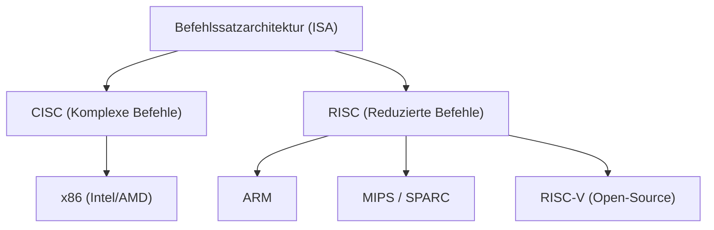
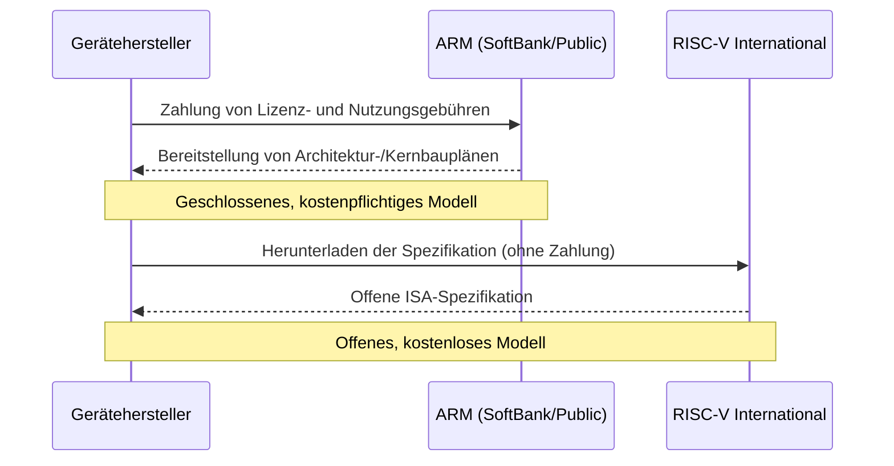

## Prolog: Der endlose Kampf um die Silizium-Vorherrschaft

Die Geschichte der Halbleiterindustrie ist zugleich die Geschichte des Kampfes um die Vorherrschaft bei der "Instruction Set Architecture" (ISA, Befehlssatzarchitektur). Von den Anfängen in den 1970er Jahren bis heute hat diese grundlegende Regel, wie ein Prozessor Befehle von der Software interpretiert und auf der Hardware ausführt, die Richtung der technologischen Entwicklung bestimmt.

Einst kontrollierte die x86-Architektur, vertreten durch Intel und AMD, den Markt für Personal Computer und Server vollständig und baute ein unerschütterliches Imperium namens "Wintel" (Windows + Intel) auf. Als sich die Welt jedoch vom PC in Richtung Mobilgeräte verschob, begann dieses Herrschaftssystem allmählich zu wanken. Dabei gewann die ARM-Architektur an Bedeutung, die eine extreme Energieeffizienz anstrebte.

Das Aufkommen und die Verbreitung von ARM war nicht nur ein technischer Generationswechsel, sondern ein Paradigmenwechsel des Geschäftsmodells selbst. Und heute ist es "RISC-V", das als reine Open-Source-Lösung geboren wurde und die Festung von ARM bedroht. In diesem Artikel werden wir die Geschichte riesiger Technologieunternehmen wie Intel, AMD, Apple und NVIDIA durchqueren und das großartige Epos der Halbleiterarchitekturen von CISC zu RISC und von geschlossen zu offen entwirren.

## Kapitel 1: Die Geburt von x86 und die Blütezeit von CISC

### 1.1 Die Entwicklung vom Intel 4004 zum 8086

Im Jahr 1971 stellte Intel den weltweit ersten Mikroprozessor "4004" vor. Dieser wurde ursprünglich für die Taschenrechner des japanischen Unternehmens Busicom entwickelt, bildete aber den Ursprung für das anschließende explosive Wachstum der Halbleiterindustrie. Danach entwickelte er sich über den 8008 und 8080 weiter, bis 1978 das historische Meisterwerk "8086" geboren wurde. Dies war der Beginn der bis heute andauernden x86-Architektur-Linie.

Der 8086 war ein 16-Bit-Prozessor und etablierte sich als De-facto-Branchenstandard, nachdem er im IBM-PC übernommen wurde. In dieser Zeit war Speicher sehr teuer und die Speicherkapazität begrenzt. Daher mussten Programme so klein wie möglich gehalten werden, und der "CISC" (Complex Instruction Set Computer)-Ansatz, bei dem komplexe Verarbeitungen mit einem einzigen Befehl ausgeführt werden konnten, war sinnvoll.

### 1.2 Die Etablierung des Wintel-Imperiums und die Herausforderung durch AMD

Vom späten 1980er bis in die 1990er Jahre dominierte die Kombination aus dem Windows-Betriebssystem von Microsoft und den Prozessoren von Intel, bekannt als "Wintel", den PC-Markt vollständig. Intel brachte mit rasender Geschwindigkeit neue Produkte auf den Markt, wie den 80286, 80386, i486 und die Pentium-Serie, und steigerte die Leistung durch Erhöhung der Taktfrequenz und Erweiterung der Befehle dramatisch.

Es war AMD (Advanced Micro Devices), das diese Vorherrschaft von Intel mutig herausforderte. Ursprünglich startete AMD als Second-Source (alternativer Hersteller) für Intel, entwickelte aber allmählich eigene Prozessoren und lieferte sich mit Intel einen erbitterten Preis- und Leistungswettbewerb (das sogenannte "Megahertz-Rennen"). Insbesondere der 1999 vorgestellte "Athlon"-Prozessor übertraf zeitweise Intels Pentium III in der Leistung und zeigte der Welt die technologische Stärke von AMD.

Der Kampf zwischen Intel und AMD fand jedoch auf demselben Schlachtfeld (ISA) namens "x86". Während sie die komplexen Befehlssätze der CISC-Architektur beibehielten, strebten sie nach Leistungssteigerungen durch die Übernahme von RISC-ähnlichen Ansätzen, bei denen Befehle intern in einfache Mikrooperationen zerlegt und ausgeführt wurden.

## Kapitel 2: Der Aufstieg von RISC und das Geschäftsmodell von ARM

### 2.1 Die Geburt der RISC-Philosophie

Während die CISC-Architekturen immer komplexer wurden, wurde Anfang der 1980er Jahre ein völlig neuer Ansatz vorgeschlagen. Dies war "RISC" (Reduced Instruction Set Computer). Diese Forschung, angeführt von John Cocke von IBM und David Patterson von der UC Berkeley, basierte auf der Idee: "Nur häufig verwendete einfache Befehle werden in der Hardware implementiert, und komplexe Verarbeitungen werden durch deren Kombination (Software) realisiert."

RISC zielte darauf ab, die Gesamtleistung durch die Vereinfachung der Befehlsdekodierung und die Effizienzsteigerung der Pipeline-Verarbeitung zu verbessern. SPARC von Sun Microsystems und die MIPS-Architektur von MIPS Technologies tauchten auf und feierten vor allem auf dem Markt für Workstations und Server gewisse Erfolge.

### 2.2 Acorn Computers und die Geburt von ARM

Die RISC-Welle erreichte auch den kleinen britischen Computerhersteller "Acorn Computers". Sie begannen mit der Entwicklung eines eigenen RISC-Prozessors für den Nachfolger ihres Bildungscomputers "BBC Micro". Entwickelt mit begrenztem Budget und Personal, war "ARM" (Acorn RISC Machine, später Advanced RISC Machines) überraschend einfach und zeichnete sich durch einen extrem niedrigen Stromverbrauch aus.

Im Jahr 1990 wurde "ARM Ltd." als Joint Venture von Acorn Computers, Apple und VLSI Technology gegründet. Apple entwickelte zu dieser Zeit das revolutionäre Personal Digital Assistant (PDA) "Newton" und suchte nach einem stromsparenden Hochleistungsprozessor.

### 2.3 Der Wandel von Fabless zur IP-Lizenzierung

Man kann sagen, dass die wahre Innovation von ARM weniger in seiner Architektur selbst lag, sondern vielmehr in seinem Geschäftsmodell. Damals übernahmen die meisten Halbleiterhersteller ein vertikal integriertes (IDM) Modell, bei dem sie Chips im eigenen Haus entwarfen und in eigenen Fabriken (Fabs) herstellten. ARM hingegen besaß selbst keine Fabriken und verkaufte nicht einmal Chips.

Sie übernahmen das beispiellose Geschäftsmodell, lediglich "Prozessor-Baupläne (IP: Intellectual Property)" zu erstellen und diese an andere Halbleiterhersteller zu lizenzieren. Kundenunternehmen (Lizenznehmer) konnten basierend auf den von ARM bereitgestellten Bauplänen kundenspezifische Chips (SoC: System on a Chip) entwickeln und herstellen, die optimale Funktionen für ihre eigenen Produkte kombinierten.

Dieses IP-Lizenzmodell passte perfekt zu den Anforderungen des schnell wachsenden Mobilfunkmarktes. Mobiltelefonhersteller mussten bei begrenzter Akkukapazität die maximale Leistung erzielen, und die stromsparende Architektur von ARM war ideal. Unternehmen wie Texas Instruments (TI) und Qualcomm übernahmen nach und nach die ARM-Lizenz, und ARM wuchs zum "Schattenherrscher" auf dem Mobiltelefonmarkt heran.

## Kapitel 3: Die mobile Revolution und der Schock von Apple Silicon

### 3.1 Die explosive Verbreitung von Smartphones und die ARM-Hegemonie

Als Apple 2007 das "iPhone" vorstellte, erlebte die Welt einen entscheidenden Wendepunkt. Das erste iPhone war mit einem von Samsung hergestellten ARM-basierten Prozessor ausgestattet. Danach erschien das von Google geführte Android-Betriebssystem, und die Verbreitung von Smartphones nahm explosionsartig zu.

Der unbestrittene größte Gewinner dieser mobilen Revolution war ARM. Die ARM-Architektur wurde als Gehirn aller mobilen Geräte wie Smartphones, Tablets und Smartwatches übernommen. Intel versuchte ebenfalls, mit dem "Atom"-Prozessor für mobile Geräte auf den Mobilfunkmarkt vorzudringen, scheiterte jedoch an der überwältigenden Energieeffizienz von ARM und dem bereits etablierten starken Ökosystem.

### 3.2 Die Geschichte der Architekturwechsel bei Apple

Hier lohnt sich ein Blick auf die einzigartige Geschichte des Unternehmens Apple. Apple ist ein seltenes Unternehmen, das die Architektur seiner Prozessoren, dem Herzstück seiner Hauptprodukte, im Laufe seiner Geschichte dreimal komplett umgestellt hat.

1. **Von 68k zu PowerPC (1994)**: Wechsel von der 68000-Serie von Motorola zum PowerPC, der gemeinsam mit IBM/Motorola entwickelt wurde.
2. **Von PowerPC zu Intel x86 (2006)**: Die Leistungssteigerung des PowerPC (insbesondere das Problem des Stromverbrauchs bei Laptops) geriet ins Stocken, und Steve Jobs beschloss den vollständigen Umstieg auf die x86-Architektur von Intel.
3. **Von Intel x86 zu Apple Silicon (ARM) (2020)**: Der größte Wendepunkt war der Umstieg auf "Apple Silicon".

### 3.3 Was Apple Silicon (M1-Chip) bewiesen hat

Apple hat über Jahre hinweg durch die "A-Serien"-Chips für das iPhone und iPad Know-how im Design von ARM-basierten Custom-Silizium angesammelt. Die Leistung verbesserte sich mit jeder Generation und erreichte schließlich ein Niveau, das die Intel-Prozessoren für PCs bedrohte.

Im Jahr 2020 stellte Apple den selbst entwickelten Chip "M1" für Macs vor. Dies ist ein SoC, das auf der ARM-Architektur basiert und von Apple in hohem Maße individuell angepasst wurde. Der M1-Chip übertraf die Leistung damaliger High-End-x86-Prozessoren bei einem erstaunlich niedrigen Stromverbrauch.

Der Erfolg von Apple Silicon versetzte der Industrie zwei entscheidende Schocks. Erstens zerstörte er vollständig das langjährige Vorurteil, dass "die ARM-Architektur nur für leistungsschwache Mobilgeräte geeignet ist", und bewies, dass sie selbst in High-End-Desktop-PCs und Workstations problemlos mit x86 konkurrieren (oder diese sogar übertreffen) kann. Zweitens zeigte er die überwältigende Überlegenheit von großen Technologieunternehmen auf, die "IP lizenzieren und ihr eigenes Custom-Silizium entwerfen".

## Kapitel 4: Die Ambitionen von NVIDIA und die Architektur im KI-Zeitalter

### 4.1 Von der GPU zum Herzstück der KI

Während ARM den Mobilfunkmarkt eroberte, entwickelte sich im Hintergrund leise eine weitere wichtige Architektur: die von NVIDIA vorangetriebene GPU (Graphics Processing Unit). Ursprünglich als dedizierter Chip zur Beschleunigung der Grafikberechnung in 3D-Spielen geboren, begannen Forscher, die das hohe Maß an paralleler Rechenleistung erkannten, GPUs für wissenschaftlich-technische Berechnungen (GPGPU).

Nach dem Erscheinen von "AlexNet" im Jahr 2012 erlebte die Deep-Learning-Technologie einen Durchbruch und löste einen KI-Boom aus. Beim Training neuronaler Netze, die enorme Matrixoperationen erfordern, zeigten die GPUs von NVIDIA eine überwältigende Leistung und wurden zur De-facto-Standardplattform in der KI-Entwicklung.

### 4.2 Das Scheitern von NVIDIAs ARM-Übernahme

Jensen Huang, CEO von NVIDIA, der eine absolute Position im KI-Bereich aufgebaut hatte, hegte noch größere Ambitionen. Im September 2020 kündigte NVIDIA an, ARM von der SoftBank Group für bis zu 40 Milliarden Dollar zu übernehmen.

Wäre diese Übernahme erfolgreich gewesen, wären "die weltstärkste KI-Plattform (NVIDIA)" und "das am weitesten verbreitete Prozessor-Ökosystem (ARM)" verschmolzen, und die Machtverhältnisse in der Halbleiterindustrie wären völlig neu geschrieben worden. NVIDIA plante die Entwicklung von Next-Generation-Prozessoren für KI-Rechenzentren, die die eigene GPU-Technologie mit der CPU-Technologie von ARM kombinierten.

Dieser Mega-Deal stieß jedoch auf heftigen Widerstand von Halbleiterunternehmen und Aufsichtsbehörden auf der ganzen Welt. Das Fundament von ARMs Geschäftsmodell war "Neutralität (wie die Schweiz)", und die Beherrschung von ARM durch ein bestimmtes Unternehmen (NVIDIA) war für Konkurrenten (wie Qualcomm, Google, Microsoft) inakzeptabel. Letztendlich konnte die Genehmigung der Kartellbehörden der verschiedenen Länder nicht eingeholt werden, und die Übernahmepläne wurden im Februar 2022 fallen gelassen.

Dieser Vorfall zeigte nicht nur, welch wichtiges "öffentliches Gut" ARM in der modernen Technologiebranche geworden ist, sondern unterstrich auch die starke Wachsamkeit gegenüber einem Technologiemonopol durch ein einzelnes Unternehmen.

## Kapitel 5: Die Geburt und Revolution des dritten Pols "RISC-V"

### 5.1 Was ist RISC-V?

Während die Aufregung um die ARM-Übernahme durch NVIDIA Wellen in der Industrie schlug, rückte "RISC-V" rasant in den Mittelpunkt der Aufmerksamkeit. RISC-V ist eine Open-Source-Befehlssatzarchitektur (ISA), deren Entwicklung 2010 von einem Forschungsteam der University of California, Berkeley (UC Berkeley) gestartet wurde.

Das Hauptmerkmal von RISC-V ist, dass seine Spezifikation (ISA), ähnlich wie bei Open-Source-Software wie Linux oder Android, kostenlos veröffentlicht wird und von jedem frei genutzt, verändert und implementiert werden kann. Im Gegensatz zu herkömmlichen x86- und ARM-Architekturen, bei denen die Rechte von bestimmten Unternehmen (Intel oder ARM Ltd.) monopolisiert und hohe Lizenzgebühren sowie strenge Nutzungsbedingungen auferlegt wurden (Closed ISA), ist RISC-V völlig offen (Open ISA).

### 5.2 Der Paradigmenwechsel durch RISC-V

Das Aufkommen von RISC-V führt zu einer seismischen Verschiebung in der Halbleiterindustrie. Die Gründe dafür sind folgende:

1. **Lizenzfreiheit und Kostenreduzierung**: Für kleine und mittlere Unternehmen, Start-ups und universitäre Forschungseinrichtungen stellten die Architektur-Lizenzgebühren von ARM in Millionenhöhe eine große Hürde dar. Durch die Nutzung von RISC-V lassen sich diese Anfangskosten drastisch senken, wodurch die Hürde für die Entwicklung eigener Prozessoren erheblich sinkt.
2. **Ultimative Anpassbarkeit**: RISC-V nutzt ein modulares Design, das es ermöglicht, neben dem einfachen Basisbefehlssatz je nach Anwendungszweck frei Erweiterungsfunktionen (wie Vektorberechnungen, Verschlüsselung usw.) hinzuzufügen oder zu entfernen. Es ist möglich, individuell angepasste Chips zu entwerfen, die für jeden Zweck optimiert sind, von ultrakleinen Chips für IoT-Geräte bis hin zu KI-Beschleunigern und Hochleistungsservern für Rechenzentren.
3. **Befreiung vom Vendor-Lock-in**: Um das Risiko einer zu starken Abhängigkeit von der ARM-Architektur (wie Erhöhungen der Lizenzgebühren oder geopolitische Risiken wie beim NVIDIA-Übernahmeversuch) zu vermeiden, beginnen viele Unternehmen, RISC-V als starke Alternative zu in Betracht zu ziehen.

### 5.3 Der Eintritt großer Technologieunternehmen und die Expansion des Ökosystems

Anfangs wurde RISC-V hauptsächlich für die akademische Forschung und kleine Embedded-Systeme als geeignet erachtet, aber heute investieren riesige Technologieunternehmen massiv.

Google hat RISC-V als Mikrocontroller zur Steuerung seines eigenen KI-Prozessors (TPU) übernommen und treibt außerdem die offizielle Unterstützung von Android OS für RISC-V voran. Große Speicherunternehmen wie Western Digital und Seagate haben ihre HDD/SSD-Controller durch RISC-V-basierte ersetzt. Qualcomm entwickelt vor dem Hintergrund eines Lizenzstreits mit ARM RISC-V-basierte Chips für Wearables.

Darüber hinaus florieren spezialisierte RISC-V-Startups wie SiFive, Andes Technology und Tenstorrent (geleitet vom genialen Architekten Jim Keller) und treiben das Design leistungsstarker RISC-V-Kerne und die Entwicklung von KI-Beschleunigern voran.

## Kapitel 6: Geopolitische Risiken und die strategische Bedeutung von RISC-V

### 6.1 Die Spannungen zwischen den USA und China und die Blockbildung bei Halbleitertechnologien

Hinter der schnellen Verbreitung von RISC-V stehen nicht nur technologische Vorteile, sondern auch die Dynamik der internationalen Politik, die einen großen Einfluss ausübt. Insbesondere die sich verschärfende Konfrontation zwischen den USA und China führt zu einer Fragmentierung (Entkopplung) der Halbleiter-Lieferkette.

Die US-Regierung hat aus Gründen der nationalen Sicherheit die Exportkontrollen für Halbleitertechnologien gegenüber chinesischen Technologieunternehmen wie Huawei verschärft. Infolgedessen waren chinesische Unternehmen dem Risiko ausgesetzt, dass ihr Zugang zu Intels x86-Prozessoren und der neuesten ARM-Architektur eingeschränkt wurde. (Obwohl ARM ein britisches Unternehmen ist, unterliegt es den Vorschriften, da es viele US-Technologien enthält).

### 6.2 Chinas "technologische Unabhängigkeit" und RISC-V

In dieser Krisensituation war das quelloffene "RISC-V", das nicht den Gesetzen eines bestimmten Landes oder den Absichten eines Unternehmens unterliegt, für China ein wahrer Segen. Die chinesische Regierung und chinesische Unternehmen investieren massiv in RISC-V als Kernstück ihrer nationalen Strategie zur Erreichung technologischer Autarkie (technologische Unabhängigkeit).

T-Head (PingTouGe), die Halbleitersparte der Alibaba Group, entwickelte die leistungsstarke RISC-V-Prozessorserie "Xuantie" und machte deren Design als Open Source verfügbar. Innerhalb Chinas schreitet die Entwicklung von RISC-V-basierten Halbleitern, von IoT-Geräten über Rechenzentrumsserver bis hin zu KI-Chips, mit explosiver Geschwindigkeit voran.

### 6.3 Das Dilemma des Westens und die Diskussion um Regulierung

Die westlichen Länder stehen derweil vor einem Dilemma. Während einige die Entwicklung von Open-Source-Technologien als förderlich für Innovationen begrüßen, wächst die Besorgnis, dass RISC-V die Halbleiterkapazitäten Chinas verbessern und zur Modernisierung seiner Militärtechnologie beitragen könnte.

Unter US-Politikern werden zunehmend Forderungen laut, das Netz der Exportkontrollen auch auf Open-Source-Technologien einschließlich RISC-V auszuweiten. Die Einschränkung der Veröffentlichung von Open-Source-"Spezifikationen (Texten)" könnte jedoch die Meinungsfreiheit und die Grundlagen internationaler gemeinsamer Forschung zerstören, sodass es äußerst schwierig ist, wirksame Regulierungsinstrumente zu finden. RISC-V International (die Standardisierungsorganisation) hat ihren Hauptsitz bereits von den USA in das dauerhaft neutrale Land Schweiz verlegt, um geopolitische Risiken zu vermeiden.

## Epilog: Die Zukunft des Next-Generation-Computings

Der Kampf um Halbleiter-Befehlssätze hat sich über einen bloßen technologischen Streit hinaus zu einem großartigen Drama entwickelt, das Unternehmensstrategien und sogar die nationale Sicherheit einbezieht.

Das von Intel und AMD aufgebaute x86-CISC-Imperium verfügt nach wie vor über eine starke Basis im Cloud-Server- und PC-Markt. Wie der Erfolg von Apple Silicon jedoch zeigt, nimmt die Bedrohung durch ARM auch im Hochleistungsbereich von Tag zu Tag zu. Zudem entsteht vor dem Hintergrund des KI-Booms ein neues Computing-Paradigma rund um NVIDIAs GPUs.

Und darunter beginnt das quelloffene RISC-V leise, aber sicher die Basis aller Geräte zu erodieren. So wie Linux einst eine einzigartige Position auf dem Markt für Server-Betriebssysteme einnahm und zur Kerntechnologie des Internets wurde, hat RISC-V als "Linux der Hardware" das Potenzial, die gemeinsame Sprache des Halbleiter-Ökosystems der nächsten Generation zu werden.

x86, ARM und RISC-V. Diese drei Architekturen werden sich auch in Zukunft gegenseitig beeinflussen und die Evolution der digitalen Infrastruktur vorantreiben, die unsere Gesellschaft trägt. Der Kampf um die Vorherrschaft beim Silizium hat kein Ende.
