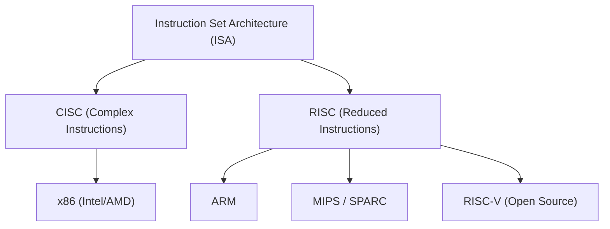
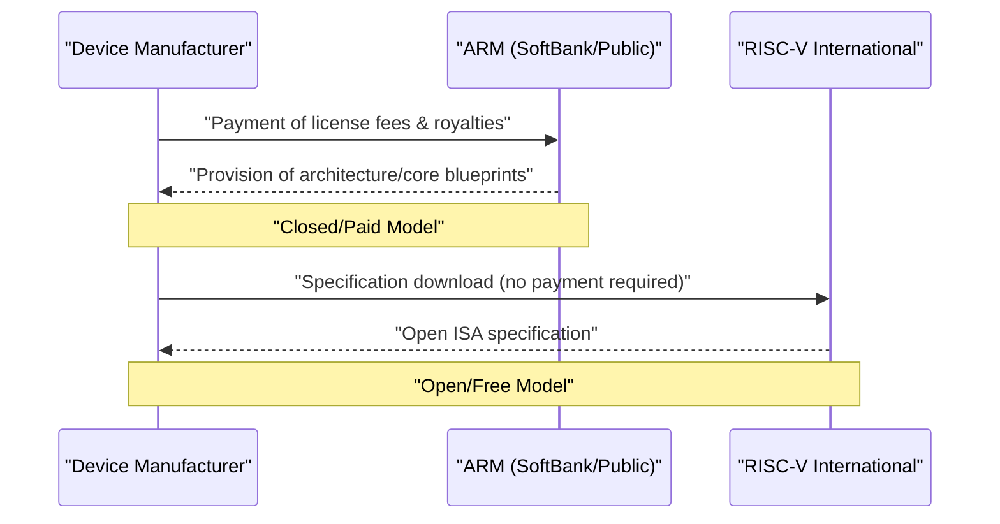

## Prologue: The Never-Ending Struggle for Silicon Hegemony

The history of the semiconductor industry is essentially the history of the struggle for hegemony over the 'Instruction Set Architecture (ISA)'. From the early days in the 1970s to the present, this fundamental rule of how a processor interprets instructions from software and executes them on hardware has determined the direction of technological evolution.

Once, the x86 architecture, represented by Intel and AMD, completely dominated the personal computer and server markets, building an immovable empire known as 'Wintel (Windows + Intel)'. However, as the world shifted from PCs to mobile devices, that dominant system gradually began to waver. Emerging in its place was the ARM architecture, which pursued power efficiency to the absolute limit.

The emergence and spread of ARM was not merely a technical generational shift, but a paradigm shift in the business model itself. And now, what threatens ARM's stronghold is 'RISC-V', born as a completely open-source architecture. In this article, crossing the histories of giant technology companies such as Intel, AMD, Apple, and NVIDIA, we will unravel the grand epic of semiconductor architectures moving from CISC to RISC, and from closed to open.

## Chapter 1: The Birth of x86 and the Golden Age of CISC

### 1.1 Evolution from Intel 4004 to 8086

In 1971, Intel announced the world's first microprocessor, the '4004'. This was originally developed for calculators made by the Japanese company Busicom, but it became the starting point for the explosive growth of the semiconductor industry that followed. After that, it continued to evolve to the 8008 and 8080, and in 1978, the historical masterpiece '8086' was born. This marks the beginning of the lineage of the 'x86' architecture that continues to this day.

The 8086 was a 16-bit processor, and by being adopted in the subsequent IBM PC, it established the position of a de facto industry standard. In this era, memory was extremely expensive, and storage capacity was limited. Therefore, it was necessary to keep the program size as small as possible, making the 'CISC (Complex Instruction Set Computer)' approach, which could execute complex processing with a single instruction, rational.

### 1.2 The Establishment of the Wintel Empire and AMD's Challenge

From the late 1980s through the 1990s, the combination of Microsoft's Windows operating system and Intel's processors was called 'Wintel', completely dominating the PC market. Intel introduced new products with fierce momentum—80286, 80386, i486, and the Pentium series—dramatically improving performance by increasing clock frequencies and expanding instructions.

Bravely continuously challenging Intel's hegemony was AMD (Advanced Micro Devices). Although AMD initially started as a second source (alternative manufacturer) for Intel, it gradually developed independently designed processors, engaging in fierce price and performance competition (the so-called 'Megahertz war') with Intel. Notably, the 'Athlon' processor announced in 1999 temporarily surpassed Intel's Pentium III in performance, showing AMD's technological prowess to the world.

However, the battle between Intel and AMD was strictly a competition on the same playing field (ISA) of 'x86'. While maintaining the complex instruction set of the CISC architecture, they sought to improve performance by adopting a RISC-like approach internally, breaking down instructions into simple micro-operations for execution.

## Chapter 2: The Rise of RISC and ARM's Business Model

### 2.1 The Birth of the RISC Philosophy

As the CISC architecture continued to become more complex, a completely new approach was proposed in the early 1980s. That was 'RISC (Reduced Instruction Set Computer)'. This research, led by IBM's John Cocke and UC Berkeley's David Patterson, was based on the philosophy of 'implementing only frequently used, simple instructions in hardware, and realizing complex processing through combinations of them (software)'.

RISC aimed to improve overall performance by simplifying instruction decoding and making pipeline processing more efficient. Sun Microsystems' SPARC, MIPS Technologies' MIPS architecture, and others emerged, achieving a certain level of success primarily in the workstation and server markets.

### 2.2 Acorn Computers and the Birth of ARM

The wave of RISC also reached Acorn Computers, a small British computer manufacturer. They began developing their own RISC processor for the successor to their educational computer, the 'BBC Micro'. Developed with a limited budget and personnel, the 'ARM (Acorn RISC Machine, later Advanced RISC Machines)' was remarkably simple and characterized by extremely low power consumption.

In 1990, 'ARM Ltd.' was established as a joint venture by three companies: Acorn Computers, Apple, and VLSI Technology. At the time, Apple was developing the 'Newton', a revolutionary personal digital assistant (PDA), and was seeking a high-performance processor with low power consumption.

### 2.3 Transition from Fabless to IP Licensing

ARM's true innovation arguably lay in its business model rather than the architecture itself. At the time, many semiconductor manufacturers adopted a vertically integrated (IDM) model, designing chips in-house and manufacturing them in their own factories (fabs). However, ARM did not have its own factories, and furthermore, did not even sell chips.

They adopted an unprecedented business model of creating only the 'processor blueprints (IP: Intellectual Property)' and licensing them to other semiconductor manufacturers. Customer companies (licensees) could develop and manufacture custom chips (SoC: System on a Chip) combining the optimal features for their products based on the blueprints provided by ARM.

This IP licensing model perfectly matched the demands of the rapidly expanding mobile market. Mobile phone manufacturers needed to extract maximum performance within limited battery capacities, making ARM's low-power architecture ideal. Companies like Texas Instruments (TI) and Qualcomm successively adopted ARM licenses, and ARM grew into the 'shadow ruler' of the mobile phone market.

## Chapter 3: The Mobile Revolution and the Impact of Apple Silicon

### 3.1 The Explosive Spread of Smartphones and ARM's Hegemony

In 2007, the world reached a decisive turning point with Apple's announcement of the 'iPhone'. The early iPhones were equipped with ARM-based processors manufactured by Samsung. Subsequently, the Google-led Android OS appeared, and the spread of smartphones showed explosive momentum.

In this mobile revolution, the biggest winner was undoubtedly ARM. The ARM architecture was adopted as the brains for all mobile devices, including smartphones, tablets, and smartwatches. Intel also introduced the 'Atom' processor for mobile devices in an attempt to bring x86 into the mobile space, but it was defeated by ARM's overwhelming power efficiency and its already strongly formed ecosystem.

### 3.2 The History of Apple's Architecture Transitions

Here, we should note the unique history of the company Apple. Apple is a rare enterprise that has completely transitioned the architecture of the processors at the heart of its main products three times in its history.

1. **68k to PowerPC (1994)**: Transition from Motorola's 68000 series to PowerPC, jointly developed with IBM/Motorola.
2. **PowerPC to Intel x86 (2006)**: As performance improvements for PowerPC (especially the power consumption problem for laptops) reached an impasse, Steve Jobs decided on a complete transition to Intel's x86 architecture.
3. **Intel x86 to Apple Silicon (ARM) (2020)**: And the biggest turning point is the transition to 'Apple Silicon'.

### 3.3 What Apple Silicon (M1 Chip) Proved

For many years, Apple had accumulated know-how in designing ARM-based custom silicon through the 'A-series' chips for iPhones and iPads. Its performance improved with each generation, finally reaching a level that threatened Intel processors for PCs.

In 2020, Apple announced the 'M1', an independently developed chip for Mac. This is an SoC based on the ARM architecture, highly customized by Apple itself. The M1 chip achieved performance surpassing contemporary high-end x86 processors with astonishingly low power consumption.

The success of Apple Silicon delivered two decisive shocks to the industry. First, it completely shattered the long-standing prejudice that 'ARM architecture is low-performance for mobile devices', proving that it can compete with (or surpass) x86 even in high-end desktop PCs and workstations. Second, it demonstrated the overwhelming advantage for giant technology companies to 'license IP and design custom silicon in-house'.

## Chapter 4: NVIDIA's Ambition and the Architecture of the AI Era

### 4.1 From GPUs to the Heart of AI

While ARM conquered the mobile market, another important architecture was quietly evolving on the sidelines. It was the GPU (Graphics Processing Unit) led by NVIDIA. Initially born as a dedicated chip to accelerate 3D game graphics rendering, researchers noticing its high parallel computing capabilities began applying it to scientific computing (GPGPU).

Following the appearance of 'AlexNet' in 2012, deep learning technology achieved a breakthrough, sparking the AI boom. In the training of neural networks, which requires massive matrix calculations, NVIDIA's GPUs demonstrated overwhelming performance, becoming the de facto standard platform for AI development.

### 4.2 The Frustration of NVIDIA's ARM Acquisition

Jensen Huang, CEO of NVIDIA, which had built an absolute position in the AI domain, harbored further ambitions. In September 2020, NVIDIA announced it would acquire ARM from SoftBank Group for up to 40 billion dollars.

Had this acquisition been completed, the 'world's strongest AI platform (NVIDIA)' and the 'world's most ubiquitous processor ecosystem (ARM)' would have integrated, completely redrawing the power map of the semiconductor industry. NVIDIA aimed to develop next-generation AI data center processors fusing its GPU technology and ARM's CPU technology.

However, this mega-deal faced fierce opposition from semiconductor companies and regulatory authorities worldwide. The foundation of ARM's business model was 'neutrality (being like Switzerland)', and a specific company like NVIDIA dominating ARM was unacceptable to rival companies (Qualcomm, Google, Microsoft, etc.). Ultimately, unable to obtain approval from antitrust authorities in various countries, the acquisition plan was abandoned in February 2022.

This incident highlighted both how important a 'public good' ARM has become in the modern technology industry and the strong wariness against technological monopolies by specific companies.

## Chapter 5: The Birth and Revolution of the Third Pole 'RISC-V'

### 5.1 What is RISC-V?

As the turmoil over NVIDIA's ARM acquisition sent ripples through the industry, what rapidly began to attract attention was 'RISC-V' (Risk-Five). RISC-V is an open-source Instruction Set Architecture (ISA) whose development started in 2010 by a research team at the University of California, Berkeley (UC Berkeley).

The greatest feature of RISC-V is that, like open-source software such as Linux and Android, its specifications (ISA) are published free of charge, and anyone can freely use, modify, and implement it. While traditional x86 and ARM had their rights monopolized by specific companies (Intel and ARM Ltd.) imposing high license fees and strict usage conditions (Closed ISA), RISC-V is completely open (Open ISA).

### 5.2 The Paradigm Shift Brought by RISC-V

The emergence of RISC-V is bringing tectonic shifts to the semiconductor industry. The reasons are as follows:

1. **License-Free and Cost Reduction**: For small and medium-sized enterprises, startups, and university research institutions, ARM's architecture license fees, amounting to millions of dollars, were a major barrier. Using RISC-V can dramatically reduce this initial cost, significantly lowering the hurdle to independent processor development.
2. **Ultimate Customizability**: RISC-V adopts a modular design; in addition to the basic simple instruction set, extension features (vector operations, encryption, etc.) can be freely added or removed depending on the application. It is possible to independently design custom chips optimized for any use, from ultra-compact chips for IoT devices to AI accelerators and high-performance servers for data centers.
3. **Liberation from Vendor Lock-in**: To avoid the risks of relying too much on the ARM architecture (such as license fee hikes or geopolitical risks like the NVIDIA acquisition turmoil), many companies are beginning to consider RISC-V as a strong alternative.

### 5.3 The Entry of Giant Tech Companies and Ecosystem Expansion

Initially regarded as being for academic research and small-scale embedded devices, RISC-V is now seeing investments from all the giant technology companies.

Google has adopted RISC-V for the microcontrollers controlling its AI processors (TPU) and is further proceeding with official support for RISC-V in the Android OS. Major storage companies like Western Digital and Seagate have replaced their HDD/SSD controllers with RISC-V bases. Qualcomm, against the backdrop of its licensing lawsuit with ARM, is developing RISC-V-based chips for wearables.

Furthermore, startups specializing in RISC-V such as SiFive, Andes Technology, and Tenstorrent (led by genius architect Jim Keller) are emerging one after another, driving the design of high-performance RISC-V cores and the development of AI accelerators.

## Chapter 6: Geopolitical Risks and the Strategic Significance of RISC-V

### 6.1 US-China Friction and the Bloc-ization of Semiconductor Technology

Behind the rapid spread of RISC-V, not only technological superiority but also the dynamics of international politics have a major influence. In particular, the intensifying US-China conflict is causing a division (decoupling) in the semiconductor supply chain.

For security reasons, the US government tightened export restrictions on semiconductor technology to Chinese technology companies like Huawei. This exposed Chinese companies to the risk of restricted access to Intel's x86 processors and the latest ARM architecture. (Although ARM is a British company, it is subject to regulation because it includes a lot of US technology).

### 6.2 China's 'Technological Independence' and RISC-V

Under this critical situation, the open-source 'RISC-V', unswayed by the laws of specific countries or the intentions of companies, was exactly a welcome rain during a drought for China. The Chinese government and companies are making massive investments in RISC-V as the core of a national strategy to achieve technological self-sufficiency (technological independence).

T-Head (PingTouGe), the semiconductor division of the Alibaba Group, developed the high-performance RISC-V processor 'Xuantie' series and open-sourced its designs. Within China, RISC-V-based semiconductor development is advancing with explosive momentum, ranging from IoT devices to data center servers and even AI chips.

### 6.3 Western Dilemma and the Regulatory Debate

Meanwhile, Western countries are facing a dilemma. While there are voices welcoming the development of open-source technology as a driver of innovation, there are growing concerns that China's semiconductor capabilities will improve through RISC-V, leading to the modernization of its military technology.

Some US politicians have begun arguing that the net of export controls on open-source technologies, including RISC-V, should be expanded. However, restricting the publication of open-source 'specifications (text)' could destroy the foundation of freedom of speech and international joint research, and finding effective regulatory means is extremely difficult. To avoid geopolitical risks, RISC-V International (the standardization organization) has already relocated its headquarters from the US to Switzerland, a permanently neutral country.

## Epilogue: The Future of Next-Generation Computing

The battle over semiconductor instruction sets has transcended mere technological debate to become a grand drama involving corporate strategy and even national security.

The x86 CISC empire built by Intel and AMD still holds a solid foundation in the cloud server and PC markets. However, as the success of Apple Silicon shows, the threat of ARM in the high-performance domain is increasing day by day. Furthermore, against the backdrop of the AI boom, a new computing paradigm centered on NVIDIA's GPUs is being formed.

And underneath it all, the open-source RISC-V is quietly but steadily beginning to erode the foundation of all devices. Just as Linux once built a unique position in the server OS market and became the foundational technology of the internet, RISC-V has the potential to become the common language of the next-generation semiconductor ecosystem as the 'Linux of hardware'.

x86, ARM, and RISC-V. These three architectures will continue to influence each other and drive the evolution of the digital infrastructure that supports our society. The struggle over silicon hegemony has no end.
