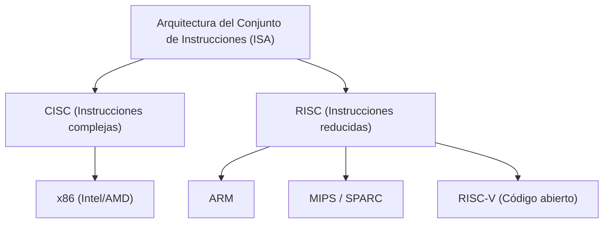
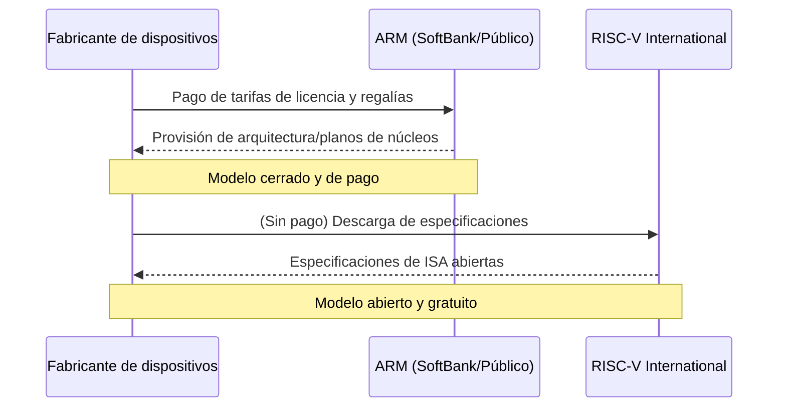

## Introducción: La lucha interminable por la hegemonía del silicio

La historia de la industria de los semiconductores es, en sí misma, la historia de la lucha por la hegemonía de la "Arquitectura del Conjunto de Instrucciones" (ISA: Instruction Set Architecture). Desde sus albores en la década de 1970 hasta el presente, esta regla fundamental de cómo un procesador interpreta y ejecuta las instrucciones del software en el hardware ha determinado la dirección de la evolución tecnológica.

En el pasado, la arquitectura x86, representada por Intel y AMD, dominó por completo el mercado de computadoras personales y servidores, construyendo un imperio inamovible conocido como "Wintel" (Windows + Intel). Sin embargo, a medida que el mundo pasó de las PC a los dispositivos móviles, ese dominio comenzó a tambalearse gradualmente. Fue entonces cuando surgió la arquitectura ARM, que buscaba la eficiencia energética al extremo.

La aparición y popularización de ARM no fue solo un cambio generacional tecnológico, sino un cambio de paradigma en el modelo de negocio mismo. Y ahora, la fortaleza de ARM está siendo amenazada por "RISC-V", que nació como una arquitectura completamente de código abierto. En este artículo, repasaremos la historia de gigantes tecnológicos como Intel, AMD, Apple y NVIDIA, desentrañando la epopeya de las arquitecturas de semiconductores en su transición de CISC a RISC, y de entornos cerrados a abiertos.

## Capítulo 1: El nacimiento de x86 y la edad de oro de CISC

### 1.1 La evolución del Intel 4004 al 8086

En 1971, Intel anunció el "4004", el primer microprocesador del mundo. Originalmente desarrollado para calculadoras de la empresa japonesa Busicom, se convirtió en el punto de partida del crecimiento explosivo de la industria de semiconductores. Tras evolucionar al 8008 y 8080, en 1978 nació la obra maestra histórica, el "8086". Este marcó el comienzo de la familia de arquitecturas "x86" que continúa hasta nuestros días.

El 8086 era un procesador de 16 bits, y tras ser adoptado por las IBM PC, estableció su posición como estándar de facto de la industria. En esa época, la memoria era extremadamente cara y la capacidad de almacenamiento limitada. Por lo tanto, era necesario mantener el tamaño de los programas lo más pequeño posible, haciendo que el enfoque "CISC (Complex Instruction Set Computer)", capaz de ejecutar operaciones complejas con una sola instrucción, fuera lo más lógico.

### 1.2 La consolidación del imperio Wintel y el desafío de AMD

Desde finales de los 80 hasta la década de 1990, la combinación del sistema operativo Windows de Microsoft y los procesadores de Intel se conoció como "Wintel" y dominó completamente el mercado de las PC. Intel lanzó una avalancha de nuevos productos: 80286, 80386, i486 y la serie Pentium, mejorando drásticamente el rendimiento mediante aumentos en la frecuencia de reloj y expansiones de instrucciones.

AMD (Advanced Micro Devices) desafió valientemente esta hegemonía de Intel. Aunque AMD comenzó como una segunda fuente (fabricante alternativo) para Intel, gradualmente desarrolló sus propios procesadores diseñados internamente, entablando una feroz guerra de precios y competencia de rendimiento (la llamada "carrera de los megahercios") con Intel. Especialmente con el anuncio del procesador "Athlon" en 1999, que superó temporalmente al Pentium III de Intel en rendimiento, AMD demostró su destreza tecnológica al mundo.

Sin embargo, la batalla entre Intel y AMD siempre fue dentro del mismo terreno (ISA) conocido como "x86". Mientras mantenían el complejo conjunto de instrucciones de la arquitectura CISC, internamente mejoraron el rendimiento adoptando un enfoque estilo RISC: descomponiendo las instrucciones en microoperaciones más simples para su ejecución.

## Capítulo 2: El auge de RISC y el modelo de negocio de ARM

### 2.1 El nacimiento de la filosofía RISC

Mientras las arquitecturas CISC se volvían cada vez más complejas, a principios de la década de 1980 se propuso un enfoque completamente nuevo: "RISC (Reduced Instruction Set Computer)". Esta investigación, liderada por John Cocke de IBM y David Patterson de la Universidad de California en Berkeley, se basaba en la idea de "implementar en hardware solo instrucciones simples de uso frecuente, y realizar procesos complejos a través de combinaciones de estas (software)".

RISC buscaba mejorar el rendimiento general simplificando la decodificación de instrucciones y haciendo más eficiente el procesamiento segmentado (pipeline). Arquitecturas como SPARC de Sun Microsystems y MIPS de MIPS Technologies aparecieron en escena, logrando cierto éxito principalmente en el mercado de estaciones de trabajo y servidores.

### 2.2 Acorn Computers y el nacimiento de ARM

La ola de RISC también llegó a un pequeño fabricante británico de computadoras, "Acorn Computers". Para el sucesor de su computadora educativa "BBC Micro", comenzaron a desarrollar su propio procesador RISC. Desarrollado con presupuesto y personal limitados, el "ARM" (Acorn RISC Machine, más tarde Advanced RISC Machines) se caracterizaba por ser asombrosamente simple y tener un consumo de energía muy bajo.

En 1990, se fundó "ARM Ltd." como una empresa conjunta entre Acorn Computers, Apple y VLSI Technology. En ese momento, Apple estaba desarrollando su revolucionario Asistente Digital Personal (PDA), el "Newton", y necesitaba un procesador de alto rendimiento con bajo consumo de energía.

### 2.3 La transición de Fabless a la licencia de IP

La verdadera innovación de ARM estuvo en su modelo de negocio, más que en su arquitectura misma. En aquella época, muchos fabricantes de semiconductores utilizaban un modelo de integración vertical (IDM), diseñando sus propios chips y fabricándolos en sus propias fábricas (fabs). Sin embargo, ARM no tenía fábricas e incluso no vendía chips.

Adoptaron un modelo de negocio sin precedentes en el que solo creaban los "planos de diseño del procesador (IP: Propiedad Intelectual)" y los licenciaban a otros fabricantes de semiconductores. Las empresas clientes (licenciatarias) podían usar los planos de ARM para desarrollar y fabricar chips personalizados (SoC: System on a Chip) adaptados a sus productos.

Este modelo de licencia de IP encajó perfectamente con las demandas del mercado móvil en rápido crecimiento. Los fabricantes de teléfonos móviles necesitaban extraer el máximo rendimiento de capacidades de batería limitadas, haciendo ideal la arquitectura de bajo consumo de energía de ARM. Empresas como Texas Instruments (TI) y Qualcomm adoptaron las licencias de ARM una tras otra, convirtiéndola en el "gobernante en las sombras" del mercado de la telefonía móvil.

## Capítulo 3: La revolución móvil y el impacto de Apple Silicon

### 3.1 La explosión de los teléfonos inteligentes y la hegemonía de ARM

En 2007, con el anuncio del "iPhone" por parte de Apple, el mundo llegó a un punto de inflexión decisivo. El primer iPhone estaba equipado con un procesador basado en ARM fabricado por Samsung. Más tarde, apareció el sistema operativo Android impulsado por Google, y la popularización de los teléfonos inteligentes experimentó un crecimiento explosivo.

En esta revolución móvil, el mayor ganador sin duda fue ARM. La arquitectura ARM fue adoptada como el cerebro de todo tipo de dispositivos móviles, como teléfonos inteligentes, tabletas y relojes inteligentes. Intel también intentó ingresar al mercado móvil introduciendo el procesador "Atom", pero fracasó frente a la abrumadora eficiencia energética de ARM y su ecosistema ya fuertemente consolidado.

### 3.2 La historia de las transiciones de arquitectura de Apple

Aquí vale la pena destacar la historia única de Apple como empresa. Apple es una compañía rara que ha cambiado por completo la arquitectura del procesador, el corazón de sus productos principales, en tres ocasiones a lo largo de su historia.

1. **De 68k a PowerPC (1994)**: Transición de la serie 68000 de Motorola al PowerPC desarrollado en conjunto con IBM/Motorola.
2. **De PowerPC a Intel x86 (2006)**: Debido al estancamiento en las mejoras de rendimiento del PowerPC (especialmente por problemas de consumo de energía en portátiles), Steve Jobs decidió hacer una transición total a la arquitectura x86 de Intel.
3. **De Intel x86 a Apple Silicon (ARM) (2020)**: El mayor punto de inflexión fue la transición a "Apple Silicon".

### 3.3 Lo que demostró Apple Silicon (Chip M1)

Durante muchos años, a través de sus chips "Serie A" para el iPhone y el iPad, Apple acumuló conocimientos sobre el diseño de chips personalizados basados en ARM. Con cada generación, el rendimiento mejoró hasta amenazar el nivel de los procesadores Intel para PC.

En 2020, Apple anunció su propio chip de desarrollo interno "M1" para Mac. Es un SoC basado en la arquitectura ARM con un alto grado de personalización por parte de Apple. El chip M1 ofreció un rendimiento que superaba a los procesadores x86 de gama alta de la época, con un consumo de energía asombrosamente bajo.

El éxito de Apple Silicon tuvo dos impactos decisivos en la industria. Primero, destruyó por completo el viejo prejuicio de que "la arquitectura ARM es solo para un rendimiento bajo en dispositivos móviles", demostrando que puede competir (o incluso superar) plenamente con x86 en PC de escritorio y estaciones de trabajo de gama alta. Segundo, demostró la abrumadora superioridad para una empresa tecnológica gigante de "licenciar propiedad intelectual y diseñar su propio silicio personalizado".

## Capítulo 4: Las ambiciones de NVIDIA y la arquitectura de la era de la IA

### 4.1 De las GPU al corazón de la IA

Mientras ARM dominaba el mercado móvil, otra importante arquitectura evolucionaba silenciosamente: las unidades de procesamiento gráfico (GPU) impulsadas por NVIDIA. Las GPU nacieron inicialmente como chips dedicados a acelerar el renderizado de gráficos de juegos en 3D, pero investigadores comenzaron a aplicarlas al cálculo científico (GPGPU) notando su alta capacidad para el procesamiento paralelo.

Desde la aparición de "AlexNet" en 2012, las tecnologías de aprendizaje profundo lograron un gran avance, desencadenando un auge en la IA. Las GPU de NVIDIA, al demostrar un rendimiento abrumador en el entrenamiento de redes neuronales que requieren enormes cálculos de matrices, se convirtieron en la plataforma estándar de facto en el desarrollo de la IA.

### 4.2 El fracaso de la adquisición de ARM por parte de NVIDIA

Jensen Huang, el CEO de NVIDIA, habiendo establecido una posición absoluta en el campo de la IA, tenía una ambición aún mayor. En septiembre de 2020, NVIDIA anunció la adquisición de ARM de SoftBank Group por hasta 40 mil millones de dólares.

Si se hubiera completado esta adquisición, la "plataforma de IA más poderosa del mundo (NVIDIA)" y el "ecosistema de procesadores más extendido del mundo (ARM)" se habrían integrado, reescribiendo por completo el mapa de poder de la industria de semiconductores. NVIDIA planeaba desarrollar procesadores para centros de datos de IA de próxima generación, combinando su propia tecnología de GPU con la tecnología de CPU de ARM.

Sin embargo, este mega-acuerdo enfrentó una feroz oposición de empresas de semiconductores y reguladores de todo el mundo. La esencia del modelo de negocio de ARM es su "neutralidad (actuando como Suiza)", y que una empresa específica como NVIDIA controlara ARM era inaceptable para sus competidores (como Qualcomm, Google, Microsoft, etc.). Finalmente, al no poder obtener la aprobación de las autoridades antimonopolio de varios países, el plan de adquisición se canceló en febrero de 2022.

Este incidente demostró lo importante que se ha vuelto ARM como "bien público" en la industria tecnológica moderna, al tiempo que destacó un fuerte temor al monopolio tecnológico por parte de una empresa específica.

## Capítulo 5: El nacimiento del tercer polo "RISC-V" y su revolución

### 5.1 ¿Qué es RISC-V?

Mientras el alboroto por la adquisición de ARM por parte de NVIDIA causaba revuelo en la industria, "RISC-V" (Risk Five) comenzó a atraer la atención de manera acelerada. RISC-V es una Arquitectura de Conjunto de Instrucciones (ISA) de código abierto, cuyo desarrollo fue iniciado en 2010 por un equipo de investigación de la Universidad de California en Berkeley (UC Berkeley).

La característica principal de RISC-V es que, al igual que el software de código abierto como Linux o Android, su especificación (ISA) está disponible de forma gratuita, y cualquier persona puede usarla, modificarla e implementarla libremente. Mientras que las arquitecturas x86 y ARM convencionales estaban monopolizadas por empresas específicas (Intel o ARM) que imponían altas tarifas de licencia y condiciones de uso estrictas (ISA cerradas), RISC-V es completamente abierto (ISA abierta).

### 5.2 El cambio de paradigma que trae RISC-V

La aparición de RISC-V está provocando cambios sísmicos en la industria de los semiconductores. Las razones son las siguientes:

1. **Libre de licencias y reducción de costos**: Para las pequeñas y medianas empresas, startups e instituciones de investigación universitarias, las tarifas de licencia de arquitectura de ARM, que ascendían a millones de dólares, eran una gran barrera. Al usar RISC-V, este costo inicial se puede reducir drásticamente, bajando el obstáculo para el desarrollo de procesadores propios.
2. **Máxima personalización**: RISC-V adopta un diseño modular; además de un conjunto base de instrucciones simples, se pueden agregar o eliminar libremente funciones extendidas (operaciones vectoriales, cifrado, etc.) según sea necesario. Se pueden diseñar internamente chips personalizados optimizados para cualquier uso, desde microchips ultracompactos para dispositivos IoT, hasta aceleradores de IA y servidores de alto rendimiento para centros de datos.
3. **Liberación del bloqueo del proveedor (Vendor Lock-in)**: Para evitar el riesgo de depender demasiado de la arquitectura ARM (aumentos en las tarifas de licencia o riesgos geopolíticos como la controversia de la adquisición por parte de NVIDIA), muchas empresas están comenzando a considerar RISC-V como una alternativa viable.

### 5.3 Entrada de gigantes tecnológicos y expansión del ecosistema

Aunque inicialmente se consideró para investigaciones académicas y pequeños dispositivos integrados, hoy en día los gigantes tecnológicos están invirtiendo en masa en RISC-V.

Google adoptó RISC-V para los microcontroladores de sus propios procesadores de IA (TPU), y está avanzando en el soporte oficial del sistema operativo Android para RISC-V. Grandes empresas de almacenamiento como Western Digital y Seagate han reemplazado sus controladores de HDD/SSD por procesadores basados en RISC-V. Con el telón de fondo de su demanda sobre licencias con ARM, Qualcomm está desarrollando chips para dispositivos portátiles (wearables) basados en RISC-V.

Además, startups especializadas en RISC-V como SiFive, Andes Technology y Tenstorrent (liderada por el brillante arquitecto Jim Keller) han surgido una tras otra, impulsando el diseño de núcleos RISC-V de alto rendimiento y el desarrollo de aceleradores de IA.

## Capítulo 6: Riesgos geopolíticos y la importancia estratégica de RISC-V

### 6.1 Las tensiones entre EE. UU. y China y la fragmentación de la tecnología de semiconductores

Detrás de la rápida popularización de RISC-V, no solo está su superioridad tecnológica, sino que la dinámica de la política internacional tiene una gran influencia. En particular, la intensificación del conflicto entre Estados Unidos y China ha provocado la desvinculación (decoupling) de la cadena de suministro de semiconductores.

El gobierno de EE. UU. ha fortalecido las restricciones a la exportación de tecnología de semiconductores a empresas tecnológicas chinas como Huawei por razones de seguridad nacional. Como resultado, las empresas chinas se enfrentan al riesgo de un acceso restringido a los procesadores x86 de Intel y las últimas arquitecturas de ARM (aunque ARM es una empresa del Reino Unido, contiene mucha tecnología estadounidense, por lo que está sujeta a restricciones).

### 6.2 La "independencia tecnológica" de China y RISC-V

En esta situación crítica, "RISC-V" de código abierto, que no está sujeto a las leyes de ningún país o los caprichos de empresas particulares, ha sido como agua de mayo para China. El gobierno y las empresas chinas están invirtiendo fuertemente en RISC-V como pieza central de una estrategia nacional para lograr la autosuficiencia tecnológica (independencia tecnológica).

La división de semiconductores del Grupo Alibaba, T-Head (PingTouGe), desarrolló la serie de procesadores RISC-V de alto rendimiento "Xuantie" y abrió sus diseños (open source). En China, el desarrollo de semiconductores basados en RISC-V, desde dispositivos IoT hasta servidores de centros de datos y chips de IA, avanza a un ritmo explosivo.

### 6.3 El dilema occidental y el debate sobre la regulación

Por otro lado, los países occidentales enfrentan un dilema. Si bien algunas voces dan la bienvenida al desarrollo de la tecnología de código abierto como promotor de la innovación, crecen las preocupaciones de que la capacidad de semiconductores de China mejore a través de RISC-V, lo que conduciría a la modernización de sus tecnologías militares.

Algunos políticos estadounidenses están comenzando a abogar por la expansión de las redes de restricciones a la exportación sobre tecnologías de código abierto, incluido RISC-V. Sin embargo, limitar la publicación de "especificaciones (texto)" de código abierto podría destruir las bases de la libertad de expresión y la investigación colaborativa internacional, haciendo que sea extremadamente difícil encontrar medios de regulación efectivos. RISC-V International (la organización de estandarización) ya ha trasladado su sede de Estados Unidos a Suiza, un país con neutralidad permanente, para evitar los riesgos geopolíticos.

## Capítulo final: El futuro de la informática de próxima generación

La batalla por el conjunto de instrucciones de semiconductores ha trascendido un simple debate técnico, convirtiéndose en un drama épico que involucra la estrategia corporativa y la seguridad nacional.

El imperio CISC de x86 construido por Intel y AMD aún tiene una base sólida en los servidores en la nube y los mercados de PC. Sin embargo, como lo demuestra el éxito de Apple Silicon, la amenaza de ARM está aumentando día a día, incluso en el sector de alto rendimiento. Además, en el contexto del auge de la IA, se está formando un nuevo paradigma informático centrado en las GPU de NVIDIA.

Y bajo esa capa, el código abierto RISC-V está erosionando silenciosa pero inexorablemente los cimientos de todo tipo de dispositivos. Al igual que Linux forjó su propia posición en el mercado de sistemas operativos de servidores y se convirtió en la tecnología base de Internet, RISC-V, como el "Linux del hardware", tiene el potencial de convertirse en el lenguaje común de los ecosistemas de semiconductores de próxima generación.

x86, ARM y RISC-V. Estas tres arquitecturas sin duda continuarán influyéndose mutuamente mientras impulsan la evolución de la infraestructura digital que sustenta a nuestra sociedad. La lucha por la hegemonía del silicio no tiene fin.
