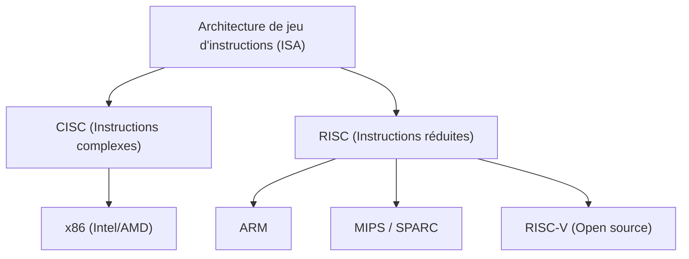
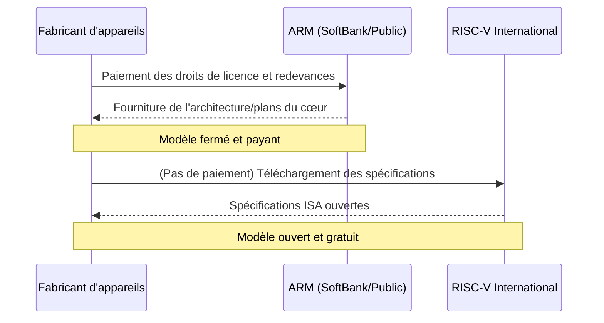

## Introduction : La lutte sans fin pour l'hégémonie du silicium

L'histoire de l'industrie des semi-conducteurs est en soi l'histoire de la lutte pour l'hégémonie autour de « l'Architecture de Jeu d'Instructions (ISA : Instruction Set Architecture) ». Depuis ses débuts dans les années 1970 jusqu'à aujourd'hui, cette règle fondamentale qui définit la manière dont un processeur interprète et exécute les instructions logicielles sur le matériel a déterminé la direction de l'évolution technologique.

Autrefois, l'architecture x86, représentée par Intel et AMD, dominait complètement les marchés des ordinateurs personnels et des serveurs, bâtissant un empire inébranlable connu sous le nom de « Wintel » (Windows + Intel). Cependant, alors que le monde passait du PC au mobile, ce système de domination a commencé à vaciller progressivement. C'est là qu'a émergé l'architecture ARM, qui a poussé l'efficacité énergétique à son paroxysme.

L'émergence et la diffusion d'ARM n'étaient pas un simple changement de génération technologique, mais un véritable changement de paradigme du modèle économique lui-même. Et aujourd'hui, ce qui menace le bastion d'ARM, c'est « RISC-V », né en tant que système entièrement open source. Dans cet article, tout en traversant l'histoire d'entreprises technologiques géantes telles qu'Intel, AMD, Apple et NVIDIA, nous démêlerons la grande épopée de l'architecture des semi-conducteurs, allant du CISC au RISC, puis du fermé à l'ouvert.

## Chapitre 1 : La naissance du x86 et l'âge d'or du CISC

### 1.1 L'évolution de l'Intel 4004 au 8086

En 1971, Intel a annoncé le « 4004 », le premier microprocesseur au monde. Bien qu'il ait été initialement développé pour les calculatrices de la société japonaise Busicom, il est devenu le point de départ de la croissance explosive de l'industrie des semi-conducteurs qui a suivi. Par la suite, l'évolution s'est poursuivie avec les 8008 et 8080, pour donner naissance en 1978 au chef-d'œuvre historique, le « 8086 ». C'est le début de la lignée de l'architecture « x86 » qui se poursuit encore aujourd'hui.

Le 8086 était un processeur 16 bits qui, en étant adopté dans le futur IBM PC, a établi sa position de norme industrielle de fait (de facto standard). À cette époque, la mémoire était extrêmement coûteuse et la capacité de stockage limitée. Par conséquent, il était nécessaire de maintenir la taille des programmes aussi petite que possible, et l'approche « CISC (Complex Instruction Set Computer) », qui permettait d'exécuter des traitements complexes avec une seule instruction, était rationnelle.

### 1.2 L'établissement de l'empire Wintel et le défi d'AMD

De la fin des années 1980 aux années 1990, la combinaison du système d'exploitation Windows de Microsoft et des processeurs d'Intel a été appelée « Wintel », dominant totalement le marché des PC. Intel a lancé de nouveaux produits à un rythme effréné avec les séries 80286, 80386, i486, puis Pentium, augmentant considérablement les performances grâce à l'augmentation de la fréquence d'horloge et à l'extension des instructions.

Face à cette hégémonie d'Intel, c'est AMD (Advanced Micro Devices) qui a continué à relever le défi avec audace. Initialement lancée comme seconde source (fabricant de fabrication alternatif) pour Intel, AMD a progressivement développé ses propres processeurs conçus en interne, engageant une féroce guerre des prix et des performances (la fameuse « course aux mégahertz ») avec Intel. En particulier, le processeur « Athlon » annoncé en 1999 a temporairement surpassé le Pentium III d'Intel en termes de performances, montrant ainsi au monde la puissance technologique d'AMD.

Cependant, la bataille entre Intel et AMD était avant tout une compétition sur le même terrain de jeu (ISA) du « x86 ». Tout en conservant le jeu d'instructions complexe de l'architecture CISC, ils ont cherché à améliorer les performances en adoptant une approche de type RISC, qui consistait en interne à décomposer les instructions en micro-opérations simples avant de les exécuter.

## Chapitre 2 : L'essor du RISC et le modèle économique d'ARM

### 2.1 La naissance de la philosophie RISC

Alors que l'architecture CISC devenait de plus en plus complexe, une approche totalement nouvelle a été proposée au début des années 1980. Il s'agissait du « RISC (Reduced Instruction Set Computer) ». Cette recherche, menée par John Cocke d'IBM et David Patterson de l'Université de Californie à Berkeley, était basée sur l'idée que « seules les instructions simples et fréquemment utilisées sont implémentées de manière matérielle, et les traitements complexes sont réalisés par leur combinaison (logicielle) ».

Le RISC visava améliorer les performances globales en simplifiant le décodage des instructions et en rendant le traitement en pipeline plus efficace. L'architecture SPARC de Sun Microsystems et l'architecture MIPS de MIPS Technologies ont fait leur apparition, connaissant un certain succès principalement sur les marchés des postes de travail et des serveurs.

### 2.2 Acorn Computers et la naissance d'ARM

La vague du RISC a également atteint un petit fabricant d'ordinateurs britannique, « Acorn Computers ». Ils ont entrepris de développer leur propre processeur RISC pour le successeur de leur ordinateur éducatif, le « BBC Micro ». Développé avec un budget et un personnel limités, « l'ARM (Acorn RISC Machine, plus tard Advanced RISC Machines) » se caractérisait par son incroyable simplicité et sa très faible consommation d'énergie.

En 1990, « ARM Ltd. » a été fondée en tant que coentreprise par trois sociétés : Acorn Computers, Apple et VLSI Technology. À l'époque, Apple développait un terminal d'information portable (PDA) révolutionnaire, le « Newton », et recherchait un processeur performant à faible consommation d'énergie.

### 2.3 De la fabrication (fabless) à la licence de propriété intellectuelle (IP)

On peut dire que la véritable innovation d'ARM résidait dans son modèle économique plutôt que dans son architecture elle-même. À l'époque, de nombreux fabricants de semi-conducteurs adoptaient un modèle d'intégration verticale (IDM) où ils concevaient leurs propres puces et les fabriquaient dans leurs propres usines (fabs). Cependant, ARM ne possédait pas d'usines et ne vendait même pas de puces.

Ils ont adopté un modèle économique inédit qui consistait à créer uniquement les « plans de conception du processeur (IP : Intellectual Property) » et à les concéder sous licence à d'autres fabricants de semi-conducteurs. Les entreprises clientes (titulaires de licence) pouvaient concevoir, développer et fabriquer des puces personnalisées (SoC : System on a Chip) combinant les fonctionnalités les plus adaptées à leurs produits à partir des plans fournis par ARM.

Ce modèle de licence IP correspondait parfaitement aux exigences du marché mobile en pleine expansion. Les fabricants de téléphones portables devaient tirer le maximum de performances d'une capacité de batterie limitée, et l'architecture basse consommation d'ARM était idéale. Des entreprises telles que Texas Instruments (TI) et Qualcomm ont adopté tour à tour les licences d'ARM, et ARM est devenue le « dirigeant de l'ombre » du marché de la téléphonie mobile.

## Chapitre 3 : La révolution mobile et l'impact d'Apple Silicon

### 3.1 La diffusion explosive des smartphones et l'hégémonie d'ARM

En 2007, l'annonce de l'« iPhone » par Apple a marqué un tournant décisif pour le monde. Les premiers iPhones étaient équipés de processeurs basés sur ARM fabriqués par Samsung. Par la suite, le système d'exploitation Android, piloté par Google, a fait son apparition, et la diffusion des smartphones a connu un essor explosif.

Dans cette révolution mobile, le plus grand gagnant est sans aucun doute ARM. L'architecture ARM a été adoptée comme le cerveau de tous les appareils mobiles tels que les smartphones, les tablettes et les montres intelligentes. Intel a également tenté de percer dans le secteur mobile en lançant son processeur « Atom » pour mobiles, mais a été vaincu face à l'efficacité énergétique écrasante d'ARM et au solide écosystème déjà en place.

### 3.2 L'histoire de la transition architecturale d'Apple

Ici, il convient de prêter attention à l'histoire singulière de l'entreprise Apple. Apple est une entreprise rare qui a entièrement modifié l'architecture du processeur au cœur de ses produits phares à trois reprises dans son histoire.

1. **Du 68k au PowerPC (1994)** : Transition de la série 68000 de Motorola au PowerPC développé conjointement avec IBM/Motorola.
2. **Du PowerPC au x86 d'Intel (2006)** : Face à la stagnation des améliorations de performances du PowerPC (en particulier le problème de consommation d'énergie pour les ordinateurs portables), Steve Jobs a décidé d'une transition complète vers l'architecture x86 d'Intel.
3. **Du x86 d'Intel à Apple Silicon (ARM) (2020)** : Enfin, le tournant majeur a été la transition vers « Apple Silicon ».

### 3.3 Ce qu'Apple Silicon (la puce M1) a prouvé

Pendant de nombreuses années, Apple a accumulé un savoir-faire dans la conception de silicium personnalisé basé sur ARM grâce à ses puces de « série A » pour iPhone et iPad. Leurs performances se sont améliorées au fil des générations, atteignant finalement un niveau menaçant pour les processeurs Intel destinés aux PC.

En 2020, Apple a annoncé la puce « M1 », un composant développé en interne pour le Mac. Il s'agit d'un SoC basé sur l'architecture ARM qu'Apple a hautement personnalisé par lui-même. La puce M1 offrait des performances surpassant celles des processeurs x86 haut de gamme de l'époque avec une consommation d'énergie remarquablement faible.

Le succès d'Apple Silicon a provoqué deux ondes de choc décisives dans l'industrie. Premièrement, il a complètement détruit le préjugé de longue date selon lequel « l'architecture ARM est destinée aux applications mobiles peu performantes », prouvant qu'elle pouvait amplement rivaliser (voire surpasser) le x86 même dans les PC de bureau haut de gamme et les postes de travail. Deuxièmement, cela a démontré l'avantage écrasant pour les entreprises technologiques géantes de « licencier l'IP et de concevoir leur propre silicium personnalisé en interne ».

## Chapitre 4 : L'ambition de NVIDIA et l'architecture à l'ère de l'IA

### 4.1 Du GPU au cœur de l'IA

Pendant qu'ARM conquérait le marché mobile, une autre architecture importante évoluait discrètement. Il s'agissait du GPU (Graphics Processing Unit) piloté par NVIDIA. Bien qu'il ait été initialement créé comme une puce dédiée à l'accélération du traitement du rendu graphique des jeux 3D, des chercheurs, attirés par sa grande capacité de calcul parallèle, ont commencé à l'appliquer au calcul scientifique et technique (GPGPU).

Après l'apparition d'« AlexNet » en 2012, la technologie du deep learning (apprentissage profond) a fait une percée, déclenchant un véritable boom de l'IA. Dans l'apprentissage des réseaux de neurones, qui nécessite d'énormes calculs matriciels, les GPU de NVIDIA ont démontré des performances écrasantes et sont devenus la plate-forme standard de facto dans le développement de l'IA.

### 4.2 L'échec de l'acquisition d'ARM par NVIDIA

Le PDG de NVIDIA, Jensen Huang, qui a établi une position absolue dans le domaine de l'IA, nourrissait de nouvelles ambitions. En septembre 2020, NVIDIA a annoncé qu'elle rachèterait ARM au groupe SoftBank pour un montant pouvant atteindre 40 milliards de dollars.

Si cette acquisition avait été conclue, la « plate-forme d'IA la plus puissante au monde (NVIDIA) » et « l'écosystème de processeurs le plus répandu au monde (ARM) » auraient été intégrés, ce qui aurait complètement redessiné la carte de l'industrie des semi-conducteurs. NVIDIA prévoyait de développer des processeurs pour centres de données IA de nouvelle génération, combinant sa propre technologie GPU avec la technologie CPU d'ARM.

Cependant, cette méga-transaction s'est heurtée à une féroce opposition des entreprises de semi-conducteurs et des autorités de régulation du monde entier. Le fondement du modèle économique d'ARM était la « neutralité (une présence semblable à celle de la Suisse) », et le contrôle d'ARM par une entreprise spécifique comme NVIDIA était inacceptable pour ses entreprises rivales (Qualcomm, Google, Microsoft, etc.). En fin de compte, l'accord n'a pas pu obtenir l'approbation des autorités antitrust de divers pays, et le plan d'acquisition a été annulé en février 2022.

Cet incident a montré à quel point ARM est devenue un « bien public » crucial dans l'industrie technologique moderne, tout en mettant en évidence la forte méfiance à l'égard des monopoles technologiques par des entreprises spécifiques.

## Chapitre 5 : La naissance et la révolution du troisième pôle, « RISC-V »

### 5.1 Qu'est-ce que RISC-V ?

Alors que l'agitation autour de l'acquisition d'ARM par NVIDIA faisait des vagues dans l'industrie, « RISC-V » a rapidement commencé à attirer l'attention. RISC-V est une architecture de jeu d'instructions (ISA) open source dont le développement a débuté en 2010 par une équipe de recherche de l'Université de Californie à Berkeley (UC Berkeley).

La principale caractéristique de RISC-V, à l'instar des logiciels open source tels que Linux ou Android, est que ses spécifications (ISA) sont publiées gratuitement et peuvent être utilisées, modifiées et implémentées librement par n'importe qui. Alors que les architectures traditionnelles x86 et ARM étaient monopolisées par des entreprises spécifiques (Intel et ARM) avec des frais de licence élevés et des conditions d'utilisation strictes (ISA fermées), RISC-V est totalement ouvert (ISA ouvert).

### 5.2 Le changement de paradigme apporté par RISC-V

L'émergence de RISC-V est en train d'apporter des changements tectoniques à l'industrie des semi-conducteurs. Les raisons en sont les suivantes :

1. **Sans licence et réduction des coûts** : Pour les petites et moyennes entreprises, les start-up et les instituts de recherche universitaires, les millions de dollars de frais de licence architecturale d'ARM constituaient un obstacle majeur. L'utilisation de RISC-V peut réduire considérablement ces coûts initiaux, abaissant ainsi considérablement la barrière au développement de processeurs personnalisés.
2. **Personnalisation ultime** : RISC-V adopte une conception modulaire, et en plus du jeu d'instructions simple de base, des extensions (calcul vectoriel, cryptage, etc.) peuvent être ajoutées ou supprimées librement en fonction de l'application. Des puces ultra-petites pour les appareils IoT aux accélérateurs d'IA, en passant par les serveurs haute performance pour les centres de données, il est possible de concevoir indépendamment des puces personnalisées optimisées pour chaque application.
3. **Libération de l'enfermement propriétaire (vendor lock-in)** : Afin d'éviter les risques liés à une dépendance excessive à l'égard de l'architecture ARM (tels que les augmentations des frais de licence et les risques géopolitiques tels que la tentative d'acquisition par NVIDIA), de nombreuses entreprises commencent à considérer RISC-V comme une alternative viable.

### 5.3 L'entrée des géants de la technologie et l'expansion de l'écosystème

Bien qu'initialement considéré comme destiné à la recherche universitaire ou aux petits appareils embarqués, de grandes entreprises technologiques investissent désormais massivement dans RISC-V.

Google a adopté RISC-V comme microcontrôleur de contrôle pour son propre processeur d'IA (TPU), et fait progresser la prise en charge officielle d'Android OS pour RISC-V. Des géants du stockage comme Western Digital et Seagate ont remplacé leurs contrôleurs de disques durs/SSD par une base RISC-V. Qualcomm développe des puces basées sur RISC-V pour les appareils portables dans le contexte de son litige de licence avec ARM.

De plus, des start-up spécialisées dans RISC-V telles que SiFive, Andes Technology et Tenstorrent (dirigée par le génial architecte Jim Keller) font leur apparition les unes après les autres, pilotant la conception de cœurs RISC-V performants et le développement d'accélérateurs d'IA.

## Chapitre 6 : Les risques géopolitiques et l'importance stratégique de RISC-V

### 6.1 Les frictions sino-américaines et la fragmentation de la technologie des semi-conducteurs

L'adoption rapide de RISC-V s'explique non seulement par ses avantages technologiques, mais aussi par l'influence considérable de la dynamique politique internationale. En particulier, l'intensification du conflit entre les États-Unis et la Chine provoque le découplage (séparation) des chaînes d'approvisionnement en semi-conducteurs.

Pour des raisons de sécurité nationale, le gouvernement américain a renforcé le contrôle des exportations de la technologie des semi-conducteurs vers les entreprises technologiques chinoises telles que Huawei. Par conséquent, les entreprises chinoises ont été confrontées au risque d'une restriction d'accès aux processeurs x86 d'Intel et à la dernière architecture ARM (bien qu'ARM soit une entreprise britannique, elle contient beaucoup de technologies américaines et est donc sujette à la réglementation).

### 6.2 L'« indépendance technologique » de la Chine et RISC-V

Dans cette situation de crise, l'architecture open source « RISC-V », qui n'est pas soumise aux lois d'un pays particulier ni aux intentions d'une entreprise spécifique, a été une véritable aubaine pour la Chine. Le gouvernement chinois et ses entreprises investissent massivement dans RISC-V en tant qu'élément central de leur stratégie nationale visant à atteindre l'autosuffisance technologique (indépendance technologique).

T-Head (PingTouGe), la division des semi-conducteurs du groupe Alibaba, a développé la série de processeurs RISC-V haute performance « Xuantie » et a mis sa conception en open source. En Chine, le développement de semi-conducteurs basés sur RISC-V progresse à un rythme explosif, des appareils IoT aux serveurs de centres de données et même aux puces d'IA.

### 6.3 Le dilemme de l'Occident et les débats sur la réglementation

D'un autre côté, les pays occidentaux sont confrontés à un dilemme. Bien que certains se réjouissent du fait que le développement de la technologie open source favorise l'innovation, des inquiétudes croissantes se font entendre quant au fait que les capacités en matière de semi-conducteurs de la Chine s'améliorent grâce à RISC-V, ce qui conduirait à la modernisation de ses technologies militaires.

Parmi les politiciens américains, certains commencent à soutenir qu'il faudrait élargir le filet de contrôle des exportations aux technologies open source, y compris RISC-V. Cependant, restreindre la publication de « spécifications » (textes) open source pourrait détruire la liberté d'expression et les bases de la recherche conjointe internationale, et il est extrêmement difficile de trouver des moyens de réglementation efficaces. Pour éviter les risques géopolitiques, RISC-V International (l'organisme de normalisation) a déjà transféré son siège social des États-Unis vers la Suisse, un pays perpétuellement neutre.

## Conclusion : L'avenir de l'informatique de nouvelle génération

La bataille autour des jeux d'instructions pour les semi-conducteurs a dépassé le cadre d'un simple débat technologique pour devenir un grand drame impliquant les stratégies des entreprises et même la sécurité nationale.

L'empire CISC x86 bâti par Intel et AMD possède toujours une base solide sur les marchés des serveurs cloud et des PC. Cependant, comme le montre le succès d'Apple Silicon, la menace d'ARM grandit de jour en jour, même dans le domaine des hautes performances. En outre, dans le contexte du boom de l'IA, un nouveau paradigme informatique centré sur le GPU de NVIDIA est en train de se former.

Et en dessous, RISC-V, l'open source, commence discrètement, mais sûrement, à éroder les bases de tous les appareils. Tout comme Linux a jadis établi une position unique sur le marché des systèmes d'exploitation de serveurs et est devenu la technologie fondatrice d'Internet, RISC-V a le potentiel de devenir le langage commun du futur écosystème des semi-conducteurs en tant que « Linux du matériel ».

x86, ARM et RISC-V. Ces trois architectures continueront de s'influencer mutuellement, menant l'évolution de l'infrastructure numérique qui soutient notre société. La lutte pour l'hégémonie du silicium n'a pas de fin.
