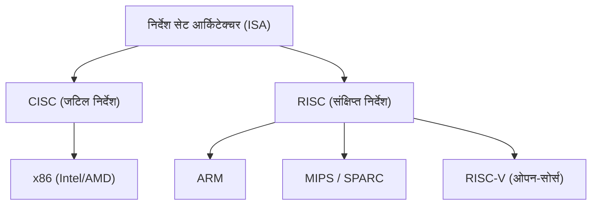
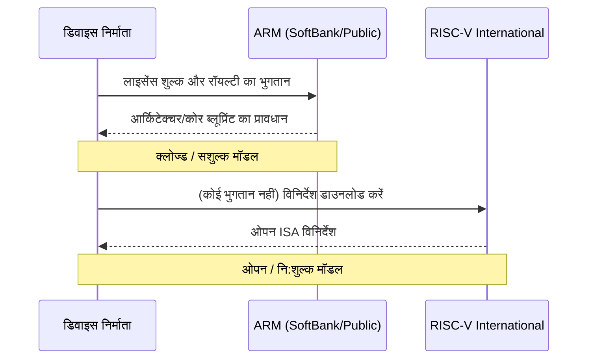

## प्रस्तावना: सिलिकॉन के वर्चस्व के लिए कभी न खत्म होने वाला संघर्ष

सेमीकंडक्टर उद्योग का इतिहास अनिवार्य रूप से "इंस्ट्रक्शन सेट आर्किटेक्चर (ISA: Instruction Set Architecture)" पर वर्चस्व की लड़ाई का इतिहास है। 1970 के दशक के शुरुआती दिनों से लेकर आज तक, प्रोसेसर सॉफ्टवेयर के निर्देशों की व्याख्या कैसे करते हैं और उन्हें हार्डवेयर पर कैसे निष्पादित करते हैं, इस मूलभूत नियम ने प्रौद्योगिकी के विकास की दिशा तय की है।

एक समय में, Intel और AMD द्वारा प्रतिनिधित्व किए गए x86 आर्किटेक्चर ने पर्सनल कंप्यूटर और सर्वर बाज़ार पर पूरी तरह से कब्ज़ा कर लिया था, और एक अजेय साम्राज्य का निर्माण किया जिसे "Wintel (Windows + Intel)" कहा जाता था। हालाँकि, जैसे-जैसे दुनिया PC से मोबाइल की ओर स्थानांतरित हुई, उनका यह वर्चस्व धीरे-धीरे डगमगाने लगा। यहीं पर अत्यधिक पावर दक्षता को लक्षित करने वाले ARM आर्किटेक्चर का उदय हुआ।

ARM का आगमन और प्रसार केवल एक तकनीकी पीढ़ी का बदलाव नहीं था, बल्कि व्यवसाय मॉडल में एक प्रतिमान विस्थापन (paradigm shift) था। और अब, "RISC-V" जो कि पूरी तरह से ओपन-सोर्स के रूप में उभरा है, ARM के गढ़ को चुनौती देने की कगार पर है। इस लेख में, हम Intel, AMD, Apple और NVIDIA जैसी विशाल प्रौद्योगिकी कंपनियों के इतिहास के माध्यम से, CISC से RISC और क्लोज्ड से ओपन की ओर बढ़ने वाले सेमीकंडक्टर आर्किटेक्चर की भव्य महाकाव्य कथा को उजागर करेंगे।

## अध्याय 1: x86 का जन्म और CISC का स्वर्ण युग

### 1.1 Intel 4004 से 8086 तक का विकास

1971 में, Intel ने दुनिया का पहला माइक्रोप्रोसेसर "4004" पेश किया। यह मूल रूप से जापानी कंपनी Busicom के कैलकुलेटर के लिए विकसित किया गया था, लेकिन यह बाद में सेमीकंडक्टर उद्योग के विस्फोटक विकास का प्रारंभिक बिंदु बन गया। इसके बाद, 8008 और 8080 के साथ विकास जारी रहा, और 1978 में ऐतिहासिक उत्कृष्ट कृति "8086" का जन्म हुआ। यहीं से "x86" आर्किटेक्चर की वंशावली शुरू हुई जो आज तक जारी है।

8086 एक 16-बिट प्रोसेसर था, और बाद में IBM PC द्वारा इसे अपनाए जाने से, इसने वास्तविक उद्योग मानक (de facto standard) के रूप में अपनी स्थिति स्थापित की। उस युग में, मेमोरी बहुत महंगी थी और स्टोरेज क्षमता सीमित थी। इसलिए, प्रोग्राम के आकार को जितना संभव हो उतना छोटा रखना आवश्यक था, और "CISC (Complex Instruction Set Computer)" दृष्टिकोण, जो एक ही निर्देश के साथ जटिल प्रसंस्करण निष्पादित कर सकता था, तर्कसंगत था।

### 1.2 Wintel साम्राज्य की स्थापना और AMD की चुनौती

1980 के दशक के अंत से लेकर 1990 के दशक तक, Microsoft के Windows ऑपरेटिंग सिस्टम और Intel के प्रोसेसर के संयोजन को "Wintel" कहा जाता था, जिसने PC बाज़ार पर पूरी तरह से शासन किया। Intel ने एक के बाद एक नए उत्पाद पेश किए—जैसे 80286, 80386, i486, और Pentium श्रृंखला—घड़ी की आवृत्ति बढ़ाकर और निर्देशों का विस्तार करके प्रदर्शन में नाटकीय रूप से सुधार किया।

AMD (Advanced Micro Devices) ने Intel के इस वर्चस्व को साहसपूर्वक चुनौती देना जारी रखा। हालांकि AMD की शुरुआत Intel के दूसरे स्रोत के रूप में हुई थी, लेकिन इसने धीरे-धीरे अपने स्वयं के डिज़ाइन वाले प्रोसेसर विकसित किए, और Intel के साथ तीव्र मूल्य और प्रदर्शन प्रतिस्पर्धा (तथाकथित "मेगाहर्ट्ज़ युद्ध") में उलझ गया। विशेष रूप से 1999 में घोषित "Athlon" प्रोसेसर ने अस्थायी रूप से प्रदर्शन के मामले में Intel के Pentium III को पीछे छोड़ दिया, और दुनिया को AMD की तकनीकी शक्ति दिखाई।

हालाँकि, Intel और AMD के बीच की लड़ाई अभी भी "x86" के समान आधार (ISA) पर एक प्रतियोगिता थी। उन्होंने CISC आर्किटेक्चर के जटिल निर्देश सेट को बनाए रखते हुए प्रदर्शन में सुधार करने के लिए RISC-जैसी कार्यप्रणाली को अपनाया, जहाँ निर्देशों को निष्पादन के लिए आंतरिक रूप से सरल माइक्रो-ऑपरेशन्स में तोड़ दिया जाता था।

## अध्याय 2: RISC का उदय और ARM का व्यवसाय मॉडल

### 2.1 RISC दर्शन का जन्म

चूंकि CISC आर्किटेक्चर लगातार जटिल होता जा रहा था, 1980 के दशक की शुरुआत में एक बिल्कुल नया दृष्टिकोण प्रस्तावित किया गया था। वह था "RISC (Reduced Instruction Set Computer)"। IBM के जॉन कॉक और यूसी बर्कले के डेविड पैटरसन के नेतृत्व में किया गया यह शोध इस विचार पर आधारित था कि "केवल अक्सर उपयोग किए जाने वाले सरल निर्देशों को हार्डवेयर में लागू किया जाना चाहिए, और जटिल प्रसंस्करण उनके संयोजन (सॉफ्टवेयर) के माध्यम से महसूस किया जाना चाहिए।"

RISC का उद्देश्य निर्देश डिकोडिंग को सरल बनाकर और पाइपलाइन प्रसंस्करण को सुव्यवस्थित करके समग्र प्रदर्शन में सुधार करना था। Sun Microsystems का SPARC और MIPS Technologies का MIPS आर्किटेक्चर आदि उभरे, जिन्होंने मुख्य रूप से वर्कस्टेशन और सर्वर बाज़ार में कुछ सफलता हासिल की।

### 2.2 Acorn Computers और ARM का जन्म

RISC की लहर ब्रिटेन की एक छोटी कंप्यूटर निर्माता कंपनी "Acorn Computers" तक भी पहुँची। उन्होंने अपने स्वयं के शैक्षिक कंप्यूटर, "BBC Micro", के उत्तराधिकारी के लिए अपना खुद का RISC प्रोसेसर विकसित करना शुरू किया। सीमित बजट और कर्मचारियों के साथ विकसित, "ARM" (Acorn RISC Machine, जिसे बाद में Advanced RISC Machines कहा गया) की विशेषता यह थी कि यह आश्चर्यजनक रूप से सरल था और इसकी बिजली की खपत बहुत कम थी।

1990 में, "ARM Ltd." को Acorn Computers, Apple और VLSI Technology के बीच एक संयुक्त उद्यम के रूप में स्थापित किया गया था। उस समय, Apple "Newton", एक क्रांतिकारी पर्सनल डिजिटल असिस्टेंट (PDA) विकसित कर रहा था, और एक ऐसे प्रोसेसर की तलाश में था जो कम बिजली की खपत के साथ उच्च प्रदर्शन प्रदान कर सके।

### 2.3 फैबलेस से आईपी लाइसेंसिंग में परिवर्तन

यह कहा जा सकता है कि ARM का वास्तविक नवाचार उसके आर्किटेक्चर की तुलना में उसके व्यवसाय मॉडल में अधिक था। उस समय, कई सेमीकंडक्टर निर्माता एक वर्टिकल इंटीग्रेशन (IDM) मॉडल अपना रहे थे, जहाँ वे अपने चिप्स स्वयं डिज़ाइन करते थे और उन्हें अपने कारखानों में निर्मित करते थे। हालाँकि, ARM के पास अपना खुद का कारखाना नहीं था, और उसने चिप्स भी नहीं बेचे।

उन्होंने "प्रोसेसर ब्लूप्रिंट (IP: Intellectual Property)" बनाने और उन्हें अन्य सेमीकंडक्टर निर्माताओं को लाइसेंस देने के अभूतपूर्व व्यवसाय मॉडल को अपनाया। ग्राहक कंपनियाँ (लाइसेंसधारी) ARM द्वारा प्रदान किए गए ब्लूप्रिंट के आधार पर अपने उत्पादों के लिए अनुकूलित कस्टम चिप्स (SoC: System on a Chip) विकसित और निर्मित कर सकती थीं।

यह आईपी लाइसेंस मॉडल तेजी से बढ़ते मोबाइल बाज़ार की माँगों से पूरी तरह मेल खाता था। मोबाइल फोन निर्माताओं को सीमित बैटरी क्षमता के भीतर अधिकतम प्रदर्शन निकालने की आवश्यकता थी, और ARM का कम-शक्ति (low-power) आर्किटेक्चर आदर्श था। टेक्सास इंस्ट्रूमेंट्स (TI) और क्वालकॉम (Qualcomm) जैसी कंपनियों ने एक के बाद एक ARM के लाइसेंस को अपनाया, और ARM मोबाइल फोन बाज़ार में "पर्दे के पीछे का शासक" बन गया।

## अध्याय 3: मोबाइल क्रांति और Apple Silicon का प्रभाव

### 3.1 स्मार्टफ़ोन का विस्फोटक प्रसार और ARM का वर्चस्व

2007 में, जब Apple ने "iPhone" की घोषणा की, तो दुनिया एक निर्णायक मोड़ पर आ गई। शुरुआती iPhone सैमसंग द्वारा निर्मित ARM-आधारित प्रोसेसर से लैस था। उसके बाद, Google के नेतृत्व में Android OS सामने आया, और स्मार्टफ़ोन का प्रसार विस्फोटक गति से बढ़ा।

इस मोबाइल क्रांति में निर्विवाद रूप से सबसे बड़ा विजेता ARM रहा है। ARM आर्किटेक्चर को स्मार्टफोन, टैबलेट और स्मार्टवॉच जैसे हर मोबाइल डिवाइस के दिमाग के रूप में अपनाया गया। Intel ने भी "Atom" प्रोसेसर के साथ मोबाइल में प्रवेश करने की कोशिश की, लेकिन ARM की अभूतपूर्व पावर दक्षता और पहले से स्थापित मजबूत इकोसिस्टम के सामने उसे हार माननी पड़ी।

### 3.2 Apple के आर्किटेक्चर ट्रांज़िशन का इतिहास

यहाँ, हम Apple के अनूठे इतिहास पर ध्यान केंद्रित करना चाहेंगे। Apple एक दुर्लभ कंपनी है जिसने अपने मुख्य उत्पादों के केंद्र में स्थित प्रोसेसर के आर्किटेक्चर को इतिहास में तीन बार पूरी तरह से बदला है।

1. **68k से PowerPC तक (1994)**: Motorola की 68000 श्रृंखला से IBM/Motorola के साथ संयुक्त रूप से विकसित PowerPC में स्थानांतरण।
2. **PowerPC से Intel x86 तक (2006)**: PowerPC के प्रदर्शन में सुधार (विशेष रूप से लैपटॉप के लिए बिजली की खपत के मुद्दे) रुक जाने पर, स्टीव जॉब्स ने पूरी तरह से Intel के x86 आर्किटेक्चर पर स्विच करने का निर्णय लिया।
3. **Intel x86 से Apple Silicon (ARM) तक (2020)**: और सबसे बड़ा मोड़ "Apple Silicon" में परिवर्तन था।

### 3.3 Apple Silicon (M1 चिप) ने क्या साबित किया

कई वर्षों से, Apple ने iPhone और iPad के लिए "A-सीरीज़" चिप्स के माध्यम से ARM-आधारित कस्टम सिलिकॉन डिज़ाइन करने में विशेषज्ञता हासिल की थी। प्रत्येक पीढ़ी के साथ इसका प्रदर्शन सुधरता गया, अंततः उस स्तर तक पहुँच गया जहाँ इसने PC के लिए Intel प्रोसेसर को खतरे में डाल दिया।

2020 में, Apple ने Mac के लिए स्व-विकसित चिप "M1" की घोषणा की। यह ARM आर्किटेक्चर पर आधारित एक SoC है, जिसे Apple ने अपने स्तर पर अत्यधिक कस्टमाइज़ किया है। M1 चिप ने आश्चर्यजनक रूप से कम बिजली की खपत के साथ उस समय के हाई-एंड x86 प्रोसेसर से बेहतर प्रदर्शन हासिल किया।

Apple Silicon की सफलता ने उद्योग को दो निर्णायक झटके दिए। पहला, इसने इस लंबे समय से चले आ रहे पूर्वाग्रह को पूरी तरह से नष्ट कर दिया कि "ARM आर्किटेक्चर केवल मोबाइल के लिए कम-प्रदर्शन वाली तकनीक है", यह साबित करते हुए कि यह हाई-एंड डेस्कटॉप पीसी और वर्कस्टेशन में भी x86 के साथ प्रतिस्पर्धा कर सकता है (या उसे पार कर सकता है)। दूसरा, इसने एक विशाल प्रौद्योगिकी कंपनी के "IP को लाइसेंस देने और इन-हाउस कस्टम सिलिकॉन डिज़ाइन करने" के अत्यधिक लाभ को प्रदर्शित किया।

## अध्याय 4: NVIDIA की महत्वाकांक्षाएं और AI युग का आर्किटेक्चर

### 4.1 GPU से AI के केंद्र तक

जब ARM मोबाइल बाज़ार जीत रहा था, एक और महत्वपूर्ण आर्किटेक्चर चुपचाप विकसित हो रहा था। यह GPU (Graphics Processing Unit) था, जिसका नेतृत्व NVIDIA कर रहा था। शुरू में GPU को 3D गेम के लिए ग्राफिक्स रेंडरिंग को गति देने के लिए एक समर्पित चिप के रूप में बनाया गया था, लेकिन इसकी उच्च समानांतर कंप्यूटिंग (parallel computing) क्षमताओं को देखकर शोधकर्ताओं ने इसे वैज्ञानिक कंप्यूटिंग (GPGPU) में लागू करना शुरू कर दिया।

2012 में "AlexNet" की उपस्थिति के बाद, डीप लर्निंग (Deep Learning) तकनीक ने एक सफलता हासिल की, जिससे AI में भारी उछाल आया। न्यूरल नेटवर्क की ट्रेनिंग में, जिसमें भारी मात्रा में मैट्रिक्स संचालन की आवश्यकता होती है, NVIDIA के GPU ने असाधारण प्रदर्शन दिखाया और AI विकास के लिए वास्तविक मानक (de facto standard) प्लेटफॉर्म बन गया।

### 4.2 NVIDIA द्वारा ARM के अधिग्रहण की विफलता

AI क्षेत्र में पूर्ण स्थिति स्थापित करने वाले NVIDIA के सीईओ जेन्सन हुआंग की महत्वाकांक्षाएँ और भी बड़ी थीं। सितंबर 2020 में, NVIDIA ने घोषणा की कि वह SoftBank Group से 40 बिलियन डॉलर तक के सौदे में ARM का अधिग्रहण करेगा।

अगर यह अधिग्रहण सफल हो जाता, तो "दुनिया का सबसे शक्तिशाली AI प्लेटफॉर्म (NVIDIA)" और "दुनिया का सबसे व्यापक रूप से उपयोग किया जाने वाला प्रोसेसर इकोसिस्टम (ARM)" एकीकृत हो जाते, जिससे सेमीकंडक्टर उद्योग का परिदृश्य पूरी तरह से बदल जाता। NVIDIA ने अगली पीढ़ी के AI डेटा सेंटर प्रोसेसर विकसित करने की योजना बनाई थी जो उसकी GPU तकनीक को ARM की CPU तकनीक के साथ मिलाते।

हालाँकि, इस मेगा डील को दुनिया भर की सेमीकंडक्टर कंपनियों और नियामकों के कड़े विरोध का सामना करना पड़ा। ARM के व्यवसाय मॉडल का मूल इसकी "तटस्थता (स्विट्जरलैंड जैसी स्थिति)" है, और NVIDIA जैसी विशिष्ट कंपनी का ARM पर नियंत्रण करना प्रतिद्वंद्वी कंपनियों (Qualcomm, Google, Microsoft आदि) के लिए स्वीकार्य नहीं था। अंततः, विभिन्न देशों के अविश्वास अधिकारियों से अनुमोदन प्राप्त करने में विफलता के कारण, अधिग्रहण की योजना को फरवरी 2022 में रद्द कर दिया गया।

इस घटना ने दिखाया कि कैसे ARM आधुनिक प्रौद्योगिकी उद्योग में एक महत्वपूर्ण "सार्वजनिक वस्तु (public good)" बन गया है, और साथ ही किसी एक विशिष्ट कंपनी द्वारा प्रौद्योगिकी एकाधिकार के खिलाफ मजबूत सतर्कता को उजागर किया।

## अध्याय 5: तीसरे ध्रुव "RISC-V" का जन्म और क्रांति

### 5.1 RISC-V क्या है?

जैसे-जैसे NVIDIA के ARM अधिग्रहण विवाद ने उद्योग में हलचल मचाई, "RISC-V" (रिस्क फाइव) ने तेजी से ध्यान आकर्षित करना शुरू किया। RISC-V एक ओपन-सोर्स इंस्ट्रक्शन सेट आर्किटेक्चर (ISA) है, जिसका विकास 2010 में कैलिफोर्निया विश्वविद्यालय, बर्कले (UC Berkeley) की एक शोध टीम द्वारा शुरू किया गया था।

RISC-V की सबसे बड़ी विशेषता यह है कि, Linux या Android जैसे ओपन-सोर्स सॉफ्टवेयर के समान, इसके विनिर्देश (ISA) मुफ्त में उपलब्ध हैं, और कोई भी स्वतंत्र रूप से उनका उपयोग, संशोधन और कार्यान्वयन कर सकता है। जबकि पारंपरिक x86 और ARM के अधिकार विशिष्ट कंपनियों (Intel और ARM) द्वारा एकाधिकार में हैं और उन पर उच्च लाइसेंस शुल्क और सख्त उपयोग की शर्तें लागू की जाती हैं (Closed ISA), RISC-V पूरी तरह से खुला है (Open ISA)।

### 5.2 RISC-V द्वारा लाया गया पैराडाइम शिफ्ट

RISC-V का उद्भव सेमीकंडक्टर उद्योग में एक भूकंपीय बदलाव ला रहा है। इसके कारण इस प्रकार हैं:

1. **लाइसेंस-मुक्त और लागत में कमी**: छोटे और मध्यम उद्यमों, स्टार्टअप्स और विश्वविद्यालय अनुसंधान संस्थानों के लिए, लाखों डॉलर की ARM आर्किटेक्चर लाइसेंसिंग फीस एक बड़ी बाधा थी। RISC-V का उपयोग करके, इस प्रारंभिक लागत को नाटकीय रूप से कम किया जा सकता है, जिससे कस्टम प्रोसेसर विकसित करने की बाधाएँ काफी कम हो जाती हैं।
2. **अंतिम अनुकूलन क्षमता (Ultimate Customizability)**: RISC-V एक मॉड्यूलर डिज़ाइन को अपनाता है, जो बुनियादी सरल निर्देश सेट के अलावा आवश्यकतानुसार कस्टम एक्सटेंशन (जैसे कि वेक्टर गणना, एन्क्रिप्शन आदि) को स्वतंत्र रूप से जोड़ने और हटाने की अनुमति देता है। IoT उपकरणों के लिए अल्ट्रा-स्मॉल चिप्स से लेकर, AI एक्सेलरेटर और डेटा सेंटर के लिए उच्च-प्रदर्शन सर्वर तक, हर एप्लिकेशन के लिए अनुकूलित कस्टम चिप्स स्वतंत्र रूप से डिज़ाइन किए जा सकते हैं।
3. **वेंडर लॉक-इन से मुक्ति**: ARM आर्किटेक्चर (लाइसेंस शुल्क वृद्धि या NVIDIA अधिग्रहण विवाद जैसे भू-राजनीतिक जोखिम) पर बहुत अधिक निर्भर होने के जोखिम से बचने के लिए, कई कंपनियाँ RISC-V को एक शक्तिशाली विकल्प के रूप में मान रही हैं।

### 5.3 विशाल टेक कंपनियों का प्रवेश और इकोसिस्टम का विस्तार

हालाँकि शुरुआत में RISC-V को शैक्षणिक अनुसंधान और छोटे पैमाने के एम्बेडेड उपकरणों के लिए माना जाता था, अब विशाल प्रौद्योगिकी कंपनियाँ इसमें भारी निवेश कर रही हैं।

Google ने अपने AI प्रोसेसर (TPU) के लिए कंट्रोल माइक्रोकंट्रोलर के रूप में RISC-V को अपनाया है, और RISC-V के लिए आधिकारिक Android OS समर्थन को आगे बढ़ा रहा है। Western Digital और Seagate जैसी बड़ी स्टोरेज कंपनियों ने अपने HDD/SSD नियंत्रकों को RISC-V बेस पर बदल दिया है। Qualcomm, ARM के साथ अपने लाइसेंसिंग विवाद की पृष्ठभूमि में, वियरेबल्स के लिए RISC-V-आधारित चिप्स विकसित कर रहा है।

इसके अलावा, SiFive, Andes Technology, और Tenstorrent (जीनियस आर्किटेक्ट जिम केलर के नेतृत्व में) जैसे RISC-V विशेषज्ञ स्टार्टअप्स एक के बाद एक उभर रहे हैं, जो उच्च प्रदर्शन वाले RISC-V कोर और AI एक्सेलरेटर के विकास को गति दे रहे हैं।

## अध्याय 6: भू-राजनीतिक जोखिम और RISC-V का रणनीतिक महत्व

### 6.1 अमेरिका-चीन संघर्ष और सेमीकंडक्टर तकनीक का ब्लॉकिकरण

RISC-V के तेजी से प्रसार की पृष्ठभूमि के पीछे न केवल तकनीकी श्रेष्ठता है, बल्कि अंतरराष्ट्रीय राजनीति की गतिशीलता का भी बड़ा प्रभाव है। विशेष रूप से, गहन अमेरिका-चीन प्रतिद्वंद्विता सेमीकंडक्टर आपूर्ति श्रृंखलाओं के विखंडन का कारण बन रही है।

सुरक्षा कारणों से, अमेरिकी सरकार ने Huawei जैसी चीनी प्रौद्योगिकी कंपनियों को सेमीकंडक्टर प्रौद्योगिकी के निर्यात पर प्रतिबंध कड़े कर दिए हैं। नतीजतन, चीनी कंपनियों को Intel के x86 प्रोसेसर और नवीनतम ARM आर्किटेक्चर तक पहुँच प्रतिबंधित होने के जोखिम का सामना करना पड़ा। (यद्यपि ARM एक ब्रिटिश कंपनी है, लेकिन इसमें बहुत अधिक अमेरिकी तकनीक शामिल है, जो इसे नियमों के अधीन बनाती है)।

### 6.2 चीन की "तकनीकी स्वतंत्रता" और RISC-V

इस संकट की स्थिति में, ओपन-सोर्स "RISC-V" जो किसी विशिष्ट देश के कानूनों या कंपनियों के इरादों से प्रभावित नहीं है, चीन के लिए एक वरदान था। तकनीकी आत्मनिर्भरता (तकनीकी स्वतंत्रता) प्राप्त करने की अपनी राष्ट्रीय रणनीति के मूल के रूप में चीनी सरकार और कंपनियाँ RISC-V में भारी निवेश कर रही हैं।

Alibaba ग्रुप के सेमीकंडक्टर डिवीजन, T-Head (PingTouGe) ने उच्च-प्रदर्शन वाले RISC-V प्रोसेसर की "Xuantie" श्रृंखला विकसित की है और उनके डिज़ाइन को ओपन-सोर्स किया है। चीन में, IoT उपकरणों से लेकर डेटा सेंटर सर्वर और यहाँ तक कि AI चिप्स तक, RISC-V-आधारित सेमीकंडक्टर विकास विस्फोटक गति से आगे बढ़ रहा है।

### 6.3 पश्चिम की दुविधा और विनियमन पर बहस

दूसरी ओर, पश्चिमी देशों को एक दुविधा का सामना करना पड़ रहा है। जबकि कुछ लोग ओपन-सोर्स तकनीक के विकास का स्वागत करते हुए कहते हैं कि यह नवाचार को बढ़ावा देता है, वहीं इस बात की चिंता बढ़ रही है कि RISC-V के माध्यम से चीन की सेमीकंडक्टर क्षमताएँ सुधरेंगी, जिससे इसकी सैन्य तकनीक का आधुनिकीकरण होगा।

अमेरिका में कुछ राजनेताओं ने तर्क देना शुरू कर दिया है कि RISC-V सहित ओपन-सोर्स प्रौद्योगिकियों पर निर्यात नियंत्रण का जाल व्यापक किया जाना चाहिए। हालाँकि, ओपन-सोर्स "विनिर्देशों (पाठ)" के प्रकाशन को प्रतिबंधित करना वाक् स्वतंत्रता और अंतर्राष्ट्रीय संयुक्त अनुसंधान की नींव को नष्ट कर सकता है, और प्रभावी नियामक उपाय खोजना बेहद मुश्किल है। भू-राजनीतिक जोखिमों से बचने के लिए, मानकीकरण निकाय RISC-V International ने पहले ही अपना मुख्यालय अमेरिका से स्विट्जरलैंड, जो हमेशा से एक तटस्थ देश रहा है, स्थानांतरित कर लिया है।

## अंतिम अध्याय: नेक्स्ट-जेनरेशन कंप्यूटिंग का भविष्य

सेमीकंडक्टर इंस्ट्रक्शन सेट को लेकर लड़ाई अब केवल तकनीकी विवाद नहीं रह गई है, बल्कि एक भव्य नाटक बन गई है जिसमें कॉर्पोरेट रणनीति और राष्ट्रीय सुरक्षा शामिल है।

Intel और AMD द्वारा निर्मित x86 का CISC साम्राज्य अभी भी क्लाउड सर्वर और PC बाज़ारों में एक मजबूत आधार रखता है। हालाँकि, जैसा कि Apple Silicon की सफलता दिखाती है, उच्च-प्रदर्शन वाले क्षेत्रों में भी ARM का खतरा दिन-ब-दिन बढ़ता जा रहा है। इसके अलावा, AI बूम की पृष्ठभूमि में, NVIDIA के GPU के इर्द-गिर्द केंद्रित एक नया कंप्यूटिंग प्रतिमान बन रहा है।

और इन सबसे नीचे, ओपन-सोर्स RISC-V हर डिवाइस की नींव को चुपचाप लेकिन निश्चित रूप से खिसकाना शुरू कर रहा है। जिस तरह Linux ने सर्वर OS बाज़ार में अपनी अनूठी स्थिति बनाई और इंटरनेट की आधारभूत तकनीक बन गया, उसी तरह RISC-V में "हार्डवेयर के Linux" के रूप में अगली पीढ़ी के सेमीकंडक्टर इकोसिस्टम की सामान्य भाषा बनने की क्षमता है।

x86, ARM और RISC-V। ये तीनों आर्किटेक्चर एक-दूसरे को प्रभावित करते रहेंगे और डिजिटल इंफ्रास्ट्रक्चर के विकास को गति देंगे जो हमारे समाज का समर्थन करता है। सिलिकॉन के वर्चस्व का यह संघर्ष कभी खत्म नहीं होगा।
