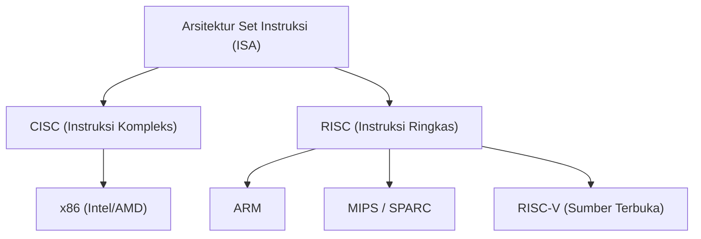
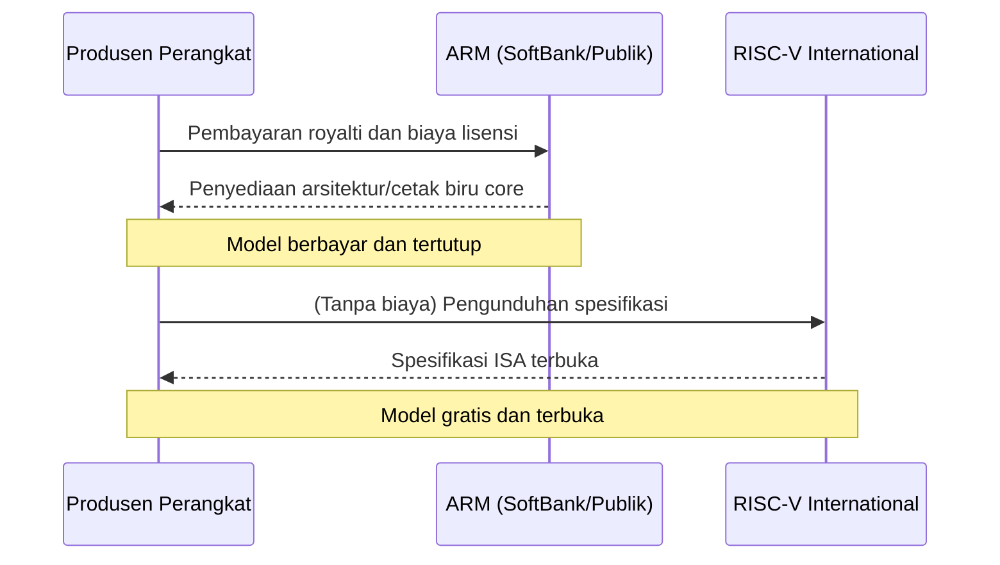

## Prolog: Perjuangan Tanpa Akhir untuk Hegemoni Silikon

Sejarah industri semikonduktor adalah sejarah perebutan hegemoni seputar "Arsitektur Set Instruksi (ISA: Instruction Set Architecture)". Dari masa-masa awal di tahun 1970-an hingga saat ini, aturan mendasar tentang bagaimana sebuah prosesor menginterpretasikan instruksi dari perangkat lunak dan mengeksekusinya pada perangkat keras telah menentukan arah evolusi teknologi.

Dahulu, arsitektur x86 yang diwakili oleh Intel dan AMD sepenuhnya menguasai pasar komputer pribadi dan server, membangun kerajaan tak tergoyahkan yang disebut "Wintel (Windows + Intel)". Namun, seiring pergeseran dunia dari PC ke seluler, dominasi tersebut mulai goyah secara perlahan. Di sanalah muncul arsitektur ARM, yang mengejar efisiensi daya hingga batas maksimal.

Kemunculan dan penyebaran ARM bukan sekadar pergantian generasi teknologi, melainkan pergeseran paradigma dalam model bisnis itu sendiri. Dan saat ini, yang mengancam benteng pertahanan ARM adalah "RISC-V", yang lahir sebagai sumber terbuka sepenuhnya. Artikel ini akan menelusuri epik arsitektur semikonduktor dari CISC ke RISC, dan dari sistem tertutup ke terbuka, dengan melintasi sejarah raksasa teknologi seperti Intel, AMD, Apple, dan NVIDIA.

## Bab 1: Kelahiran x86 dan Masa Keemasan CISC

### 1.1 Evolusi dari Intel 4004 ke 8086

Pada tahun 1971, Intel mengumumkan mikroprosesor pertama di dunia "4004". Meskipun awalnya dikembangkan untuk kalkulator dari perusahaan Jepang Busicom, ini menjadi titik awal pertumbuhan eksplosif industri semikonduktor di kemudian hari. Setelah itu, prosesor terus berevolusi ke 8008, 8080, hingga mahakarya bersejarah "8086" lahir pada tahun 1978. Inilah awal silsilah arsitektur "x86" yang berlanjut hingga hari ini.

8086 adalah prosesor 16-bit, dan dengan diadopsinya pada IBM PC, ia mengukuhkan posisinya sebagai standar industri secara de facto. Di era ini, memori sangat mahal dan kapasitas penyimpanan juga terbatas. Oleh karena itu, ukuran program perlu ditekan sekecil mungkin, sehingga pendekatan "CISC (Complex Instruction Set Computer)", yang dapat mengeksekusi pemrosesan kompleks dengan satu instruksi, sangatlah masuk akal.

### 1.2 Pendirian Kerajaan Wintel dan Tantangan AMD

Dari akhir 1980-an hingga 1990-an, kombinasi sistem operasi Windows Microsoft dan prosesor Intel yang disebut "Wintel" sepenuhnya mendominasi pasar PC. Intel meluncurkan produk-produk baru dengan agresif seperti seri 80286, 80386, i486, dan Pentium, secara dramatis meningkatkan kinerja melalui peningkatan kecepatan clock dan perluasan instruksi.

Menghadapi hegemoni Intel ini, AMD (Advanced Micro Devices) dengan gigih terus menantang. Meskipun awalnya dimulai sebagai produsen alternatif (second source) bagi Intel, AMD secara bertahap mengembangkan prosesor rancangannya sendiri dan terlibat dalam persaingan harga serta kinerja yang sengit dengan Intel (dikenal sebagai "perlombaan megahertz"). Secara khusus, prosesor "Athlon" yang diumumkan pada tahun 1999 untuk sementara mengungguli Pentium III milik Intel dalam hal kinerja, menunjukkan kekuatan teknologi AMD kepada dunia.

Namun, persaingan antara Intel dan AMD pada dasarnya adalah kompetisi di arena (ISA) yang sama, yaitu "x86". Mereka meningkatkan kinerja dengan mengadopsi pendekatan ala RISC, yaitu secara internal memecah instruksi menjadi mikro-operasi sederhana untuk dieksekusi, sambil mempertahankan set instruksi kompleks dari arsitektur CISC.

## Bab 2: Kebangkitan RISC dan Model Bisnis ARM

### 2.1 Lahirnya Filosofi RISC

Seiring arsitektur CISC yang semakin kompleks, pendekatan yang sama sekali baru diusulkan pada awal 1980-an. Itulah "RISC (Reduced Instruction Set Computer)". Penelitian ini, yang dipimpin oleh John Cocke dari IBM dan David Patterson dari UC Berkeley, didasarkan pada filosofi bahwa "hanya instruksi sederhana yang sering digunakan yang diimplementasikan dalam perangkat keras, sedangkan pemrosesan kompleks diwujudkan melalui kombinasi instruksi-instruksi tersebut (perangkat lunak)".

RISC bertujuan untuk meningkatkan kinerja keseluruhan dengan menyederhanakan dekode instruksi dan mengefisienkan pemrosesan pipeline. Arsitektur seperti SPARC dari Sun Microsystems dan MIPS dari MIPS Technologies pun bermunculan, dan meraih tingkat kesuksesan tertentu, terutama di pasar workstation dan server.

### 2.2 Acorn Computers dan Kelahiran ARM

Gelombang RISC juga mencapai pembuat komputer kecil di Inggris, "Acorn Computers". Mereka mulai mengembangkan prosesor RISC mereka sendiri untuk penerus komputer pendidikan mereka, "BBC Micro". Dikembangkan dengan anggaran dan personel yang terbatas, "ARM (Acorn RISC Machine, yang kemudian menjadi Advanced RISC Machines)" memiliki karakteristik luar biasa sederhana dan konsumsi daya yang sangat rendah.

Pada tahun 1990, "ARM Ltd." didirikan sebagai perusahaan patungan oleh tiga perusahaan: Acorn Computers, Apple, dan VLSI Technology. Pada saat itu, Apple sedang mengembangkan "Newton", sebuah Personal Digital Assistant (PDA) yang revolusioner, dan mencari prosesor berkinerja tinggi dengan konsumsi daya rendah.

### 2.3 Transisi dari Fabless ke Lisensi IP

Inovasi nyata dari ARM bisa dikatakan tidak terletak pada arsitekturnya sendiri, melainkan pada model bisnisnya. Pada masa itu, banyak produsen semikonduktor mengadopsi model terintegrasi vertikal (IDM), merancang cip mereka sendiri dan memproduksinya di pabrik (fab) mereka sendiri. Namun, ARM tidak memiliki pabrik sendiri, dan bahkan tidak menjual cip sama sekali.

Mereka hanya membuat "cetak biru prosesor (IP: Intellectual Property)" dan melisensikannya ke pembuat semikonduktor lain, mengadopsi model bisnis yang belum pernah ada sebelumnya. Perusahaan klien (pemegang lisensi) dapat mengembangkan dan memproduksi cip kustom (SoC: System on a Chip) yang menggabungkan fitur optimal untuk produk mereka sendiri, berdasarkan cetak biru yang disediakan oleh ARM.

Model lisensi IP ini sangat cocok dengan tuntutan pasar seluler yang berkembang pesat. Produsen ponsel pintar harus memaksimalkan kinerja dengan kapasitas baterai terbatas, dan arsitektur rendah daya ARM adalah solusi yang ideal. Perusahaan seperti Texas Instruments (TI) dan Qualcomm satu per satu mengadopsi lisensi ARM, dan ARM pun tumbuh menjadi "penguasa bayangan" di pasar seluler.

## Bab 3: Revolusi Seluler dan Dampak Apple Silicon

### 3.1 Ledakan Penyebaran Ponsel Pintar dan Hegemoni ARM

Pada tahun 2007, ketika Apple mengumumkan "iPhone", dunia mencapai titik balik yang menentukan. iPhone generasi awal ditenagai oleh prosesor berbasis ARM yang diproduksi oleh Samsung. Setelah itu, sistem operasi Android yang dipimpin Google muncul, dan penyebaran ponsel pintar menunjukkan momentum yang eksplosif.

Dalam revolusi seluler ini, pemenang terbesarnya tidak diragukan lagi adalah ARM. Arsitektur ARM diadopsi sebagai otak dari semua perangkat seluler seperti ponsel pintar, tablet, dan jam tangan pintar. Intel juga mencoba memasuki pasar seluler dengan memperkenalkan prosesor "Atom", tetapi kalah oleh efisiensi daya ARM yang luar biasa dan ekosistem yang sudah terbangun kuat.

### 3.2 Sejarah Transisi Arsitektur Apple

Di sini, sejarah unik perusahaan Apple patut diperhatikan. Apple adalah perusahaan langka yang telah sepenuhnya beralih arsitektur prosesor yang menjadi inti dari produk unggulannya, sebanyak tiga kali dalam sejarah.

1. **Dari 68k ke PowerPC (1994)**: Transisi dari seri 68000 Motorola ke PowerPC, yang dikembangkan bersama IBM dan Motorola.
2. **Dari PowerPC ke Intel x86 (2006)**: Peningkatan kinerja PowerPC (terutama masalah konsumsi daya untuk laptop) terhenti, dan Steve Jobs memutuskan transisi penuh ke arsitektur x86 milik Intel.
3. **Dari Intel x86 ke Apple Silicon (ARM) (2020)**: Kemudian, titik balik terbesar adalah transisi ke "Apple Silicon".

### 3.3 Apa yang Dibuktikan oleh Apple Silicon (Chip M1)

Selama bertahun-tahun, Apple telah mengakumulasi pengetahuan (know-how) desain silikon kustom berbasis ARM melalui chip "Seri A" untuk iPhone dan iPad. Kinerjanya meningkat di setiap generasi, dan akhirnya mencapai tingkat yang mengancam prosesor Intel untuk PC.

Pada tahun 2020, Apple mengumumkan cip buatan sendiri untuk Mac, yaitu "M1". Ini adalah SoC berbasis arsitektur ARM yang sangat dikustomisasi secara eksklusif oleh Apple. Chip M1 mewujudkan kinerja yang melampaui prosesor x86 high-end pada masa itu dengan konsumsi daya rendah yang luar biasa.

Keberhasilan Apple Silicon memberikan dua kejutan besar bagi industri. Pertama, ia sepenuhnya menghancurkan prasangka lama bahwa "arsitektur ARM adalah untuk perangkat seluler berperforma rendah", dan membuktikan bahwa ARM dapat bersaing dengan (atau bahkan melampaui) x86 bahkan dalam PC desktop dan workstation high-end. Kedua, ia menunjukkan keunggulan luar biasa dari perusahaan teknologi raksasa dalam "melisensikan IP dan merancang silikon kustom secara mandiri".

## Bab 4: Ambisi NVIDIA dan Arsitektur Era AI

### 4.1 Dari GPU menjadi Jantung AI

Sementara ARM mendominasi pasar seluler, arsitektur penting lainnya berevolusi secara diam-diam. Itulah GPU (Graphics Processing Unit) yang dipimpin oleh NVIDIA. Meskipun GPU awalnya lahir sebagai cip khusus untuk mempercepat pemrosesan rendering grafis game 3D, para peneliti yang memperhatikan tingginya kemampuan komputasi paralel tersebut mulai menerapkannya pada komputasi ilmiah dan teknis (GPGPU).

Setelah kemunculan "AlexNet" pada tahun 2012, teknologi deep learning mencapai terobosan, dan memicu booming AI. GPU NVIDIA menunjukkan kinerja luar biasa dalam melatih jaringan saraf tiruan (neural networks) yang membutuhkan operasi matriks masif, menjadikannya platform standar de facto dalam pengembangan AI.

### 4.2 Kegagalan Akuisisi ARM oleh NVIDIA

CEO NVIDIA, Jensen Huang, yang membangun posisi absolut di ranah AI, memiliki ambisi yang lebih besar lagi. Pada bulan September 2020, NVIDIA mengumumkan akan mengakuisisi ARM dari SoftBank Group senilai hingga 40 miliar dolar AS.

Seandainya akuisisi ini terjadi, "platform AI terkuat di dunia (NVIDIA)" dan "ekosistem prosesor yang paling banyak digunakan di dunia (ARM)" akan terintegrasi, yang pasti akan mengubah sepenuhnya peta kekuatan di industri semikonduktor. NVIDIA berencana mengembangkan prosesor pusat data AI generasi berikutnya dengan menggabungkan teknologi GPU mereka dengan teknologi CPU ARM.

Namun, kesepakatan raksasa ini menghadapi penolakan keras dari perusahaan semikonduktor dan regulator di seluruh dunia. Dasar dari model bisnis ARM adalah "netralitas (keberadaan layaknya Swiss)", dan dominasi ARM oleh perusahaan spesifik seperti NVIDIA tidak dapat diterima oleh perusahaan saingan (Qualcomm, Google, Microsoft, dll.). Pada akhirnya, akuisisi tersebut gagal mendapatkan persetujuan dari otoritas antimonopoli di berbagai negara, dan rencana akuisisi dibatalkan pada bulan Februari 2022.

Insiden ini tidak hanya menunjukkan betapa pentingnya ARM sebagai entitas layaknya "barang publik" dalam industri teknologi modern, tetapi juga menyoroti kehati-hatian yang kuat terhadap monopoli teknologi oleh perusahaan tertentu.

## Bab 5: Kelahiran dan Revolusi Kutub Ketiga "RISC-V"

### 5.1 Apa itu RISC-V?

Sementara keributan akuisisi ARM oleh NVIDIA menimbulkan riak di industri, "RISC-V" (dibaca risk-five) dengan cepat mulai menarik perhatian. RISC-V adalah arsitektur set instruksi (ISA) sumber terbuka yang mulai dikembangkan oleh tim peneliti di University of California, Berkeley (UC Berkeley) pada tahun 2010.

Fitur terbesar dari RISC-V adalah spesifikasinya (ISA) dirilis secara gratis, sama seperti perangkat lunak sumber terbuka (open source) layaknya Linux atau Android, sehingga siapa pun dapat bebas menggunakan, mengubah, dan mengimplementasikannya. Sementara x86 dan ARM tradisional dimonopoli oleh perusahaan tertentu (Intel dan ARM Ltd.) dan tunduk pada biaya lisensi yang mahal dan persyaratan penggunaan yang ketat (Closed ISA), RISC-V sepenuhnya terbuka (Open ISA).

### 5.2 Pergeseran Paradigma yang Dibawa oleh RISC-V

Kehadiran RISC-V membawa pergeseran tektonik ke industri semikonduktor. Alasannya adalah sebagai berikut:

1. **Bebas Lisensi dan Pengurangan Biaya**: Bagi UKM, startup, dan lembaga penelitian universitas, biaya lisensi arsitektur ARM yang mencapai jutaan dolar merupakan rintangan besar. Dengan menggunakan RISC-V, biaya awal ini dapat dipangkas secara drastis, sehingga menurunkan hambatan yang signifikan untuk mengembangkan prosesor mandiri.
2. **Kustomisasi Maksimal**: RISC-V mengadopsi desain modular, sehingga selain set instruksi dasar yang sederhana, fungsi ekstensi (seperti operasi vektor, enkripsi, dll.) dapat ditambahkan atau dihapus secara bebas sesuai dengan penggunaannya. Hal ini memungkinkan rancangan cip kustom yang dioptimalkan untuk berbagai aplikasi secara mandiri, mulai dari cip ultra-kompak untuk perangkat IoT, akselerator AI, hingga server berkinerja tinggi untuk pusat data.
3. **Bebas dari Vendor Lock-in**: Untuk menghindari risiko karena terlalu bergantung pada arsitektur ARM (seperti kenaikan biaya lisensi dan risiko geopolitik layaknya kegaduhan akuisisi oleh NVIDIA), banyak perusahaan mulai mempertimbangkan RISC-V sebagai alternatif yang menjanjikan.

### 5.3 Masuknya Raksasa Teknologi dan Perluasan Ekosistem

Awalnya, RISC-V dipandang hanya untuk penelitian akademis atau perangkat tertanam berskala kecil, namun kini perusahaan-perusahaan teknologi raksasa berbondong-bondong melakukan investasi.

Google mengadopsi RISC-V sebagai mikrokontroler pengontrol untuk prosesor AI mereka (TPU) dan juga sedang mendorong dukungan resmi Android OS untuk RISC-V. Perusahaan penyimpanan raksasa seperti Western Digital dan Seagate telah mengganti pengontrol HDD/SSD mereka dengan berbasis RISC-V. Dengan latar belakang gugatan lisensi dengan ARM, Qualcomm sedang mengembangkan cip untuk perangkat wearable berbasis RISC-V.

Selain itu, startup spesialis RISC-V secara bergiliran muncul seperti SiFive, Andes Technology, dan Tenstorrent (dipimpin oleh arsitek jenius Jim Keller), yang memimpin perancangan core RISC-V berkinerja tinggi dan pengembangan akselerator AI.

## Bab 6: Risiko Geopolitik dan Signifikansi Strategis RISC-V

### 6.1 Friksi AS-Tiongkok dan Blokade Teknologi Semikonduktor

Di balik penyebaran RISC-V yang cepat, dinamika politik internasional sangat memengaruhi, bukan hanya keunggulan teknologinya. Khususnya, konflik yang makin memanas antara Amerika Serikat dan Tiongkok menyebabkan terbaginya (decoupling) rantai pasokan semikonduktor.

Pemerintah AS memperketat pembatasan ekspor teknologi semikonduktor terhadap perusahaan teknologi Tiongkok seperti Huawei dengan alasan keamanan nasional. Hal ini menyebabkan perusahaan Tiongkok menghadapi risiko pembatasan akses ke prosesor x86 Intel maupun arsitektur ARM terbaru. (Walaupun ARM adalah perusahaan Inggris, produknya mengandung banyak teknologi AS sehingga menjadi subjek pembatasan).

### 6.2 "Kemerdekaan Teknologi" Tiongkok dan RISC-V

Dalam situasi krisis ini, "RISC-V" yang sumber terbuka, tidak dipengaruhi oleh hukum negara tertentu maupun keinginan perusahaan, benar-benar seperti hujan di musim kemarau bagi Tiongkok. Pemerintah dan perusahaan Tiongkok berinvestasi sangat besar pada RISC-V sebagai inti dari strategi nasional untuk mencapai swasembada teknologi (kemerdekaan teknologi).

T-Head (PingTouGe), divisi semikonduktor dari Grup Alibaba, mengembangkan seri prosesor RISC-V berkinerja tinggi "Xuantie" dan menjadikannya sumber terbuka. Di dalam negeri Tiongkok, pengembangan semikonduktor berbasis RISC-V meledak pesat, mulai dari perangkat IoT hingga server pusat data, serta cip AI.

### 6.3 Dilema Barat dan Diskusi Regulasi

Di sisi lain, negara-negara Barat sedang menghadapi dilema. Di satu sisi, ada pihak yang menyambut baik kemajuan teknologi sumber terbuka karena mendorong inovasi, tetapi di sisi lain, kekhawatiran meningkat bahwa kapabilitas semikonduktor Tiongkok akan meningkat melalui RISC-V dan mengarah pada modernisasi teknologi militernya.

Di antara para politisi AS, mulai muncul argumen bahwa jaring pembatasan ekspor harus diperluas untuk teknologi open source, termasuk RISC-V. Namun, membatasi rilis "spesifikasi (teks)" sumber terbuka berisiko menghancurkan kebebasan berbicara dan fondasi penelitian kolaboratif internasional, menjadikannya sangat sulit untuk menemukan langkah regulasi yang efektif. Untuk menghindari risiko geopolitik, RISC-V International (organisasi standardisasi spesifikasi) telah memindahkan kantor pusatnya dari Amerika Serikat ke negara netral abadi, Swiss.

## Epilog: Arah Komputasi Generasi Berikutnya

Pertempuran atas set instruksi semikonduktor telah melampaui sekadar perdebatan teknis, berubah menjadi drama epik yang melibatkan strategi perusahaan hingga keamanan nasional suatu negara.

Kekaisaran CISC x86 yang dibangun oleh Intel dan AMD masih memiliki basis yang kuat di pasar server cloud dan PC. Namun, sebagaimana ditunjukkan oleh keberhasilan Apple Silicon, ancaman ARM juga semakin meningkat dari hari ke hari di ranah performa tinggi. Selanjutnya, dengan latar belakang booming AI, paradigma komputasi baru yang berpusat pada GPU NVIDIA sedang terbentuk.

Dan di lapisan bawahnya, sumber terbuka RISC-V mulai diam-diam namun pasti menggerus fondasi setiap perangkat. Sama seperti Linux yang dahulu membangun posisinya sendiri di pasar OS server dan menjadi teknologi fondasi untuk Internet, RISC-V memiliki potensi untuk menjadi bahasa umum dari ekosistem semikonduktor generasi berikutnya sebagai "Linux untuk Perangkat Keras".

x86, ARM, dan RISC-V. Ketiga arsitektur ini akan terus memengaruhi satu sama lain sembari memimpin evolusi infrastruktur digital yang mendukung masyarakat kita. Perjuangan untuk memperebutkan hegemoni silikon tidak akan pernah berakhir.
