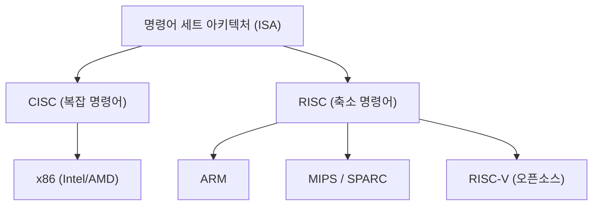
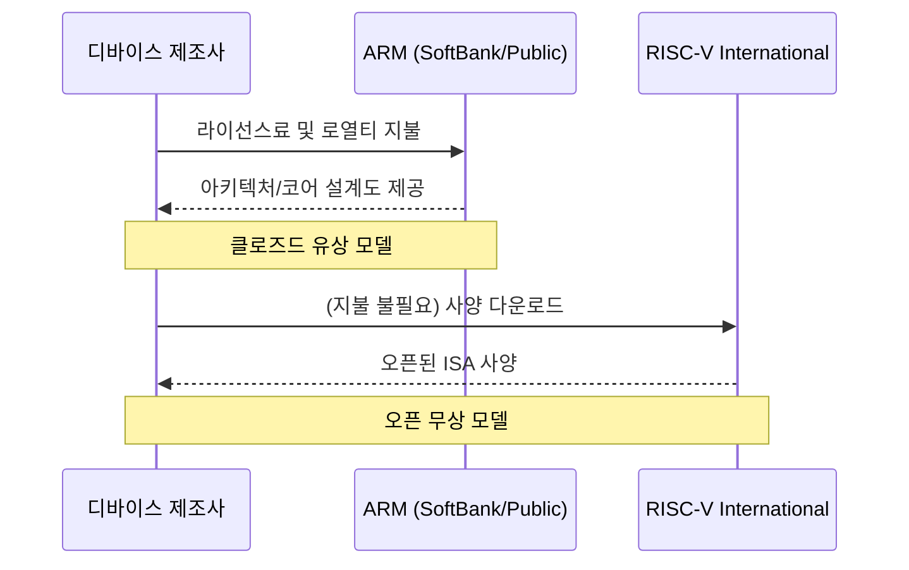

## 서장: 실리콘 패권을 둘러싼 끝없는 투쟁

반도체 산업의 역사는 그대로 '명령어 세트 아키텍처(ISA: Instruction Set Architecture)'를 둘러싼 패권 다툼의 역사이다. 1970년대 여명기부터 현재에 이르기까지, 프로세서가 어떻게 소프트웨어로부터의 명령을 해석하고 하드웨어 상에서 실행할 것인가 하는 이 근원적인 규칙은 기술 진화의 방향성을 결정지어 왔다.

과거, Intel과 AMD로 대표되는 x86 아키텍처는 개인용 컴퓨터와 서버 시장을 완전히 장악하며 'Wintel(Windows + Intel)'로 불리는 부동의 제국을 건설했다. 그러나 세상이 PC에서 모바일로 이동하면서 그 지배 체제는 서서히 흔들리기 시작한다. 거기서 대두된 것이 전력 효율을 극한까지 추구한 ARM 아키텍처이다.

ARM의 등장과 보급은 단순한 기술적인 세대교체가 아니라 비즈니스 모델 자체의 패러다임 전환이었다. 그리고 현재, 그 ARM의 아성을 위협하고 있는 것이 완전한 오픈소스로 탄생한 'RISC-V'이다. 본고에서는 Intel, AMD, Apple, NVIDIA 같은 거대 기술 기업들의 역사를 가로지르며, CISC에서 RISC로, 그리고 클로즈드에서 오픈으로 향하는 반도체 아키텍처의 장대한 서사시를 풀어본다.

## 제1장: x86의 탄생과 CISC의 전성기

### 1.1 Intel 4004에서 8086으로의 진화

1971년, Intel은 세계 최초의 마이크로프로세서 '4004'를 발표했다. 이것은 원래 일본의 비지콤(Busicom)사의 계산기용으로 개발된 것이었으나, 이후 반도체 산업의 폭발적인 성장의 원점이 되었다. 그 후 8008, 8080으로 진화를 거듭하여, 1978년에 역사적 걸작인 '8086'이 탄생한다. 이것이 오늘날까지 이어지는 'x86' 아키텍처 계보의 시작이다.

8086은 16비트 프로세서로, 이후 IBM PC에 채택됨으로써 사실상의 업계 표준(디팩토 스탠다드) 지위를 확립했다. 이 시대에는 메모리가 매우 비쌌고 스토리지 용량도 제한적이었다. 따라서 프로그램의 크기를 가능한 한 작게 유지해야 했으며, 하나의 명령으로 복잡한 처리를 실행할 수 있는 'CISC(Complex Instruction Set Computer)' 접근 방식이 합리적이었다.

### 1.2 Wintel 제국의 확립과 AMD의 도전

1980년대 후반부터 1990년대에 걸쳐, Microsoft의 Windows 운영체제와 Intel 프로세서의 조합은 'Wintel'로 불리며 PC 시장을 완전히 지배했다. Intel은 80286, 80386, i486, 그리고 Pentium 시리즈 등 노도와 같은 기세로 신제품을 투입하며 클럭 주파수 향상과 명령어 확장을 통해 성능을 비약적으로 높여갔다.

이러한 Intel의 패권에 과감하게 도전을 이어간 것이 AMD(Advanced Micro Devices)이다. 당초 Intel의 세컨드 소스(대체 제조사)로 출발했던 AMD였으나, 점차 독자 설계의 프로세서를 개발하여 Intel과 치열한 가격 경쟁 및 성능 경쟁(이른바 '메가헤르츠 경쟁')을 펼쳤다. 특히 1999년에 발표된 'Athlon' 프로세서는 일시적으로 Intel의 Pentium III를 성능 면에서 능가하며 AMD의 기술력을 세계에 과시하게 되었다.

그러나 Intel과 AMD의 싸움은 어디까지나 'x86'이라는 같은 씨름판(ISA) 위에서의 경쟁이었다. 그들은 CISC 아키텍처의 복잡한 명령어 세트를 유지하면서, 내부적으로는 명령을 단순한 마이크로 오퍼레이션으로 분해하여 실행하는 RISC적인 접근 방식을 도입함으로써 성능 향상을 도모하고 있었다.

## 제2장: RISC의 대두와 ARM의 비즈니스 모델

### 2.1 RISC 철학의 탄생

CISC 아키텍처가 갈수록 복잡해지는 가운데, 1980년대 초반에 전혀 새로운 접근 방식이 제창되었다. 그것이 'RISC(Reduced Instruction Set Computer)'이다. IBM의 존 코크(John Cocke)나 UC 버클리의 데이비드 패터슨(David Patterson) 등이 주도한 이 연구는 '자주 사용되는 단순한 명령만을 하드웨어로 구현하고, 복잡한 처리는 이들의 조합(소프트웨어)으로 실현한다'는 사상에 기초하고 있었다.

RISC는 명령어 디코딩을 간소화하고 파이프라인 처리를 효율화함으로써 전체적인 성능을 향상시키는 것을 목표로 했다. Sun Microsystems의 SPARC나 MIPS Technologies의 MIPS 아키텍처 등이 등장하여 주로 워크스테이션이나 서버 시장에서 일정한 성공을 거두었다.

### 2.2 Acorn Computers와 ARM의 탄생

RISC의 물결은 영국의 작은 컴퓨터 제조사 'Acorn Computers'에도 도달했다. 그들은 자사의 교육용 컴퓨터 'BBC Micro'의 후속 기종을 위해 독자적인 RISC 프로세서 개발에 착수했다. 제한된 예산과 인력 속에서 개발된 'ARM(Acorn RISC Machine, 훗날 Advanced RISC Machines)'은 놀라울 정도로 단순하며 소비 전력이 매우 적다는 특징을 가지고 있었다.

1990년, Acorn Computers, Apple, VLSI Technology 3사의 조인트 벤처로 'ARM Ltd.'가 설립되었다. Apple은 당시 획기적인 휴대 정보 단말기(PDA)인 'Newton'의 개발을 진행하고 있었고, 저전력 고성능 프로세서를 필요로 했던 것이다.

### 2.3 팹리스에서 IP 라이선스로의 전환

ARM의 진정한 혁신성은 그 아키텍처 자체보다는 비즈니스 모델에 있었다고 할 수 있다. 당시 많은 반도체 제조사들은 자사에서 칩을 설계하고 자사의 공장(팹)에서 제조하는 수직통합형(IDM) 모델을 채택하고 있었다. 그러나 ARM은 스스로 공장을 갖지 않았으며, 심지어 칩의 판매조차 하지 않았다.

그들은 '프로세서의 설계도(IP: Intellectual Property)'만을 작성하고, 그것을 다른 반도체 제조사에게 라이선스로 제공하는 전대미문의 비즈니스 모델을 채택한 것이다. 고객 기업(라이선시)은 ARM이 제공한 설계도를 바탕으로 자사의 제품에 최적화된 기능을 조합한 커스텀 칩(SoC: System on a Chip)을 개발·제조할 수 있었다.

이 IP 라이선스 모델은 급속히 확대되는 모바일 시장의 요구와 완벽하게 일치했다. 휴대전화 제조사는 제한된 배터리 용량 안에서 최대한의 성능을 끌어내야 했으며, ARM의 저전력 아키텍처는 이상적이었다. 텍사스 인스트루먼트(TI)나 퀄컴 같은 기업들이 차례로 ARM의 라이선스를 채택하였고, ARM은 휴대전화 시장에서의 '그림자 지배자'로 성장해 간다.

## 제3장: 모바일 혁명과 Apple Silicon의 충격

### 3.1 스마트폰의 폭발적 보급과 ARM의 패권

2007년, Apple이 'iPhone'을 발표하면서 세계는 결정적인 전환점을 맞이했다. 초기 iPhone에는 Samsung이 제조한 ARM 기반의 프로세서가 탑재되어 있었다. 이후 Google 주도의 Android OS가 등장하면서 스마트폰의 보급은 폭발적인 기세를 보였다.

이 모바일 혁명에서 최대의 승자가 된 것은 의심할 여지 없이 ARM이다. 스마트폰, 태블릿, 스마트워치 등 모든 모바일 기기의 두뇌로 ARM 아키텍처가 채택되었다. Intel도 모바일용으로 'Atom' 프로세서를 투입하며 x86의 모바일 진출을 시도했지만, ARM의 압도적인 전력 효율과 이미 형성되어 있던 견고한 생태계 앞에 패배하고 말았다.

### 3.2 Apple의 아키텍처 전환의 역사

여기서 Apple이라는 기업의 특이한 역사에 주목해 보자. Apple은 자사 주력 제품의 심장부인 프로세서의 아키텍처를 역사상 무려 세 번이나 완전히 전환시킨 희귀한 기업이다.

1. **68k에서 PowerPC로 (1994년)**: Motorola의 68000 시리즈에서 IBM/Motorola와의 공동 개발을 통한 PowerPC로의 전환.
2. **PowerPC에서 Intel x86으로 (2006년)**: PowerPC의 성능 향상(특히 노트북용의 소비 전력 문제)이 한계에 부딪히면서, 스티브 잡스는 Intel의 x86 아키텍처로의 전면 전환을 결단했다.
3. **Intel x86에서 Apple Silicon (ARM)으로 (2020년)**: 그리고 최대의 전환점이 'Apple Silicon'으로의 전환이다.

### 3.3 Apple Silicon(M1 칩)이 증명한 것

Apple은 오랜 기간 iPhone이나 iPad용 'A시리즈' 칩을 통해 ARM 기반의 커스텀 실리콘 설계 노하우를 축적해 왔다. 그 성능은 세대를 거듭할수록 향상되어, 마침내 PC용 Intel 프로세서를 위협하는 수준에 도달해 있었다.

2020년, Apple은 Mac용 독자 개발 칩 'M1'을 발표했다. 이것은 ARM 아키텍처를 기반으로 Apple이 독자적으로 고도의 커스터마이징을 가한 SoC이다. M1 칩은 당시의 하이엔드 x86 프로세서를 능가하는 퍼포먼스를 경이적인 저소비전력으로 실현했다.

Apple Silicon의 성공은 업계에 두 가지 결정적인 충격을 주었다. 첫째, 'ARM 아키텍처는 모바일용의 저성능인 것'이라는 오랜 편견을 완전히 부수고, 하이엔드 데스크톱 PC나 워크스테이션에서도 충분히 x86과 싸울 수(혹은 능가할 수) 있음을 증명했다. 둘째, 거대 기술 기업이 'IP를 라이선스 받아 자사에서 커스텀 실리콘을 설계하는 것'의 압도적인 우위성을 보여준 것이다.

## 제4장: NVIDIA의 야망과 AI 시대의 아키텍처

### 4.1 GPU에서 AI의 심장부로

ARM이 모바일 시장을 제패하는 한편에서, 또 하나의 중요한 아키텍처가 조용히 진화를 이룩하고 있었다. NVIDIA가 주도하는 GPU(Graphics Processing Unit)이다. 당초에는 3D 게임의 그래픽 렌더링 처리를 고속화하기 위한 전용 칩으로 탄생한 GPU였으나, 그 병렬 연산 능력의 우수성에 주목한 연구자들이 과학 기술 계산에 응용하기 시작했다(GPGPU).

2012년 'AlexNet'의 등장 이후, 딥러닝 기술이 돌파구를 마련하며 AI 붐이 일어났다. 방대한 행렬 연산을 필요로 하는 신경망(Neural Network) 학습에 있어서 NVIDIA의 GPU는 압도적인 퍼포먼스를 발휘하며 AI 개발의 사실상 표준 플랫폼이 되었다.

### 4.2 NVIDIA에 의한 ARM 인수 좌절

AI 영역에서 절대적인 지위를 구축한 NVIDIA의 젠슨 황(Jensen Huang) CEO는 더 큰 야망을 품었다. 2020년 9월, NVIDIA는 소프트뱅크 그룹으로부터 ARM을 최대 400억 달러에 인수한다고 발표한 것이다.

만약 이 인수가 성사되었다면 '세계 최강의 AI 플랫폼(NVIDIA)'과 '세계에서 가장 널리 보급된 프로세서 생태계(ARM)'가 통합되어 반도체 업계의 세력 구도는 완전히 다시 쓰여졌을 것이다. NVIDIA는 자사의 GPU 기술과 ARM의 CPU 기술을 융합한 차세대 AI 데이터센터용 프로세서 개발을 노리고 있었다.

그러나 이 메가 딜은 전 세계의 반도체 기업들과 규제 당국의 맹렬한 반대에 부딪혔다. ARM의 비즈니스 모델의 근간은 '중립성(스위스와 같은 존재)'이며, NVIDIA라는 특정 기업이 ARM을 지배하는 것은 경쟁 기업들(Qualcomm, Google, Microsoft 등)에게 용납될 수 없는 일이었기 때문이다. 결국 각국의 독점금지법 당국의 승인을 얻지 못하고, 2022년 2월에 인수 계획은 백지 철회되었다.

이 사건은 ARM이 현대의 기술 업계에서 얼마나 중요한 '공공재'와 같은 존재가 되었는지를 보여줌과 동시에, 특정 기업에 의한 기술 독점에 대한 강한 경계심을 부각시켰다.

## 제5장: 제3의 극 'RISC-V'의 탄생과 혁명

### 5.1 RISC-V란 무엇인가?

NVIDIA의 ARM 인수 소동이 업계에 파문을 일으키는 가운데, 급격하게 주목을 받기 시작한 것이 'RISC-V(리스크 파이브)'이다. RISC-V는 2010년 캘리포니아 대학교 버클리(UC Berkeley)의 연구팀에 의해 개발이 시작된 오픈소스 명령어 세트 아키텍처(ISA)이다.

RISC-V의 가장 큰 특징은 Linux나 Android 같은 오픈소스 소프트웨어와 마찬가지로, 그 사양(ISA)이 무상으로 공개되어 있어 누구나 자유롭게 사용, 변경, 구현할 수 있다는 점에 있다. 기존의 x86이나 ARM이 특정 기업(Intel이나 ARM사)에 의해 권리가 독점되어 고액의 라이선스료나 엄격한 이용 조건이 부과되었던(클로즈드 ISA) 반면, RISC-V는 완전히 오픈되어 있다(오픈 ISA).

### 5.2 RISC-V가 가져오는 패러다임 전환

RISC-V의 등장은 반도체 업계에 지각 변동을 가져오고 있다. 그 이유는 다음과 같다.

1. **라이선스 프리와 비용 절감**: 중소기업이나 스타트업, 대학 연구 기관에게 수백만 달러에 달하는 ARM의 아키텍처 라이선스료는 큰 장벽이었다. RISC-V를 사용하면 이 초기 비용을 획기적으로 절감할 수 있어 독자적인 프로세서 개발의 문턱이 크게 낮아진다.
2. **궁극의 커스터마이즈성**: RISC-V는 모듈식 설계를 채택하고 있어 기본이 되는 단순한 명령어 세트에 더해 용도에 따라 확장 기능(벡터 연산, 암호화 등)을 자유롭게 추가하거나 삭제할 수 있다. IoT 기기용 초소형 칩부터 AI 가속기, 데이터센터용 고성능 서버까지, 모든 용도에 최적화된 커스텀 칩을 독자적으로 설계할 수 있다.
3. **벤더 종속(Vendor Lock-in)으로부터의 해방**: ARM 아키텍처에 지나치게 의존하는 것의 리스크(라이선스료 인상이나 NVIDIA의 인수 소동과 같은 지정학적 리스크)를 회피하기 위해 많은 기업들이 RISC-V를 유력한 대안(얼터너티브)으로 검토하기 시작했다.

### 5.3 거대 테크 기업의 참여와 생태계의 확대

처음에는 학술 연구나 소규모 임베디드 기기용으로 여겨졌던 RISC-V였으나, 현재는 거대 기술 기업들이 앞다투어 투자를 진행하고 있다.

Google은 자사의 AI 프로세서(TPU)의 제어용 마이크로컨트롤러로 RISC-V를 채택했고, 나아가 Android OS의 RISC-V에 대한 공식 지원을 추진하고 있다. Western Digital이나 Seagate 같은 스토리지 대기업은 자사의 HDD/SSD 컨트롤러를 RISC-V 기반으로 교체했다. Qualcomm은 ARM과의 라이선스 소송을 배경으로 RISC-V 기반의 웨어러블용 칩을 개발하고 있다.

또한 SiFive, Andes Technology, Tenstorrent(천재 아키텍트인 짐 켈러가 이끄는)와 같은 RISC-V 전문 스타트업이 차례로 대두하며, 고성능 RISC-V 코어 설계와 AI 가속기 개발을 견인하고 있다.

## 제6장: 지정학적 리스크와 RISC-V의 전략적 의의

### 6.1 미중 마찰과 반도체 기술의 블록화

RISC-V가 급속히 보급되는 배경에는 기술적인 우위성뿐만 아니라 국제 정치의 역학이 크게 영향을 미치고 있다. 특히 격화되는 미중 대립은 반도체 공급망의 분단(디커플링)을 초래하고 있다.

미국 정부는 안보상의 이유로 Huawei를 비롯한 중국 기술 기업들에 대한 반도체 기술 수출 규제를 강화했다. 이로 인해 중국 기업들은 Intel의 x86 프로세서나 최신 ARM 아키텍처에 대한 접근이 제한될 리스크에 직면했다. (ARM은 영국 기업이지만, 미국의 기술이 많이 포함되어 있어 규제 대상이 된다).

### 6.2 중국의 '기술적 독립'과 RISC-V

이러한 위기 상황 속에서, 특정 국가의 법률이나 기업의 의향에 좌우되지 않는 오픈소스인 'RISC-V'는 중국에게 그야말로 가뭄에 단비였다. 중국 정부와 기업들은 기술의 자급자족(기술적 독립)을 달성하기 위한 국가 전략의 핵심으로 RISC-V에 막대한 투자를 하고 있다.

Alibaba 그룹의 반도체 부문인 T-Head(핑터우거, 平头哥)는 고성능 RISC-V 프로세서 'Xuantie' 시리즈를 개발하고 그 설계를 오픈소스화했다. 중국 국내에서는 IoT 기기부터 데이터센터용 서버, 심지어 AI 칩에 이르기까지 RISC-V 기반의 반도체 개발이 폭발적인 기세로 진행되고 있다.

### 6.3 구미의 딜레마와 규제 논의

한편 구미 국가들은 딜레마에 직면해 있다. 오픈소스 기술의 발전은 혁신을 촉진한다며 환영하는 목소리가 있는 반면, RISC-V를 통해 중국의 반도체 역량이 향상되어 군사 기술의 현대화로 이어질 것을 우려하는 목소리가 높아지고 있다.

미국 정치인들 중에는 RISC-V를 포함한 오픈소스 기술에 대한 수출 규제망을 넓혀야 한다는 주장도 나오기 시작했다. 그러나 오픈소스 '사양(텍스트)'의 공개를 제한하는 것은 언론의 자유나 국제적인 공동 연구의 기반을 파괴하는 일이 될 수 있어, 실효성 있는 규제 수단을 찾는 것은 극히 어렵다. RISC-V International(규격 표준화 단체)은 지정학적 리스크를 회피하기 위해 이미 본부를 미국에서 영세 중립국인 스위스로 이전했다.

## 종장: 차세대 컴퓨팅의 행방

반도체의 명령어 세트를 둘러싼 싸움은 단순한 기술 논쟁을 넘어, 기업 전략과 국가 안보마저도 끌어들이는 장대한 드라마가 되었다.

Intel과 AMD가 구축한 x86의 CISC 제국은 클라우드 서버나 PC 시장에서 여전히 견고한 기반을 가지고 있다. 그러나 Apple Silicon의 성공이 보여주듯 고성능 영역에서도 ARM의 위협은 날로 커지고 있다. 게다가 AI 붐을 배경으로 NVIDIA의 GPU를 중심으로 한 새로운 컴퓨팅 패러다임이 형성되고 있다.

그리고 그 밑바탕에서는 오픈소스인 RISC-V가 모든 기기의 토대를 조용히, 그러나 확실하게 잠식하기 시작했다. 과거 Linux가 서버 OS 시장에서 독자적인 지위를 구축하고 인터넷의 기반 기술이 되었듯, RISC-V는 '하드웨어의 Linux'로서 차세대 반도체 생태계의 공통 언어가 될 잠재력을 품고 있다.

x86, ARM, 그리고 RISC-V. 이 3개의 아키텍처는 앞으로도 서로 영향을 주고받으며 우리 사회를 지탱하는 디지털 인프라의 진화를 견인해 나갈 것이다. 실리콘 패권을 둘러싼 투쟁에 끝은 없다.
