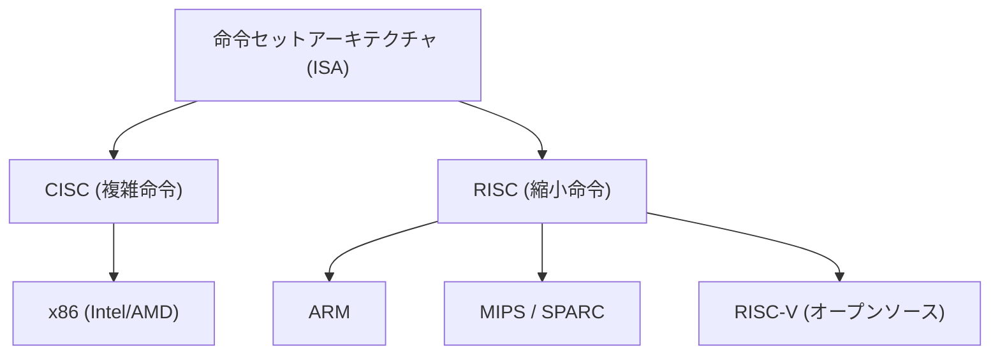
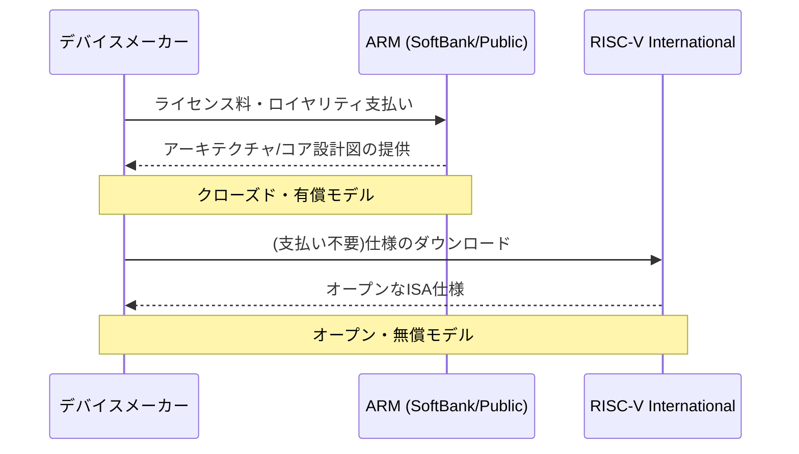

## 序章：シリコンの覇権をめぐる終わりのない闘争

半導体産業の歴史は、そのまま「命令セットアーキテクチャ（ISA: Instruction Set Architecture）」をめぐる覇権争いの歴史である。1970年代の黎明期から現在に至るまで、プロセッサがどのようにソフトウェアからの命令を解釈し、ハードウェア上で実行するかというこの根源的なルールは、テクノロジーの進化の方向性を決定づけてきた。

かつて、IntelとAMDに代表されるx86アーキテクチャは、パーソナルコンピュータとサーバー市場を完全に掌握し、「Wintel（Windows + Intel）」と呼ばれる不動の帝国を築き上げた。しかし、世界がPCからモバイルへとシフトする中で、その支配体制は徐々に揺らぎ始めることになる。そこで台頭したのが、電力効率を極限まで追求したARMアーキテクチャである。

ARMの登場と普及は、単なる技術的な世代交代ではなく、ビジネスモデルそのもののパラダイムシフトであった。そして現在、そのARMの牙城を脅かそうとしているのが、完全なオープンソースとして誕生した「RISC-V」である。本稿では、Intel、AMD、Apple、NVIDIAといった巨大テクノロジー企業の歴史を横断しながら、CISCからRISC、そしてクローズドからオープンへと向かう半導体アーキテクチャの壮大な叙事詩を紐解いていく。

## 第1章：x86の誕生とCISCの全盛期

### 1.1 Intel 4004から8086への進化

1971年、Intelは世界初のマイクロプロセッサ「4004」を発表した。これはもともと日本のビジコン社の計算機向けに開発されたものであったが、その後の半導体産業の爆発的な成長の原点となった。その後、8008、8080と進化を続け、1978年に歴史的傑作である「8086」が誕生する。これが、今日まで続く「x86」アーキテクチャの系譜の始まりである。

8086は16ビットプロセッサであり、その後のIBM PCに採用されたことで、事実上の業界標準（デファクトスタンダード）の地位を確立した。この時代、メモリは非常に高価であり、ストレージの容量も限られていた。そのため、プログラムのサイズを可能な限り小さく抑える必要があり、一つの命令で複雑な処理を実行できる「CISC（Complex Instruction Set Computer）」アプローチが合理的であった。

### 1.2 Wintel帝国の確立とAMDの挑戦

1980年代後半から1990年代にかけて、MicrosoftのWindowsオペレーティングシステムとIntelのプロセッサの組み合わせは「Wintel」と呼ばれ、PC市場を完全に支配した。Intelは、80286、80386、i486、そしてPentiumシリーズと、怒涛の勢いで新製品を投入し、クロック周波数の向上と命令の拡張によって性能を飛躍的に高めていった。

このIntelの覇権に対して、果敢に挑戦を続けたのがAMD（Advanced Micro Devices）である。当初はIntelのセカンドソース（代替製造メーカー）としてスタートしたAMDであったが、次第に独自設計のプロセッサを開発し、Intelとの激しい価格競争と性能競争（いわゆる「メガヘルツ競争」）を繰り広げた。特に1999年に発表された「Athlon」プロセッサは、一時的にIntelのPentium IIIを性能面で凌駕し、AMDの技術力を世界に見せつけることとなった。

しかし、IntelとAMDの戦いは、あくまで「x86」という同じ土俵（ISA）の上での競争であった。彼らはCISCアーキテクチャの複雑な命令セットを維持しながら、内部的には命令を単純なマイクロオペレーションに分解して実行するという、RISC的なアプローチを取り入れることで性能向上を図っていた。

## 第2章：RISCの台頭とARMのビジネスモデル

### 2.1 RISC哲学の誕生

CISCアーキテクチャが複雑化の一途を辿る中、1980年代初頭に全く新しいアプローチが提唱された。それが「RISC（Reduced Instruction Set Computer）」である。IBMのジョン・コックや、UCバークレー校のデビッド・パターソンらが主導したこの研究は、「よく使われる単純な命令のみをハードウェアで実装し、複雑な処理はそれらの組み合わせ（ソフトウェア）で実現する」という思想に基づいていた。

RISCは、命令のデコードを簡素化し、パイプライン処理を効率化することで、全体的なパフォーマンスを向上させることを目指した。Sun MicrosystemsのSPARCや、MIPS TechnologiesのMIPSアーキテクチャなどが登場し、主にワークステーションやサーバー市場で一定の成功を収めた。

### 2.2 Acorn ComputersとARMの誕生

RISCの波は、イギリスの小さなコンピュータメーカー「Acorn Computers」にも到達した。彼らは自社の教育用コンピュータ「BBC Micro」の後継機のために、独自のRISCプロセッサの開発に着手した。限られた予算と人員の中で開発された「ARM（Acorn RISC Machine、後にAdvanced RISC Machines）」は、驚くほどシンプルで、かつ消費電力が非常に少ないという特徴を持っていた。

1990年、Acorn Computers、Apple、VLSI Technologyの3社によるジョイントベンチャーとして「ARM Ltd.」が設立された。Appleは当時、画期的な携帯情報端末（PDA）である「Newton」の開発を進めており、低消費電力で高性能なプロセッサを求めていたのである。

### 2.3 ファブレスからIPライセンスへの転換

ARMの真の革新性は、そのアーキテクチャ自体よりも、ビジネスモデルにあったと言える。当時、多くの半導体メーカーは自社でチップを設計し、自社の工場（ファブ）で製造する垂直統合型（IDM）モデルを採用していた。しかし、ARMは自ら工場を持たず、さらにチップの販売すら行わなかった。

彼らは「プロセッサの設計図（IP：Intellectual Property）」のみを作成し、それを他の半導体メーカーにライセンス供与するという、前代未聞のビジネスモデルを採用したのである。顧客企業（ライセンシー）は、ARMから提供された設計図をもとに、自社の製品に最適な機能を組み合わせたカスタムチップ（SoC：System on a Chip）を開発・製造することができた。

このIPライセンスモデルは、急速に拡大するモバイル市場の要求に完璧にマッチしていた。携帯電話メーカーは、限られたバッテリー容量の中で最大限のパフォーマンスを引き出す必要があり、ARMの低消費電力アーキテクチャは理想的であった。テキサス・インスツルメンツ（TI）やクアルコムといった企業が次々とARMのライセンスを採用し、ARMは携帯電話市場における「影の支配者」へと成長していく。

## 第3章：モバイル革命とApple Siliconの衝撃

### 3.1 スマートフォンの爆発的普及とARMの覇権

2007年、Appleが「iPhone」を発表したことで、世界は決定的な転換点を迎えた。初期のiPhoneには、Samsungが製造したARMベースのプロセッサが搭載されていた。その後、Google主導のAndroid OSが登場し、スマートフォンの普及は爆発的な勢いを見せた。

このモバイル革命において、最大の勝者となったのは間違いなくARMである。スマートフォン、タブレット、スマートウォッチといったあらゆるモバイルデバイスの頭脳として、ARMアーキテクチャが採用された。Intelもモバイル向けに「Atom」プロセッサを投入し、x86のモバイル進出を試みたが、ARMの圧倒的な電力効率と、すでに形成されていた強固なエコシステムの前に敗れ去ることとなった。

### 3.2 Appleのアーキテクチャ移行の歴史

ここで、Appleという企業の特異な歴史に注目したい。Appleは、自社の主力製品の心臓部であるプロセッサのアーキテクチャを、歴史上3度も完全に移行させている稀有な企業である。

1. **68kからPowerPCへ (1994年)**: Motorolaの68000シリーズから、IBM/Motorolaとの共同開発によるPowerPCへの移行。
2. **PowerPCからIntel x86へ (2006年)**: PowerPCの性能向上（特にノートPC向けの消費電力問題）が行き詰まり、スティーブ・ジョブズはIntelのx86アーキテクチャへの全面移行を決断した。
3. **Intel x86からApple Silicon (ARM) へ (2020年)**: そして、最大の転換点が「Apple Silicon」への移行である。

### 3.3 Apple Silicon（M1チップ）が証明したこと

Appleは長年、iPhoneやiPad向けの「Aシリーズ」チップを通じて、ARMベースのカスタムシリコンの設計ノウハウを蓄積してきた。その性能は世代を重ねるごとに向上し、ついにPC向けのIntelプロセッサを脅かすレベルに達していた。

2020年、AppleはMac向けの独自開発チップ「M1」を発表した。これはARMアーキテクチャをベースに、Appleが独自に高度なカスタマイズを施したSoCである。M1チップは、当時のハイエンドx86プロセッサを凌駕するパフォーマンスを、驚異的な低消費電力で実現した。

Apple Siliconの成功は、業界に2つの決定的な衝撃を与えた。第一に、「ARMアーキテクチャはモバイル向けの低性能なもの」という長年の偏見を完全に打ち砕き、ハイエンドのデスクトップPCやワークステーションでも十分にx86と戦える（あるいは凌駕する）ことを証明した。第二に、巨大テクノロジー企業が「IPをライセンスし、自社でカスタムシリコンを設計する」ことの圧倒的な優位性を見せつけたのである。

## 第4章：NVIDIAの野望とAI時代のアーキテクチャ

### 4.1 GPUからAIの心臓部へ

ARMがモバイル市場を制覇する傍らで、もう一つの重要なアーキテクチャが静かに進化を遂げていた。NVIDIAが主導するGPU（Graphics Processing Unit）である。当初は3Dゲームのグラフィックス描画処理を高速化するための専用チップとして誕生したGPUであったが、その並列計算能力の高さに目をつけた研究者たちが、科学技術計算に応用し始めた（GPGPU）。

2012年の「AlexNet」の登場以降、ディープラーニング技術がブレイクスルーを果たし、AIブームが巻き起こった。膨大な行列演算を必要とするニューラルネットワークの学習において、NVIDIAのGPUは圧倒的なパフォーマンスを発揮し、AI開発における事実上の標準プラットフォームとなった。

### 4.2 NVIDIAによるARM買収の挫折

AI領域で絶対的な地位を築いたNVIDIAのジェンスン・フアンCEOは、さらなる野望を抱いた。2020年9月、NVIDIAはソフトバンクグループからARMを最大400億ドルで買収すると発表したのである。

もしこの買収が成立していれば、「世界最強のAIプラットフォーム（NVIDIA）」と「世界で最も普及しているプロセッサエコシステム（ARM）」が統合され、半導体業界の勢力図は完全に塗り替えられていたはずである。NVIDIAは、自社のGPU技術とARMのCPU技術を融合させた、次世代のAIデータセンター向けプロセッサの開発を目論んでいた。

しかし、このメガディールは世界中の半導体企業や規制当局からの猛烈な反対に遭った。ARMのビジネスモデルの根幹は「中立性（スイスのような存在）」であり、NVIDIAという特定の企業がARMを支配することは、ライバル企業（Qualcomm、Google、Microsoftなど）にとって容認できるものではなかったからだ。最終的に、各国の独占禁止法当局の承認を得ることができず、2022年2月に買収計画は白紙撤回された。

この事件は、ARMが現代のテクノロジー業界においていかに重要な「公共財」のような存在となっているかを示すと同時に、特定企業による技術独占に対する強い警戒感を浮き彫りにした。

## 第5章：第三の極「RISC-V」の誕生と革命

### 5.1 RISC-Vとは何か？

NVIDIAによるARM買収騒動が業界に波紋を広げる中、急激に注目を集め始めたのが「RISC-V（リスクファイブ）」である。RISC-Vは、2010年にカリフォルニア大学バークレー校（UC Berkeley）の研究チームによって開発が開始されたオープンソースの命令セットアーキテクチャ（ISA）である。

RISC-Vの最大の特徴は、LinuxやAndroidのようなオープンソースソフトウェアと同様に、その仕様（ISA）が無償で公開されており、誰でも自由に使用、変更、実装できる点にある。従来のx86やARMが、特定企業（IntelやARM社）によって権利が独占され、高額なライセンス料や厳しい利用条件が課せられていた（クローズドISA）のに対し、RISC-Vは完全にオープンである（オープンISA）。

### 5.2 RISC-Vがもたらすパラダイムシフト

RISC-Vの登場は、半導体業界に地殻変動をもたらしつつある。その理由は以下の通りである。

1. **ライセンスフリーとコスト削減**: 中小企業やスタートアップ、大学の研究機関にとって、数百万ドルに上るARMのアーキテクチャライセンス料は大きな障壁であった。RISC-Vを使用すれば、この初期コストを劇的に削減でき、独自のプロセッサ開発へのハードルが大きく下がる。
2. **究極のカスタマイズ性**: RISC-Vはモジュール式の設計を採用しており、基本となるシンプルな命令セットに加え、用途に応じて拡張機能（ベクトル演算、暗号化など）を自由に追加・削除できる。IoTデバイス向けの超小型チップから、AIアクセラレータ、データセンター向け高性能サーバーまで、あらゆる用途に最適化されたカスタムチップを独自に設計可能である。
3. **ベンダーロックインからの解放**: ARMアーキテクチャに依存しすぎることのリスク（ライセンス料の値上げや、NVIDIAによる買収騒動のような地政学的リスク）を回避するため、多くの企業がRISC-Vを有力なオルタナティブ（代替手段）として検討し始めている。

### 5.3 巨大テック企業の参入とエコシステムの拡大

当初は学術研究や小規模な組み込み機器向けと見なされていたRISC-Vであったが、現在では巨大テクノロジー企業がこぞって投資を行っている。

Googleは、自社のAIプロセッサ（TPU）の制御用マイコンとしてRISC-Vを採用し、さらにAndroid OSのRISC-Vへの公式対応を進めている。Western DigitalやSeagateといったストレージ大企業は、自社のHDD/SSDコントローラをRISC-Vベースに置き換えた。Qualcommは、ARMとのライセンス訴訟を背景に、RISC-Vベースのウェアラブル向けチップを開発している。

さらに、SiFive、Andes Technology、Tenstorrent（天才アーキテクトのジム・ケラー氏が率いる）といったRISC-V専門のスタートアップが次々と台頭し、高性能なRISC-Vコアの設計やAIアクセラレータの開発を牽引している。

## 第6章：地政学的リスクとRISC-Vの戦略的意義

### 6.1 米中摩擦と半導体技術のブロック化

RISC-Vの急速な普及の背景には、技術的な優位性だけでなく、国際政治のダイナミクスが大きく影響している。特に、激化する米中対立は、半導体サプライチェーンの分断（デカップリング）を引き起こしている。

米国政府は安全保障上の理由から、Huaweiなどの中国のテクノロジー企業に対する半導体技術の輸出規制を強化した。これにより、中国企業はIntelのx86プロセッサや、最新のARMアーキテクチャへのアクセスが制限されるリスクに直面した。（ARMはイギリス企業だが、米国の技術が多く含まれているため規制の対象となる）。

### 6.2 中国の「技術的独立」とRISC-V

この危機的状況下において、特定の国の法律や企業の意向に左右されないオープンソースの「RISC-V」は、中国にとってまさに干天の慈雨であった。中国政府や企業は、テクノロジーの自給自足（技術的独立）を達成するための国家戦略の中核として、RISC-Vに莫大な投資を行っている。

Alibabaグループの半導体部門であるT-Head（平頭哥）は、高性能なRISC-Vプロセッサ「Xuantie」シリーズを開発し、その設計をオープンソース化した。中国国内では、IoTデバイスからデータセンター向けサーバー、さらにはAIチップに至るまで、RISC-Vベースの半導体開発が爆発的な勢いで進んでいる。

### 6.3 欧米のジレンマと規制の議論

一方の欧米諸国では、ジレンマに直面している。オープンソース技術の発展はイノベーションを促進するとして歓迎する声がある一方で、RISC-Vを通じて中国の半導体能力が向上し、軍事技術の近代化に繋がることを懸念する声が高まっている。

米国の政治家の中には、RISC-Vを含むオープンソース技術に対する輸出規制の網を広げるべきだという主張も出始めている。しかし、オープンソースの「仕様（テキスト）」の公開を制限することは、言論の自由や国際的な共同研究の基盤を破壊することになりかねず、実効性のある規制手段を見出すのは極めて困難である。RISC-V International（規格の標準化団体）は、地政学的なリスクを回避するため、すでに本部を米国から永世中立国であるスイスに移転している。

## 終章：次世代コンピューティングのゆくえ

半導体の命令セットをめぐる戦いは、単なる技術論争を超え、企業戦略、そして国家の安全保障をも巻き込む壮大なドラマとなった。

IntelとAMDが築き上げたx86のCISC帝国は、クラウドサーバーやPC市場において依然として強固な基盤を持っている。しかし、Apple Siliconの成功が示すように、高性能領域においてもARMの脅威は日に日に増している。さらに、AIブームを背景に、NVIDIAのGPUを中心とした新しいコンピューティングパラダイムが形成されつつある。

そして、その下層では、オープンソースのRISC-Vが、あらゆるデバイスの土台を静かに、しかし確実に侵食し始めている。かつて、LinuxがサーバーOS市場で独自の地位を築き、インターネットの基盤技術となったように、RISC-Vは「ハードウェアのLinux」として、次世代の半導体エコシステムの共通言語となる可能性を秘めている。

x86、ARM、そしてRISC-V。これら3つのアーキテクチャは、今後も互いに影響を与え合いながら、私たちの社会を支えるデジタルインフラの進化を牽引していくことだろう。シリコンの覇権をめぐる闘争に、終わりはない。
