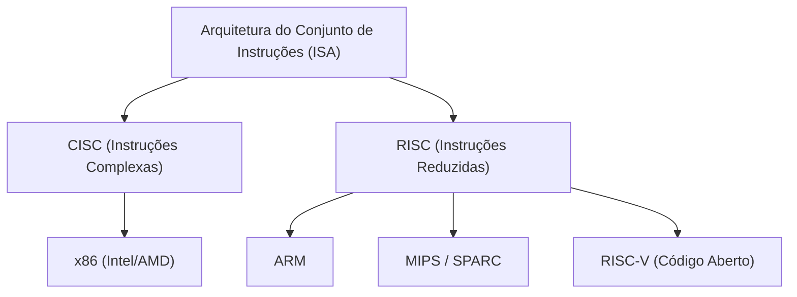
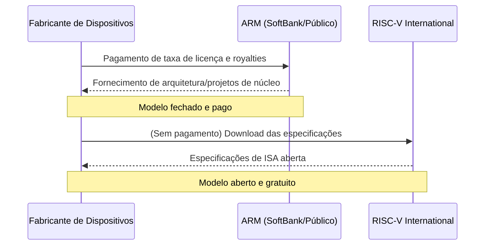

## Introdução: A luta interminável pela hegemonia do silício

A história da indústria de semicondutores é, em si, a história da disputa pela hegemonia em torno da "Arquitetura do Conjunto de Instruções" (ISA: Instruction Set Architecture). Desde os seus primórdios na década de 1970 até o presente, essa regra fundamental de como os processadores interpretam as instruções de software e as executam no hardware determinou a direção da evolução tecnológica.

No passado, a arquitetura x86, representada pela Intel e AMD, dominava completamente o mercado de computadores pessoais e servidores, construindo um império inabalável conhecido como "Wintel" (Windows + Intel). No entanto, à medida que o mundo mudava dos PCs para os dispositivos móveis, esse sistema de dominação começou a vacilar gradualmente. Foi aí que surgiu a arquitetura ARM, que buscava a máxima eficiência energética.

O surgimento e a disseminação do ARM não foram apenas uma mudança de geração tecnológica, mas uma mudança de paradigma no próprio modelo de negócios. E agora, o que ameaça a fortaleza do ARM é o "RISC-V", que nasceu como um projeto de código aberto completo. Neste artigo, enquanto atravessamos a história de empresas gigantes de tecnologia como Intel, AMD, Apple e NVIDIA, desvendaremos a épica saga das arquiteturas de semicondutores, que vai de CISC para RISC, e de sistemas fechados para abertos.

## Capítulo 1: O nascimento do x86 e a era de ouro do CISC

### 1.1 A evolução do Intel 4004 ao 8086

Em 1971, a Intel anunciou o "4004", o primeiro microprocessador do mundo. Originalmente desenvolvido para as calculadoras da empresa japonesa Busicom, tornou-se o ponto de partida para o crescimento explosivo subsequente da indústria de semicondutores. Após evoluir para 8008 e 8080, em 1978 nasceu a obra-prima histórica, o "8086". Este é o início da linhagem da arquitetura "x86" que continua até hoje.

O 8086 era um processador de 16 bits que, ao ser adotado pelos IBM PCs subsequentes, estabeleceu-se como o padrão de fato da indústria. Nessa época, a memória era muito cara e a capacidade de armazenamento era limitada. Portanto, era necessário manter o tamanho dos programas o menor possível, e a abordagem "CISC (Complex Instruction Set Computer)", capaz de executar processos complexos com uma única instrução, era lógica.

### 1.2 O estabelecimento do império Wintel e o desafio da AMD

Do final da década de 1980 até a década de 1990, a combinação do sistema operacional Windows da Microsoft com os processadores da Intel foi chamada de "Wintel" e dominou completamente o mercado de PCs. A Intel lançou sucessivamente novos produtos de forma implacável: as séries 80286, 80386, i486 e Pentium, melhorando dramaticamente o desempenho ao aumentar a frequência de clock e expandir as instruções.

A AMD (Advanced Micro Devices) desafiou corajosamente essa hegemonia da Intel. Inicialmente, a AMD começou como uma segunda fonte (fabricante alternativo) para a Intel, mas gradualmente desenvolveu processadores com designs originais, engajando-se em intensas guerras de preços e competições de desempenho com a Intel (a chamada "Guerra dos Megahertz"). Em particular, o processador "Athlon", anunciado em 1999, superou temporariamente o Pentium III da Intel em desempenho, mostrando a força tecnológica da AMD para o mundo.

No entanto, a batalha entre a Intel e a AMD era uma competição dentro da mesma arena (ISA), o "x86". Eles buscaram melhorias de desempenho mantendo o conjunto complexo de instruções da arquitetura CISC e adotando uma abordagem no estilo RISC, internamente decompondo instruções em micro-operações mais simples para execução.

## Capítulo 2: A ascensão do RISC e o modelo de negócios da ARM

### 2.1 O nascimento da filosofia RISC

Enquanto a arquitetura CISC continuava a se tornar mais complexa, uma abordagem completamente nova foi proposta no início da década de 1980. Esse era o "RISC (Reduced Instruction Set Computer)". Esta pesquisa, liderada por John Cocke da IBM e David Patterson da UC Berkeley, foi baseada na ideia de que "apenas as instruções simples usadas com frequência seriam implementadas em hardware, e os processos complexos seriam realizados combinando-as (via software)".

O RISC visava melhorar o desempenho geral simplificando a decodificação de instruções e tornando o processamento de pipeline mais eficiente. A arquitetura SPARC da Sun Microsystems e a arquitetura MIPS da MIPS Technologies surgiram, alcançando um certo nível de sucesso principalmente no mercado de estações de trabalho e servidores.

### 2.2 Acorn Computers e o nascimento da ARM

A onda do RISC também alcançou uma pequena fabricante de computadores britânica, a "Acorn Computers". Eles começaram a desenvolver seu próprio processador RISC para o sucessor do seu computador educacional "BBC Micro". O "ARM" (Acorn RISC Machine, mais tarde Advanced RISC Machines), desenvolvido com orçamento e pessoal limitados, era caracterizado por ser incrivelmente simples e ter um consumo de energia muito baixo.

Em 1990, a "ARM Ltd." foi estabelecida como uma joint venture entre Acorn Computers, Apple e VLSI Technology. Na época, a Apple estava desenvolvendo o "Newton", um assistente digital pessoal (PDA) revolucionário, e procurava por um processador de baixo consumo e alto desempenho.

### 2.3 A transição de Fabless para licenciamento de IP

A verdadeira inovação da ARM pode ser dita estar no seu modelo de negócios, e não na arquitetura em si. Na época, a maioria dos fabricantes de semicondutores adotou o modelo de Dispositivo Integrado (IDM), projetando os chips internamente e fabricando-os nas suas próprias fábricas (fabs). No entanto, a ARM não tinha fábricas próprias e sequer vendia chips.

Eles adotaram um modelo de negócios inédito: criavam apenas os "projetos dos processadores (IP: Propriedade Intelectual)" e licenciavam isso para outros fabricantes de semicondutores. As empresas clientes (licenciadas) podiam desenvolver e fabricar chips personalizados (SoC: System on a Chip) que combinavam funções ideais para os seus produtos com base no projeto fornecido pela ARM.

Esse modelo de licenciamento de IP se alinhava perfeitamente com os requisitos do mercado móvel em rápida expansão. Os fabricantes de telefones móveis precisavam extrair o máximo de desempenho de uma bateria com capacidade limitada, e a arquitetura de baixo consumo de energia da ARM era ideal. Empresas como Texas Instruments (TI) e Qualcomm adotaram sucessivamente a licença ARM, e a ARM cresceu para se tornar a "governante das sombras" do mercado de telefones móveis.

## Capítulo 3: A revolução móvel e o impacto do Apple Silicon

### 3.1 A rápida adoção de smartphones e a hegemonia da ARM

Em 2007, quando a Apple anunciou o "iPhone", o mundo atingiu um ponto de virada decisivo. O iPhone inicial era equipado com um processador baseado em ARM fabricado pela Samsung. Depois, o sistema operacional Android, liderado pelo Google, foi introduzido, e os smartphones começaram a se espalhar com força explosiva.

Nessa revolução móvel, o maior vencedor foi sem dúvida a ARM. A arquitetura ARM foi adotada como o cérebro de quase todos os dispositivos móveis, incluindo smartphones, tablets e smartwatches. A Intel também tentou entrar no mercado móvel com o processador x86 "Atom", mas foi derrotada diante da eficiência energética esmagadora da ARM e do seu ecossistema robusto já consolidado.

### 3.2 A história das transições de arquitetura da Apple

Aqui, vale a pena focar na história singular da Apple como empresa. A Apple é uma corporação rara que mudou completamente a arquitetura do processador, o coração dos seus principais produtos, três vezes ao longo da sua história.

1. **Do 68k para o PowerPC (1994)**: A transição da série 68000 da Motorola para o PowerPC co-desenvolvido com a IBM/Motorola.
2. **Do PowerPC para o Intel x86 (2006)**: As melhorias de desempenho do PowerPC atingiram um impasse (especialmente o problema de consumo de energia para laptops), e Steve Jobs decidiu migrar totalmente para a arquitetura x86 da Intel.
3. **Do Intel x86 para o Apple Silicon (ARM) (2020)**: E o maior ponto de virada foi a transição para o "Apple Silicon".

### 3.3 O que o Apple Silicon (Chip M1) provou

Por muitos anos, a Apple acumulou conhecimento em design de silício personalizado baseado em ARM através da sua série de chips "A" para o iPhone e iPad. Seu desempenho melhorou com as gerações, chegando finalmente a um nível que ameaçava os processadores Intel para PCs.

Em 2020, a Apple anunciou o "M1", o seu próprio chip desenvolvido para Macs. Este é um SoC baseado na arquitetura ARM, com alta personalização feita independentemente pela Apple. O chip M1 alcançou um desempenho que superava os processadores x86 de alto desempenho da época, com consumo de energia surpreendentemente baixo.

O sucesso do Apple Silicon deu dois impactos decisivos na indústria. Primeiro, destruiu completamente o preconceito de longa data de que "a arquitetura ARM tem um desempenho baixo focado em dispositivos móveis", provando que ela pode competir (ou superar) amplamente o x86, mesmo em desktops e estações de trabalho de última geração. Em segundo lugar, mostrou a superioridade esmagadora da estratégia das empresas gigantes de tecnologia em "licenciar IP e projetar silício customizado internamente".

## Capítulo 4: As ambições da NVIDIA e a arquitetura na era da IA

### 4.1 De GPUs ao coração da IA

Enquanto a ARM dominava o mercado móvel, outra arquitetura importante estava a evoluir silenciosamente: a GPU (Unidade de Processamento Gráfico) liderada pela NVIDIA. Inicialmente, a GPU nasceu como um chip dedicado a acelerar o processamento de desenhos gráficos para jogos 3D. Contudo, pesquisadores que notaram sua alta capacidade de processamento paralelo começaram a aplicá-la em computação científica e tecnológica (GPGPU).

Após a introdução da "AlexNet" em 2012, as tecnologias de aprendizado profundo alcançaram um avanço significativo, provocando um boom de IA. No treinamento de redes neurais, que exige grandes quantidades de operações matriciais, as GPUs da NVIDIA demonstraram um desempenho avassalador, tornando-se a plataforma padrão de fato para o desenvolvimento de IA.

### 4.2 O revés na aquisição da ARM pela NVIDIA

Jensen Huang, CEO da NVIDIA, que estabeleceu uma posição absoluta no campo de IA, tinha ambições ainda maiores. Em setembro de 2020, a NVIDIA anunciou que iria adquirir a ARM, então propriedade do SoftBank Group, por até 40 bilhões de dólares.

Se essa aquisição tivesse sido concluída, a "plataforma de IA mais forte do mundo (NVIDIA)" e "o ecossistema de processadores mais difundido do mundo (ARM)" teriam se fundido, reescrevendo completamente o mapa de poder da indústria de semicondutores. A NVIDIA planejava desenvolver a próxima geração de processadores de data centers de IA combinando a sua tecnologia de GPU com a tecnologia de CPU da ARM.

No entanto, este mega acordo encontrou forte oposição de empresas de semicondutores e autoridades reguladoras em todo o mundo. A base do modelo de negócios da ARM era a "neutralidade (como a Suíça)", e o domínio da ARM por uma empresa específica, como a NVIDIA, não era aceitável para rivais (Qualcomm, Google, Microsoft, etc.). No fim das contas, eles não conseguiram obter a aprovação de autoridades antitruste internacionais, e o plano de aquisição foi cancelado em fevereiro de 2022.

Esse incidente mostrou quão vital a ARM se tornou na indústria moderna de tecnologia, agindo como um "bem público", ao mesmo tempo que evidenciou uma forte vigilância contra monopólios tecnológicos por empresas específicas.

## Capítulo 5: O nascimento e a revolução da terceira via, "RISC-V"

### 5.1 O que é RISC-V?

Enquanto o tumulto da aquisição da ARM pela NVIDIA causava impacto na indústria, o "RISC-V" começou a atrair atenção rápida e massiva. O RISC-V é uma Arquitetura de Conjunto de Instruções (ISA) de código aberto que começou a ser desenvolvida em 2010 por uma equipa de investigadores da Universidade da Califórnia em Berkeley (UC Berkeley).

A principal característica do RISC-V é que a sua especificação (ISA) está aberta gratuitamente, tal como o software de código aberto, como Linux ou Android, permitindo que qualquer pessoa a utilize, altere e implemente de forma livre. Em contraste com o x86 ou a ARM, cujos direitos eram monopolizados por empresas específicas (Intel ou a ARM) com elevadas taxas de licenciamento e condições rigorosas de utilização (ISA fechada), o RISC-V é totalmente aberto (ISA aberta).

### 5.2 A mudança de paradigma proporcionada pelo RISC-V

A ascensão do RISC-V está a causar mudanças tectônicas na indústria de semicondutores pelos seguintes motivos:

1. **Sem licença e redução de custos**: Para pequenas e médias empresas, startups e instituições de pesquisa universitárias, os milhões de dólares em taxas de licença para a arquitetura ARM eram um obstáculo enorme. Usando RISC-V, os custos iniciais podem ser reduzidos drasticamente e a barreira para desenvolver processadores proprietários diminui significativamente.
2. **Personalização extrema**: O RISC-V usa um design modular que permite a adição ou remoção livre de extensões (operações de vetor, criptografia, etc.) conforme necessário, além de um conjunto simples de instruções básicas. É possível criar chips personalizados otimizados para qualquer finalidade, desde pequenos chips para dispositivos IoT até aceleradores de IA e servidores de data centers de alto desempenho.
3. **Libertação do vendor lock-in (prisão tecnológica)**: Para evitar os riscos da dependência excessiva na arquitetura ARM (tais como os riscos de um aumento nas taxas de licença ou os riscos geopolíticos vistos no tumulto da aquisição da NVIDIA), muitas empresas começaram a considerar o RISC-V como uma forte alternativa.

### 5.3 A entrada das empresas de tecnologia gigante e a expansão do ecossistema

Embora inicialmente tenha sido visto como algo para pesquisa acadêmica ou pequenos dispositivos integrados, o RISC-V hoje está recebendo altos investimentos das grandes empresas de tecnologia.

O Google adotou o RISC-V como o microcontrolador de gestão para seu processador de IA (TPU), e está a impulsionar o suporte oficial do sistema operativo Android para o RISC-V. Grandes empresas de armazenamento, como a Western Digital e a Seagate, substituíram os controladores de seus HDDs/SSDs pela arquitetura baseada no RISC-V. A Qualcomm, tendo como pano de fundo seu processo sobre licenças contra a ARM, também está a desenvolver chips com base em RISC-V para uso em wearables.

Além disso, startups especializadas em RISC-V, como a SiFive, Andes Technology e Tenstorrent (liderada pelo brilhante arquiteto Jim Keller), continuam a emergir, conduzindo o desenvolvimento de núcleos RISC-V de elevado desempenho e o design de aceleradores de IA.

## Capítulo 6: Riscos geopolíticos e a importância estratégica do RISC-V

### 6.1 Fricções entre EUA e China e a divisão tecnológica de semicondutores

Além das vantagens tecnológicas, a rápida expansão do RISC-V foi muito impulsionada pelas dinâmicas da política internacional. Especificamente, o intensificado confronto entre os Estados Unidos e a China provocou um rompimento nas cadeias de suprimento de semicondutores (desacoplamento).

Por motivos de segurança nacional, o governo dos EUA endureceu os controlos de exportação de tecnologias de semicondutores a empresas de tecnologia chinesas como a Huawei. Como resultado, empresas chinesas enfrentaram o risco de ter acesso restrito aos processadores x86 da Intel e à mais recente arquitetura ARM. (Embora a ARM seja uma empresa britânica, está sujeita às regulamentações porque inclui muita tecnologia dos EUA).

### 6.2 A "Independência tecnológica" chinesa e o RISC-V

Em meio a essa crise, a tecnologia de código aberto "RISC-V", que não é influenciada pelas leis ou intenções corporativas de qualquer país específico, foi uma verdadeira salvação para a China. O governo e as empresas chinesas têm feito investimentos substanciais na RISC-V, formando o núcleo da estratégia nacional de longo prazo para alcançar a autossuficiência (independência tecnológica).

A T-Head (PingTouGe), divisão de semicondutores do Alibaba Group, desenvolveu a série de processadores RISC-V de alto desempenho "Xuantie" e tornou o design em código aberto (open-source). Dentro da China, o desenvolvimento em semicondutores baseados no RISC-V explodiu, indo desde dispositivos IoT e servidores em data centers até mesmo aos chips de IA.

### 6.3 O dilema no ocidente e discussões de regulação

Os países ocidentais, entretanto, enfrentam um dilema. Enquanto há quem saúda o desenvolvimento de tecnologia de código aberto como um forte catalisador de inovação, também têm crescido as preocupações que a capacidade chinesa em semicondutores está a se elevar por meio da RISC-V, levando a uma modernização de sua tecnologia militar.

Começaram a surgir argumentos de certos políticos americanos para ampliar os limites dos controlos de exportação a tecnologias open-source como a do RISC-V. No entanto, tentar limitar ou proibir uma "especificação (texto)" que é open-source pode destroçar as fundações das cooperações de pesquisas internacionais, assim como a liberdade de expressão, e encontrar uma medida real para regulamentá-la será extremamente difícil. Como forma de evitar os riscos políticos ao longo do tempo, a RISC-V International (órgão de padronização da tecnologia) transferiu a sua sede dos EUA à neutra nação da Suíça.

## Conclusão: O futuro da próxima geração da computação

A batalha na esfera dos conjuntos de instruções para semicondutores superou o mero discurso técnico, convertendo-se num grande espetáculo de estratégia corporativa e até segurança nacional.

A hegemonia da arquitetura CISC x86 forjada pela Intel e a AMD tem ainda uma forte influência nos servidores de armazenamento em nuvem e mercado de PCs. Porém, como indicado pelo sucesso do Apple Silicon, a grande ameaça da ARM mesmo num espaço de grande rendimento de performance torna-se cada vez mais nítida a cada dia. Além disso, seguindo na esteira da ascensão de IAs, o que presenciamos é a formação dum inteiramente novo paradigma sob as asas de GPUs focadas de forma semelhante por parte da NVIDIA.

E debaixo destas grandes camadas de corporativismos está o aberto RISC-V que erodiu silente porém decisivamente aos poucos os alicerces em cada tipo de dispositivo. Outrora vimos como o sistema operacional Linux consolidou a si a posição que se tornou a fundação central para a ascensão desta rede de internet. Hoje vemos que o RISC-V tem consigo o claro potencial como o "Linux do Hardware" se estipulará a língua franca da nova geração nos ecossistemas de semicondutores.

O x86, ARM e a RISC-V; as evoluções nos ecossistemas que continuarão influenciando os trâmites do dia a dia enquanto puxa as rédeas no crescimento do amparo destas infraestruturas ao redor. A batalha contínua que trava pelo governo supremo sobre o domínio no silício nunca terá o seu fim estipulado.
