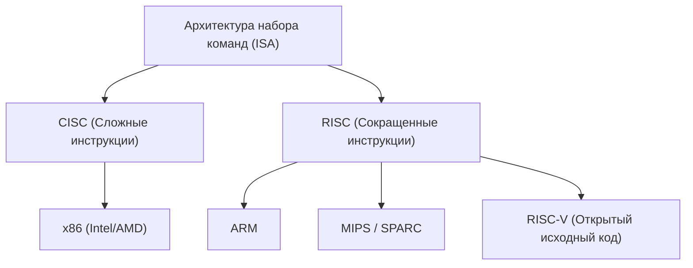
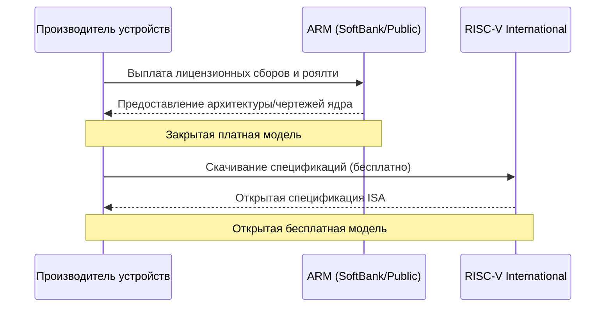

## Введение: Бесконечная борьба за кремниевую гегемонию

История полупроводниковой промышленности — это история борьбы за гегемонию вокруг «архитектуры набора команд» (ISA: Instruction Set Architecture). С момента зарождения в 1970-х годах и до наших дней это фундаментальное правило того, как процессоры интерпретируют программные инструкции и выполняют их на аппаратном обеспечении, определяло направление технологической эволюции.

В прошлом архитектура x86, представленная компаниями Intel и AMD, полностью доминировала на рынках персональных компьютеров и серверов, построив непоколебимую империю, известную как «Wintel» (Windows + Intel). Однако по мере перехода мира от ПК к мобильным устройствам эта система господства начала постепенно рушиться. И тогда на первый план вышла архитектура ARM, стремящаяся к максимальной энергоэффективности.

Появление и распространение ARM стали не просто технологической сменой поколений, а сменой парадигмы самой бизнес-модели. А теперь доминирующему положению ARM угрожает архитектура «RISC-V», зародившаяся как полностью открытый исходный код. В этой статье мы пройдемся по истории таких технологических гигантов, как Intel, AMD, Apple и NVIDIA, и раскроем грандиозный эпос о переходе полупроводниковых архитектур от CISC к RISC и от закрытых систем к открытым.

## Глава 1: Рождение x86 и золотой век CISC

### 1.1 Эволюция от Intel 4004 к 8086

В 1971 году Intel представила первый в мире микропроцессор «4004». Изначально он разрабатывался для калькуляторов японской компании Busicom, но стал отправной точкой для последующего взрывного роста полупроводниковой индустрии. Затем последовали модели 8008 и 8080, а в 1978 году на свет появился исторический шедевр — «8086». Именно он положил начало линии архитектуры «x86», которая существует и по сей день.

Процессор 8086 был 16-битным, и после того как он был использован в IBM PC, он утвердился в статусе фактического отраслевого стандарта (де-факто стандарта). В те времена память была очень дорогой, а объем хранилищ ограниченным. Поэтому необходимо было максимально сокращать размер программ, и подход «CISC» (Complex Instruction Set Computer), позволяющий выполнять сложные операции одной инструкцией, оказался рациональным.

### 1.2 Становление империи Wintel и вызов от AMD

С конца 1980-х и в 1990-х годах комбинация операционной системы Windows от Microsoft и процессоров от Intel получила название «Wintel» и полностью захватила рынок ПК. Intel с огромной скоростью выпускала новые продукты: серии 80286, 80386, i486 и Pentium, стремительно повышая производительность за счет увеличения тактовой частоты и расширения инструкций.

Отважный вызов гегемонии Intel бросила компания AMD (Advanced Micro Devices). Изначально начав как второй поставщик (альтернативный производитель) для Intel, AMD постепенно перешла к разработке процессоров собственной архитектуры, вступив в ожесточенную ценовую войну и гонку производительности (так называемую «мегагерцевую гонку») с Intel. В частности, процессор «Athlon», представленный в 1999 году, временно превзошел Pentium III от Intel по производительности, продемонстрировав всему миру технологическую мощь AMD.

Однако борьба между Intel и AMD оставалась конкуренцией на одном и том же поле — архитектуре «x86». Сохраняя сложный набор команд архитектуры CISC, они стремились повысить производительность, внедряя RISC-подобный подход: внутренне разбивая инструкции на простые микрооперации для выполнения.

## Глава 2: Возвышение RISC и бизнес-модель ARM

### 2.1 Рождение философии RISC

В то время как архитектура CISC становилась всё более сложной, в начале 1980-х годов был предложен совершенно новый подход. Им стал «RISC» (Reduced Instruction Set Computer). Это исследование, возглавляемое Джоном Коком из IBM и Дэвидом Паттерсоном из Калифорнийского университета в Беркли, базировалось на идее: «реализовывать в аппаратном обеспечении только часто используемые простые инструкции, а сложные операции выполнять за счет их комбинации (программно)».

RISC был нацелен на повышение общей производительности за счет упрощения декодирования инструкций и оптимизации конвейерной обработки. Появились такие архитектуры, как SPARC от Sun Microsystems и архитектура MIPS от MIPS Technologies, которые достигли определенного успеха, главным образом на рынке рабочих станций и серверов.

### 2.2 Acorn Computers и зарождение ARM

Волна RISC достигла и небольшой британской компьютерной компании «Acorn Computers». Они приступили к разработке собственного RISC-процессора для преемника своего образовательного компьютера «BBC Micro». Разработанный в условиях ограниченного бюджета и штата, процессор «ARM» (Acorn RISC Machine, позже Advanced RISC Machines) отличался удивительной простотой и крайне низким энергопотреблением.

В 1990 году было создано совместное предприятие «ARM Ltd.» с участием Acorn Computers, Apple и VLSI Technology. В то время Apple разрабатывала инновационный персональный цифровой помощник (КПК) «Newton» и искала высокопроизводительный процессор с низким энергопотреблением.

### 2.3 Переход от бесфабричного производства к лицензированию ИС (IP)

Истинная инновационность ARM заключалась не столько в самой архитектуре, сколько в ее бизнес-модели. В то время большинство производителей полупроводников использовали вертикально-интегрированную (IDM) модель, проектируя чипы самостоятельно и производя их на собственных фабриках. Однако ARM не имела собственных фабрик и даже не занималась продажей чипов.

Они приняли беспрецедентную бизнес-модель: создавали только «чертежи процессоров (IP: Intellectual Property)» и лицензировали их другим производителям полупроводников. Компании-клиенты (лицензиаты) на основе чертежей, предоставленных ARM, могли разрабатывать и производить кастомные чипы (SoC: System on a Chip), сочетающие оптимальные функции для их собственных продуктов.

Эта модель лицензирования IP идеально соответствовала требованиям быстрорастущего мобильного рынка. Производителям мобильных телефонов необходимо было извлекать максимальную производительность при ограниченной емкости аккумуляторов, и архитектура ARM с ее низким энергопотреблением была идеальной. Такие компании, как Texas Instruments (TI) и Qualcomm, одна за другой приобретали лицензии ARM, и ARM постепенно превратилась в «теневого правителя» рынка мобильных телефонов.

## Глава 3: Мобильная революция и влияние Apple Silicon

### 3.1 Взрывное распространение смартфонов и гегемония ARM

В 2007 году компания Apple представила «iPhone», и мир достиг решающего поворотного момента. Первые iPhone оснащались процессорами на базе ARM, произведенными компанией Samsung. Вскоре появилась операционная система Android, возглавляемая Google, и распространение смартфонов приобрело взрывной характер.

Безусловным победителем в этой мобильной революции стала ARM. Архитектура ARM была выбрана в качестве «мозга» для всех мобильных устройств: смартфонов, планшетов, умных часов. Intel также попыталась выйти на мобильный рынок с процессором «Atom» на базе x86, но потерпела поражение перед подавляющей энергоэффективностью ARM и уже сформировавшейся мощной экосистемой.

### 3.2 История архитектурных переходов Apple

Здесь стоит обратить внимание на уникальную историю компании Apple. Apple — редкая компания, которая за свою историю трижды полностью меняла архитектуру процессоров, являющихся ядром её главных продуктов.

1. **От 68k к PowerPC (1994 год)**: Переход от серии 68000 компании Motorola к PowerPC, разработанному совместно с IBM и Motorola.
2. **От PowerPC к Intel x86 (2006 год)**: В связи с тупиком в повышении производительности PowerPC (особенно из-за проблем с энергопотреблением в ноутбуках), Стив Джобс принял решение о полном переходе на архитектуру x86 от Intel.
3. **От Intel x86 к Apple Silicon (ARM) (2020 год)**: И самым масштабным поворотным моментом стал переход на «Apple Silicon».

### 3.3 Что доказал Apple Silicon (чип M1)

На протяжении многих лет Apple накапливала ноу-хау в проектировании кастомного кремния на базе ARM с помощью чипов «А-серии» для iPhone и iPad. С каждым поколением их производительность росла и в конечном итоге достигла уровня, угрожающего процессорам Intel для ПК.

В 2020 году Apple анонсировала «M1» — процессор собственной разработки для Mac. Это SoC на базе архитектуры ARM с глубокой кастомизацией от Apple. Чип M1 обеспечил производительность, превосходящую топовые процессоры x86 того времени, при поразительно низком энергопотреблении.

Успех Apple Silicon нанес индустрии два решающих удара. Во-первых, он полностью разрушил многолетнее предубеждение о том, что «архитектура ARM предназначена для низкопроизводительных мобильных устройств», доказав, что она может на равных конкурировать с x86 (или даже превосходить ее) в высокопроизводительных настольных ПК и рабочих станциях. Во-вторых, он продемонстрировал подавляющее преимущество гигантских технологических компаний, «лицензирующих IP и проектирующих собственный кастомный кремний».

## Глава 4: Амбиции NVIDIA и архитектура эпохи ИИ

### 4.1 От графических процессоров к сердцу ИИ

В то время как ARM покоряла мобильный рынок, еще одна важная архитектура тихо эволюционировала — GPU (графический процессор) под руководством NVIDIA. Изначально GPU создавался как специализированный чип для ускорения обработки 3D-графики в играх, но исследователи, заметив его высокую способность к параллельным вычислениям, начали применять его для научно-технических расчетов (GPGPU).

После появления «AlexNet» в 2012 году произошел прорыв в технологиях глубокого обучения, что породило бум искусственного интеллекта. Графические процессоры NVIDIA продемонстрировали невероятную производительность в обучении нейронных сетей, требующем огромных матричных вычислений, и стали фактическим стандартным платформам для разработки ИИ.

### 4.2 Провал приобретения ARM компанией NVIDIA

Генеральный директор NVIDIA Дженсен Хуанг, укрепив абсолютные позиции компании в сфере ИИ, вынашивал еще более грандиозные амбиции. В сентябре 2020 году NVIDIA объявила о покупке ARM у SoftBank Group за сумму до 40 миллиардов долларов.

Если бы это приобретение состоялось, «самая мощная в мире ИИ-платформа (NVIDIA)» и «самая распространенная процессорная экосистема (ARM)» объединились бы, что полностью перекроило бы расстановку сил в полупроводниковой индустрии. NVIDIA планировала разработать процессоры следующего поколения для ИИ-дата-центров, объединив собственные технологии GPU с технологиями CPU от ARM.

Однако эта мегасделка столкнулась с яростным сопротивлением со стороны полупроводниковых компаний и регуляторов по всему миру. Фундаментом бизнес-модели ARM был «нейтралитет (подобно Швейцарии)», и контроль над ARM со стороны конкретной компании (NVIDIA) был неприемлем для конкурентов (Qualcomm, Google, Microsoft и др.). В конечном итоге, не получив одобрения антимонопольных органов разных стран, в феврале 2022 года план слияния был отменен.

Этот инцидент показал, насколько важным «общественным благом» стала компания ARM в современной технологической индустрии, а также высветил сильную настороженность в отношении технологической монополии со стороны одной компании.

## Глава 5: Рождение и революция третьего полюса — «RISC-V»

### 5.1 Что такое RISC-V?

Пока скандал вокруг покупки ARM компанией NVIDIA вызывал волнения в индустрии, стремительно набирала популярность «RISC-V» (Риск-Файв). RISC-V — это архитектура набора команд (ISA) с открытым исходным кодом, разработку которой начала исследовательская группа Калифорнийского университета в Беркли (UC Berkeley) в 2010 году.

Главная особенность RISC-V заключается в том, что, подобно программному обеспечению с открытым исходным кодом, такому как Linux или Android, её спецификация (ISA) опубликована бесплатно, и любой желающий может свободно её использовать, изменять и внедрять. В отличие от традиционных x86 и ARM, права на которые монополизированы конкретными компаниями (Intel и ARM Ltd.), взимающими высокие лицензионные сборы и устанавливающими строгие условия использования (закрытая ISA), RISC-V является полностью открытой (открытая ISA).

### 5.2 Смена парадигмы, привносимая RISC-V

Появление RISC-V вызывает тектонические сдвиги в полупроводниковой индустрии. Причины тому следующие:

1. **Отсутствие лицензий и снижение затрат**: Для малого и среднего бизнеса, стартапов и университетских исследовательских центров миллионные лицензионные сборы за архитектуру ARM были серьезным барьером. Использование RISC-V позволяет радикально сократить эти первоначальные затраты и значительно снижает порог для разработки собственных процессоров.
2. **Максимальная кастомизация**: RISC-V использует модульную конструкцию: к базовому простому набору инструкций можно свободно добавлять и удалять расширения (векторные вычисления, шифрование и т.д.) в зависимости от потребностей. Это позволяет самостоятельно проектировать кастомные чипы, оптимизированные для любых задач — от крошечных микросхем для IoT-устройств до ИИ-ускорителей и высокопроизводительных серверов для центров обработки данных.
3. **Избавление от привязки к одному поставщику**: Чтобы избежать рисков, связанных с чрезмерной зависимостью от архитектуры ARM (повышение лицензионных сборов или геополитические риски, подобные инциденту с приобретением NVIDIA), многие компании начали рассматривать RISC-V в качестве мощной альтернативы.

### 5.3 Выход на рынок технологических гигантов и расширение экосистемы

Изначально RISC-V рассматривалась как решение для научных исследований или небольших встраиваемых устройств, но сегодня технологические гиганты наперебой инвестируют в неё.

Google выбрала RISC-V в качестве микроконтроллера для управления своими ИИ-процессорами (TPU) и продвигает официальную поддержку RISC-V в ОС Android. Крупные компании в сфере хранения данных, такие как Western Digital и Seagate, заменили свои контроллеры HDD/SSD на базе RISC-V. Qualcomm, на фоне судебного разбирательства с ARM по вопросам лицензирования, разрабатывает чипы для носимых устройств на основе RISC-V.

Кроме того, одна за другой появляются профильные стартапы в области RISC-V, такие как SiFive, Andes Technology и Tenstorrent (которую возглавляет гениальный архитектор Джим Келлер). Они стимулируют разработку высокопроизводительных ядер RISC-V и ИИ-ускорителей.

## Глава 6: Геополитические риски и стратегическое значение RISC-V

### 6.1 Американо-китайские трения и фрагментация полупроводниковых технологий

За стремительным распространением RISC-V стоят не только её технологические преимущества, но и динамика международной политики. В частности, обостряющееся противостояние между США и Китаем вызывает разрыв (декаплинг) цепочек поставок полупроводников.

Правительство США из соображений национальной безопасности усилило экспортный контроль над полупроводниковыми технологиями в отношении китайских технологических компаний, таких как Huawei. В результате китайские компании столкнулись с риском ограничения доступа к процессорам Intel x86 и новейшим архитектурам ARM (хотя ARM является британской компанией, она включает много американских технологий и поэтому подпадает под ограничения).

### 6.2 «Технологическая независимость» Китая и RISC-V

В этой критической ситуации «RISC-V» с открытым исходным кодом, не зависящая от законов конкретной страны или желаний отдельных корпораций, стала для Китая настоящим спасением. Китайское правительство и компании инвестируют колоссальные средства в RISC-V как в ядро национальной стратегии по достижению технологической самодостаточности (технологической независимости).

Полупроводниковое подразделение Alibaba Group, T-Head (PingTouGe), разработало высокопроизводительные процессоры RISC-V серии «Xuantie» и выложило их дизайн в открытый доступ. Внутри Китая разработка полупроводников на базе RISC-V — от IoT-устройств до серверов дата-центров и ИИ-чипов — продвигается взрывными темпами.

### 6.3 Дилемма Запада и дебаты о регулировании

В то же время страны Запада столкнулись с дилеммой. С одной стороны, развитие технологий с открытым исходным кодом приветствуется как стимул для инноваций, с другой — растут опасения, что через RISC-V Китай сможет повысить свой потенциал в полупроводниковой сфере, что приведет к модернизации его военных технологий.

Некоторые американские политики уже начали настаивать на расширении экспортного контроля на технологии с открытым исходным кодом, включая RISC-V. Однако ограничение публикации «спецификаций (текста)» открытого исходного кода может разрушить свободу слова и основу для международных совместных исследований, а найти эффективные средства регулирования крайне сложно. Организация стандартизации RISC-V International, чтобы избежать геополитических рисков, уже перенесла свою штаб-квартиру из США в нейтральную Швейцарию.

## Заключение: Будущее вычислений следующего поколения

Битва за наборы команд в полупроводниках вышла за рамки простой технической дискуссии и превратилась в грандиозную драму, затрагивающую корпоративные стратегии и даже национальную безопасность.

Империя CISC архитектуры x86, построенная Intel и AMD, все еще сохраняет прочные позиции на рынке облачных серверов и ПК. Однако, как показывает успех Apple Silicon, угроза со стороны ARM в сегменте высокой производительности растет с каждым днем. Более того, на фоне бума искусственного интеллекта формируется новая вычислительная парадигма, в центре которой находятся графические процессоры NVIDIA.

А на нижнем уровне открытая архитектура RISC-V тихо, но уверенно начинает размывать фундамент всех устройств. Подобно тому, как Linux когда-то занял свою уникальную нишу на рынке серверных операционных систем и стал базовой технологией интернета, RISC-V имеет все шансы стать «Linux для аппаратного обеспечения» и общим языком экосистемы полупроводников следующего поколения.

x86, ARM и RISC-V. Эти три архитектуры будут и впредь влиять друг на друга, определяя развитие цифровой инфраструктуры, поддерживающей наше общество. В борьбе за кремниевую гегемонию нет конца.
