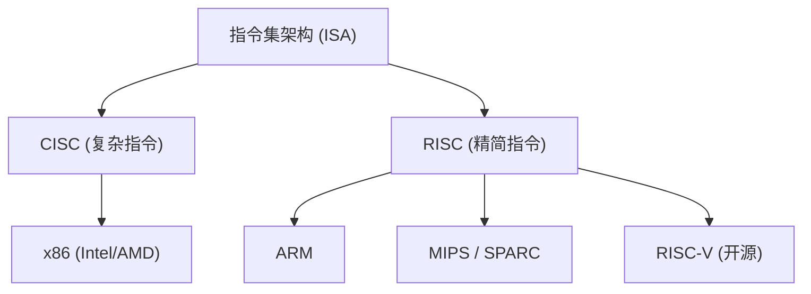
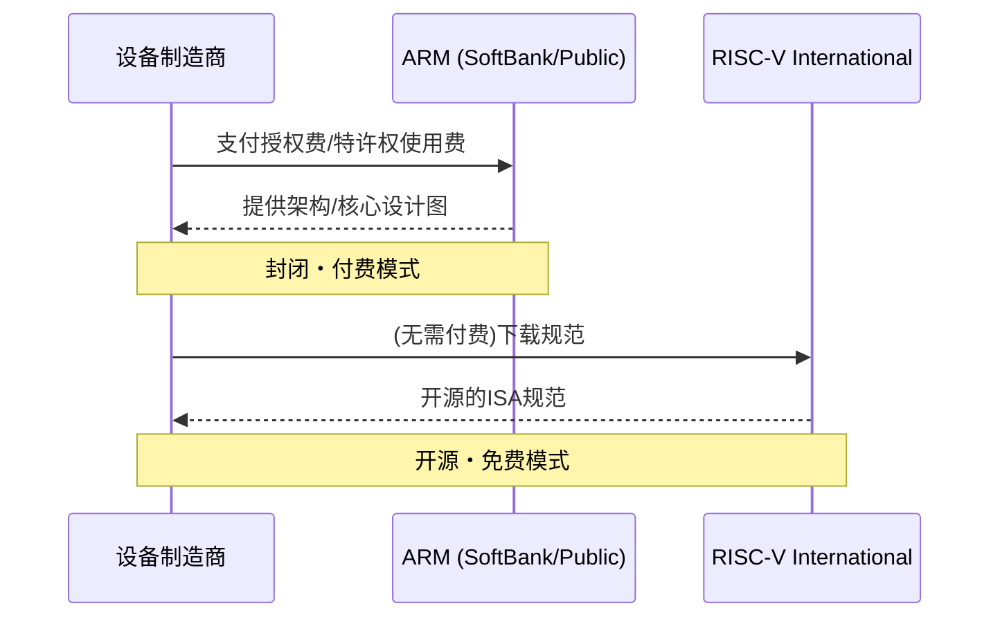

## 序章：围绕硅霸权的无尽斗争

半导体产业的历史，可以说就是一部围绕“指令集架构（ISA: Instruction Set Architecture）”的霸权争夺史。从1970年代的黎明期至今，处理器如何解释来自软件的指令并在硬件上执行，这一根本性的规则决定了技术进化的方向。

曾经，以Intel和AMD为代表的x86架构完全掌控了个人电脑和服务器市场，建立起被称为“Wintel（Windows + Intel）”的不可动摇的帝国。然而，随着世界从PC向移动设备的转变，这一统治体制开始逐渐动摇。在此背景下崛起的，是追求极致能源效率的ARM架构。

ARM的出现与普及，不仅是单纯的技术世代更迭，更是商业模式本身的范式转移。而如今，正试图威胁ARM堡垒的，是作为完全开源诞生的“RISC-V”。本文将横跨Intel、AMD、Apple、NVIDIA等科技巨头的历史，为您解读从CISC到RISC，再从封闭走向开源的半导体架构宏大史诗。

## 第1章：x86的诞生与CISC的全盛期

### 1.1 从Intel 4004到8086的进化

1971年，Intel发布了全球首款微处理器“4004”。这最初是为日本Busicom公司的计算器开发的，但它成为了此后半导体产业爆炸性增长的起点。随后，历经8008、8080的不断进化，1978年诞生了历史性的杰作“8086”。这便是延续至今的“x86”架构谱系的开端。

8086是一款16位处理器，因被随后的IBM PC采用，确立了其事实上的行业标准地位。在这个时代，内存非常昂贵，存储容量也十分有限。因此，必须尽可能地减小程序的体积，而采用能够通过单一指令执行复杂处理的“CISC（复杂指令集计算机）”方法是合理的。

### 1.2 Wintel帝国的确立与AMD的挑战

从1980年代后期到1990年代，微软的Windows操作系统与Intel处理器的组合被称为“Wintel”，完全统治了PC市场。Intel以势如破竹之势推出了80286、80386、i486以及Pentium系列等新产品，通过提高时钟频率和扩展指令，使性能得到了飞跃性的提升。

面对Intel的霸权，AMD（Advanced Micro Devices）进行了果敢的挑战。AMD最初作为Intel的第二货源（替代制造商）起步，但逐渐开始开发自主设计的处理器，并与Intel展开了激烈的价格竞争和性能竞争（即所谓的“兆赫兹大战”）。特别是1999年发布的“Athlon”处理器，一度在性能上超越了Intel的Pentium III，向世界展示了AMD的技术实力。

然而，Intel与AMD的战斗，始终是在“x86”这一相同舞台（ISA）上的竞争。他们在维持CISC架构复杂指令集的同时，在内部采用将指令分解为简单的微操作来执行的类似RISC的方法，以此来提升性能。

## 第2章：RISC的崛起与ARM的商业模式

### 2.1 RISC哲学的诞生

在CISC架构日益复杂的过程中，1980年代初提出了一种全新的方法，那就是“RISC（精简指令集计算机）”。由IBM的约翰·科克和加州大学伯克利分校的大卫·帕特森等人主导的这项研究，基于“仅在硬件上实现常用的简单指令，而复杂的处理则通过这些指令的组合（软件）来实现”的思想。

RISC旨在通过简化指令解码和提高流水线处理效率来提升整体性能。Sun Microsystems的SPARC、MIPS Technologies的MIPS等架构相继登场，主要在工作站和服务器市场取得了一定的成功。

### 2.2 Acorn Computers与ARM的诞生

RISC的浪潮也波及到了英国的一家小型计算机制造商“Acorn Computers”。为了开发其教育用计算机“BBC Micro”的后续机型，他们着手研发自己的RISC处理器。在有限的预算和人员下开发出的“ARM（Acorn RISC Machine，后更名为Advanced RISC Machines）”，具有出奇简单且功耗极低的特点。

1990年，Acorn Computers、Apple和VLSI Technology三家公司合资成立了“ARM Ltd.”。当时，Apple正在开发划时代的个人数字助理（PDA）“Newton”，亟需一款低功耗且高性能的处理器。

### 2.3 从无晶圆厂到IP授权的转变

可以说，ARM真正的创新之处在于其商业模式，而非架构本身。当时，许多半导体制造商采用的是自己设计芯片并在自家工厂（晶圆厂）制造的垂直整合型（IDM）模式。然而，ARM不仅自己没有工厂，甚至连芯片的销售都不参与。

他们采用了史无前例的商业模式：仅仅制作“处理器的设计图（IP：知识产权）”，并将其授权给其他半导体制造商。客户企业（被授权方）可以根据ARM提供的设计图，结合最适合自家产品的功能，开发和制造定制芯片（SoC：系统级芯片）。

这种IP授权模式完美契合了迅速扩张的移动市场的需求。手机制造商必须在有限的电池容量下发挥出最大的性能，而ARM的低功耗架构无疑是理想之选。德州仪器（TI）、高通等企业陆续采用了ARM的授权，ARM逐渐成长为手机市场中的“幕后统治者”。

## 第3章：移动革命与Apple Silicon的冲击

### 3.1 智能手机的爆炸式普及与ARM的霸权

2007年，Apple发布了“iPhone”，世界迎来了决定性的转折点。早期的iPhone搭载了三星制造的基于ARM的处理器。随后，Google主导的Android操作系统登场，智能手机的普及呈现出爆炸式的势头。

在这场移动革命中，最大的赢家毫无疑问是ARM。智能手机、平板电脑、智能手表等各类移动设备的大脑都采用了ARM架构。Intel也推出了面向移动设备的“Atom”处理器，试图让x86进军移动领域，但在ARM压倒性的能源效率以及已经形成的强大生态系统面前，最终败下阵来。

### 3.2 Apple的架构变迁史

在此，我们应关注Apple这家企业的特殊历史。Apple是历史上罕见的、将自身主力产品核心处理器的架构进行过三次彻底转换的企业。

1. **从68k到PowerPC (1994年)**: 从摩托罗拉的68000系列，转向与IBM/摩托罗拉共同开发的PowerPC。
2. **从PowerPC到Intel x86 (2006年)**: 由于PowerPC在性能提升（尤其是面向笔记本电脑的功耗问题）上陷入瓶颈，史蒂夫·乔布斯决定全面转向Intel的x86架构。
3. **从Intel x86到Apple Silicon (ARM) (2020年)**: 接着，最大的转折点便是向“Apple Silicon”的过渡。

### 3.3 Apple Silicon（M1芯片）所证明的事实

多年来，Apple通过用于iPhone和iPad的“A系列”芯片，积累了基于ARM的定制芯片设计经验。其性能随着世代更迭不断提升，最终达到了足以威胁PC端Intel处理器的水平。

2020年，Apple发布了面向Mac的自主研发芯片“M1”。这是一款基于ARM架构，由Apple进行高度自主定制的SoC。M1芯片以惊人的低功耗，实现了超越当时高端x86处理器的性能。

Apple Silicon的成功给业界带来了两次决定性的冲击。首先，它彻底打破了“ARM架构是面向移动设备的低性能产品”这一长年以来的偏见，证明了即使在高端台式机和工作站领域，ARM也完全能够与x86抗衡（甚至超越）。其次，它展示了科技巨头通过“获取IP授权并自主设计定制芯片”所拥有的压倒性优势。

## 第4章：NVIDIA的野心与AI时代的架构

### 4.1 从GPU到AI的心脏

在ARM称霸移动市场的同时，另一个重要的架构也在悄然进化。那就是由NVIDIA主导的GPU（图形处理器）。GPU最初是作为加速3D游戏图形渲染处理的专用芯片而诞生的，但研究人员看中了其强大的并行计算能力，开始将其应用于科学技术计算（GPGPU）。

自2012年“AlexNet”登场以来，深度学习技术取得了突破性进展，掀起了AI热潮。在需要庞大矩阵运算的神经网络训练中，NVIDIA的GPU展现出了压倒性的性能，成为了AI开发中事实上的标准平台。

### 4.2 NVIDIA收购ARM的挫折

在AI领域确立了绝对地位的NVIDIA首席执行官黄仁勋，怀抱了更大的野心。2020年9月，NVIDIA宣布将以最高400亿美元从软银集团收购ARM。

如果这项收购成立，那么“世界最强的AI平台（NVIDIA）”与“世界最普及的处理器生态系统（ARM）”将合二为一，半导体行业的势力版图必将被彻底改写。NVIDIA企图将自家的GPU技术与ARM的CPU技术相融合，开发出面向下一代AI数据中心的处理器。

然而，这笔巨额交易遭到了全球半导体企业及监管机构的强烈反对。ARM商业模式的根基在于“中立性（如同瑞士般的存在）”，由NVIDIA这样特定的企业来控制ARM，是其竞争对手（如高通、Google、微软等）所无法容忍的。最终，由于未能获得各国反垄断法主管机构的批准，该收购计划于2022年2月被宣告流产。

这一事件不仅表明了ARM在现代科技行业中已成为多么重要的“公共物品”般的存在，同时也凸显了各界对特定企业进行技术垄断的强烈警惕感。

## 第5章：第三极“RISC-V”的诞生与革命

### 5.1 什么是RISC-V？

在NVIDIA收购ARM风波在业界引起轩然大波之际，“RISC-V”开始迅速吸引人们的关注。RISC-V是由加州大学伯克利分校（UC Berkeley）的研究团队于2010年开始开发的一种开源指令集架构（ISA）。

RISC-V最大的特点在于，它与Linux或Android等开源软件一样，其规范（ISA）是免费公开的，任何人都可以自由地使用、修改和实现。传统的x86和ARM的权利被特定企业（Intel或ARM公司）所垄断，并被施加了高昂的授权费和严格的使用条件（封闭ISA），相比之下，RISC-V则是完全开放的（开源ISA）。

### 5.2 RISC-V带来的范式转移

RISC-V的登场正在给半导体行业带来地壳变动般的改变。其原因如下：

1. **免授权费与成本削减**: 对于中小企业、初创公司以及大学研究机构来说，高达数百万美元的ARM架构授权费是一个巨大的障碍。通过使用RISC-V，可以大幅削减这一初期成本，大大降低了自主开发处理器的门槛。
2. **极致的可定制性**: RISC-V采用了模块化设计，除了作为基础的简单指令集外，还可以根据用途自由添加或删除扩展功能（如向量运算、加密等）。从面向IoT设备的超小型芯片，到AI加速器、面向数据中心的高性能服务器，它可以自主设计针对各种用途进行优化的定制芯片。
3. **摆脱供应商锁定**: 为了避免过度依赖ARM架构带来的风险（如授权费上涨，以及类似NVIDIA收购风波这样的地缘政治风险），许多企业开始将RISC-V作为有力的替代方案（Alternative）进行考量。

### 5.3 科技巨头的入局与生态系统的扩大

RISC-V最初被视为面向学术研究和小型嵌入式设备的产物，但现在科技巨头们正争相进行投资。

Google采用RISC-V作为自家AI处理器（TPU）的控制微控制器，并进一步推进Android操作系统对RISC-V的官方支持。西部数据（Western Digital）和希捷（Seagate）等存储大厂已将自家的HDD/SSD控制器替换为基于RISC-V的设计。高通（Qualcomm）在与ARM存在授权诉讼的背景下，正在开发基于RISC-V的可穿戴设备芯片。

此外，SiFive、Andes Technology、Tenstorrent（由天才架构师Jim Keller领导）等专门从事RISC-V的初创企业陆续崭露头角，引领着高性能RISC-V核心的设计与AI加速器的开发。

## 第6章：地缘政治风险与RISC-V的战略意义

### 6.1 中美摩擦与半导体技术的阵营化

RISC-V迅速普及的背后，不仅有技术上的优势，还受到了国际政治动力的深刻影响。特别是愈演愈烈的中美对立，引发了半导体供应链的分化（脱钩）。

出于国家安全的理由，美国政府加强了对华为等中国科技企业半导体技术的出口管制。这使得中国企业面临着无法获取Intel x86处理器及最新ARM架构的风险。（尽管ARM是英国企业，但因其包含了大量美国技术，同样成为管制对象）。

### 6.2 中国的“技术独立”与RISC-V

在这种危机状况下，不受特定国家法律和企业意愿左右的开源“RISC-V”，对中国而言简直是久旱逢甘霖。为了实现技术自给自足（技术独立），中国政府和企业将RISC-V作为国家战略的核心，进行了巨额投资。

阿里巴巴集团旗下的半导体部门平头哥（T-Head）开发了高性能的RISC-V处理器“玄铁（Xuantie）”系列，并将其设计开源。在中国国内，从IoT设备到数据中心服务器，乃至AI芯片，基于RISC-V的半导体开发正以爆炸性的势头向前推进。

### 6.3 欧美的两难困境与管制之争

另一方面，欧美国家正面临着两难境地。虽然有声音欢迎开源技术的发展能促进创新，但与此同时，越来越多的人担忧中国会通过RISC-V提升半导体能力，进而推动其军事技术的现代化。

美国的一些政客也开始主张，应扩大对包括RISC-V在内的开源技术的出口管制网。然而，限制开源“规范（文本）”的公开，可能会破坏言论自由和国际联合研究的根基，找到行之有效的管制手段极为困难。为了规避地缘政治风险，RISC-V International（标准制定组织）已经将其总部从美国迁至永久中立国瑞士。

## 终章：下一代计算的去向

围绕半导体指令集的战斗，已经超越了单纯的技术争论，演变为一场卷入企业战略甚至国家安全的宏大戏剧。

Intel与AMD建立的x86 CISC帝国，在云服务器和PC市场依然拥有坚实的基础。但是，正如Apple Silicon的成功所表明的那样，即使在高性能领域，ARM的威胁也在与日俱增。此外，在AI热潮的背景下，以NVIDIA的GPU为中心的新计算范式正在形成。

而在其底层，开源的RISC-V正悄无声息却又实实在在地开始蚕食所有设备的根基。正如Linux曾要在服务器OS市场确立独特地位并成为互联网的基础技术一样，RISC-V作为“硬件版Linux”，蕴含着成为下一代半导体生态系统通用语言的可能性。

x86、ARM以及RISC-V。这三种架构在今后也将相互影响，牵引支撑我们社会的数字基础设施的进化。围绕硅霸权的斗争，永无止境。
