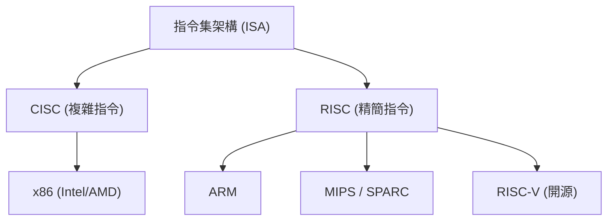
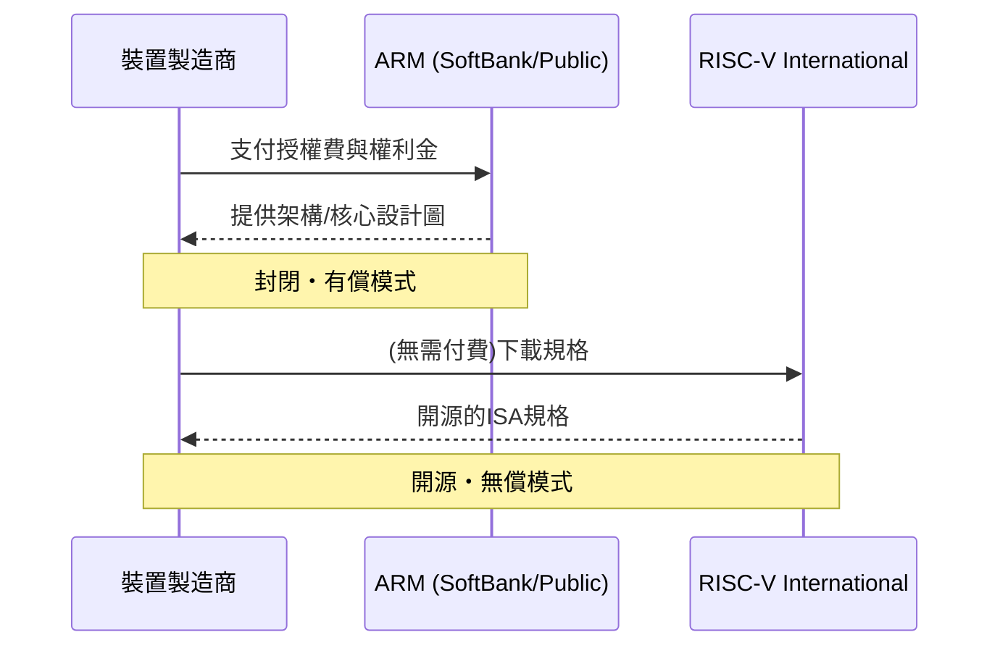

## 序章：圍繞矽霸權的無盡鬥爭

半導體產業的歷史，本身就是一部圍繞著「指令集架構（ISA: Instruction Set Architecture）」霸權爭奪的歷史。從1970年代的黎明期到現在，處理器如何解釋來自軟體的指令並在硬體上執行，這項根本的規則決定了技術發展的方向。

過去，以Intel和AMD為代表的x86架構完全掌控了個人電腦和伺服器市場，建立起被稱為「Wintel（Windows + Intel）」的不可動摇的帝國。然而，隨著世界從PC向行動裝置轉移，這個統治體制開始逐漸動搖。在那裡崛起的是將能源效率追求到極致的ARM架構。

ARM的登場和普及不僅僅是技術上的改朝換代，而是商業模式本身的典範轉移。而現在，試圖威脅ARM堡壘的，是作為完全開源誕生的「RISC-V」。本文將橫跨Intel、AMD、Apple、NVIDIA等巨大科技企業的歷史，為您剖析半導體架構從CISC到RISC，從封閉走向開源的宏大史詩。

## 第1章：x86的誕生與CISC的全盛期

### 1.1 從Intel 4004到8086的進化

1971年，Intel發表了世界首款微處理器「4004」。這最初是為了日本Busicom公司的計算機所開發的，但它成為了後來半導體產業爆發性成長的起點。隨後，歷經8008、8080的持續進化，1978年誕生了歷史性的傑作「8086」。這也是延續至今的「x86」架構系譜的開端。

8086是一款16位元處理器，由於被隨後的IBM PC所採用，確立了事實上業界標準（De facto standard）的地位。在這個時代，記憶體非常昂貴，儲存容量也有限。因此，有必要盡可能地縮小程式的大小，能夠以單一指令執行複雜處理的「CISC（Complex Instruction Set Computer，複雜指令集電腦）」方法是合理的。

### 1.2 Wintel帝國的確立與AMD的挑戰

從1980年代後半到1990年代，微軟的Windows作業系統與Intel處理器的組合被稱為「Wintel」，完全支配了PC市場。Intel以排山倒海之勢投入新產品，包括80286、80386、i486以及Pentium系列，透過提升時脈頻率和擴充指令，使效能飛躍性地提升。

面對Intel的霸權，果敢地持續發起挑戰的是AMD（Advanced Micro Devices）。最初作為Intel的第二貨源（替代製造商）起步的AMD，逐漸開發出獨自設計的處理器，與Intel展開了激烈的價格競爭和效能競爭（即所謂的「兆赫茲競爭」）。特別是1999年發表的「Athlon」處理器，在效能上曾一度超越Intel的Pentium III，向世界展示了AMD的技術實力。

然而，Intel與AMD的競爭，終究是在「x86」這個相同競技場（ISA）上的競爭。他們在維持CISC架構複雜指令集的同時，內部透過將指令分解為簡單的微操作來執行，藉由引入類似RISC的方法來謀求效能提升。

## 第2章：RISC的崛起與ARM的商業模式

### 2.1 RISC哲學的誕生

在CISC架構不斷複雜化的同時，1980年代初期提出了一種全新的方法。那就是「RISC（Reduced Instruction Set Computer，精簡指令集電腦）」。由IBM的約翰·科克（John Cocke）以及加州大學柏克萊分校的大衛·帕特森（David Patterson）等人主導的這項研究，基於「僅以硬體實作常用的簡單指令，複雜的處理則透過它們的組合（軟體）來實現」的思想。

RISC旨在透過簡化指令解碼、提高管線處理效率，來提升整體效能。Sun Microsystems的SPARC和MIPS Technologies的MIPS架構等相繼登場，主要在工作站和伺服器市場取得了一定的成功。

### 2.2 Acorn Computers與ARM的誕生

RISC的浪潮也波及到了英國的一家小型電腦製造商「Acorn Computers」。為了自家教育用電腦「BBC Micro」的後繼機種，他們著手開發獨自的RISC處理器。在有限的預算和人員下開發出的「ARM（Acorn RISC Machine，後更名為Advanced RISC Machines）」，具有驚人的簡潔性以及極低的功耗等特點。

1990年，由Acorn Computers、Apple和VLSI Technology三家公司合資成立了「ARM Ltd.」。當時Apple正在開發劃時代的個人數位助理（PDA）「Newton」，需要一款低功耗且高效能的處理器。

### 2.3 從無廠半導體向IP授權的轉變

可以說ARM真正的創新性與其說是架構本身，不如說是它的商業模式。當時，許多半導體製造商都採用自家設計晶片、並在自家工廠（晶圓廠）製造的垂直整合（IDM）模式。然而，ARM自己不擁有工廠，甚至也不進行晶片的銷售。

他們採用了前所未聞的商業模式：僅製作「處理器的設計圖（IP：Intellectual Property）」，並將其授權給其他的半導體製造商。客戶企業（被授權方）能夠根據ARM提供的設計圖，開發、製造結合了最適合自家產品功能的客製化晶片（SoC：System on a Chip）。

這種IP授權模式，完美契合了迅速擴張的行動市場需求。手機製造商必須在有限的電池容量中發揮最大的效能，而ARM的低功耗架構是理想的選擇。德州儀器（TI）和高通（Qualcomm）等企業接連採用ARM的授權，ARM逐漸成長為手機市場的「幕後支配者」。

## 第3章：行動革命與Apple Silicon的衝擊

### 3.1 智慧型手機的爆發性普及與ARM的霸權

2007年，Apple發表了「iPhone」，世界迎來了決定性的轉折點。初代的iPhone搭載了由Samsung製造的基於ARM的處理器。隨後，由Google主導的Android OS登場，智慧型手機的普及呈現出爆發性的趨勢。

在這場行動革命中，最大的贏家毫無疑問是ARM。作為智慧型手機、平板電腦、智慧手錶等所有行動裝置的大腦，ARM架構被廣泛採用。Intel也投入了針對行動裝置的「Atom」處理器，試圖讓x86進軍行動市場，但在ARM壓倒性的能源效率以及早已形成的強大生態系統面前，最終以失敗告終。

### 3.2 Apple架構轉移的歷史

在這裡，我們應該關注Apple這家企業奇特的歷史。Apple是一家罕見的企業，在其歷史上，曾3次完全轉移了作為自家主力產品心臟部位的處理器架構。

1. **從68k到PowerPC (1994年)**: 從Motorola的68000系列，轉移到與IBM/Motorola共同開發的PowerPC。
2. **從PowerPC到Intel x86 (2006年)**: PowerPC的效能提升（特別是針對筆記型電腦的功耗問題）陷入瓶頸，史蒂夫·賈伯斯（Steve Jobs）決定全面轉向Intel的x86架構。
3. **從Intel x86到Apple Silicon (ARM) (2020年)**: 然後，最大的轉折點是轉移到「Apple Silicon」。

### 3.3 Apple Silicon（M1晶片）證明的事實

多年來，Apple透過針對iPhone和iPad的「A系列」晶片，積累了基於ARM的客製化晶片設計技術（Know-how）。其效能隨著世代更迭不斷提升，終於達到了威脅PC用Intel處理器的水準。

2020年，Apple發表了針對Mac獨自開發的晶片「M1」。這是一款以ARM架構為基礎，由Apple獨自進行高度客製化的SoC。M1晶片以驚人的低功耗，實現了超越當時高階x86處理器的效能。

Apple Silicon的成功，給業界帶來了兩個決定性的衝擊。第一，它徹底粉碎了長期以來「ARM架構只適用於行動裝置的低效能產品」的偏見，證明了在高端的桌上型PC和工作站中，它也完全能夠與x86抗衡（甚至超越）。第二，它展示了巨大科技企業「授權IP並親自設計客製化晶片」的壓倒性優勢。

## 第4章：NVIDIA的野心與AI時代的架構

### 4.1 從GPU到AI的心臟部

在ARM稱霸行動市場的同時，另一個重要的架構也在悄悄進化。那就是由NVIDIA主導的GPU（Graphics Processing Unit，圖形處理器）。最初GPU是為了加速3D遊戲的圖形渲染處理而誕生的專用晶片，但看中其高平行計算能力的研究人員，開始將其應用於科學技術計算（GPGPU）。

自2012年「AlexNet」登場以來，深度學習技術取得了突破，引發了AI熱潮。在需要龐大矩陣運算的神經網路訓練中，NVIDIA的GPU發揮了壓倒性的效能，成為了AI開發中事實上的標準平台。

### 4.2 NVIDIA收購ARM的挫敗

在AI領域建立絕對地位的NVIDIA執行長黃仁勳（Jensen Huang），抱持著更大的野心。2020年9月，NVIDIA宣布將以最高400億美元的價格，從軟銀集團手中收購ARM。

如果這項收購成立，「世界最強的AI平台（NVIDIA）」與「世界上最普及的處理器生態系統（ARM）」將合而為一，半導體業界的勢力版圖勢必將完全改寫。NVIDIA企圖將自家的GPU技術與ARM的CPU技術融合，開發出次世代的AI資料中心用處理器。

然而，這場世紀交易遭遇了全球半导体企業及監管機構的強烈反對。因為ARM商業模式的根基在於「中立性（如同瑞士般的存在）」，由NVIDIA這家特定企業來控制ARM，對競爭對手（如高通、Google、微軟等）來說是無法容忍的。最終，未能獲得各國反壟斷法機構的批准，收購計畫於2022年2月宣告破局撤回。

此事件不僅表明了ARM在現代科技業界中，已經成為多麼重要的類似「公共財」的存在，同時也凸顯了對於特定企業技術壟斷的強烈警戒心。

## 第5章：第三極「RISC-V」的誕生與革命

### 5.1 什麼是RISC-V？

在NVIDIA收購ARM的風波在業界引起漣漪之際，急劇吸引人們目光的是「RISC-V（唸作Risk-Five）」。RISC-V是2010年由加州大學柏克萊分校（UC Berkeley）研究團隊開始開發的開源指令集架構（ISA）。

RISC-V最大的特點是，就像Linux或Android等開源軟體一樣，它的規格（ISA）是免費公開的，任何人都可以自由地使用、修改和實作。傳統的x86和ARM，其權利被特定企業（Intel或ARM公司）獨佔，並被課以高額的授權費和嚴格的使用條件（封閉ISA）；相比之下，RISC-V是完全開源的（開源ISA）。

### 5.2 RISC-V帶來的典範轉移

RISC-V的登場，正在為半導體業界帶來地殼變動。其理由如下：

1. **免授權費與成本削減**: 對於中小企業、新創公司及大學研究機構來說，高達數百萬美元的ARM架構授權費是巨大的障礙。使用RISC-V，可以大幅降低這項初期成本，從而大大降低了獨自開發處理器的門檻。
2. **極致的客製化性**: RISC-V採用模組化設計，除了基礎的簡單指令集外，還可以根據用途自由追加或刪除擴充功能（如向量運算、加密等）。從IoT裝置用的超小型晶片，到AI加速器、資料中心用高效能伺服器，能夠獨自設計針對所有用途最佳化的客製化晶片。
3. **從供應商鎖定中解放**: 為了迴避過度依賴ARM架構的風險（如授權費調漲，以及像NVIDIA收購風波般的地緣政治風險），許多企業已經開始將RISC-V視為強有力的替代方案。

### 5.3 巨大科技企業的投入與生態系統的擴大

當初被認為僅適用於學術研究和小型嵌入式裝置的RISC-V，現在巨大的科技企業正爭相進行投資。

Google在自家的AI處理器（TPU）中採用了RISC-V作為控制用微控制器，並進一步推動Android OS對RISC-V的官方支援。Western Digital和Seagate等儲存大廠，已將自家的HDD/SSD控制器替換為基於RISC-V的架構。高通在與ARM的授權訴訟背景下，正在開發基於RISC-V的穿戴式裝置用晶片。

此外，如SiFive、Andes Technology、Tenstorrent（由天才架構師Jim Keller率領）等專注於RISC-V的新創公司接連崛起，引領著高效能RISC-V核心的設計與AI加速器的開發。

## 第6章：地緣政治風險與RISC-V的戰略意義

### 6.1 美中摩擦與半導體技術的區塊化

RISC-V迅速普及的背景中，不僅是技術上的優勢，國際政治的動態也產生了巨大的影響。特別是日益激化的美中對立，正在引發半導體供應鏈的分裂（脫鉤）。

基於國家安全理由，美國政府加強了對華為等中國科技企業的半導體技術出口管制。這使得中國企業面臨被限制取得Intel的x86處理器和最新ARM架構的風險。（雖然ARM是英國企業，但因其中包含了大量美國技術，因此也成為管制的對象）。

### 6.2 中國的「技術獨立」與RISC-V

在這種危機狀況下，不受特定國家的法律或企業意向左右的開源「RISC-V」，對中國來說無疑是久旱逢甘霖。中國政府與企業為了達成科技自給自足（技術獨立），將RISC-V作為國家戰略的核心，投入了龐大的資金。

阿里巴巴集團的半導體部門平頭哥（T-Head），開發了高效能的RISC-V處理器「玄鐵（Xuantie）」系列，並將其設計開源。在中國國內，從IoT裝置到資料中心用伺服器，甚至AI晶片，基於RISC-V的半導體開發正以爆發性的態勢發展。

### 6.3 歐美的兩難與管制的爭論

另一方面，歐美國家正面臨著兩難的局面。一方面有聲音歡迎開源技術的發展能促進創新；但另一方面，也有越來越多的聲音擔憂，透過RISC-V會提升中國的半導體能力，進而推動其軍事技術的現代化。

在美國的政治家中，甚至開始出現主張應將包含RISC-V在內的開源技術納入出口管制範圍的聲音。然而，限制開源「規格（文本）」的公開，可能會破壞言論自由與國際共同研究的基礎，要找出切實有效的管制手段極為困難。為了規避地緣政治風險，RISC-V International（規格標準化組織）已經將總部從美國遷移至永久中立國瑞士。

## 終章：次世代運算的去向

圍繞半導體指令集的戰爭，已超越單純的技術爭論，成為了一場捲入企業戰略乃至國家安全的宏大戲碼。

Intel和AMD建立的x86 CISC帝國，在雲端伺服器和PC市場中依然擁有堅固的基礎。然而，正如Apple Silicon的成功所顯示，即便在高效能領域，ARM的威脅也日益增加。此外，在AI熱潮的背景下，以NVIDIA的GPU為中心的全新運算典範正在形成。

而在這一切的底層，開源的RISC-V正悄悄地、卻切實地開始侵蝕所有裝置的基石。正如過去Linux在伺服器OS市場建立起獨特地位，並成為網際網路的基礎技術一樣，RISC-V作為「硬體界的Linux」，潛藏著成為次世代半導體生態系統共同語言的可能性。

x86、ARM，以及RISC-V。這三種架構在未來也將繼續相互影響，引領著支撐我們社會的數位基礎設施的進化。圍繞矽霸權的鬥爭，沒有終點。
