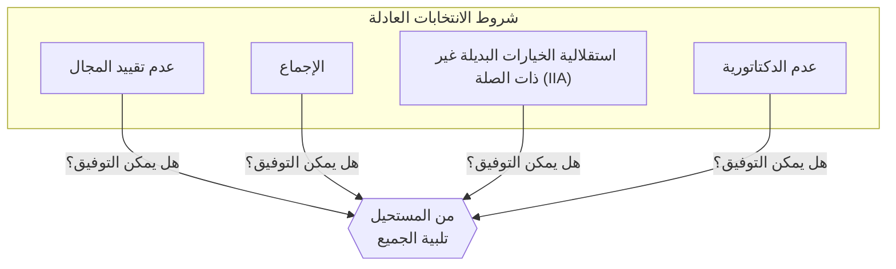
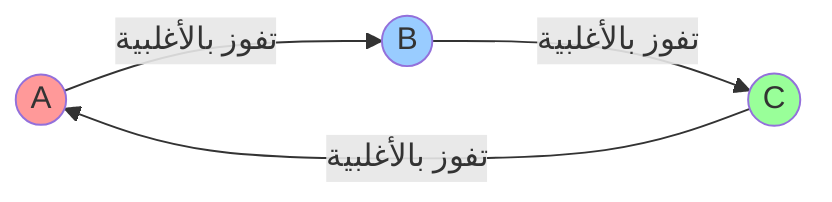
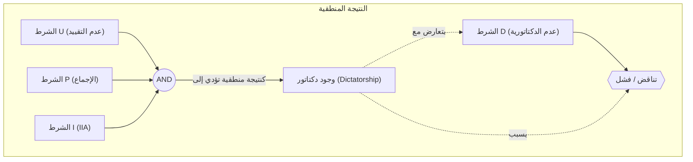

# مقدمة: هل يمكن تصميم "انتخابات مثالية"؟

عندما نتخذ قرارات في المجتمع، فإن الطرق الأكثر استخداماً هي "الانتخابات" أو "التصويت بالأغلبية". ولكن، هل يعكس **التصويت بالأغلبية** الإرادة الشعبية دائماً بدقة؟ أو، هل يمكننا إنشاء "نظام انتخابي مثالي يقتنع به الجميع" إذا أدخلنا قواعد مختلفة؟

في الواقع، الجواب الرياضي على هذا السؤال هو **"لا"**.

في عام 1951، أثبت الخبير الاقتصادي كينيث أرو (Kenneth Arrow) رياضياً أنه لا توجد قاعدة مثالية لاتخاذ القرار تستوفي مجموعة من الشروط العقلانية. وهذا ما يُعرف بـ **"[مبرهنة استحالة أرو](https://kenji.blog/ar/p/arrows-impossibility-theorem/)" ([Arrow's Impossibility Theorem](https://kenji.blog/ar/p/arrows-impossibility-theorem/))**. وحصل أرو على جائزة نوبل في الاقتصاد عام 1972 تقديراً لإسهاماته في نظرية الاختيار الاجتماعي، بما في ذلك هذا الإنجاز.

في هذه المقالة، سنشرح بالتفصيل ماذا تعني هذه المبرهنة، مدعمة بالأمثلة العملية، والصيغ الرياضية، والرسوم التوضيحية.

## 1. ما هي [مبرهنة استحالة أرو](https://kenji.blog/ar/p/arrows-impossibility-theorem/)؟

ببساطة، تنص [مبرهنة استحالة أرو](https://kenji.blog/ar/p/arrows-impossibility-theorem/) على أنه **"عندما يختار 3 ناخبين أو أكثر من بين 3 خيارات أو أكثر، فمن المستحيل تلبية جميع الشروط المتعددة التي يجب أن يستوفيها 'النظام الانتخابي العادل (قاعدة اتخاذ القرار)' في نفس الوقت"**.

يُقصد بـ "الانتخابات العادلة" هنا مجموعة من الشروط التي نشعر بديهياً أنها "عادلة". عرّف أرو الحد الأدنى من الشروط العقلانية التي يجب أن يفي بها المجتمع، وأظهر أنها غير متوافقة منطقياً.

### شروط مسبقة للمبرهنة

للتفكير في المبرهنة، نضع السيناريو التالي:

- مجموعة الخيارات $X = \{A, B, C, \dots\}$ (※ عدد الخيارات 3 أو أكثر)
- مجموعة الناخبين $V = \{1, 2, \dots, n\}$ (※ عدد الناخبين 3 أو أكثر)
- كل ناخب لديه "ترتيب تفضيل (تصنيف)" خاص به للخيارات.
- **دالة الرفاهية الاجتماعية (Social Welfare Function)** $F$: وهي دالة (أي قاعدة فرز الأصوات الانتخابية) تتلقى ترتيب التفضيل للجميع كمدخلات، وتُخرج ترتيب التفضيل للمجتمع بأكمله.

## 2. الشروط الأربعة التي يجب أن تفي بها "الانتخابات العادلة"

قدم أرو 4 شروط (أو 5 في بعض التوسعات) يجب أن تفي بها دالة الرفاهية الاجتماعية المثالية $F$. وجميعها تبدو بديهية للانتخابات الديمقراطية.

### الشرط 1: عدم تقييد المجال (Unrestricted Domain)
هذا الشرط يعني أنه يحق للناخبين أن يكون لديهم أي ترتيب تفضيل (تصنيف).
على سبيل المثال، سواء كان الرأي "A > B > C" أو الرأي "C > A > B"، وبغض النظر عن الترتيب، يجب أن يقبل نظام التجميع ذلك، ويتمكن من تحديد ترتيب المجتمع بأكمله دون التسبب في خطأ.

### الشرط 2: الإجماع (Pareto Principle / Unanimity)
إذا كان الجميع يعتقد أن "الخيار A مفضل على الخيار B (أي A > B)"، فيجب أن تكون النتيجة للمجتمع بأسره هي "A > B". يبدو هذا مطلباً طبيعياً للغاية.

### الشرط 3: استقلالية الخيارات البديلة غير ذات الصلة (Independence of Irrelevant Alternatives, IIA)
ينبغي أن يتحدد الترتيب الاجتماعي لخيارين، لنقل A و B، فقط من خلال الترتيب النسبي لـ A و B لدى الناخبين الفرديين، ولا ينبغي أن يتأثر بوجود خيار ثالث غير ذي صلة C، أو ترتيبه.

### الشرط 4: عدم الدكتاتورية (Non-dictatorship)
يجب ألا يكون النظام بحيث يصبح رأي شخص واحد معين (دكتاتور) هو القرار للمجتمع بأكمله دائماً، بغض النظر عن آراء جميع الأشخاص الآخرين.

---

أثبتت [مبرهنة استحالة أرو](https://kenji.blog/ar/p/arrows-impossibility-theorem/) حقيقة صادمة رياضياً وهي: **"لا توجد دالة رفاهية اجتماعية تفي بهذه الشروط الأربعة في نفس الوقت (فرض عدم الدكتاتورية سيؤدي دائماً إلى تناقض)"**.

## 3. أمثلة عملية: لماذا تتناقض الشروط؟

لماذا تتعارض هذه الشروط التي تبدو بديهية؟ دعونا نلقي نظرة على ذلك من خلال "مفارقة كوندورسيه" و "عيوب طريقة بوردا".

### مفارقة كوندورسيه (مأزق التصويت بالأغلبية)

لنفترض أن هناك 3 ناخبين (X، Y، Z) يصوتون على 3 سياسات (A، B، C). ترتيب تفضيلات كل منهم هو كما يلي:

- الناخب X: **A > B > C** 
- الناخب Y: **B > C > A** 
- الناخب Z: **C > A > B** 

دعونا نحدد النتيجة بالتصويت بالأغلبية وجهاً لوجه (دورة روبن):

1. **A ضد B** : يفضل الناخبان X و Z الخيار A (بالنسبة لـ Z الترتيب هو C>A>B لذا بين A و B يختار A)، بينما يفضل الناخب Y الخيار B. النتيجة 2 إلى 1 **فوز A (أي A > B)** .
2. **B ضد C** : يفضل الناخبان X و Y الخيار B، بينما يفضل الناخب Z الخيار C. النتيجة 2 إلى 1 **فوز B (أي B > C)** .
3. **C ضد A** : يفضل الناخبان Y و Z الخيار C، بينما يفضل الناخب X الخيار A. النتيجة 2 إلى 1 **فوز C (أي C > A)** .

كنتيجة للمجتمع بأكمله، نقع في حلقة **A > B > C > A ...** ولا يمكننا تحديد الترتيب. هذا ما يسمى بـ **مفارقة كوندورسيه (Condorcet Paradox)**. إذا حاولنا تلبية شرط "عدم تقييد المجال (يحق للناخبين امتلاك أي رأي)"، فلن يتمكن التصويت بالأغلبية من الحساب بشكل صحيح.

### طريقة بوردا وانهيار "الاستقلالية (IIA)"

إذن، لتجنب الحلقة، دعنا نقدم "نظام النقاط (طريقة بوردا)". يتم منح 3 نقاط للمركز الأول، و 2 نقطة للمركز الثاني، و نقطة واحدة للمركز الثالث، ثم يتم حساب مجموع النقاط لتحديد الفائز.

لنفترض أن هناك 5 ناخبين لديهم التفضيلات التالية:

- 3 ناخبين: **A > B > C** (A: 3 نقاط, B: 2 نقطة, C: 1 نقطة)
- 2 ناخبان: **B > C > A** (B: 3 نقاط, C: 2 نقطة, A: 1 نقطة)

نحسب إجمالي النقاط:
- نقاط A: $(3 \times 3) + (1 \times 2) = 11$ نقطة
- نقاط B: $(2 \times 3) + (3 \times 2) = 12$ نقطة
- نقاط C: $(1 \times 3) + (2 \times 2) = 7$ نقاط

النتيجة هي **B > A > C**، و B هو الفائز.

لنفترض الآن أنه تم استبعاد الخيار C لأي سبب من الأسباب. وفقًا للشرط 3 "استقلالية الخيارات البديلة غير ذات الصلة (IIA)"، حتى إذا اختفى C، فإن نتيجة الفوز والخسارة (الترتيب) بين A و B لا ينبغي أن تتغير.

دعونا نعيد حساب نظام النقاط بدون C (بحيث يحصل المركز الأول على نقطتين، والمركز الثاني على نقطة واحدة):
- 3 ناخبين: **A > B** 
- 2 ناخبان: **B > A** 

- نقاط A: $(2 \times 3) + (1 \times 2) = 8$ نقاط
- نقاط B: $(1 \times 3) + (2 \times 2) = 7$ نقاط

النتيجة أصبحت **A > B**، وانعكست النتيجة وأصبح A هو الفائز!
هذا يعني أن وجود الخيار الثالث C قد أثر على النتيجة بين A و B. بمعنى آخر، فإن الانتخابات القائمة على نظام النقاط **"لا يمكنها أن تلبي شرط الاستقلالية عن الخيارات البديلة غير ذات الصلة"**.

## 4. التعبير بواسطة الصيغ والمعادلات المنطقية

دعونا نعبّر عن [مبرهنة استحالة أرو](https://kenji.blog/ar/p/arrows-impossibility-theorem/) بشكل أكثر صرامة باستخدام الصيغ والمعادلات المنطقية.

ليكن مجموع الناخبين $V = \{1, 2, \dots, n\}$، ومجموعة الخيارات $X$ (حيث $|X| \ge 3$).
ليكن تفضيل الناخب $i$ هو $\succeq_i$، ومجموعة تفضيلات جميع الناخبين (الملف الشخصي) هو $P = (\succeq_1, \succeq_2, \dots, \succeq_n)$.
ولتكن دالة الرفاهية الاجتماعية هي $F$، ونصف التفضيل للمجتمع بأكمله بأنه $\succeq = F(P)$.

شروط أرو مصاغة على النحو التالي:

1. **عدم تقييد المجال (U)** :
   $F$ مُعرَّف لجميع الملفات الشخصية الممكنة $P$ حيث يكون كل $\succeq_i$ علاقة ثنائية كاملة ومتعدية على $X$.

2. **الإجماع (P)** :
   لأي خيارين $x, y \in X$، إذا كان لكل ناخب $i \in V$، $x \succ_i y$، فإنه في $F(P)$ سيكون $x \succ y$ أيضاً.
   $$ \forall x, y \in X, \ (\forall i \in V, \ x \succ_i y) \implies x \succ y $$

3. **استقلالية الخيارات البديلة غير ذات الصلة (I)** :
   لأي ملفين شخصيين $P, P'$، ولأي $x, y \in X$، إذا كانت العلاقة الترتيبية النسبية بين $x, y$ متساوية في $P$ و $P'$ لجميع الناخبين $i$، فإن العلاقة الترتيبية النسبية لـ $x, y$ في $F(P)$ و $F(P')$ متساوية أيضاً.
   $$ \forall x, y \in X, \ (\forall i \in V, \ x \succ_i y \iff x \succ'_i y) \implies (x \succ y \iff x \succ' y) $$

4. **عدم الدكتاتورية (D)** :
   لا يوجد دكتاتور $d \in V$ يمكنه، لأي ملف شخصي $P$، أن يحدد دائماً تفضيله القوي كتفضيل للمجتمع، بغض النظر عن تفضيلات الناخبين الآخرين.
   $$ \neg \exists d \in V \text{ s.t. } \forall P, \forall x, y \in X, \ (x \succ_d y \implies x \succ y) $$

**نص مبرهنة أرو** :
عندما يكون $|X| \ge 3$ و $|V| \ge 2$، فإن أي دالة رفاهية اجتماعية $F$ تفي بالشروط (U), (P), (I) يجب أن يكون لها دكتاتور (وهذا يتعارض مع الشرط (D)).
أي أنه لا توجد دالة $F$ تفي بالشروط (U), (P), (I), (D) معاً.

## 5. الخاتمة: هل الديمقراطية لا تعمل؟

"إذا لم يكن هناك نظام انتخابي مثالي، فهل يعني هذا أن الديمقراطية مليئة بالعيوب ولا معنى لها؟"

قد يشعر الكثيرون بذلك عندما يعلمون بهذه المبرهنة. ومع ذلك، في مجالات الاقتصاد والعلوم السياسية، تُعتبر هذه المبرهنة **"دليلاً للبحث عن تسويات واقعية بدلاً من السعي وراء الكمال"**.

في الواقع، يعمل مجتمعنا من خلال التخفيف قليلاً من أحد "شروط" المبرهنة:

1. **تخفيف شرط عدم تقييد المجال** :
   في السياسة الواقعية، آراء الناخبين (التفضيلات) ليست مبعثرة تماماً، بل غالباً ما يكون لها اتجاه معين (اليمين أو اليسار، وما يسمى بخصائص التفضيلات ذات الذروة الواحدة - Single-peaked preferences). في ظل هذه الظروف المحدودة، ثبت أن التصويت بالأغلبية يعمل بشكل جيد (مبرهنة الناخب الوسيط).

2. **تخفيف شرط الاستقلالية (IIA)** :
   على الرغم من أن طريقة بوردا المذكورة أعلاه أو التصويت الأغلبي بجولتين لا تفي بشرط IIA، إلا أنها تُعتمد على نطاق واسع في جميع أنحاء العالم كـ "قواعد انتخابية واقعية". يتم قبول خطر حدوث بعض التصويت التكتيكي (مثل التصويت لغير المرشح المفضل لتجنب ضياع الصوت) كبديل لاستبعاد الدكتاتورية.

3. **قياس "القوة" بجانب الترتيب** :
   تفترض مبرهنة أرو أننا نجمع فقط الترتيب "أفضل A على B". في السنوات الأخيرة، تمت دراسة أنظمة تتجنب المفارقات عن طريق إدخال "قوة" التفضيل أو "مدى القبول"، مثل "التصويت التقييمي (Range Voting)" أو "التصويت بالموافقة (Approval Voting)"، حيث يتم منح نقاط لكل خيار.

## في الختام

باستخدام اللغة الباردة للرياضيات، أثبتت [مبرهنة استحالة أرو](https://kenji.blog/ar/p/arrows-impossibility-theorem/) **"غياب قواعد مثالية للجميع"**. لكن هذا لا يعني هزيمة الديمقراطية.

بل يجب أخذها كرسالة إيجابية ومفيدة للغاية مفادها: **"بما أن كل نظام له نقاط ضعف، فمن المهم فهم هذه الضعف واختيار القواعد المثلى التي تناسب الموقف بعد نقاش مستفيض"**.

ولأنه لا يوجد نظام مثالي، يجب علينا التفكير والنقاش والاستمرار في تحديث مجتمعنا دائماً.
