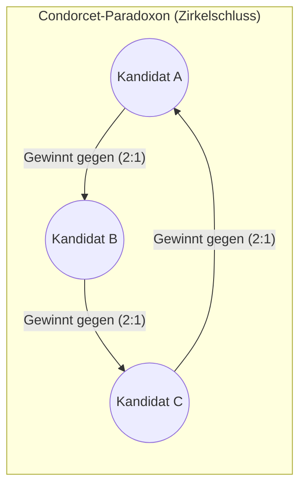
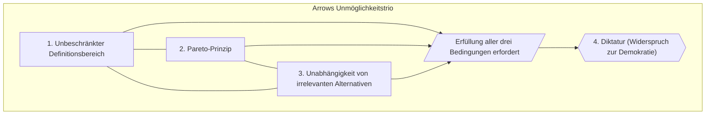

Wenn politische Wahlen oder Abstimmungen anstehen, hört man oft Stimmen der Unzufriedenheit wie „Mein Wille spiegelt sich nicht wider“ oder „Es hat sowieso der Kandidat gewonnen, der nur durch taktisches Wählen profitiert hat“. In solchen Momenten denken wir oft: „Gäbe es nur ein logischeres und gerechteres, perfektes Wahlsystem...“

Doch in den 1950er Jahren wurde in der Wirtschaftswissenschaft ein schockierendes mathematisches Theorem bewiesen. Es lautet: **„Ein absolut gerechtes und perfektes Wahlsystem existiert logischerweise nicht.“**

Dieses Theorem, das als **Unmöglichkeitssatz von Arrow** ([Arrow's Impossibility Theorem](https://kenji.blog/de/p/arrows-impossibility-theorem/)) bekannt ist, wurde von dem Ökonomen Kenneth Arrow (Nobelpreisträger für Wirtschaftswissenschaften) formuliert. In diesem Artikel werden wir die Essenz des Unmöglichkeitssatzes von Arrow ohne allzu komplexe mathematische Formeln und leicht verständlich erklären.

## Die Schwierigkeit von Wahlen (Das Condorcet-Paradoxon)

Bevor wir zu Arrows Theorem kommen, betrachten wir ein einfaches Beispiel (bekannt als das Condorcet-Paradoxon), das zeigt, warum Abstimmungen so schwierig sind.

Angenommen, drei Personen (Wähler 1, 2 und 3) wählen ihren Favoriten aus drei Optionen (A, B und C). Ihre Präferenzen (Ranglisten) sehen wie folgt aus:

- **Wähler 1**: 1. Wahl A > 2. Wahl B > 3. Wahl C (A > B > C)
- **Wähler 2**: 1. Wahl B > 2. Wahl C > 3. Wahl A (B > C > A)
- **Wähler 3**: 1. Wahl C > 2. Wahl A > 3. Wahl B (C > A > B)

Nun lassen wir diese drei Personen in direkten Duellen gegeneinander abstimmen.

1. **A vs. B**: Wähler 1 und 3 bevorzugen A gegenüber B. Wähler 2 bevorzugt B gegenüber A. $\to$ **A gewinnt mit 2 zu 1 (A > B)**
2. **B vs. C**: Wähler 1 und 2 bevorzugen B gegenüber C. Wähler 3 bevorzugt C gegenüber B. $\to$ **B gewinnt mit 2 zu 1 (B > C)**
3. **C vs. A**: Wähler 2 und 3 bevorzugen C gegenüber A. Wähler 1 bevorzugt A gegenüber C. $\to$ **C gewinnt mit 2 zu 1 (C > A)**

Fassen wir das Ergebnis zusammen:
**A gewinnt gegen B, B gewinnt gegen C, C gewinnt gegen A (A > B > C > A...)**

Obwohl die Präferenzen jedes Einzelnen keinen Widerspruch aufweisen, entsteht, wenn man den „Willen der Gruppe“ zusammenfasst, ein Zirkelschluss, ähnlich wie beim Schere-Stein-Papier, und der endgültige Gewinner kann nicht ermittelt werden. Dies zeigt uns, dass „die einfache Mehrheitsentscheidung nicht immer die optimale Wahl der gesamten Gruppe korrekt widerspiegelt“.

## Die 4 Bedingungen der Demokratie, die Arrow definierte

Arrow dachte: „Vielleicht ist nicht das Mehrheitswahlsystem fehlerhaft, sondern es ist prinzipiell unmöglich, eine Abstimmungsregel zu entwerfen, die alle zufriedenstellt.“ Er begann damit, die Bedingungen für „ein faires Wahlsystem“ mathematisch zu definieren.

Die von ihm postulierten Bedingungen, die ein „perfektes Wahlsystem (soziale Wohlfahrtsfunktion)“ erfüllen muss, sind im Wesentlichen die folgenden vier:

### 1. Unbeschränkter Definitionsbereich (Universelle Zulässigkeit)
Das Wahlsystem muss jedes erdenkliche Muster von individuellen Präferenzen (Ranglisten) zulassen. Es darf nicht heißen: „Dieses System funktioniert nicht, wenn diese spezifische Präferenzverteilung vorliegt“. Es muss immer ein Ergebnis liefern können.

### 2. Pareto-Prinzip (Schwaches Pareto-Prinzip)
Wenn **alle Wähler** Option A gegenüber Option B bevorzugen, dann muss auch das Wahlsystem (als Wille der gesamten Gesellschaft) zu dem Ergebnis kommen, dass „A besser ist als B“. Das ist das absolute Minimum an demokratischem Konsens.

### 3. Unabhängigkeit von irrelevanten Alternativen (IIA)
Ob die Gesellschaft A gegenüber B bevorzugt, darf **nur von den Präferenzen der Individuen bezüglich A und B** abhängen. Selbst wenn plötzlich ein Kandidat C hinzukommt oder ausscheidet, darf sich die gesellschaftliche Rangfolge von A und B nicht umkehren (es darf keinen „Spoiler-Effekt“ geben).
*(Ein Spoiler-Effekt ist beispielsweise, wenn das Auftreten eines dritten Kandidaten, der ähnliche Ansichten wie A vertritt, dazu führt, dass A Stimmen verliert und stattdessen B gewinnt.)*

### 4. Keine Diktatur (Non-dictatorship)
Das Wahlsystem darf nicht den Präferenzen einer bestimmten einzelnen Person (des Diktators) Vorrang geben und die Meinungen aller anderen ignorieren. Es ist keine Demokratie, wenn ein „Diktator“ das Ergebnis unabhängig von den restlichen Stimmen im Alleingang bestimmen kann.

## [Der Unmöglichkeitssatz von Arrow](https://kenji.blog/de/p/arrows-impossibility-theorem/)

Diese vier Bedingungen sind so grundlegend, dass jeder zustimmen würde: „Ein faires Wahlsystem sollte diese natürlich erfüllen.“ Arrows mathematischer Beweis hat jedoch folgende unbarmherzige Tatsache aufgedeckt:

> **Gibt es 3 oder mehr Optionen, so gibt es kein Wahlsystem, das alle diese vier Bedingungen gleichzeitig erfüllt.**

Mit anderen Worten: Wenn ein Wahlsystem versucht, die Bedingungen 1 bis 3 strikt einzuhalten, wird es unweigerlich zu einem System der **„Diktatur“** (Bedingung 4 wird verletzt). Verhindert man jedoch eine Diktatur, wird zwangsläufig eine der Bedingungen 1 bis 3 verletzt (wie z. B. der Spoiler-Effekt in Bedingung 3 oder das Eintreten des Condorcet-Paradoxons).

## Was bedeutet das für die Realität?

[Der Unmöglichkeitssatz von Arrow](https://kenji.blog/de/p/arrows-impossibility-theorem/) bedeutet nicht: „Deshalb sind Wahlen sinnlos und die Demokratie hat versagt.“ Er besagt vielmehr: **„Eine Abstimmung ist lediglich ein Werkzeug und nicht perfekt; wir müssen das System wählen, das am ehesten dem entspricht, worauf wir Wert legen.“**

Wenn wir uns tatsächliche Wahlsysteme ansehen, werden wir feststellen, dass sie alle auf irgendeine Weise bestimmte Bedingungen „opfern“ (insbesondere Bedingung 3: Unabhängigkeit von irrelevanten Alternativen).

- **Einfache Mehrheitswahl (Plurality Voting)**: Verletzt Bedingung 3 drastisch. Es kommt häufig zum Spoiler-Effekt, durch den eine Option gewinnt, die eigentlich von der Mehrheit abgelehnt wird.
- **Stichwahl (Runoff Voting)**: Wird häufig bei Präsidentschaftswahlen verwendet. Auch hier wird Bedingung 3 verletzt, da die Reihenfolge der Eliminierung das Endergebnis verändern kann (Monotonie-Probleme können auftreten).
- **Borda-Wahl (Borda Count)**: Ein Punktesystem (z. B. 1. Platz = 3 Punkte, 2. Platz = 2 Punkte). Spiegelt den Willen der Gesamtheit gut wider, verletzt jedoch ebenfalls Bedingung 3. Es ist sehr anfällig für taktisches Wählen (z. B. indem man dem stärksten Konkurrenten absichtlich die wenigsten Punkte gibt).

## Fazit

**„Ein absolut perfektes Wahlsystem, das jegliche Widersprüche ausschließt, existiert nicht.“**
Diese von Arrow bewiesene Tatsache mag auf den ersten Blick pessimistisch erscheinen. Wenn wir dieses Theorem jedoch richtig verstehen, können wir den Fokus künftiger Diskussionen von der Illusion einer „perfekten Lösung“ auf die Frage lenken: **„Für diese konkrete Entscheidung, welche Art von Fehler (Paradoxon) sind wir als Gesellschaft bereit zu tolerieren?“**

Die Mathematik zeigt uns keine „perfekte Lösung“, aber sie gibt uns die tiefe Einsicht, „die strukturellen Grenzen der Realität objektiv zu erfassen“. Das ist die größte Lehre aus dem Unmöglichkeitssatz von Arrow.
