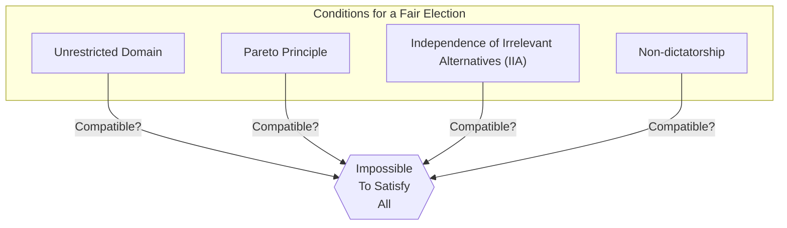
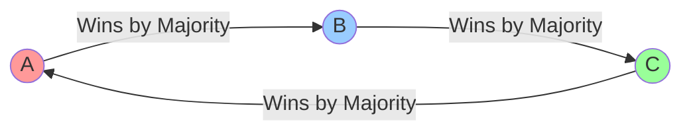
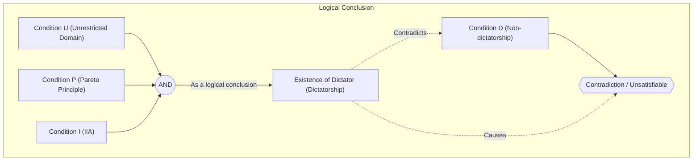

# Introduction: Can We Create a "Perfect Election"?

When we decide something in society, the most commonly used methods are "elections" or "majority rule." However, does **majority rule** always accurately reflect the will of the people? Or, if we introduce different rules, could we create a "perfect election system that everyone agrees with"?

In fact, the mathematical answer to this question is **"No."**

In 1951, the economist Kenneth Arrow mathematically proved that there is no perfect decision-making rule that satisfies certain reasonable conditions. This is **"[Arrow's Impossibility Theorem](https://kenji.blog/en/p/arrows-impossibility-theorem/)."** Arrow was awarded the Nobel Memorial Prize in Economic Sciences in 1972 for his contributions to social choice theory, including this achievement.

In this article, we will explain in detail what this theorem means, incorporating concrete examples, mathematical formulas, and diagrams.

## 1. What is [Arrow's Impossibility Theorem](https://kenji.blog/en/p/arrows-impossibility-theorem/)?

To put [Arrow's Impossibility Theorem](https://kenji.blog/en/p/arrows-impossibility-theorem/) simply, it states that **"When 3 or more voters are choosing from 3 or more options, it is impossible for a 'fair election (decision-making rule)' to simultaneously satisfy multiple conditions that it should meet."**

Here, a "fair election" refers to several conditions that we intuitively feel "would make it fair." Arrow defined the minimum reasonable conditions that a society should meet and showed that they are logically incompatible.

### Prerequisites of the Theorem

To consider the theorem, we set up the following situation:

- A set of options $X = \{A, B, C, \dots\}$ (*3 or more options)
- A set of voters $V = \{1, 2, \dots, n\}$ (*3 or more voters)
- Each voter has their own "preference order (ranking)" for the options.
- **Social Welfare Function** $F$: A function that takes everyone's preference order as input and outputs the preference order of society as a whole (i.e., the aggregation rule for the election).

## 2. Four Conditions a "Fair Election" Should Meet

Arrow presented the following 4 (or extended to 5) conditions that an ideal social welfare function $F$ should satisfy. All of them seem like things that "a democratic election should naturally satisfy."

### Condition 1: Unrestricted Domain
This is the condition that voters may have any preference order (ranking).
For example, whether the opinion is "A > B > C" or "C > A > B," the aggregation system must accept any order and determine the overall social order without causing an error.

### Condition 2: Pareto Principle / Unanimity
If everyone thinks "Option A is preferable to Option B (A > B)," then the result for society as a whole must also be "A > B." This seems like an extremely natural requirement.

### Condition 3: Independence of Irrelevant Alternatives (IIA)
The social ranking of any two options A and B should be determined solely by the relative ranking of A and B by individual voters, and must not be affected by the existence of an irrelevant third option C, or their ranking relative to C.

### Condition 4: Non-dictatorship
The system must not be such that the opinion of one specific person (a dictator) always becomes the decision of the entire society exactly as it is, regardless of the opinions of all other people.

---

[Arrow's Impossibility Theorem](https://kenji.blog/en/p/arrows-impossibility-theorem/) mathematically proved the shocking fact that **"there exists no social welfare function that satisfies all these 4 conditions simultaneously (imposing non-dictatorship always leads to a contradiction)."**

## 3. Concrete Examples: Why Do the Conditions Contradict Each Other?

Why do these seemingly natural conditions contradict each other? Let's look through the famous "Condorcet Paradox" and the "Problem with the Borda Count."

### Condorcet Paradox (The Pitfall of Majority Rule)

Suppose 3 voters (Mr. X, Mr. Y, Mr. Z) are voting on 3 policies (A, B, C). Their respective preference orders are as follows:

- Mr. X: **A > B > C** 
- Mr. Y: **B > C > A** 
- Mr. Z: **C > A > B** 

Let's decide this by 1-on-1 majority rule (round-robin).

1. **A vs B**: Mr. X and Mr. Z prefer A (Mr. Z is C>A>B, so between A and B, it's A), and Mr. Y prefers B. Result: **A wins (A > B)** by 2 to 1.
2. **B vs C**: Mr. X and Mr. Y prefer B, and Mr. Z prefers C. Result: **B wins (B > C)** by 2 to 1.
3. **C vs A**: Mr. Y and Mr. Z prefer C, and Mr. X prefers A. Result: **C wins (C > A)** by 2 to 1.

For society as a whole, it falls into a loop state of **A > B > C > A ...**, making it impossible to determine the ranking. This is called the **Condorcet Paradox**. If you try to satisfy "Unrestricted Domain (people can have any opinion)," majority rule can no longer aggregate correctly.

### The Borda Count and the Breakdown of "Independence (IIA)"

Then, let's introduce a "points system (Borda count)" to avoid the loop. It is a system where 1st place gets 3 points, 2nd place gets 2 points, and 3rd place gets 1 point, competing on total points.

Suppose there are 5 voters with the following preferences:

- 3 people: **A > B > C** (A: 3 pts, B: 2 pts, C: 1 pt)
- 2 people: **B > C > A** (B: 3 pts, C: 2 pts, A: 1 pt)

Let's calculate the total points:
- A's score: $(3 \times 3) + (1 \times 2) = 11$ points
- B's score: $(2 \times 3) + (3 \times 2) = 12$ points
- C's score: $(1 \times 3) + (2 \times 2) = 7$ points

The result is **B > A > C**, making B the winner.

Now, suppose option C is removed from the candidates for some reason. According to Condition 3 "Independence of Irrelevant Alternatives (IIA)," even if C disappears, the win/loss (ranking) of A and B should not change.

Let's recalculate with the points system (1st place 2 points, 2nd place 1 point) again with C removed (only A and B).
- 3 people: **A > B** 
- 2 people: **B > A** 

- A's score: $(2 \times 3) + (1 \times 2) = 8$ points
- B's score: $(1 \times 3) + (2 \times 2) = 7$ points

The result is **A > B**, and the winner has reversed to A!
This means that the existence of the third option C affected the win/loss of A and B. In other words, a points-based election **cannot satisfy "Independence of Irrelevant Alternatives."**

## 4. Expression Using Mathematical and Logical Formulas

Let's express [Arrow's Impossibility Theorem](https://kenji.blog/en/p/arrows-impossibility-theorem/) more rigorously using mathematical and logical formulas.

Let the set of voters be $V = \{1, 2, \dots, n\}$, and the set of options be $X$ ($|X| \ge 3$).
Let the preference of voter $i$ be $\succeq_i$, and the set of preferences of all voters (profile) be $P = (\succeq_1, \succeq_2, \dots, \succeq_n)$.
Let the social welfare function be $F$, and describe the preference of society as a whole as $\succeq = F(P)$.

Arrow's conditions are formulated as follows:

1. **Unrestricted Domain (U)**:
   $F$ is defined for all possible profiles $P$ such that each $\succeq_i$ is any complete and transitive binary relation on $X$.

2. **Pareto Principle / Unanimity (P)**:
   For any options $x, y \in X$, if $x \succ_i y$ for all voters $i \in V$, then $x \succ y$ in $F(P)$.
   $$ \forall x, y \in X, \ (\forall i \in V, \ x \succ_i y) \implies x \succ y $$

3. **Independence of Irrelevant Alternatives (I)**:
   For any two profiles $P, P'$ and any $x, y \in X$, if the relative ordering between $x, y$ for every voter $i$ is the same in $P$ and $P'$, then the relative ordering of $x, y$ in $F(P)$ and $F(P')$ is also the same.
   $$ \forall x, y \in X, \ (\forall i \in V, \ x \succ_i y \iff x \succ'_i y) \implies (x \succ y \iff x \succ' y) $$

4. **Non-dictatorship (D)**:
   There exists no dictator $d \in V$ such that for any profile $P$, regardless of the preferences of other voters, their own strict preference can always be determined as the society's preference.
   $$ \neg \exists d \in V \text{ s.t. } \forall P, \forall x, y \in X, \ (x \succ_d y \implies x \succ y) $$

**The Claim of Arrow's Theorem**:
When $|X| \ge 3$ and $|V| \ge 2$, any social welfare function $F$ that satisfies conditions (U), (P), and (I) must have a dictator (violates condition (D)).
In other words, there is no $F$ that simultaneously satisfies (U), (P), (I), and (D).

## 5. Conclusion: Does Democracy Not Work?

"If a perfect election system does not exist, is democracy full of flaws and meaningless?"

When learning about this theorem, many people might feel that way. However, in the fields of economics and political science, this theorem is viewed as **"a guidepost for finding realistic compromises, rather than pursuing perfection."**

In reality, our society functions by slightly relaxing one of the "conditions" of the theorem.

1. **Relaxing Unrestricted Domain**:
   In real politics, voters' opinions (preferences) are often not completely scattered but have a certain tendency (such as right-wing/left-wing, a property called single-peaked preferences). Under such limited situations, it has been proven that majority rule (the median voter theorem) works well.

2. **Relaxing Independence (IIA)**:
   The aforementioned Borda count and majority rule with runoff voting do not satisfy the IIA condition, but they are widely adopted around the world as "realistic election rules." Instead of accepting the risk of some strategic voting (such as voting for someone other than one's favorite to avoid a wasted vote), they eliminate dictatorship.

3. **Measuring "Strength" as well as Order**:
   Arrow's theorem assumes aggregating only the order, such as "I like A more than B." In recent years, systems that avoid the paradox by incorporating the "strength" or "tolerance" of preferences, such as "Range Voting" or "Approval Voting," which assign a score to each option, are also being studied.

## Conclusion

[Arrow's Impossibility Theorem](https://kenji.blog/en/p/arrows-impossibility-theorem/) used the cold language of mathematics to prove **"the absence of a rule that is perfect for everyone."** However, that does not mean the defeat of democracy.

Rather, we should take it as a very positive and educational message: **"Since every system inevitably has weaknesses, it is important to understand those weaknesses, choose the most optimal rule for the situation, and thoroughly discuss."**

Precisely because a perfect system does not exist, we must always think, discuss, and continue to update our society.
