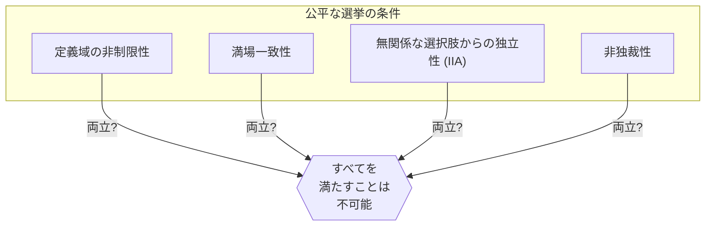
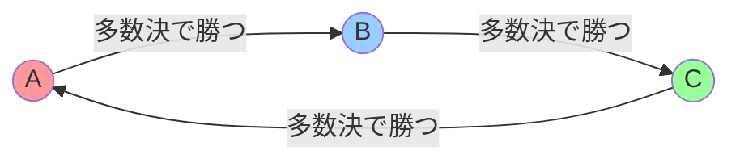
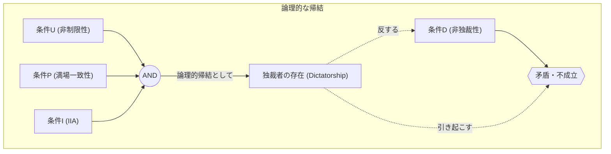

# Introducción: ¿Es posible crear unas "elecciones perfectas"?

Cuando decidimos algo en nuestra sociedad, lo más común es utilizar "elecciones" o la "regla de la mayoría". Sin embargo, ¿la **regla de la mayoría** refleja siempre con precisión la voluntad del pueblo? O si introducimos otras reglas, ¿podemos crear un "sistema electoral perfecto que convenza a todos"?

De hecho, la respuesta matemática a esta pregunta es **"No"**.

En 1951, el economista Kenneth Arrow demostró matemáticamente que no existe ninguna regla de toma de decisiones perfecta que satisfaga ciertas condiciones razonables. Esto es el **"Teorema de la imposibilidad de Arrow" (Arrow's Impossibility Theorem)**. Gracias a sus contribuciones a la teoría de la elección social, incluyendo este teorema, Arrow recibió el Premio Nobel de Economía en 1972.

En este artículo, explicaremos en detalle qué significa este teorema, utilizando ejemplos concretos, fórmulas y diagramas.

## 1. ¿Qué es el Teorema de la imposibilidad de Arrow?

En pocas palabras, el Teorema de la imposibilidad de Arrow establece que: **"Cuando 3 o más votantes deben elegir entre 3 o más alternativas, es imposible satisfacer simultáneamente todas las condiciones que debería cumplir una 'elección justa (regla de toma de decisiones)'"**.

Las "elecciones justas" aquí se refieren a varias condiciones que intuitivamente sentimos que son "justas". Arrow definió las condiciones racionales mínimas que la sociedad debería cumplir, y demostró que son lógicamente incompatibles.

### Premisas del teorema

Para considerar el teorema, establecemos la siguiente situación:

- Conjunto de alternativas $X = \{A, B, C, \dots\}$ (*3 o más alternativas)
- Conjunto de votantes $V = \{1, 2, \dots, n\}$ (*3 o más votantes)
- Cada votante tiene su propio "orden de preferencia (ranking)" de las alternativas.
- **Función de bienestar social (Social Welfare Function)** $F$: Una función que recibe el orden de preferencia de todos como entrada y emite el orden de preferencia de la sociedad en su conjunto (es decir, la regla de escrutinio de las elecciones).

## 2. Las 4 condiciones que deben cumplir unas "elecciones justas"

Arrow propuso cuatro condiciones (o cinco, en versiones extendidas) que debería satisfacer una función de bienestar social ideal $F$. Todas ellas parecen condiciones obvias que cualquier elección democrática debería cumplir.

### Condición 1: Dominio no restringido (Unrestricted Domain)
Esta condición significa que los votantes pueden tener cualquier orden de preferencia (ranking).
Por ejemplo, ya sea una opinión "A > B > C" o "C > A > B", sin importar el orden, el sistema de recuento debe aceptarla y poder determinar el orden de la sociedad en su conjunto sin causar errores.

### Condición 2: Unanimidad (Principio de Pareto / Unanimity)
Si todos piensan que "la alternativa A es preferible a la alternativa B (A > B)", entonces el resultado para la sociedad en su conjunto también debe ser "A > B". Parece una exigencia sumamente natural.

### Condición 3: Independencia de alternativas irrelevantes (Independence of Irrelevant Alternatives, IIA)
El orden social de dos alternativas A y B debe determinarse únicamente por el orden relativo de A y B para cada votante, y no debe verse afectado por la existencia de una tercera alternativa irrelevante C o su posición relativa respecto a ella.

### Condición 4: No dictadura (Non-dictatorship)
No debe ser un sistema donde, independientemente de la opinión de todas las demás personas, la opinión de una persona específica (el dictador) se convierta siempre directamente en la decisión de la sociedad en su conjunto.

---

El Teorema de la imposibilidad de Arrow demostró matemáticamente el impactante hecho de que **"No existe ninguna función de bienestar social que satisfaga estas 4 condiciones al mismo tiempo (imponer la no dictadura siempre lleva a una contradicción)"**.

## 3. Ejemplo concreto: ¿Por qué son contradictorias estas condiciones?

¿Por qué estas condiciones aparentemente obvias entran en contradicción? Veámoslo a través de la famosa "Paradoja de Condorcet" y los "Problemas del método de Borda".

### La Paradoja de Condorcet (Las trampas de la mayoría)

Supongamos que 3 votantes (Persona X, Persona Y, Persona Z) votan sobre 3 políticas (A, B, C). Sus respectivos órdenes de preferencia son los siguientes:

- Persona X: **A > B > C** 
- Persona Y: **B > C > A** 
- Persona Z: **C > A > B** 

Intentemos decidir esto por mayoría 1 a 1 (todos contra todos).

1. **A vs B**: X y Z prefieren A (Z tiene C>A>B, así que entre A y B prefiere A), Y prefiere B. Resultado, por 2 a 1, **A gana (A > B)**.
2. **B vs C**: X y Y prefieren B, Z prefiere C. Resultado, por 2 a 1, **B gana (B > C)**.
3. **C vs A**: Y y Z prefieren C, X prefiere A. Resultado, por 2 a 1, **C gana (C > A)**.

La sociedad en su conjunto cae en un bucle **A > B > C > A ...**, y es imposible determinar un orden. Esto se llama la **Paradoja de Condorcet (Condorcet Paradox)**. Si intentamos satisfacer el "Dominio no restringido" (cualquiera puede tener cualquier opinión), la regla de la mayoría no puede hacer un recuento correcto.

### El método de Borda y el colapso de la "Independencia (IIA)"

Para evitar el bucle, introduzcamos un "sistema de puntos (método de Borda)". El primer lugar recibe 3 puntos, el segundo 2 puntos y el tercero 1 punto, y se compite por la puntuación total.

Supongamos que hay 5 votantes con las siguientes preferencias:

- 3 personas: **A > B > C** (A: 3 puntos, B: 2 puntos, C: 1 punto)
- 2 personas: **B > C > A** (B: 3 puntos, C: 2 puntos, A: 1 punto)

Calculamos los puntos totales.
- Puntos de A: $(3 \times 3) + (1 \times 2) = 11$ puntos
- Puntos de B: $(2 \times 3) + (3 \times 2) = 12$ puntos
- Puntos de C: $(1 \times 3) + (2 \times 2) = 7$ puntos

El resultado es **B > A > C**, y B es el ganador.

Ahora, supongamos que la alternativa C se retira de los candidatos por alguna razón. Según la Condición 3, "Independencia de alternativas irrelevantes (IIA)", aunque C desaparezca, la victoria o derrota (orden) entre A y B no debería cambiar.

Volvamos a calcular con el sistema de puntos (1er lugar 2 puntos, 2do lugar 1 punto) sin C (solo A y B).
- 3 personas: **A > B** 
- 2 personas: **B > A** 

- Puntos de A: $(2 \times 3) + (1 \times 2) = 8$ puntos
- Puntos de B: $(1 \times 3) + (2 \times 2) = 7$ puntos

¡El resultado es **A > B**, y A se ha convertido en el ganador!
Esto significa que la existencia de la tercera alternativa, C, afectó la victoria o derrota entre A y B. En otras palabras, las elecciones basadas en sistemas de puntos **no pueden satisfacer la "Independencia de alternativas irrelevantes"**.

## 4. Representación mediante fórmulas y lógica

Expresemos el teorema de la imposibilidad de Arrow de forma más estricta mediante fórmulas matemáticas y lógica.

Sea $V = \{1, 2, \dots, n\}$ el conjunto de votantes y $X$ el conjunto de alternativas ($|X| \ge 3$).
La preferencia del votante $i$ es $\succeq_i$, y el conjunto (perfil) de preferencias de todos los votantes es $P = (\succeq_1, \succeq_2, \dots, \succeq_n)$.
La función de bienestar social es $F$, y la preferencia de la sociedad en su conjunto se escribe como $\succeq = F(P)$.

Las condiciones de Arrow se formalizan de la siguiente manera:

1. **Dominio no restringido (U)**:
   $F$ está definida para todos los perfiles posibles $P$, de modo que cada $\succeq_i$ es una relación binaria completa y transitiva arbitraria sobre $X$.

2. **Unanimidad (P)**:
   Para cualesquiera alternativas $x, y \in X$, si para todo votante $i \in V$ se tiene $x \succ_i y$, entonces en $F(P)$ también se tiene $x \succ y$.
   $$ \forall x, y \in X, \ (\forall i \in V, \ x \succ_i y) \implies x \succ y $$

3. **Independencia de alternativas irrelevantes (I)**:
   Para cualesquiera dos perfiles $P, P'$ y cualesquiera $x, y \in X$, si la relación de orden relativo entre $x, y$ para todo votante $i$ es igual en $P$ y en $P'$, entonces la relación de orden relativo de $x, y$ en $F(P)$ y $F(P')$ también es igual.
   $$ \forall x, y \in X, \ (\forall i \in V, \ x \succ_i y \iff x \succ'_i y) \implies (x \succ y \iff x \succ' y) $$

4. **No dictadura (D)**:
   No existe un dictador $d \in V$ tal que para cualquier perfil $P$, independientemente de las preferencias de otros votantes, su preferencia estricta siempre se decida como la preferencia de la sociedad.
   $$ \neg \exists d \in V \text{ s.t. } \forall P, \forall x, y \in X, \ (x \succ_d y \implies x \succ y) $$

**Afirmación del teorema de Arrow**:
Cuando $|X| \ge 3$ y $|V| \ge 2$, una función de bienestar social $F$ que satisfaga las condiciones (U), (P), e (I) siempre tiene un dictador (viola la condición (D)).
Es decir, no existe una $F$ que satisfaga simultáneamente (U), (P), (I) y (D).

## 5. Conclusión: ¿No funciona la democracia?

"Si no existe un sistema electoral perfecto, ¿la democracia está llena de defectos y carece de sentido?"

Al conocer este teorema, muchas personas podrían pensar eso. Sin embargo, en el campo de la economía y las ciencias políticas, este teorema se considera **"una guía no para buscar la perfección, sino para encontrar compromisos realistas"**.

En realidad, nuestra sociedad funciona relajando ligeramente alguna de las "condiciones" del teorema.

1. **Relajar el dominio no restringido**:
   En la política real, las opiniones (preferencias) de los votantes a menudo no son completamente aleatorias, sino que tienen cierta tendencia (como la derecha o la izquierda, lo que se llama preferencias de pico único). Se ha demostrado que, bajo estas condiciones limitadas, la regla de la mayoría (el teorema del votante mediano) funciona bien.

2. **Relajar la independencia (IIA)**:
   El mencionado método de Borda, o el sistema de dos vueltas, no satisfacen la condición IIA, pero son ampliamente adoptados en todo el mundo como "reglas electorales realistas". A cambio de aceptar el riesgo de que se produzca un voto estratégico (como votar por una segunda opción para evitar que gane el peor candidato), se elimina la dictadura.

3. **Medir no solo el orden, sino también la "fuerza"**:
   El teorema de Arrow asume que solo se suma el orden "Me gusta A más que B". En los últimos años, se han investigado sistemas que evitan la paradoja al incorporar la "fuerza" de la preferencia o el "nivel de tolerancia", como el "Voto por puntuación" (Range Voting) o el "Voto de aprobación" (Approval Voting), donde se otorgan puntos a cada alternativa.

## Palabras finales

El teorema de la imposibilidad de Arrow utilizó el lenguaje frío de las matemáticas para demostrar **"la ausencia de reglas perfectas para todos"**. Sin embargo, esto no significa el fracaso de la democracia.

Al contrario, debería entenderse como un mensaje sumamente positivo y aleccionador: **"Puesto que cualquier sistema tiene debilidades, es crucial comprenderlas, elegir la regla óptima para la situación y debatir a fondo"**.

Es precisamente porque no existe un sistema perfecto, que debemos seguir pensando, debatiendo y actualizando continuamente nuestra sociedad.
