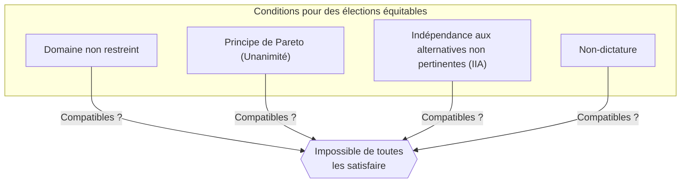
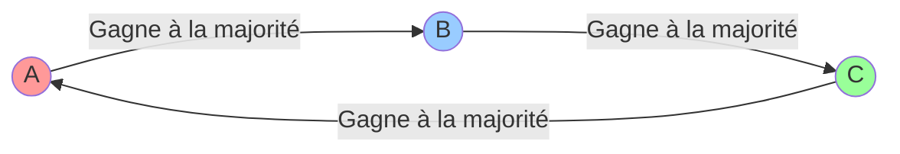
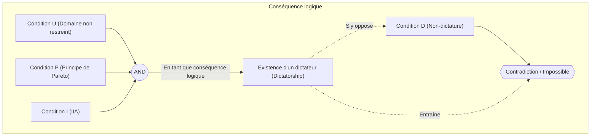

# Introduction : Peut-on créer des « élections parfaites » ?

Lorsque nous devons décider de quelque chose dans la société, la méthode la plus couramment utilisée est celle des « élections » ou de la « règle de la majorité ». Mais **la règle de la majorité** reflète-t-elle toujours fidèlement la volonté populaire ? Ou bien, pourrions-nous créer « un système électoral parfait dont tout le monde se satisferait » en introduisant de nouvelles règles ?

En réalité, la réponse mathématique à cette question est **« non »**.

En 1951, l'économiste Kenneth Arrow a prouvé mathématiquement qu'il n'existe pas de règle de décision parfaite satisfaisant simultanément un ensemble de conditions raisonnables. C'est le **« théorème d'impossibilité d'Arrow (Arrow's Impossibility Theorem) »**. Pour ses travaux, incluant cette contribution majeure à la théorie du choix social, Arrow a reçu le prix Nobel d'économie en 1972.

Dans cet article, nous allons expliquer en détail ce que signifie ce théorème, en utilisant des exemples concrets, des formules mathématiques et des schémas.

## 1. Qu'est-ce que le théorème d'impossibilité d'Arrow ?

En une phrase, le théorème d'impossibilité d'Arrow stipule que : **« Il est impossible qu'un système électoral (règle de décision) équitable satisfasse simultanément plusieurs critères logiques lorsque trois électeurs ou plus doivent choisir parmi trois options ou plus. »**

L'expression « élections équitables » désigne ici quelques critères intuitifs pour lesquels on pourrait se dire « cela semble juste ». Arrow a défini les conditions minimales rationnelles qu'une société devrait remplir, et a démontré qu'elles étaient logiquement incompatibles entre elles.

### Conditions préalables du théorème

Pour examiner le théorème, nous mettons en place la situation suivante :

- Un ensemble d'options $X = \{A, B, C, \dots\}$ (*trois options ou plus)
- Un ensemble d'électeurs $V = \{1, 2, \dots, n\}$ (*trois personnes ou plus)
- Chaque électeur possède son propre « ordre de préférence (classement) » pour ces options.
- Une **fonction de bien-être social (Social Welfare Function)** $F$ : c'est la fonction (ou la règle de décompte des élections) qui prend les préférences de tous les électeurs en entrée, et qui produit l'ordre de préférence global de la société en sortie.

## 2. Les 4 conditions que doit remplir une « élection équitable »

Arrow a proposé 4 conditions (ou 5 dans certaines extensions) que devrait satisfaire une fonction de bien-être social $F$ idéale. Toutes semblent être des exigences tout à fait naturelles pour des élections démocratiques.

### Condition 1 : Domaine non restreint (Unrestricted Domain)
C'est la condition selon laquelle les électeurs peuvent avoir n'importe quel ordre de préférence (classement).
Par exemple, que l'opinion soit « A > B > C » ou « C > A > B », le système de décompte doit accepter n'importe quel ordre et pouvoir déterminer l'ordre de l'ensemble de la société sans erreur.

### Condition 2 : Principe de Pareto / Unanimité (Pareto Principle / Unanimity)
Si tout le monde pense que « l'option A est préférable à l'option B (A > B) », le résultat pour l'ensemble de la société doit également être « A > B ». C'est une exigence qui semble extrêmement naturelle.

### Condition 3 : Indépendance aux alternatives non pertinentes (Independence of Irrelevant Alternatives, IIA)
L'ordre social entre deux options A et B ne doit dépendre que du classement relatif de A et de B par les électeurs individuels, et ne doit pas être affecté par la présence d'une troisième option non pertinente C, ni par son classement par rapport à C.

### Condition 4 : Non-dictature (Non-dictatorship)
Le système ne doit pas permettre que l'opinion d'une seule personne (le dictateur) devienne toujours la décision de la société entière, indépendamment des opinions de tous les autres.

---

Le théorème d'impossibilité d'Arrow prouve le fait choquant qu'**« il n'existe aucune fonction de bien-être social satisfaisant ces 4 conditions simultanément (imposer la non-dictature conduit toujours à une contradiction). »**

## 3. Exemples concrets : Pourquoi ces conditions sont-elles contradictoires ?

Pourquoi ces conditions apparemment évidentes se contredisent-elles ? Examinons cela à travers le célèbre « paradoxe de Condorcet » et les « problèmes de la méthode Borda ».

### Le paradoxe de Condorcet (les pièges du vote majoritaire)

Supposons que 3 électeurs (M. X, M. Y et M. Z) votent sur 3 politiques (A, B et C). Leurs ordres de préférence sont les suivants :

- M. X : **A > B > C**
- M. Y : **B > C > A**
- M. Z : **C > A > B**

Décidons par des votes majoritaires en un contre un (tournoi à la ronde).

1. **A vs B** : M. X et M. Z préfèrent A (puisque M. Z a C>A>B, il préfère A à B). M. Y préfère B. Résultat : **Victoire de A par 2 contre 1 (A > B)**.
2. **B vs C** : M. X et M. Y préfèrent B. M. Z préfère C. Résultat : **Victoire de B par 2 contre 1 (B > C)**.
3. **C vs A** : M. Y et M. Z préfèrent C. M. X préfère A. Résultat : **Victoire de C par 2 contre 1 (C > A)**.

Pour la société dans son ensemble, nous tombons dans une boucle **A > B > C > A ...**, et il est impossible de déterminer un classement. C'est ce qu'on appelle le **paradoxe de Condorcet (Condorcet Paradox)**. Si nous essayons de satisfaire le « Domaine non restreint (on peut avoir n'importe quelle opinion) », le système de la majorité simple ne peut plus compiler les résultats correctement.

### La méthode Borda et l'échec de l'« Indépendance (IIA) »

Pour éviter les boucles, introduisons un « système de points (méthode de Borda) ». La 1ère place rapporte 3 points, la 2ème place 2 points, et la 3ème place 1 point, puis on concourt sur le total des points.

Supposons qu'il y ait 5 électeurs avec les préférences suivantes :

- 3 personnes : **A > B > C** (A: 3 pts, B: 2 pts, C: 1 pt)
- 2 personnes : **B > C > A** (B: 3 pts, C: 2 pts, A: 1 pt)

Calculons les totaux.
- Score de A : $(3 \times 3) + (1 \times 2) = 11$ points
- Score de B : $(2 \times 3) + (3 \times 2) = 12$ points
- Score de C : $(1 \times 3) + (2 \times 2) = 7$ points

Le résultat est **B > A > C**, et B est le gagnant.

Maintenant, supposons que l'option C soit retirée des candidats pour une raison quelconque. Selon la condition 3 « Indépendance aux alternatives non pertinentes (IIA) », même si C disparaît, le classement entre A et B ne devrait pas changer.

Recalculons avec le système de points (1ère place = 2 points, 2ème place = 1 point) sans C (uniquement A et B).
- 3 personnes : **A > B**
- 2 personnes : **B > A**

- Score de A : $(2 \times 3) + (1 \times 2) = 8$ points
- Score de B : $(1 \times 3) + (2 \times 2) = 7$ points

Le résultat devient **A > B**, et le gagnant est renversé au profit de A !
Cela signifie que l'existence de la troisième option, C, a influencé la victoire ou la défaite entre A et B. En d'autres termes, les élections basées sur un système de points **ne peuvent pas satisfaire l'« Indépendance aux alternatives non pertinentes »**.

## 4. Représentation par des formules et expressions logiques

Exprimons le théorème d'impossibilité d'Arrow de manière plus rigoureuse à l'aide de formules et d'expressions logiques.

Soit $V = \{1, 2, \dots, n\}$ l'ensemble des électeurs, et $X$ l'ensemble des options (avec $|X| \ge 3$).
La préférence de l'électeur $i$ est notée $\succeq_i$, et le profil (ensemble des préférences de tous les électeurs) est noté $P = (\succeq_1, \succeq_2, \dots, \succeq_n)$.
La fonction de bien-être social est $F$, et la préférence de l'ensemble de la société s'écrit $\succeq = F(P)$.

Les conditions d'Arrow se formulent ainsi :

1. **Domaine non restreint (U)** :
   $F$ est définie pour tout profil $P$ possible où chaque $\succeq_i$ est une relation binaire complète et transitive sur $X$.

2. **Principe de Pareto / Unanimité (P)** :
   Pour toutes options $x, y \in X$, si pour tous les électeurs $i \in V$ on a $x \succ_i y$, alors dans $F(P)$ on doit avoir $x \succ y$.
   $$ \forall x, y \in X, \ (\forall i \in V, \ x \succ_i y) \implies x \succ y $$

3. **Indépendance aux alternatives non pertinentes (I)** :
   Pour tous les profils $P, P'$ et pour toutes options $x, y \in X$, si la relation d'ordre relative entre $x, y$ chez tous les électeurs $i$ est identique dans $P$ et dans $P'$, alors la relation d'ordre relative entre $x, y$ dans $F(P)$ et $F(P')$ est également identique.
   $$ \forall x, y \in X, \ (\forall i \in V, \ x \succ_i y \iff x \succ'_i y) \implies (x \succ y \iff x \succ' y) $$

4. **Non-dictature (D)** :
   Il n'existe aucun dictateur $d \in V$ tel que, pour tout profil $P$ et pour toutes options $x, y \in X$, sa stricte préférence détermine toujours celle de la société, quelles que soient les préférences des autres électeurs.
   $$ \neg \exists d \in V \text{ tel que } \forall P, \forall x, y \in X, \ (x \succ_d y \implies x \succ y) $$

**L'énoncé du théorème d'Arrow** :
Lorsque $|X| \ge 3$ et $|V| \ge 2$, toute fonction de bien-être social $F$ qui satisfait les conditions (U), (P) et (I) a obligatoirement un dictateur (ce qui enfreint la condition (D)).
Autrement dit, aucune fonction $F$ ne peut satisfaire simultanément (U), (P), (I) et (D).

## 5. Conclusion : La démocratie ne fonctionne-t-elle pas ?

« Puisqu'il n'existe pas de système électoral parfait, la démocratie n'est-elle que défauts et non-sens ? »

Beaucoup de gens peuvent ressentir cela en découvrant ce théorème. Cependant, dans les domaines de l'économie et des sciences politiques, ce théorème est perçu comme **« une boussole pour trouver un compromis réaliste plutôt que de chercher la perfection absolue »**.

En réalité, notre société fonctionne en assouplissant légèrement l'une des « conditions » du théorème.

1. **Assouplir le domaine non restreint** :
   Dans la politique du monde réel, les opinions des électeurs (préférences) ne sont pas complètement éparpillées, mais ont souvent une certaine tendance (préférence unimodale, comme la gauche et la droite). Dans une telle situation restreinte, il est prouvé que la règle de la majorité simple (le théorème de l'électeur médian) fonctionne très bien.

2. **Assouplir l'indépendance (IIA)** :
   La méthode Borda susmentionnée ou le scrutin majoritaire à deux tours ne satisfont pas la condition IIA, mais sont largement adoptés dans le monde entier comme des « règles électorales réalistes ». En acceptant le risque d'un certain vote stratégique (comme voter pour un autre candidat pour éviter un vote perdu), on écarte l'hypothèse de la dictature.

3. **Mesurer non seulement l'ordre, mais aussi la « force »** :
   Le théorème d'Arrow repose sur le postulat selon lequel on ne compile que l'ordre des préférences (par exemple « Je préfère A à B »). Récemment, on étudie des systèmes qui évitent le paradoxe en intégrant la « force » ou la « tolérance » des préférences, comme le « vote par valeurs (Range Voting) » où chaque option est notée, ou le « vote par approbation (Approval Voting) ».

## Pour finir

Le théorème d'impossibilité d'Arrow a utilisé le langage froid et implacable des mathématiques pour prouver **« l'absence d'une règle qui soit parfaite pour tous »**. Cependant, cela ne signifie en aucun cas l'échec de la démocratie.

C'est plutôt un message extrêmement positif et instructif qui devrait être perçu comme tel : **« Puisque tout système a obligatoirement des faiblesses, il est essentiel de comprendre ces faiblesses, de choisir la règle la plus adaptée à la situation et de débattre activement. »**

C'est justement parce qu'il n'existe pas de système parfait que nous devons continuer à réfléchir, à débattre et à mettre à jour continuellement notre société.
