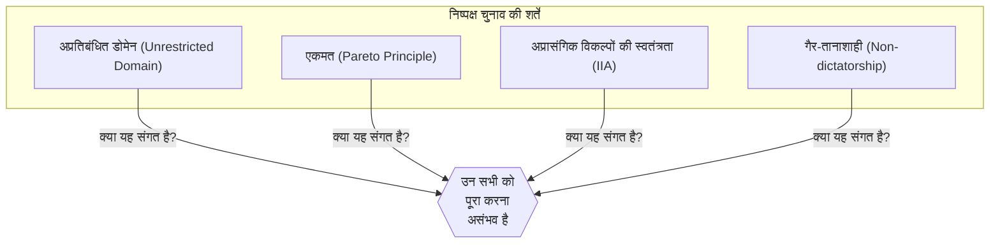
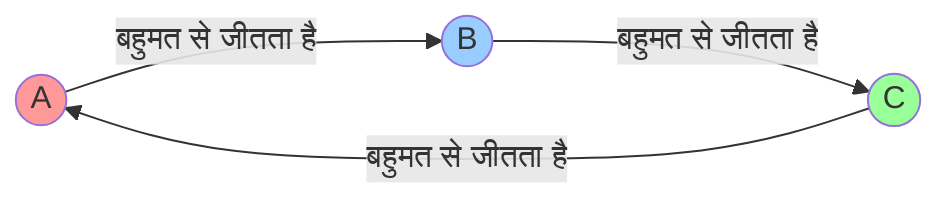
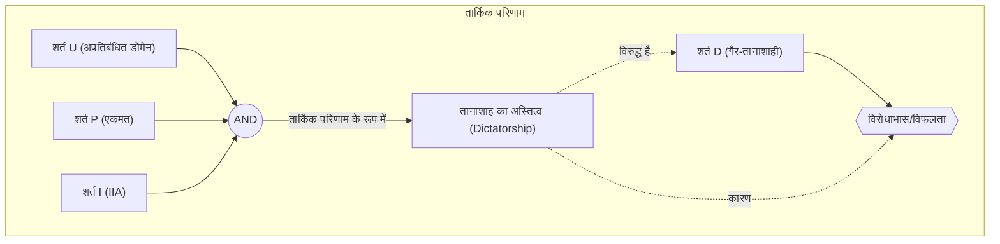

# परिचय: क्या हम एक "संपूर्ण चुनाव" बना सकते हैं?

जब हम समाज में निर्णय लेते हैं, तो सबसे अधिक उपयोग की जाने वाली विधियाँ "चुनाव (elections)" और "बहुमत का नियम (majority vote)" हैं। हालाँकि, क्या **बहुमत का नियम** हमेशा लोगों की इच्छा को सटीक रूप से दर्शाता है? या, यदि हम अलग-अलग नियम लागू करते हैं, तो क्या हम एक "संपूर्ण चुनाव प्रणाली बना सकते हैं जिससे हर कोई सहमत हो"?

वास्तव में, इस प्रश्न का गणितीय उत्तर **"नहीं"** है।

1951 में, अर्थशास्त्री केनेथ एरो (Kenneth Arrow) ने गणितीय रूप से साबित किया कि कोई संपूर्ण निर्णय लेने वाला नियम मौजूद नहीं है जो कुछ उचित शर्तों को पूरा करता हो। यही **"एरो की असंभवता प्रमेय ([Arrow's Impossibility Theorem](https://kenji.blog/hi/p/arrows-impossibility-theorem/))"** है। एरो ने सामाजिक पसंद सिद्धांत (Social Choice Theory) में उनके योगदान के लिए 1972 में अर्थशास्त्र में नोबेल पुरस्कार जीता, जिसमें यह उपलब्धि भी शामिल है।

इस लेख में, हम विशिष्ट उदाहरणों, गणितीय सूत्रों और आरेखों का उपयोग करते हुए विस्तार से बताएंगे कि इस प्रमेय का क्या अर्थ है।

## 1. [एरो का असंभवता प्रमेय](https://kenji.blog/hi/p/arrows-impossibility-theorem/) क्या है?

संक्षेप में, [एरो का असंभवता प्रमेय](https://kenji.blog/hi/p/arrows-impossibility-theorem/) बताता है कि **"जब 3 या अधिक मतदाता 3 या अधिक विकल्पों में से चुन रहे हों, तो उन सभी शर्तों को एक साथ पूरा करना असंभव है जिन्हें एक ['नि](https://kenji.blog/hi/p/paint.netの魅力/)ष्पक्ष चुनाव (निर्णय लेने का नियम)' को पूरा करना चाहिए।"**

यहां "निष्पक्ष चुनाव" कई शर्तों को संदर्भित करता है जो हमें सहज रूप से लगता है कि "निष्पक्ष" होना चाहिए। एरो ने न्यूनतम तर्कसंगत स्थितियों (rational conditions) को परिभाषित किया जिन्हें एक समाज को पूरा करना चाहिए, और दिखाया कि वे तार्किक रूप से असंगत (incompatible) हैं।

### प्रमेय की पूर्व-शर्तें (Prerequisites)

प्रमेय पर विचार करते समय, हम निम्नलिखित स्थिति निर्धारित करते हैं।

- विकल्पों का सेट $X = \{A, B, C, \dots\}$ (※ 3 या अधिक विकल्प)
- मतदाताओं का सेट $V = \{1, 2, \dots, n\}$ (※ 3 या अधिक मतदाता)
- प्रत्येक मतदाता के पास विकल्पों के लिए अपनी "प्राथमिकता क्रम (रैंकिंग / Preference order)" है।
- **सामाजिक कल्याण समारोह (Social Welfare Function)** $F$: एक ऐसा कार्य जो इनपुट के रूप में सभी के प्राथमिकता आदेश प्राप्त करता है और समग्र रूप से समाज के प्राथमिकता आदेश को आउटपुट करता है (यानी, चुनाव एकत्रीकरण नियम)।

## 2. "निष्पक्ष चुनाव" द्वारा पूरी की जाने वाली 4 शर्तें

एरो ने निम्नलिखित 4 (या विस्तारित 5) शर्तें प्रस्तुत की जिन्हें एक आदर्श सामाजिक कल्याण फ़ंक्शन $F$ को पूरा करना चाहिए। ये सभी ऐसी चीजें हैं जिन्हें आप सोचेंगे कि "यदि यह एक लोकतांत्रिक चुनाव है तो निश्चित रूप से संतुष्ट होना चाहिए।"

### शर्त 1: अप्रतिबंधित डोमेन (Unrestricted Domain)
यह शर्त है कि मतदाताओं का कोई भी प्राथमिकता क्रम (रैंकिंग) हो सकता है।
उदाहरण के लिए, एकत्रीकरण प्रणाली (aggregation system) को "A > B > C" और "C > A > B" दोनों विचारों को स्वीकार करने में सक्षम होना चाहिए, और त्रुटियों के बिना समग्र रूप से समाज के क्रम को निर्धारित करना चाहिए, चाहे क्रम कुछ भी हो।

### शर्त 2: पेरेटो सिद्धांत / एकमत (Pareto Principle / Unanimity)
यह शर्त है कि यदि हर कोई सोचता है कि "विकल्प A विकल्प B से बेहतर है (A > B)", तो समग्र रूप से समाज का परिणाम भी "A > B" होना चाहिए। यह एक बहुत ही स्वाभाविक आवश्यकता लगती है।

### शर्त 3: अप्रासंगिक विकल्पों की स्वतंत्रता (Independence of Irrelevant Alternatives, IIA)
यह शर्त है कि किसी भी दो विकल्पों A और B की सामाजिक रैंकिंग पूरी तरह से A और B की संबंधित रैंकिंग (व्यक्तिगत मतदाताओं द्वारा) पर निर्भर होनी चाहिए, न कि किसी तीसरे असंबद्ध विकल्प C की उपस्थिति या C के खिलाफ रैंकिंग से प्रभावित होनी चाहिए।

### शर्त 4: गैर-तानाशाही (Non-dictatorship)
यह शर्त है कि कोई ऐसी प्रणाली नहीं होनी चाहिए जिसमें किसी विशिष्ट व्यक्ति (तानाशाह) की राय हमेशा समाज का समग्र निर्णय बन जाए, भले ही अन्य सभी की राय कुछ भी हो।

---

एरो की असंभवता प्रमेय ने गणितीय रूप से इस चौंकाने वाले तथ्य को साबित कर दिया कि **"ऐसा कोई सामाजिक कल्याण कार्य (Social Welfare Function) नहीं है जो एक ही समय में इन सभी 4 शर्तों को पूरा करता हो (यदि आप गैर-तानाशाही लगाते हैं, तो यह हमेशा विरोधाभास पैदा करेगा)।"**

## 3. विशिष्ट उदाहरण: स्थितियाँ विरोधाभासी क्यों हैं?

ये प्रतीत होने वाली स्वाभाविक स्थितियाँ विरोधाभासी क्यों हैं? आइए इसे प्रसिद्ध "कोंडोरसेट विरोधाभास (Condorcet Paradox)" और "बोर्दा गिनती की समस्याओं (Problems of Borda Count)" के माध्यम से देखें।

### कोंडोरसेट का विरोधाभास (बहुमत वोट के नुकसान)

मान लीजिए 3 मतदाता (श्री एक्स, श्री वाई, और श्री जेड) 3 नीतियों (ए, बी, और सी) पर मतदान करते हैं। प्रत्येक की प्राथमिकता क्रम इस प्रकार है।

- श्री एक्स: **A > B > C** 
- श्री वाई: **B > C > A** 
- श्री जेड: **C > A > B** 

आइए इसे आमने-सामने (एक-पर-एक) बहुमत वोट (राउंड-रॉबिन टूर्नामेंट) से तय करें।

1. **A vs B** : X और Z, A को पसंद करते हैं (चूंकि Z, C>A>B है, इसलिए A और B के बीच, यह A है), और Y, B को पसंद करता है। परिणामस्वरूप, **A 2 से 1 से जीतता है (A > B)**।
2. **B vs C** : X और Y, B को पसंद करते हैं, और Z, C को पसंद करता है। परिणामस्वरूप, **B 2 से 1 से जीतता है (B > C)**।
3. **C vs A** : Y और Z, C को पसंद करते हैं, और X, A को पसंद करता है। परिणामस्वरूप, **C 2 से 1 से जीतता है (C > A)**।

समग्र रूप से समाज के रूप में, यह **A > B > C > A ...** की लूप स्थिति में आ जाता है, और रैंकिंग तय नहीं की जा सकती। इसे **कोंडोरसेट विरोधाभास (Condorcet Paradox)** कहा जाता है। यदि आप "अप्रतिबंधित डोमेन (आप कोई भी राय रख सकते हैं)" को संतुष्ट करने का प्रयास करते हैं, तो बहुमत का वोट सही ढंग से एकत्र नहीं कर पाएगा।

### बोर्दा गिनती (Borda Count) और "स्वतंत्रता (IIA)" का टूटना

तो, लूप से बचने के लिए, आइए एक "पॉइंट सिस्टम (बोर्दा काउंट / Borda Count)" का उपयोग करें। इस प्रणाली में, प्रथम स्थान को 3 अंक दिए जाते हैं, दूसरे स्थान को 2 अंक, और तीसरे स्थान को 1 अंक, और विकल्प कुल अंकों के आधार पर प्रतिस्पर्धा करते हैं।

मान लीजिए 5 मतदाता हैं और उनकी प्राथमिकताएँ इस प्रकार हैं।

- 3 लोग: **A > B > C** (A: 3 अंक, B: 2 अंक, C: 1 अंक)
- 2 लोग: **B > C > A** (B: 3 अंक, C: 2 अंक, A: 1 अंक)

कुल अंकों की गणना करें:
- A का स्कोर: $(3 \times 3) + (1 \times 2) = 11$ अंक
- B का स्कोर: $(2 \times 3) + (3 \times 2) = 12$ अंक
- C का स्कोर: $(1 \times 3) + (2 \times 2) = 7$ अंक

परिणाम **B > A > C** है, और B विजेता है।

अब, मान लीजिए कि विकल्प C को किसी कारण से हटा दिया गया है। शर्त 3 "अप्रासंगिक विकल्पों की स्वतंत्रता (IIA)" के अनुसार, भले ही C गायब हो जाए, A और B का जीत/हार (रैंकिंग) नहीं बदलना चाहिए।

आइए C को हटाकर (केवल A और B) पॉइंट सिस्टम (पहला स्थान 2 अंक, दूसरा स्थान 1 अंक) का उपयोग करके फिर से गणना करें।
- 3 लोग: **A > B** 
- 2 लोग: **B > A** 

- A का स्कोर: $(2 \times 3) + (1 \times 2) = 8$ अंक
- B का स्कोर: $(1 \times 3) + (2 \times 2) = 7$ अंक

परिणाम **A > B** है, और विजेता A में बदल गया है!
इसका मतलब यह है कि तीसरे विकल्प C की उपस्थिति ने A और B की जीत या हार को प्रभावित किया। दूसरे शब्दों में, बिंदु-आधारित चुनाव **"अप्रासंगिक विकल्पों की स्वतंत्रता" को संतुष्ट नहीं कर सकते**।

## 4. गणितीय सूत्र और तार्किक अभिव्यक्तियाँ

आइए अधिक सख्ती से गणितीय सूत्रों और तार्किक अभिव्यक्तियों (logical expressions) का उपयोग करके एरो की असंभवता प्रमेय को व्यक्त करें।

मान लें कि मतदाताओं का सेट $V = \{1, 2, \dots, n\}$ है, और विकल्पों का सेट $X$ है ($|X| \ge 3$)।
मतदाता $i$ की प्राथमिकता को $\succeq_i$ होने दें, और सभी मतदाताओं की प्राथमिकताओं (प्रोफ़ाइल) के समूह को $P = (\succeq_1, \succeq_2, \dots, \succeq_n)$ होने दें।
सामाजिक कल्याण फ़ंक्शन $F$ है, और समग्र रूप से समाज की प्राथमिकता $\succeq = F(P)$ के रूप में लिखी गई है।

एरो की शर्तें इस प्रकार तैयार की गई हैं:

1. **अप्रतिबंधित डोमेन (U)**:
   $F$ को सभी संभावित प्रोफाइलों $P$ के लिए परिभाषित किया गया है, जैसे कि प्रत्येक $\succeq_i$, $X$ पर कोई भी पूर्ण और सकर्मक (transitive) बाइनरी संबंध है।

2. **एकमत (P)**:
   किन्हीं दो विकल्पों $x, y \in X$ के लिए, यदि सभी मतदाताओं $i \in V$ के लिए $x \succ_i y$ है, तो $F(P)$ में भी $x \succ y$ होगा।
   $$ \forall x, y \in X, \ (\forall i \in V, \ x \succ_i y) \implies x \succ y $$

3. **अप्रासंगिक विकल्पों की स्वतंत्रता (I)**:
   किन्हीं भी दो प्रोफाइल $P, P'$ और किन्हीं भी $x, y \in X$ के लिए, यदि सभी मतदाताओं $i$ के लिए $x, y$ के बीच सापेक्ष क्रम संबंध $P$ और $P'$ में समान है, तो $F(P)$ और $F(P')$ में $x, y$ के बीच सापेक्ष क्रम संबंध भी समान है।
   $$ \forall x, y \in X, \ (\forall i \in V, \ x \succ_i y \iff x \succ'_i y) \implies (x \succ y \iff x \succ' y) $$

4. **गैर-तानाशाही (D)**:
   किसी भी प्रोफाइल $P$ के लिए, कोई ऐसा तानाशाह $d \in V$ मौजूद नहीं है जो हमेशा अपनी प्राथमिकताओं को समाज की प्राथमिकताओं के रूप में निर्धारित कर सके, चाहे अन्य मतदाताओं की प्राथमिकताएँ कुछ भी हों।
   $$ \neg \exists d \in V \text{ s.t. } \forall P, \forall x, y \in X, \ (x \succ_d y \implies x \succ y) $$

**एरो की प्रमेय का दावा**:
जब $|X| \ge 3$ और $|V| \ge 2$, शर्ते (U), (P), (I) को संतुष्ट करने वाले सामाजिक कल्याण फ़ंक्शन $F$ में हमेशा एक तानाशाह होगा (शर्त (D) का उल्लंघन करता है)।
दूसरे शब्दों में, ऐसा कोई $F$ मौजूद नहीं है जो एक ही समय में (U), (P), (I), (D) को संतुष्ट करता हो।

## 5. निष्कर्ष: क्या लोकतंत्र काम नहीं करता?

"यदि कोई संपूर्ण चुनाव प्रणाली नहीं है, तो क्या लोकतंत्र त्रुटिपूर्ण और अर्थहीन है?"

इस प्रमेय को जानने पर कई लोग ऐसा ही महसूस कर सकते हैं। हालाँकि, अर्थशास्त्र और राजनीति विज्ञान के क्षेत्र में, इस प्रमेय को **"पूर्णता (perfection) को आगे बढ़ाने के बजाय यथार्थवादी समझौते खोजने के लिए एक मार्गदर्शक संकेत"** के रूप में देखा जाता है।

वास्तव में, हमारा समाज प्रमेय की "शर्तों" में से किसी एक को थोड़ा शिथिल करके कार्य करता है।

1. **अप्रतिबंधित डोमेन को ढीला करना (Relaxing Unrestricted Domain)**:
   वास्तविक दुनिया की राजनीति में, मतदाताओं की राय (प्राथमिकताएं) पूरी तरह से अलग नहीं होती हैं, बल्कि अक्सर एक निश्चित प्रवृत्ति (जैसे दक्षिणपंथी/वामपंथी, जिसे एकल-चोटी वरीयताएँ / single-peaked preferences कहा जाता है) होती है। यह साबित हो चुका है कि ऐसी सीमित परिस्थितियों में, बहुमत वोट (मेडियन वोटर थ्योरम / Median Voter Theorem) अच्छी तरह से काम करता है।

2. **स्वतंत्रता को ढीला करना (Relaxing IIA)**:
   उपर्युक्त बोर्दा काउंट और रन-ऑफ वोटिंग के साथ बहुमत वोट IIA शर्तों को पूरा नहीं करते हैं, लेकिन उन्हें दुनिया भर में "यथार्थवादी चुनाव नियमों" के रूप में व्यापक रूप से अपनाया जाता है। कुछ रणनीतिक मतदान (जैसे व्यर्थ वोटों से बचने के लिए अपने पसंदीदा के अलावा किसी अन्य को वोट देना) के जोखिम को स्वीकार करने के बदले में, तानाशाही को समाप्त कर दिया जाता है।

3. **न केवल क्रम बल्कि "ताकत (Strength)" मापना**:
   एरो की प्रमेय पूरी तरह से आदेश एकत्र करने पर आधारित है कि "मैं B से अधिक A को पसंद करता हूं।" हाल के वर्षों में, सिस्टम पर शोध किया गया है जो प्रत्येक विकल्प को एक स्कोर देने वाले "रेंज वोटिंग (Range Voting)" या "अनुमोदन वोटिंग (Approval Voting)" जैसे वरीयताओं की "ताकत" या "सहिष्णुता" को शामिल करके विरोधाभास से बचते हैं।

## अंत में

एरो की असंभवता प्रमेय ने गणित की ठंडी भाषा का उपयोग करते हुए **"एक ऐसे नियम की अनुपस्थिति को साबित कर दिया जो सभी के लिए एकदम सही है।"** लेकिन इसका मतलब लोकतंत्र की हार नहीं है।

बल्कि, इसे एक बहुत ही सकारात्मक और शिक्षाप्रद संदेश के रूप में लिया जाना चाहिए: **"चूँकि किसी भी प्रणाली में हमेशा कमज़ोरियाँ होंगी, यह महत्वपूर्ण है कि उन कमज़ोरियों को समझा जाए, उस नियम को चुना जाए जो स्थिति के अनुकूल हो, और उसके बारे में पूरी तरह से चर्चा की जाए।"**

चूँकि कोई संपूर्ण प्रणाली नहीं है, हमें हमेशा विचार करना, चर्चा करना और अपने समाज को अद्यतन (update) करना जारी रखना चाहिए।
