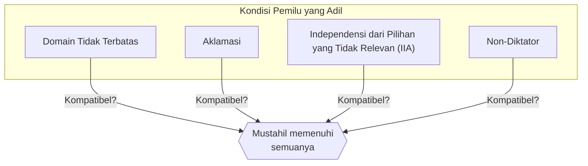
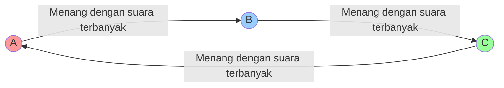
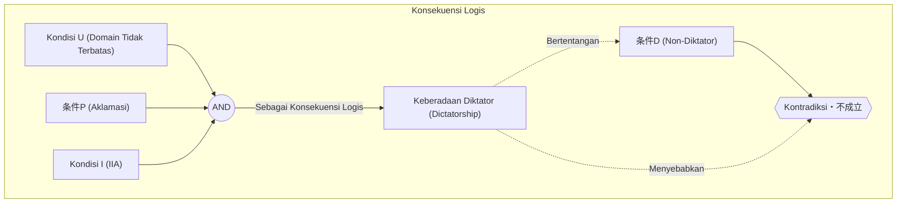

# Pendahuluan: Apakah Mungkin Membuat "Pemilu yang Sempurna"?

Saat kita memutuskan sesuatu dalam masyarakat, "pemilu" atau "suara terbanyak" (mayoritas) adalah metode yang paling umum digunakan. Namun, apakah **suara terbanyak** selalu mencerminkan kehendak rakyat secara akurat? Atau, jika kita memperkenalkan aturan lain, mungkinkah kita membuat "sistem pemilu sempurna yang dapat diterima oleh semua orang"?

Faktanya, jawaban matematis untuk pertanyaan ini adalah **"Tidak"**.

Pada tahun 1951, ekonom Kenneth Arrow membuktikan secara matematis bahwa aturan pengambilan keputusan yang sempurna dan memenuhi kondisi rasional tertentu tidaklah ada. Inilah yang disebut dengan **"Teorema Ketidakmungkinan Arrow (Arrow's Impossibility Theorem)"**. Atas kontribusinya pada teori pilihan sosial, termasuk pencapaian ini, Arrow menerima Penghargaan Nobel Ekonomi pada tahun 1972.

Dalam artikel ini, kami akan menjelaskan secara rinci apa arti dari teorema ini, disertai dengan contoh konkret, rumus matematika, dan ilustrasi.

## 1. Apa itu Teorema Ketidakmungkinan Arrow?

Singkatnya, Teorema Ketidakmungkinan Arrow menyatakan bahwa: **"Ketika ada tiga atau lebih pemilih yang memilih dari tiga atau lebih pilihan, tidak mungkin untuk memenuhi semua kondisi dari 'pemilu (aturan pengambilan keputusan) yang adil' secara bersamaan."**

"Pemilu yang adil" di sini mengacu pada beberapa kondisi yang secara intuitif kita rasakan "adil". Arrow mendefinisikan kondisi rasional minimum yang harus dipenuhi masyarakat, dan menunjukkan bahwa kondisi-kondisi tersebut secara logis tidak selaras.

### Prasyarat Teorema

Untuk memahami teorema ini, mari kita tetapkan situasi berikut:

- Himpunan pilihan $X = \{A, B, C, \dots\}$ (※ pilihan berjumlah tiga atau lebih)
- Himpunan pemilih $V = \{1, 2, \dots, n\}$ (※ pemilih berjumlah tiga atau lebih)
- Setiap pemilih memiliki "urutan preferensi (peringkat)" masing-masing terhadap pilihan tersebut.
- **Fungsi Kesejahteraan Sosial (Social Welfare Function)** $F$: Sebuah fungsi yang menerima urutan preferensi dari semua pemilih sebagai input dan menghasilkan urutan preferensi masyarakat secara keseluruhan sebagai output (yaitu, aturan agregasi/penghitungan pemilu).

## 2. 4 Kondisi yang Harus Dipenuhi oleh "Pemilu yang Adil"

Arrow mengajukan empat (atau diperluas menjadi lima) kondisi berikut yang harus dipenuhi oleh fungsi kesejahteraan sosial yang ideal, $F$. Semuanya tampak seperti kondisi yang "sewajarnya harus dipenuhi oleh pemilu yang demokratis".

### Kondisi 1: Domain Tidak Terbatas (Unrestricted Domain)
Kondisi ini menyatakan bahwa pemilih boleh memiliki urutan preferensi (peringkat) apa pun.
Misalnya, baik pendapat "A > B > C" maupun "C > A > B", apa pun urutannya, sistem agregasi harus menerimanya dan mampu menentukan urutan bagi masyarakat secara keseluruhan tanpa mengalami kesalahan.

### Kondisi 2: Aklamasi / Prinsip Pareto (Pareto Principle / Unanimity)
Jika semua orang berpikir bahwa "pilihan A lebih disukai daripada pilihan B (A > B)", maka hasil untuk masyarakat secara keseluruhan juga harus "A > B". Kondisi ini tampak seperti tuntutan yang sangat wajar.

### Kondisi 3: Independensi dari Pilihan yang Tidak Relevan (Independence of Irrelevant Alternatives, IIA)
Peringkat sosial antara dua pilihan, A dan B, harus ditentukan semata-mata oleh peringkat relatif A dan B dari masing-masing pemilih, dan tidak boleh dipengaruhi oleh keberadaan pilihan ketiga yang tidak relevan (C), maupun peringkat terhadap C.

### Kondisi 4: Non-Diktator (Non-dictatorship)
Sistem tidak boleh sedemikian rupa sehingga pendapat dari satu orang tertentu (diktator) selalu menjadi keputusan masyarakat secara keseluruhan, tanpa mempedulikan pendapat semua orang lain.

---

Teorema Ketidakmungkinan Arrow membuktikan fakta mengejutkan secara matematis bahwa **"Fungsi kesejahteraan sosial yang memenuhi keempat kondisi ini secara bersamaan tidak ada (pasti akan terjadi kontradiksi jika syarat non-diktator diterapkan)."**

## 3. Contoh Konkret: Mengapa Kondisi-kondisi Tersebut Kontradiktif?

Mengapa kondisi-kondisi yang tampaknya wajar ini menjadi kontradiktif? Mari kita lihat melalui "Paradoks Condorcet" dan "Kelemahan Metode Borda" yang terkenal.

### Paradoks Condorcet (Jebakan Suara Terbanyak)

Misalkan ada 3 pemilih (Tuan X, Tuan Y, Tuan Z) yang memberikan suara untuk 3 kebijakan (A, B, C). Urutan preferensi masing-masing adalah sebagai berikut:

- Tuan X: **A > B > C** 
- Tuan Y: **B > C > A** 
- Tuan Z: **C > A > B** 

Mari kita putuskan hal ini dengan suara terbanyak satu lawan satu (sistem setengah kompetisi).

1. **A vs B** : Tuan X dan Tuan Z lebih menyukai A (karena Z adalah C>A>B, jadi antara A dan B ia memilih A), sedangkan Tuan Y menyukai B. Hasilnya, 2 berbanding 1 untuk **kemenangan A (A > B)**.
2. **B vs C** : Tuan X dan Tuan Y lebih menyukai B, sedangkan Tuan Z menyukai C. Hasilnya, 2 berbanding 1 untuk **kemenangan B (B > C)**.
3. **C vs A** : Tuan Y dan Tuan Z lebih menyukai C, sedangkan Tuan X menyukai A. Hasilnya, 2 berbanding 1 untuk **kemenangan C (C > A)**.

Masyarakat secara keseluruhan jatuh ke dalam siklus (loop) **A > B > C > A ...**, dan tidak mungkin untuk menentukan peringkat. Ini disebut **Paradoks Condorcet (Condorcet Paradox)**. Jika kita mencoba memenuhi "Domain Tidak Terbatas (boleh memiliki pendapat apa pun)", sistem suara terbanyak gagal melakukan agregasi yang benar.

### Metode Borda dan Kegagalan "Independensi (IIA)"

Lalu, bagaimana jika kita menerapkan "sistem poin (Metode Borda)" untuk menghindari loop? Ini adalah sistem di mana peringkat 1 diberi 3 poin, peringkat 2 diberi 2 poin, dan peringkat 3 diberi 1 poin, kemudian total poin dijumlahkan.

Misalkan ada 5 pemilih dengan preferensi sebagai berikut:

- 3 orang: **A > B > C** (A: 3 poin, B: 2 poin, C: 1 poin)
- 2 orang: **B > C > A** (B: 3 poin, C: 2 poin, A: 1 poin)

Mari kita hitung total poinnya.
- Poin A: $(3 \times 3) + (1 \times 2) = 11$ poin
- Poin B: $(2 \times 3) + (3 \times 2) = 12$ poin
- Poin C: $(1 \times 3) + (2 \times 2) = 7$ poin

Hasilnya adalah **B > A > C**, sehingga B menjadi pemenang.

Sekarang, misalkan pilihan C dikeluarkan dari pencalonan karena suatu alasan. Menurut Kondisi 3, "Independensi dari Pilihan yang Tidak Relevan (IIA)", bahkan jika C menghilang, hasil menang/kalah (peringkat) antara A dan B seharusnya tidak berubah.

Mari kita hitung lagi dengan sistem poin (peringkat 1 = 2 poin, peringkat 2 = 1 poin) dalam keadaan C menghilang (hanya A dan B).
- 3 orang: **A > B** 
- 2 orang: **B > A** 

- Poin A: $(2 \times 3) + (1 \times 2) = 8$ poin
- Poin B: $(1 \times 3) + (2 \times 2) = 7$ poin

Hasilnya menjadi **A > B**, dan pemenangnya berbalik menjadi A!
Ini berarti keberadaan pilihan ketiga (C) telah memengaruhi hasil menang/kalah antara A dan B. Dengan kata lain, pemilu dengan sistem poin **tidak dapat memenuhi "Independensi dari Pilihan yang Tidak Relevan"**.

## 4. Representasi dengan Rumus Matematika dan Logika

Mari kita ekspresikan Teorema Ketidakmungkinan Arrow dengan lebih ketat menggunakan rumus matematika dan logika.

Misalkan himpunan pemilih adalah $V = \{1, 2, \dots, n\}$, dan himpunan pilihan adalah $X$ ($|X| \ge 3$).
Misalkan preferensi dari pemilih $i$ adalah $\succeq_i$, dan himpunan profil preferensi dari seluruh pemilih adalah $P = (\succeq_1, \succeq_2, \dots, \succeq_n)$.
Misalkan fungsi kesejahteraan sosial adalah $F$, dan preferensi masyarakat secara keseluruhan ditulis sebagai $\succeq = F(P)$.

Kondisi Arrow diformulasikan sebagai berikut:

1. **Domain Tidak Terbatas (U)**:
   $F$ terdefinisi untuk semua profil $P$ yang mungkin, di mana setiap $\succeq_i$ adalah relasi biner yang lengkap dan transitif atas $X$.

2. **Aklamasi / Prinsip Pareto (P)**:
   Untuk setiap pilihan $x, y \in X$, jika untuk semua pemilih $i \in V$ berlaku $x \succ_i y$, maka $x \succ y$ juga berlaku pada $F(P)$.
   $$ \forall x, y \in X, \ (\forall i \in V, \ x \succ_i y) \implies x \succ y $$

3. **Independensi dari Pilihan yang Tidak Relevan (I)**:
   Untuk setiap dua profil $P, P'$ dan setiap $x, y \in X$, jika urutan relatif antara $x, y$ untuk semua pemilih $i$ adalah sama dalam $P$ dan $P'$, maka urutan relatif dari $x, y$ dalam $F(P)$ dan $F(P')$ juga sama.
   $$ \forall x, y \in X, \ (\forall i \in V, \ x \succ_i y \iff x \succ'_i y) \implies (x \succ y \iff x \succ' y) $$

4. **Non-Diktator (D)**:
   Untuk profil $P$ mana pun, tidak ada diktator $d \in V$ yang selalu dapat menentukan preferensi kuatnya sendiri sebagai preferensi masyarakat, tanpa mempedulikan preferensi pemilih lain.
   $$ \neg \exists d \in V \text{ s.t. } \forall P, \forall x, y \in X, \ (x \succ_d y \implies x \succ y) $$

**Pernyataan Teorema Arrow**:
Ketika $|X| \ge 3$ dan $|V| \ge 2$, fungsi kesejahteraan sosial $F$ yang memenuhi kondisi (U), (P), dan (I) pasti memiliki diktator (melanggar kondisi (D)).
Dengan kata lain, $F$ yang memenuhi (U), (P), (I), dan (D) secara bersamaan tidaklah ada.

## 5. Kesimpulan: Apakah Demokrasi Tidak Berfungsi?

"Jika sistem pemilu yang sempurna tidak ada, apakah demokrasi itu penuh cacat dan tidak ada artinya?"

Banyak orang mungkin merasa demikian ketika pertama kali mengetahui teorema ini. Namun, di bidang ekonomi dan ilmu politik, teorema ini dianggap sebagai **"petunjuk untuk mencari kompromi yang realistis, bukan mengejar kesempurnaan."**

Kenyataannya, masyarakat kita berfungsi dengan melonggarkan sedikit salah satu dari "kondisi" dalam teorema ini.

1. **Melonggarkan Domain Tidak Terbatas**:
   Dalam politik dunia nyata, pendapat (preferensi) pemilih sering kali tidak sepenuhnya acak, tetapi memiliki kecenderungan tertentu (seperti sayap kanan/kiri, yang disebut sifat preferensi berujung tunggal). Di bawah kondisi terbatas seperti ini, telah dibuktikan bahwa sistem suara terbanyak (Teorema Pemilih Median) dapat berfungsi dengan baik.

2. **Melonggarkan Independensi (IIA)**:
   Metode Borda yang disebutkan sebelumnya, serta suara terbanyak dengan putaran kedua (runoff), tidak memenuhi kondisi IIA, tetapi secara luas diadopsi di seluruh dunia sebagai "aturan pemilu yang realistis". Ini berarti menerima risiko terjadinya beberapa pemilihan strategis (seperti memilih calon selain pilihan utama agar suara tidak terbuang sia-sia), sebagai ganti untuk mencegah kediktatoran.

3. **Mengukur "Kekuatan" Selain Urutan**:
   Teorema Arrow berpatokan pada premis bahwa kita hanya menghitung urutan seperti "Lebih suka A daripada B". Belakangan ini, sistem yang memasukkan "kekuatan" atau "toleransi" preferensi juga sedang diteliti, seperti "Pemungutan Suara Penilaian (Range Voting)" atau "Pemungutan Suara Persetujuan (Approval Voting)", yang memberikan poin untuk setiap pilihan guna menghindari paradoks.

## Penutup

Teorema Ketidakmungkinan Arrow membuktikan **"ketiadaan aturan yang sempurna bagi semua orang"** dengan menggunakan bahasa matematika yang sangat dingin dan objektif. Namun, hal itu tidak berarti kekalahan dari demokrasi.

Sebaliknya, ini harus dilihat sebagai pesan yang sangat positif dan mendidik bahwa **"karena setiap sistem pasti memiliki kelemahan, maka sangatlah penting untuk memahami kelemahan tersebut, memilih aturan terbaik yang sesuai dengan situasi, dan berdiskusi secara mendalam."**

Justru karena sistem yang sempurna itu tidak ada, kita harus terus berpikir, berdiskusi, dan memperbarui masyarakat kita.
