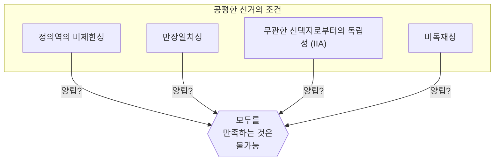
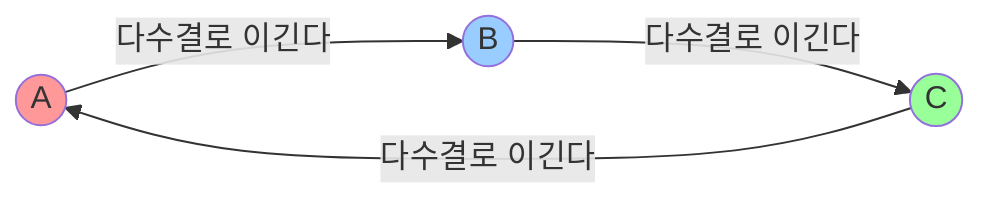
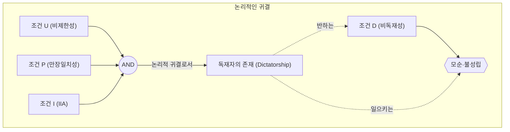

# 시작하며: '완벽한 선거'는 만들 수 있는가?

우리가 사회에서 무언가를 결정할 때 가장 일반적으로 사용되는 것이 '선거'나 '다수결'입니다. 그러나 과연 ** 다수결 ** 은 항상 민의를 정확하게 반영하는 것일까요? 혹은 다른 규칙을 도입하면 '누구나 납득하는 완벽한 선거 제도'를 만들 수 있는 것일까요.

사실 이 질문에 대한 수학적인 대답은 ** '노(No)' ** 입니다.

1951년 경제학자 케네스 애로(Kenneth Arrow)는 일정한 합리적인 조건을 만족하는 완벽한 의사결정 규칙은 존재하지 않는다는 것을 수학적으로 증명했습니다. 이것이 ** '[애로의 불가능성 정리](https://kenji.blog/ko/p/arrows-impossibility-theorem/)([Arrow's Impossibility Theorem](https://kenji.blog/ko/p/arrows-impossibility-theorem/))' ** 입니다. 애로는 이 업적을 포함한 사회적 선택 이론에 대한 공헌으로 1972년에 노벨 경제학상을 수상했습니다.

본 기사에서는 이 정리가 무엇을 의미하는지 구체적인 예시나 수식, 도해를 섞어가며 자세히 해설합니다.

## 1. [애로의 불가능성 정리](https://kenji.blog/ko/p/arrows-impossibility-theorem/)란 무엇인가?

[애로의 불가능성 정리](https://kenji.blog/ko/p/arrows-impossibility-theorem/)를 한마디로 말하면 ** "3개 이상의 선택지에서 3명 이상의 투표자가 선택할 경우, '공평한 선거(의사결정 규칙)'가 만족해야 할 여러 조건들을 모두 동시에 만족하는 것은 불가능하다" ** 는 것입니다.

여기서의 '공평한 선거'란 직관적으로 우리가 '이 정도면 공평하다'고 느끼는 몇 가지 조건을 가리킵니다. 애로는 사회가 만족해야 할 최소한의 합리적인 조건을 정의하고 그것들이 논리적으로 양립하지 않음을 보여주었습니다.

### 정리의 전제 조건

정리를 생각함에 있어 다음과 같은 상황을 설정합니다.

- 선택지의 집합 $X = \{A, B, C, \dots\}$ (※선택지는 3개 이상)
- 투표자의 집합 $V = \{1, 2, \dots, n\}$ (※투표자는 3명 이상)
- 각 투표자는 선택지에 대해 나름대로의 '선호 순서(랭킹)'를 가지고 있다.
- ** 사회적 후생 함수(Social Welfare Function) ** $F$: 전원의 선호 순서를 입력으로 받아 사회 전체의 선호 순서를 출력하는 함수(즉, 선거의 집계 규칙).

## 2. '공평한 선거'가 만족해야 할 4가지 조건

애로는 이상적인 사회적 후생 함수 $F$ 가 만족해야 할 조건으로 다음 4가지(혹은 확장해서 5가지)를 제시했습니다. 모두 '민주주의적인 선거라면 당연히 만족해야 할' 것으로 생각되는 것들뿐입니다.

### 조건 1: 정의역의 비제한성 (Unrestricted Domain)
유권자는 어떠한 선호 순서(랭킹)를 가져도 좋다는 조건입니다.
예를 들어 'A > B > C'라는 의견도, 'C > A > B'라는 의견도, 어떠한 순서라도 집계 시스템은 그것을 받아들여 오류를 일으키지 않고 사회 전체의 순서를 결정할 수 있어야 합니다.

### 조건 2: 만장일치성 (Pareto Principle / Unanimity)
전원이 '선택지 A는 선택지 B보다 바람직하다(A > B)'고 생각한다면 사회 전체의 결과로서도 'A > B'가 되어야 한다는 조건입니다. 이는 지극히 당연한 요구로 보입니다.

### 조건 3: 무관한 선택지로부터의 독립성 (Independence of Irrelevant Alternatives, IIA)
어떤 2개의 선택지 A와 B의 사회적 순위는 개별 유권자의 A와 B에 대한 상대적인 순위에 의해서만 결정되어야 하며, 무관한 제3의 선택지 C의 존재나 C에 대한 순위에 영향을 받아서는 안 된다는 조건입니다.

### 조건 4: 비독재성 (Non-dictatorship)
다른 모든 사람의 의견에 상관없이 항상 특정 1인(독재자)의 의견이 그대로 사회 전체의 결정이 되어 버리는 시스템이어서는 안 된다는 조건입니다.

---

[애로의 불가능성 정리](https://kenji.blog/ko/p/arrows-impossibility-theorem/)는 ** '이 4가지 조건을 모두 동시에 만족하는 사회적 후생 함수는 존재하지 않는다(비독재성을 부과하면 반드시 모순된다)' ** 는 충격적인 사실을 수학적으로 증명한 것입니다.

## 3. 구체적 예시: 왜 조건은 모순되는가?

왜 이들 당연하다고 생각되는 조건들이 모순되어 버리는 것일까요. 유명한 '콩도르세의 역설'과 '보르다 방식의 문제점'을 통해 살펴봅시다.

### 콩도르세의 역설 (다수결의 함정)

3명의 유권자(X씨, Y씨, Z씨)가 3개의 정책(A, B, C)에 대해 투표한다고 합시다. 각각의 선호 순서는 다음과 같습니다.

- X씨: ** A > B > C ** 
- Y씨: ** B > C > A ** 
- Z씨: ** C > A > B ** 

이것을 1대1 다수결(총당번전)로 결정해 봅시다.

1. ** A vs B ** : X씨와 Z씨는 A를 선호하고(Z씨는 C>A>B이므로 A와 B라면 A), Y씨는 B를 선호합니다. 결과 2대1로 ** A의 승리(A > B) ** .
2. ** B vs C ** : X씨와 Y씨는 B를 선호하고, Z씨는 C를 선호합니다. 결과 2대1로 ** B의 승리(B > C) ** .
3. ** C vs A ** : Y씨와 Z씨는 C를 선호하고, X씨는 A를 선호합니다. 결과 2대1로 ** C의 승리(C > A) ** .

사회 전체적으로는 ** A > B > C > A ... ** 라는 루프 상태에 빠져 버려서 순위를 결정할 수 없게 됩니다. 이를 ** 콩도르세의 역설(Condorcet Paradox) ** 이라고 부릅니다. '정의역의 비제한성(어떤 의견을 가져도 좋다)'을 만족하려고 하면 다수결에서는 올바른 집계를 할 수 없게 되어 버리는 것입니다.

### 보르다 방식과 '독립성(IIA)'의 파탄

그렇다면 루프를 피하기 위해 '포인트제(보르다 방식)'를 도입해 봅시다. 1위에 3점, 2위에 2점, 3위에 1점을 주고 합계 점수로 겨루는 방식입니다.

유권자가 5명 있고 다음과 같은 선호를 가지고 있다고 합시다.

- 3명: ** A > B > C ** (A: 3점, B: 2점, C: 1점)
- 2명: ** B > C > A ** (B: 3점, C: 2점, A: 1점)

합계 점수를 계산합니다.
- A의 득점: $(3 \times 3) + (1 \times 2) = 11$ 점
- B의 득점: $(2 \times 3) + (3 \times 2) = 12$ 점
- C의 득점: $(1 \times 3) + (2 \times 2) = 7$ 점

결과는 ** B > A > C ** 가 되어 B가 승자가 됩니다.

여기서 선택지 C가 어떤 이유로 후보에서 제외되었다고 합시다. 조건 3인 '무관한 선택지로부터의 독립성(IIA)'에 따르면 C가 사라져도 A와 B의 승패(순위)는 변하지 않아야 합니다.

C가 사라진 상태(A와 B만 존재)에서 다시 포인트제(1위 2점, 2위 1점)로 계산해 봅시다.
- 3명: ** A > B ** 
- 2명: ** B > A ** 

- A의 득점: $(2 \times 3) + (1 \times 2) = 8$ 점
- B의 득점: $(1 \times 3) + (2 \times 2) = 7$ 점

결과는 ** A > B ** 가 되어 승자가 A로 역전되어 버렸습니다!
이것은 제3의 선택지인 C의 존재가 A와 B의 승패에 영향을 주었다는 것을 의미합니다. 즉, 포인트제 선거는 ** '무관한 선택지로부터의 독립성'을 만족할 수 없는 ** 것입니다.

## 4. 수식과 논리식에 의한 표현

[애로의 불가능성 정리](https://kenji.blog/ko/p/arrows-impossibility-theorem/)를 보다 엄밀하게 수식·논리식을 사용하여 표현해 보겠습니다.

유권자의 집합을 $V = \{1, 2, \dots, n\}$, 선택지의 집합을 $X$ 라고 합니다( $|X| \ge 3$ ).
유권자 $i$ 의 선호를 $\succeq_i$ 로 하고, 전체 유권자의 선호 조합(프로필)을 $P = (\succeq_1, \succeq_2, \dots, \succeq_n)$ 이라고 합니다.
사회적 후생 함수를 $F$ 로 하고 사회 전체의 선호를 $\succeq = F(P)$ 로 기술합니다.

애로의 조건은 다음과 같이 정식화됩니다.

1. ** 정의역의 비제한성 (U) ** :
   $F$ 는 각 $\succeq_i$ 가 $X$ 상의 임의의 완전하고 추이적인 이항 관계인 모든 가능한 프로필 $P$ 에 대해 정의된다.

2. ** 만장일치성 (P) ** :
   임의의 선택지 $x, y \in X$ 에 대해 모든 유권자 $i \in V$ 에 대해 $x \succ_i y$ 이면, $F(P)$ 에서도 $x \succ y$ 가 된다.
   $$ \forall x, y \in X, \ (\forall i \in V, \ x \succ_i y) \implies x \succ y $$

3. ** 무관한 선택지로부터의 독립성 (I) ** :
   임의의 두 프로필 $P, P'$ 와 임의의 $x, y \in X$ 에 대해 모든 유권자 $i$ 에서 $x, y$ 간의 상대적인 순서 관계가 $P$ 와 $P'$ 에서 같다면, $F(P)$ 와 $F(P')$ 에서의 $x, y$ 의 상대적인 순서 관계도 같다.
   $$ \forall x, y \in X, \ (\forall i \in V, \ x \succ_i y \iff x \succ'_i y) \implies (x \succ y \iff x \succ' y) $$

4. ** 비독재성 (D) ** :
   어떠한 프로필 $P$ 에 대해서도 다른 유권자의 선호와 무관하게 항상 자기 자신의 강한 선호를 사회의 선호로 결정할 수 있는 독재자 $d \in V$ 는 존재하지 않는다.
   $$ \neg \exists d \in V \text{ s.t. } \forall P, \forall x, y \in X, \ (x \succ_d y \implies x \succ y) $$

** 애로의 정리의 주장 ** :
$|X| \ge 3$ 이고 $|V| \ge 2$ 일 때 조건(U), (P), (I)를 만족하는 사회적 후생 함수 $F$ 는 반드시 독재자를 가진다(조건(D)에 반한다).
즉, (U), (P), (I), (D)를 동시에 만족하는 $F$ 는 존재하지 않는다.

## 5. 결론: 민주주의는 기능하지 않는 것인가?

"완벽한 선거 제도가 존재하지 않는다면 민주주의는 결함투성이의 무의미한 것일까?"

이 정리를 알았을 때 많은 사람들이 그렇게 느낄지도 모릅니다. 하지만 경제학이나 정치학 분야에서는 이 정리를 ** '완벽함을 추구하는 것이 아니라 현실적인 타협점을 찾기 위한 이정표' ** 로 받아들이고 있습니다.

실제로 우리 사회는 정리의 '조건' 중 일부를 약간 완화함으로써 기능하고 있습니다.

1. ** 정의역의 비제한성을 완화한다 ** :
   현실의 정치에서 유권자의 의견(선호)은 완전히 제각각이 아니라 어느 정도의 경향(우파·좌파 등, 단봉성 선호라고 불리는 성질)을 갖는 경우가 많습니다. 이러한 한정적인 상황 하에서는 다수결(중위투표자 정리)이 잘 기능함이 증명되어 있습니다.

2. ** 독립성(IIA)을 완화한다 ** :
   앞서 언급한 보르다 방식이나 결선 투표가 있는 다수결 등은 IIA 조건을 만족하지 않지만 '현실적인 선거 규칙'으로서 전 세계에서 널리 채용되고 있습니다. 다소의 전략적 투표(사표를 피하기 위해 본명 이외에 투표하는 등)가 발생할 리스크를 받아들이는 대신 독재를 배제하고 있는 것입니다.

3. ** 순서뿐만 아니라 '강도'를 측정한다 ** :
   애로의 정리는 'A보다 B가 좋다'는 순서만을 집계하는 것을 전제로 하고 있습니다. 최근에는 각 선택지에 점수를 매기는 '평가 투표(Range Voting)'나 '승인 투표(Approval Voting)' 등 호감의 '강도'나 '허용도'를 도입하여 역설을 회피하는 제도도 연구되고 있습니다.

## 맺음말

[애로의 불가능성 정리](https://kenji.blog/ko/p/arrows-impossibility-theorem/)는 수학이라는 냉철한 언어를 사용하여 ** '모든 사람에게 완벽한 규칙의 부재' ** 를 증명했습니다. 그러나 그것이 민주주의의 패배를 의미하는 것은 아닙니다.

오히려 ** '어떠한 제도라도 반드시 약점이 있으므로 그 약점을 이해한 후에 상황에 맞는 최적의 규칙을 선택하고 논의를 다하는 것이 중요하다' ** 는 매우 긍정적이고 교훈적인 메시지로 받아들여야 할 것입니다.

완벽한 시스템이 존재하지 않기 때문에 우리는 항상 생각하고 의논하며 사회를 계속 업데이트해 나가야만 하는 것입니다.
