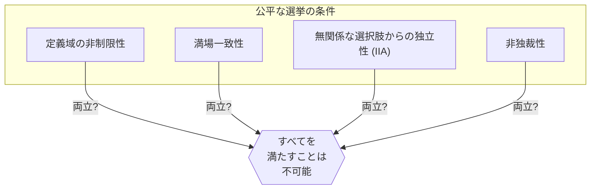
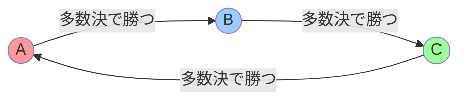
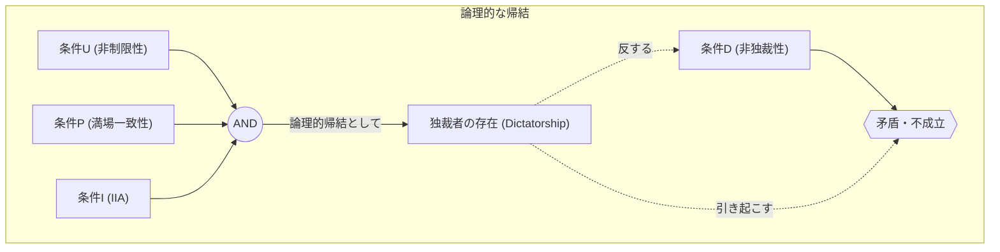

# はじめに：「完璧な選挙」は作れるのか？

私たちが社会で何かを決める際、最も一般的に用いられるのが「選挙」や「多数決」です。しかし、果たして **多数決** は常に民意を正確に反映するのでしょうか？あるいは、別のルールを導入すれば、「誰もが納得する完璧な選挙制度」を作ることができるのでしょうか。

実は、この問いに対する数学的な答えは **「ノー」** です。

1951年、経済学者のケネス・アロー（Kenneth Arrow）は、一定の合理的な条件を満たす完璧な意思決定のルールは存在しないことを数学的に証明しました。これが **「アローの不可能性定理（Arrow's Impossibility Theorem）」** です。アローはこの業績を含む社会的選択理論への貢献により、1972年にノーベル経済学賞を受賞しています。

本記事では、この定理が何を意味しているのか、具体例や数式、図解を交えながら詳しく解説します。

## 1. アローの不可能性定理とは何か？

アローの不可能性定理をひとことで言えば、 **「3つ以上の選択肢から、3人以上の投票者が選ぶ場合、『公平な選挙（意思決定ルール）』が満たすべき複数の条件をすべて同時に満たすことは不可能である」** というものです。

ここでの「公平な選挙」とは、直感的に私たちが「これなら公平だ」と感じるいくつかの条件を指します。アローは、社会が満たすべき最低限の合理的な条件を定義し、それらが論理的に両立しないことを示しました。

### 定理の前提条件

定理を考えるにあたり、以下のような状況を設定します。

- 選択肢の集合 $X = \{A, B, C, \dots\}$ （※選択肢は3つ以上）
- 投票者の集合 $V = \{1, 2, \dots, n\}$ （※投票者は3人以上）
- 各投票者は、選択肢に対して自分なりの「選好順序（ランキング）」を持っている。
- **社会的厚生関数（Social Welfare Function）** $F$：全員の選好順序を入力として受け取り、社会全体の選好順序を出力する関数（つまり、選挙の集計ルール）。

## 2. 「公平な選挙」が満たすべき4つの条件

アローは、理想的な社会的厚生関数 $F$ が満たすべき条件として、以下の4つ（あるいは拡張して5つ）を提示しました。どれも「民主主義的な選挙なら当然満たすべきだろう」と思えるものばかりです。

### 条件1：定義域の非制限性（Unrestricted Domain）
有権者は、いかなる選好順序（ランキング）を持ってもよい、という条件です。
たとえば、「A > B > C」という意見も、「C > A > B」という意見も、どのような順序であっても集計システムはそれを受け入れ、エラーを起こさずに社会全体の順序を決定できなければなりません。

### 条件2：満場一致性（Pareto Principle / Unanimity）
全員が「選択肢Aは選択肢Bよりも好ましい（A > B）」と考えているなら、社会全体の結果としても「A > B」とならなければならない、という条件です。これは極めて当然の要求に思えます。

### 条件3：無関係な選択肢からの独立性（Independence of Irrelevant Alternatives, IIA）
ある2つの選択肢 A と B の社会的な順位は、個々の有権者の A と B に対する相対的な順位のみによって決まるべきであり、無関係な第三の選択肢 C の存在や、C に対する順位に影響されてはならない、という条件です。

### 条件4：非独裁性（Non-dictatorship）
他のすべての人の意見にかかわらず、常に特定の1人（独裁者）の意見がそのまま社会全体の決定になってしまうようなシステムであってはならない、という条件です。

---

アローの不可能性定理は、 **「これら4つの条件をすべて同時に満たす社会的厚生関数は存在しない（非独裁性を課すと必ず矛盾する）」** という衝撃的な事実を数学的に証明したのです。

## 3. 具体例：なぜ条件は矛盾するのか？

なぜこれらの当然と思われる条件が矛盾してしまうのでしょうか。有名な「コンドルセのパラドックス」と「ボルダ方式の問題点」を通じて見ていきましょう。

### コンドルセのパラドックス（多数決の落とし穴）

3人の有権者（Xさん、Yさん、Zさん）が、3つの政策（A、B、C）について投票するとします。それぞれの選好順序は以下の通りです。

- Xさん： **A > B > C** 
- Yさん： **B > C > A** 
- Zさん： **C > A > B** 

これを1対1の多数決（総当たり戦）で決めてみましょう。

1. **A vs B** ： XさんとZさんは A を好み（ZさんはC>A>BなのでAとBならA）、Yさんは B を好みます。結果、2対1で **Aの勝利（A > B）** 。
2. **B vs C** ： XさんとYさんは B を好み、Zさんは C を好みます。結果、2対1で **Bの勝利（B > C）** 。
3. **C vs A** ： YさんとZさんは C を好み、Xさんは A を好みます。結果、2対1で **Cの勝利（C > A）** 。

社会全体としては **A > B > C > A ...** というループ状態に陥ってしまい、順位を決めることができません。これを **コンドルセのパラドックス（Condorcet Paradox）** と呼びます。「定義域の非制限性（どんな意見を持ってもよい）」を満たそうとすると、多数決では正しい集計ができなくなってしまうのです。

### ボルダ方式と「独立性 (IIA)」の破綻

では、ループを避けるために「ポイント制（ボルダ方式）」を導入してみましょう。1位に3点、2位に2点、3位に1点を与え、合計点で競う方式です。

有権者が5人おり、以下のような選好を持っているとします。

- 3人： **A > B > C** (A: 3点, B: 2点, C: 1点)
- 2人： **B > C > A** (B: 3点, C: 2点, A: 1点)

合計点を計算します。
- Aの得点： $(3 \times 3) + (1 \times 2) = 11$ 点
- Bの得点： $(2 \times 3) + (3 \times 2) = 12$ 点
- Cの得点： $(1 \times 3) + (2 \times 2) = 7$ 点

結果は **B > A > C** となり、B が勝者となります。

ここで、選択肢Cが何らかの理由で候補から外れたとします。条件3の「無関係な選択肢からの独立性 (IIA)」によれば、Cが消えても、AとBの勝敗（順位）は変わらないはずです。

Cが消えた状態（AとBのみ）で再度ポイント制（1位2点、2位1点）で計算してみましょう。
- 3人： **A > B** 
- 2人： **B > A** 

- Aの得点： $(2 \times 3) + (1 \times 2) = 8$ 点
- Bの得点： $(1 \times 3) + (2 \times 2) = 7$ 点

結果は **A > B** となり、勝者がAに逆転してしまいました！
これは、第三の選択肢であるCの存在が、AとBの勝敗に影響を与えてしまったことを意味します。つまり、ポイント制の選挙は **「無関係な選択肢からの独立性」を満たすことができない** のです。

## 4. 数式と論理式による表現

アローの不可能性定理を、より厳密に数式・論理式を用いて表現してみます。

有権者の集合を $V = \{1, 2, \dots, n\}$、選択肢の集合を $X$ とします（ $|X| \ge 3$ ）。
有権者 $i$ の選好を $\succeq_i$ とし、全有権者の選好の組（プロファイル）を $P = (\succeq_1, \succeq_2, \dots, \succeq_n)$ とします。
社会的厚生関数を $F$ とし、社会全体の選好を $\succeq = F(P)$ と記述します。

アローの条件は次のように定式化されます。

1. **定義域の非制限性 (U)** ：
   $F$ は、各 $\succeq_i$ が $X$ 上の任意の完全かつ推移的な二項関係であるような、すべての可能なプロファイル $P$ に対して定義される。

2. **満場一致性 (P)** ：
   任意の選択肢 $x, y \in X$ について、すべての有権者 $i \in V$ に対して $x \succ_i y$ ならば、$F(P)$ においても $x \succ y$ となる。
   $$ \forall x, y \in X, \ (\forall i \in V, \ x \succ_i y) \implies x \succ y $$

3. **無関係な選択肢からの独立性 (I)** ：
   任意の2つのプロファイル $P, P'$ と、任意の $x, y \in X$ について、すべての有権者 $i$ において $x, y$ 間の相対的な順序関係が $P$ と $P'$ で等しいならば、$F(P)$ と $F(P')$ における $x, y$ の相対的な順序関係も等しい。
   $$ \forall x, y \in X, \ (\forall i \in V, \ x \succ_i y \iff x \succ'_i y) \implies (x \succ y \iff x \succ' y) $$

4. **非独裁性 (D)** ：
   いかなるプロファイル $P$ に対しても、他の有権者の選好に関わらず、常に自己の強い選好を社会の選好として決定できるような独裁者 $d \in V$ は存在しない。
   $$ \neg \exists d \in V \text{ s.t. } \forall P, \forall x, y \in X, \ (x \succ_d y \implies x \succ y) $$

**アローの定理の主張** ：
$|X| \ge 3$ かつ $|V| \ge 2$ のとき、条件(U), (P), (I) を満たす社会的厚生関数 $F$ は、必ず独裁者を持つ（条件(D)に反する）。
すなわち、(U), (P), (I), (D) を同時に満たす $F$ は存在しない。

## 5. 結論：民主主義は機能しないのか？

「完璧な選挙制度が存在しないなら、民主主義は欠陥だらけで無意味なのだろうか？」

この定理を知ったとき、多くの人がそう感じるかもしれません。しかし、経済学や政治学の分野では、この定理を **「完璧さを追い求めるのではなく、現実的な妥協点を探るための道標」** として捉えています。

実際には、私たちの社会は定理の「条件」のいずれかを少しだけ緩めることで機能しています。

1. **定義域の非制限性を緩める** ：
   現実の政治において、有権者の意見（選好）は完全にバラバラではなく、ある程度の傾向（右派・左派など、単峰性選好と呼ばれる性質）を持つことが多いです。このような限定的な状況下では、多数決（中位投票者定理）がうまく機能することが証明されています。

2. **独立性 (IIA) を緩める** ：
   前述のボルダ方式や、決選投票付き多数決などは、IIAの条件を満たしませんが、「現実的な選挙ルール」として世界中で広く採用されています。多少の戦略的投票（死票を避けるために本命以外に投票するなど）が発生するリスクを受け入れる代わりに、独裁を排除しているのです。

3. **順序だけでなく「強さ」を測る** ：
   アローの定理は「AよりBが好き」という順序だけを集計することを前提としています。近年では、各選択肢に点数をつける「評価投票（Range Voting）」や「是認投票（Approval Voting）」など、好みの「強さ」や「許容度」を取り入れることでパラドックスを回避する制度も研究されています。

## おわりに

アローの不可能性定理は、数学という冷徹な言語を用いて **「すべての人にとって完璧なルールの不在」** を証明しました。しかしそれは、民主主義の敗北を意味するものではありません。

むしろ、 **「いかなる制度にも必ず弱点があるのだから、その弱点を理解した上で、状況に合った最適なルールを選び、議論を尽くすことが重要である」** という、非常に前向きで教訓的なメッセージだと受け取るべきでしょう。

完璧なシステムが存在しないからこそ、私たちは常に考え、話し合い、社会をアップデートし続けなければならないのです。

