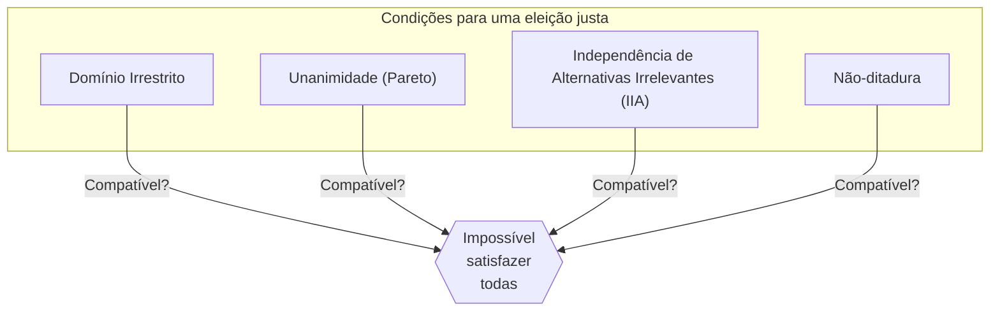
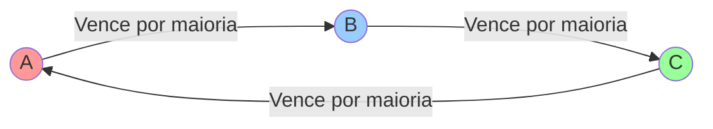
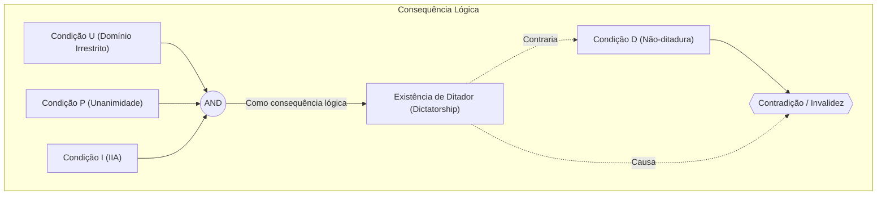

# Introdução: Será possível criar uma "eleição perfeita"?

Quando tomamos decisões em sociedade, o método mais comum é a "eleição" ou "regra da maioria". No entanto, será que a **regra da maioria** reflete sempre com precisão a vontade do povo? Ou será que, ao introduzirmos regras diferentes, conseguimos criar um "sistema eleitoral perfeito que satisfaça a todos"?

Na verdade, a resposta matemática a esta questão é **"Não"**.

Em 1951, o economista Kenneth Arrow provou matematicamente que não existe uma regra perfeita para a tomada de decisões que satisfaça um conjunto de condições razoáveis. Este é o **"Teorema da Impossibilidade de Arrow ([Arrow's Impossibility Theorem](https://kenji.blog/pt/p/arrows-impossibility-theorem/))"**. Pela sua contribuição para a Teoria da Escolha Social, incluindo este feito, Arrow recebeu o Prémio Nobel de Economia em 1972.

Neste artigo, explicaremos em detalhe o que significa este teorema, com exemplos concretos, fórmulas e diagramas.

## 1. O que é o Teorema da Impossibilidade de Arrow?

Em suma, o Teorema da Impossibilidade de Arrow afirma que: **"Quando três ou mais eleitores escolhem a partir de três ou mais opções, é impossível satisfazer simultaneamente todas as condições que uma 'eleição justa (regra de decisão)' deveria cumprir."**

A "eleição justa" refere-se aqui a várias condições que intuitivamente consideramos como "isto é justo". Arrow definiu as condições lógicas mínimas que uma sociedade deve satisfazer e mostrou que elas são logicamente incompatíveis entre si.

### Premissas do Teorema

Para analisar o teorema, estabelecemos a seguinte situação:

- Conjunto de alternativas $X = \{A, B, C, \dots\}$ (*três ou mais alternativas*)
- Conjunto de eleitores $V = \{1, 2, \dots, n\}$ (*três ou mais eleitores*)
- Cada eleitor possui a sua própria "ordem de preferência (ranking)" em relação às alternativas.
- **Função de Bem-Estar Social (Social Welfare Function)** $F$: Uma função que recebe a ordem de preferência de todos e devolve a ordem de preferência de toda a sociedade (ou seja, a regra de agregação da eleição).

## 2. As 4 condições que uma "eleição justa" deve cumprir

Arrow propôs quatro (ou cinco, em extensões) condições que uma função de bem-estar social ideal $F$ deveria satisfazer. Todas parecem ser "requisitos óbvios de uma eleição democrática".

### Condição 1: Domínio Irrestrito (Unrestricted Domain)
Os eleitores podem ter qualquer ordem de preferência (ranking).
Por exemplo, o sistema de agregação deve ser capaz de aceitar opiniões como "A > B > C" ou "C > A > B", seja qual for a ordem, e determinar a ordem global da sociedade sem erros.

### Condição 2: Princípio de Pareto / Unanimidade (Pareto Principle / Unanimity)
Se todos consideram que "a alternativa A é preferível à B (A > B)", então o resultado para toda a sociedade também deve ser "A > B". Parece uma exigência extremamente óbvia.

### Condição 3: Independência de Alternativas Irrelevantes (Independence of Irrelevant Alternatives, IIA)
A posição social relativa de duas alternativas, A e B, deve depender apenas do ranking relativo de A e B por parte dos eleitores individuais, e não deve ser influenciada pela existência de uma terceira alternativa C não relacionada, nem pela posição de C.

### Condição 4: Não-ditadura (Non-dictatorship)
O sistema não deve permitir que a opinião de um indivíduo específico (o ditador) se torne sempre a decisão de toda a sociedade, independentemente da opinião de todos os outros.

---

[O Teorema da Impossibilidade de Arrow](https://kenji.blog/pt/p/arrows-impossibility-theorem/) provou matematicamente o facto chocante de que **"não existe nenhuma função de bem-estar social que satisfaça estas quatro condições ao mesmo tempo (impor a não-ditadura leva sempre a contradições)"**.

## 3. Exemplo concreto: Por que as condições são contraditórias?

Por que razão estas condições, aparentemente óbvias, entram em conflito? Vejamos através do famoso "Paradoxo de Condorcet" e dos "Problemas do Método de Borda".

### O Paradoxo de Condorcet (A armadilha da regra da maioria)

Suponha que 3 eleitores (X, Y, Z) votam em 3 políticas (A, B, C). A ordem de preferência de cada um é a seguinte:

- Eleitor X: **A > B > C** 
- Eleitor Y: **B > C > A** 
- Eleitor Z: **C > A > B** 

Vamos decidir isto por maioria de votos um-a-um (todos contra todos).

1. **A vs B**: X e Z preferem A (Z prefere C>A>B, portanto entre A e B prefere A), Y prefere B. O resultado é 2 a 1 para a **vitória de A (A > B)**.
2. **B vs C**: X e Y preferem B, Z prefere C. O resultado é 2 a 1 para a **vitória de B (B > C)**.
3. **C vs A**: Y e Z preferem C, X prefere A. O resultado é 2 a 1 para a **vitória de C (C > A)**.

A sociedade como um todo fica presa num ciclo de **A > B > C > A ...**, tornando impossível decidir a classificação. Isto é conhecido como o **Paradoxo de Condorcet (Condorcet Paradox)**. Se tentarmos satisfazer o "Domínio Irrestrito" (podendo-se ter qualquer opinião), a regra da maioria já não consegue agregar resultados corretamente.

### O Método de Borda e o colapso da "Independência (IIA)"

Então, para evitar ciclos, vamos introduzir um "sistema de pontos (Método de Borda)". A alternativa em 1º lugar recebe 3 pontos, a 2ª recebe 2 pontos, a 3ª recebe 1 ponto, competindo pelo total.

Suponha que existam 5 eleitores com as seguintes preferências:

- 3 pessoas: **A > B > C** (A: 3 pts, B: 2 pts, C: 1 pt)
- 2 pessoas: **B > C > A** (B: 3 pts, C: 2 pts, A: 1 pt)

Calculamos a pontuação total:
- Pontuação de A: $(3 \times 3) + (1 \times 2) = 11$ pontos
- Pontuação de B: $(2 \times 3) + (3 \times 2) = 12$ pontos
- Pontuação de C: $(1 \times 3) + (2 \times 2) = 7$ pontos

O resultado é **B > A > C**, e B é o vencedor.

Agora, suponha que a alternativa C seja removida das opções por algum motivo. De acordo com a condição 3 "Independência de Alternativas Irrelevantes (IIA)", mesmo que C desapareça, a classificação entre A e B não deve mudar.

Com C removido (apenas A e B), vamos recalcular usando o sistema de pontos (1º lugar: 2 pontos, 2º lugar: 1 ponto).
- 3 pessoas: **A > B** 
- 2 pessoas: **B > A** 

- Pontuação de A: $(2 \times 3) + (1 \times 2) = 8$ pontos
- Pontuação de B: $(1 \times 3) + (2 \times 2) = 7$ pontos

O resultado torna-se **A > B**, e a vitória inverteu-se para A!
Isto significa que a existência da terceira alternativa, C, afetou o resultado de A e B. Ou seja, eleições por sistema de pontos **não conseguem satisfazer a "Independência de Alternativas Irrelevantes"**.

## 4. Representação por Fórmulas e Expressões Lógicas

Vamos expressar o Teorema da Impossibilidade de Arrow de forma mais rigorosa usando fórmulas e expressões lógicas.

Seja $V = \{1, 2, \dots, n\}$ o conjunto de eleitores e $X$ o conjunto de alternativas ( $|X| \ge 3$ ).
Seja $\succeq_i$ a preferência do eleitor $i$, e $P = (\succeq_1, \succeq_2, \dots, \succeq_n)$ o perfil (perfil de preferências de todos os eleitores).
Seja $F$ a função de bem-estar social, de forma que a preferência de toda a sociedade é descrita como $\succeq = F(P)$.

As condições de Arrow formulam-se assim:

1. **Domínio Irrestrito (U)**:
   $F$ é definida para todos os perfis possíveis $P$, em que cada $\succeq_i$ é uma relação binária completa e transitiva sobre $X$.

2. **Unanimidade (Princípio de Pareto) (P)**:
   Para quaisquer alternativas $x, y \in X$, se todos os eleitores $i \in V$ têm $x \succ_i y$, então $F(P)$ também resultará em $x \succ y$.
   $$ \forall x, y \in X, \ (\forall i \in V, \ x \succ_i y) \implies x \succ y $$

3. **Independência de Alternativas Irrelevantes (I)**:
   Para quaisquer dois perfis $P, P'$ e para quaisquer $x, y \in X$, se a relação de ordem relativa entre $x$ e $y$ for idêntica em $P$ e $P'$ para todos os eleitores $i$, então a relação de ordem relativa entre $x$ e $y$ em $F(P)$ e $F(P')$ também será idêntica.
   $$ \forall x, y \in X, \ (\forall i \in V, \ x \succ_i y \iff x \succ'_i y) \implies (x \succ y \iff x \succ' y) $$

4. **Não-ditadura (D)**:
   Não existe nenhum ditador $d \in V$ tal que, para qualquer perfil $P$, a sua forte preferência se torne sempre a preferência da sociedade, independentemente da preferência de outros eleitores.
   $$ \neg \exists d \in V \text{ s.t. } \forall P, \forall x, y \in X, \ (x \succ_d y \implies x \succ y) $$

**Afirmação do Teorema de Arrow**:
Quando $|X| \ge 3$ e $|V| \ge 2$, qualquer função de bem-estar social $F$ que satisfaça as condições (U), (P) e (I) tem sempre um ditador (violando a condição (D)).
Ou seja, não existe $F$ que satisfaça (U), (P), (I) e (D) simultaneamente.

## 5. Conclusão: Será que a democracia não funciona?

"Se um sistema eleitoral perfeito não existe, será a democracia inútil e cheia de falhas?"

Muitas pessoas podem sentir isso ao conhecerem este teorema. No entanto, nas áreas da economia e das ciências políticas, este teorema é encarado como **"um guia para encontrar compromissos realistas, em vez de buscar a perfeição"**.

Na prática, a nossa sociedade funciona ao afrouxar ligeiramente algumas das "condições" do teorema.

1. **Afrouxar o Domínio Irrestrito**:
   Na política real, as opiniões dos eleitores não são totalmente aleatórias, mas costumam ter certa tendência (como direita/esquerda, o que é conhecido como preferência de pico único). Sob tais condições restritas, provou-se que a regra da maioria funciona bem (Teorema do Eleitor Mediano).

2. **Afrouxar a Independência (IIA)**:
   O Método de Borda e o sistema de maioria em duas voltas (com segunda volta) não satisfazem a condição IIA, mas são amplamente utilizados em todo o mundo como "regras eleitorais práticas". Aceita-se algum risco de votação estratégica (como o voto útil para evitar votos desperdiçados) em troca da exclusão da ditadura.

3. **Medir a "Força" além da Ordem**:
   O Teorema de Arrow assume a agregação apenas de classificações do tipo "Prefiro A a B". Recentemente, pesquisas focam-se em sistemas que avaliam os pontos atribuídos a cada alternativa, como a "Votação por Avaliação (Range Voting)" ou a "Votação de Aprovação (Approval Voting)", permitindo contornar o paradoxo medindo a "força" da preferência ou o grau de "tolerância".

## Notas finais

[O Teorema da Impossibilidade de Arrow](https://kenji.blog/pt/p/arrows-impossibility-theorem/) provou, usando a fria linguagem da matemática, a **"ausência de uma regra perfeita para todos"**. Contudo, isso não significa a derrota da democracia.

Pelo contrário, devemos recebê-lo como uma mensagem bastante construtiva e instrutiva: **"Como qualquer sistema tem invariavelmente fraquezas, é importante compreendê-las, escolher as regras ideais adequadas para cada situação, e esgotar o debate."**

É precisamente por não haver um sistema perfeito que devemos estar em constante reflexão, debate, e continuar a modernizar a nossa sociedade.
