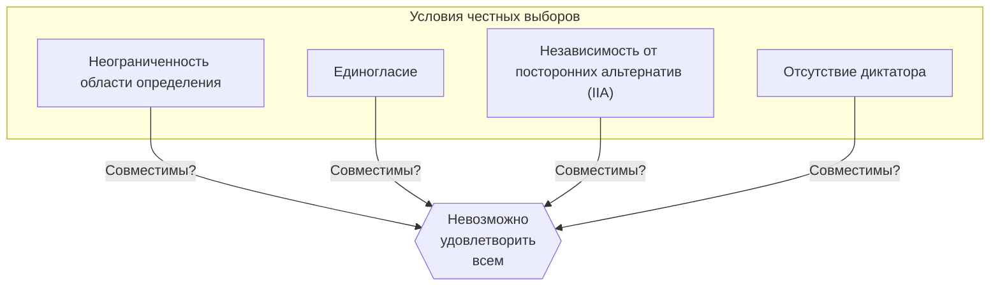
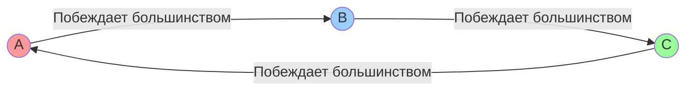
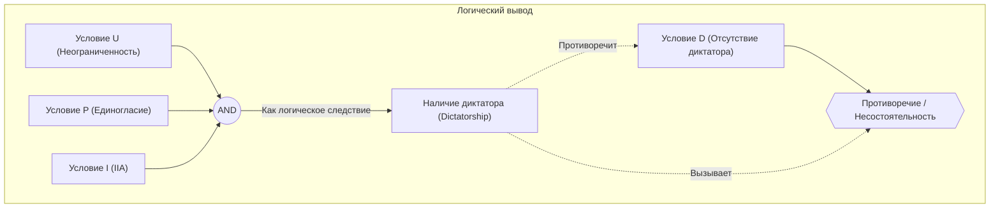

# Введение: Можно ли создать «идеальные выборы»?

Когда мы принимаем какие-либо решения в обществе, наиболее часто используются «выборы» или «голосование большинством». Однако всегда ли **голосование большинством** точно отражает волю народа? Или, возможно, введя другие правила, мы сможем создать «идеальную избирательную систему, с которой согласится каждый»?

На самом деле математический ответ на этот вопрос — **«нет»**.

В 1951 году экономист Кеннет Эрроу (Kenneth Arrow) математически доказал, что не существует правила принятия решений, которое было бы совершенным и отвечало бы определенному набору разумных условий. Это и есть **«Теорема Эрроу о невозможности (Arrow's Impossibility Theorem)»**. За этот и другие вклады в теорию общественного выбора Эрроу был удостоен Нобелевской премии по экономике в 1972 году.

В этой статье мы подробно объясним, что означает эта теорема, используя конкретные примеры, формулы и диаграммы.

## 1. Что такое теорема Эрроу о невозможности?

Говоря простым языком, теорема Эрроу о невозможности утверждает: **«При выборе из 3 и более вариантов 3 и более избирателями невозможно одновременно удовлетворить всем условиям, которым должны отвечать “честные выборы (правила принятия решений)”»**.

Здесь под «честными выборами» подразумеваются несколько условий, которые интуитивно кажутся нам справедливыми. Эрроу определил минимальные разумные условия, которым должно отвечать общество, и показал, что они логически несовместимы друг с другом.

### Предпосылки теоремы

Для рассмотрения теоремы мы устанавливаем следующую ситуацию:

- Множество вариантов $X = \{A, B, C, \dots\}$ (*от 3 и более вариантов)
- Множество избирателей $V = \{1, 2, \dots, n\}$ (*от 3 и более избирателей)
- У каждого избирателя есть свой собственный «порядок предпочтений (рейтинг)» в отношении вариантов.
- **Функция общественного благосостояния (Social Welfare Function)** $F$: Функция, которая принимает на вход порядки предпочтений всех людей и на выходе выдает порядок предпочтений общества в целом (то есть правила подсчета голосов на выборах).

## 2. 4 условия, которым должны удовлетворять «честные выборы»

Эрроу представил следующие 4 (или, в расширенном виде, 5) условия, которым должна удовлетворять идеальная функция общественного благосостояния $F$. Все они кажутся совершенно естественными для демократических выборов.

### Условие 1: Неограниченность области определения (Unrestricted Domain)
Это условие означает, что избиратели могут иметь любой порядок предпочтений (рейтинг).
Например, мнение «A > B > C» и мнение «C > A > B» — каким бы ни был порядок, система подсчета должна принять его и без ошибок определить общий порядок в обществе.

### Условие 2: Единогласие (Pareto Principle / Unanimity)
Если все считают, что «вариант А предпочтительнее варианта B (A > B)», то и в результате для всего общества должно быть «A > B». Кажется, что это абсолютно естественное требование.

### Условие 3: Независимость от посторонних альтернатив (Independence of Irrelevant Alternatives, IIA)
Социальный рейтинг между любыми двумя вариантами A и B должен определяться только относительным рейтингом этих вариантов у каждого избирателя и не должен зависеть от наличия третьего, постороннего варианта C или отношения к нему.

### Условие 4: Отсутствие диктатора (Non-dictatorship)
Не должно существовать системы, в которой мнение одного конкретного человека (диктатора) всегда становится решением всего общества, независимо от мнений всех остальных.

---

Теорема Эрроу о невозможности математически доказала шокирующий факт: **«Не существует функции общественного благосостояния, которая удовлетворяла бы всем 4 условиям одновременно (наложение условия отсутствия диктатора обязательно приводит к противоречию)»**.

## 3. Конкретный пример: Почему условия противоречат друг другу?

Почему же эти, казалось бы, естественные условия вступают в противоречие? Давайте рассмотрим это через знаменитые «Парадокс Кондорсе» и «Проблемы метода Борда».

### Парадокс Кондорсе (Ловушка большинства)

Предположим, что 3 избирателя (господин X, господин Y и господин Z) голосуют за 3 политики (A, B и C). Их порядки предпочтений следующие:

- Господин X: **A > B > C** 
- Господин Y: **B > C > A** 
- Господин Z: **C > A > B** 
 
Давайте решим это голосованием большинства 1 на 1 (круговой турнир).

1. **A против B**: X и Z предпочитают A (поскольку у Z: C>A>B, между A и B он выбирает A), а Y предпочитает B. Результат: со счетом 2:1 **побеждает A (A > B)**.
2. **B против C**: X и Y предпочитают B, а Z предпочитает C. Результат: со счетом 2:1 **побеждает B (B > C)**.
3. **C против A**: Y и Z предпочитают C, а X предпочитает A. Результат: со счетом 2:1 **побеждает C (C > A)**.

Для общества в целом возникает бесконечный цикл **A > B > C > A ...**, и определить победителя невозможно. Это называется **Парадоксом Кондорсе (Condorcet Paradox)**. При попытке выполнить «Неограниченность области определения (можно иметь любое мнение)» голосование большинства теряет способность правильно подсчитывать результаты.

### Метод Борда и нарушение «Независимости (IIA)»

Тогда давайте введем систему баллов (метод Борда), чтобы избежать цикла. За 1-е место дается 3 балла, за 2-е — 2 балла, за 3-е — 1 балл. Победитель определяется по сумме баллов.

Предположим, есть 5 избирателей со следующими предпочтениями:

- 3 человека: **A > B > C** (A: 3 балла, B: 2 балла, C: 1 балл)
- 2 человека: **B > C > A** (B: 3 балла, C: 2 балла, A: 1 балл)

Подсчитаем общую сумму баллов.
- Баллы A: $(3 \times 3) + (1 \times 2) = 11$ баллов
- Баллы B: $(2 \times 3) + (3 \times 2) = 12$ баллов
- Баллы C: $(1 \times 3) + (2 \times 2) = 7$ баллов

Результат: **B > A > C**, и победителем становится B.

Теперь предположим, что вариант C по какой-то причине выбывает из числа кандидатов. Согласно Условию 3 «Независимость от посторонних альтернатив (IIA)», исчезновение C не должно повлиять на то, кто выиграет между A и B.

Пересчитаем по балльной системе без C (только A и B; 1-е место 2 балла, 2-е место 1 балл).
- 3 человека: **A > B** 
- 2 человека: **B > A** 

- Баллы A: $(2 \times 3) + (1 \times 2) = 8$ баллов
- Баллы B: $(1 \times 3) + (2 \times 2) = 7$ баллов

Результат: **A > B**, победитель поменялся на A!
Это означает, что наличие третьего варианта C повлияло на исход борьбы между A и B. Иными словами, выборы по балльной системе **не могут удовлетворить «Независимости от посторонних альтернатив»**.

## 4. Выражение через математические и логические формулы

Давайте выразим теорему Эрроу более строго, используя математические и логические формулы.

Пусть $V = \{1, 2, \dots, n\}$ — множество избирателей, а $X$ — множество альтернатив ($|X| \ge 3$).
Обозначим предпочтение избирателя $i$ как $\succeq_i$, а набор предпочтений всех избирателей (профиль) как $P = (\succeq_1, \succeq_2, \dots, \succeq_n)$.
Пусть $F$ — функция общественного благосостояния, а общественные предпочтения запишем как $\succeq = F(P)$.

Условия Эрроу формулируются следующим образом:

1. **Неограниченность области определения (U)**:
   $F$ определена для всех возможных профилей $P$, где каждое $\succeq_i$ является любым полным и транзитивным бинарным отношением на $X$.

2. **Единогласие (P)**:
   Для любых альтернатив $x, y \in X$, если для всех избирателей $i \in V$ верно $x \succ_i y$, то и в $F(P)$ выполняется $x \succ y$.
   $$ \forall x, y \in X, \ (\forall i \in V, \ x \succ_i y) \implies x \succ y $$

3. **Независимость от посторонних альтернатив (I)**:
   Для любых двух профилей $P, P'$ и любых $x, y \in X$, если для всех избирателей $i$ относительный порядок $x, y$ одинаков в $P$ и $P'$, то относительный порядок $x, y$ также одинаков в $F(P)$ и $F(P')$.
   $$ \forall x, y \in X, \ (\forall i \in V, \ x \succ_i y \iff x \succ'_i y) \implies (x \succ y \iff x \succ' y) $$

4. **Отсутствие диктатора (D)**:
   Не существует диктатора $d \in V$, такого что для любого профиля $P$ и любых $x, y \in X$, его строгое предпочтение всегда становится общественным предпочтением, независимо от предпочтений других избирателей.
   $$ \neg \exists d \in V \text{ s.t. } \forall P, \forall x, y \in X, \ (x \succ_d y \implies x \succ y) $$

**Утверждение теоремы Эрроу**:
Когда $|X| \ge 3$ и $|V| \ge 2$, любая функция общественного благосостояния $F$, удовлетворяющая условиям (U), (P) и (I), обязательно имеет диктатора (то есть нарушает условие (D)).
Иными словами, не существует $F$, которая одновременно удовлетворяет (U), (P), (I) и (D).

## 5. Вывод: Демократия не работает?

«Если идеальной избирательной системы не существует, значит ли это, что демократия полна изъянов и бессмысленна?»

Узнав об этой теореме, многие могут подумать именно так. Однако в области экономики и политологии эта теорема рассматривается не как признак поражения, а как **«указатель для поиска реалистичных компромиссов, а не идеала»**.

На практике наше общество функционирует за счет небольшого ослабления некоторых «условий» теоремы.

1. **Ослабление неограниченности области определения**:
   В реальной политике мнения (предпочтения) избирателей редко бывают совершенно случайными, чаще они имеют определенную тенденцию (например, правые и левые — свойство, называемое однопиковыми предпочтениями). Доказано, что в таких ограниченных ситуациях правило большинства (теорема о медианном избирателе) работает хорошо.

2. **Ослабление независимости (IIA)**:
   Метод Борда или мажоритарная система в два тура не удовлетворяют условию IIA, но они широко используются по всему миру как «реалистичные правила выборов». Общество идет на риск возникновения стратегического голосования (например, голосование не за фаворита, чтобы избежать потери голоса), но взамен исключает диктатуру.

3. **Измерение «силы» предпочтений, а не только порядка**:
   Теорема Эрроу исходит из предпосылки агрегирования только порядка: «Мне А нравится больше, чем B». В последние годы также исследуются системы, избегающие парадоксов путем учета «силы» предпочтений или «степени терпимости», такие как Оценочное голосование (Range Voting) или Одобрительное голосование (Approval Voting), где каждому варианту присваиваются баллы.

## Заключение

Теорема Эрроу о невозможности использовала холодный язык математики, чтобы доказать **«отсутствие идеальных правил для всех»**. Но это не означает поражения демократии.

Скорее, ее следует воспринимать как очень позитивное и поучительное послание: **«Поскольку любая система неизбежно имеет слабые места, важно понимать эти слабости, выбирать наиболее подходящие правила для каждой ситуации и вести исчерпывающие дискуссии»**.

Именно потому, что идеальной системы не существует, мы должны постоянно думать, обсуждать и продолжать совершенствовать наше общество.
