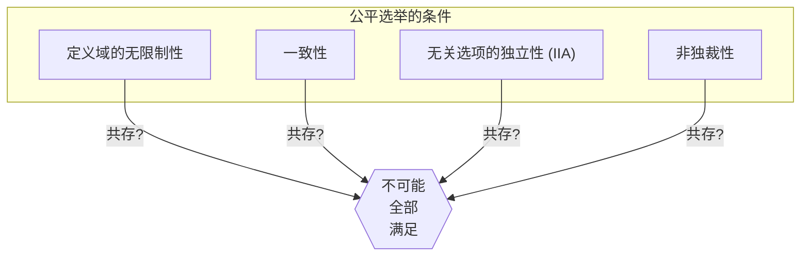
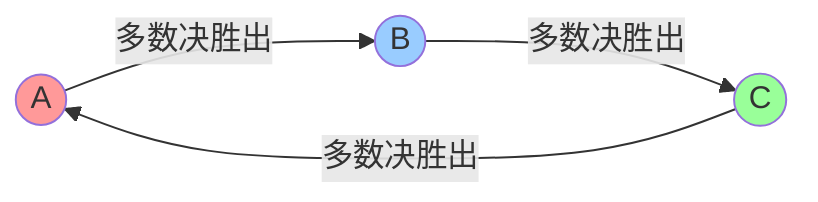
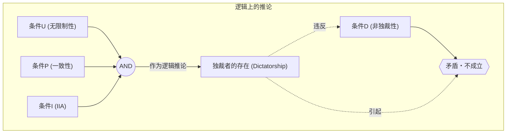

# 引言：能否制定出“完美的选举”？

当我们在社会中决定某些事情时，最常被使用的是“选举”或“多数决”。但是， **多数决** 真的能永远准确地反映民意吗？或者说，如果引入其他规则，能否制定出“每个人都信服的完美选举制度”呢？

实际上，对这个问题的数学答案是 **“不（No）”** 。

1951年，经济学家肯尼斯·阿罗（Kenneth Arrow）在数学上证明了：满足一定合理条件的完美决策规则是不存在的。这就是 **“阿罗的不可能定理（Arrow's Impossibility Theorem）”** 。凭借包含这一成就在内的对社会选择理论的贡献，阿罗于1972年获得了诺贝尔经济学奖。

本文将结合具体例子、数学公式和图解，详细解说这一定理意味着什么。

## 1. 什么是阿罗的不可能定理？

用一句话概括阿罗的不可能定理，就是 **“在3名以上的投票者从3个以上的选项中进行选择时，不可能同时满足『公平的选举（决策规则）』所应满足的多个条件”** 。

这里的“公平的选举”是指直观上让我们觉得“这样才公平”的几个条件。阿罗定义了社会必须满足的最基本的合理条件，并证明了它们在逻辑上是无法共存的。

### 定理的前提条件

在考虑定理时，设定以下场景：

- 选项的集合 $X = \{A, B, C, \dots\}$ （※选项在3个以上）
- 投票者的集合 $V = \{1, 2, \dots, n\}$ （※投票者在3人以上）
- 每个投票者对选项有自己心目中的“偏好顺序（排名）”。
- **社会福利函数（Social Welfare Function）** $F$：接收所有人的偏好顺序作为输入，输出整个社会的偏好顺序的函数（即选举的计票规则）。

## 2. “公平的选举”应满足的4个条件

阿罗提出，理想的社会福利函数 $F$ 应满足以下4个（或扩展为5个）条件。每一项似乎都是“民主选举理所当然应该满足”的条件。

### 条件1：定义域的无限制性（Unrestricted Domain）
选民可以拥有任何偏好顺序（排名）的条件。
例如，系统必须能够接受“A > B > C”的意见，或者“C > A > B”的意见，无论是什么样的顺序，计票系统都必须接受它，并在不出错的情况下决定整个社会的顺序。

### 条件2：一致性（Pareto Principle / Unanimity / 帕累托原则）
如果所有人都认为“选项A比选项B更好（A > B）”，那么作为整个社会的结果也必须是“A > B”，这是一个显得理所应当的条件。

### 条件3：无关选项的独立性（Independence of Irrelevant Alternatives, IIA）
某两个选项 A 和 B 的社会排名，应该仅由各个选民对 A 和 B 的相对排名决定，而不应该受到无关的第三个选项 C 的存在，或者对 C 的排名的影响，这样一个条件。

### 条件4：非独裁性（Non-dictatorship）
系统不能无论其他所有人的意见如何，总是让特定1人（独裁者）的意见原封不动地成为整个社会的决定，这样一个条件。

---

阿罗的不可能定理，就是用数学证明了 **“同时满足这4个条件的社会福利函数是不存在的（如果施加非独裁性，必然会产生矛盾）”** 这样一个令人震惊的事实。

## 3. 具体例子：为什么条件会发生矛盾？

为什么这些看似理所当然的条件会产生矛盾呢？让我们通过著名的“孔多塞悖论”和“波达计数法的问题点”来看一看。

### 孔多塞悖论（多数决的陷阱）

假设3名选民（X先生、Y先生、Z先生）对3项政策（A、B、C）进行投票。各自的偏好顺序如下：

- X先生： **A > B > C** 
- Y先生： **B > C > A** 
- Z先生： **C > A > B** 

让我们用1对1的多数决（循环赛）来决定一下。

1. **A vs B** ： X先生和Z先生喜欢 A （Z先生是 C>A>B，所以A和B之间选A），Y先生喜欢 B 。结果是2对1， **A获胜（A > B）** 。
2. **B vs C** ： X先生和Y先生喜欢 B ，Z先生喜欢 C 。结果是2对1， **B获胜（B > C）** 。
3. **C vs A** ： Y先生和Z先生喜欢 C ，X先生喜欢 A 。结果是2对1， **C获胜（C > A）** 。

对于整个社会来说，陷入了 **A > B > C > A ...** 这样的循环状态，无法决出排名。这被称为 **孔多塞悖论（Condorcet Paradox）** 。如果想满足“定义域的无限制性（可以持有任何意见）”，在多数决中就无法进行正确的计票了。

### 波达计数法与“独立性 (IIA)”的崩溃

那么，为了避免循环，让我们引入“积分制（波达计数法）”。这是一种给第一名3分、第二名2分、第三名1分，通过总分来竞争的制度。

假设有5名选民，并持有以下偏好。

- 3人： **A > B > C** (A: 3分, B: 2分, C: 1分)
- 2人： **B > C > A** (B: 3分, C: 2分, A: 1分)

计算总分。
- A的得分： $(3 \times 3) + (1 \times 2) = 11$ 分
- B的得分： $(2 \times 3) + (3 \times 2) = 12$ 分
- C的得分： $(1 \times 3) + (2 \times 2) = 7$ 分

结果为 **B > A > C** ，B 成为胜者。

此时，假设选项C由于某种原因从候选名单中被剔除了。根据条件3“无关选项的独立性 (IIA)”，即使C消失了，A和B的胜负（排名）也应该不会改变。

让我们在C消失的状态下（只有A和B），再次用积分制（第一名2分，第二名1分）进行计算。
- 3人： **A > B** 
- 2人： **B > A** 

- A的得分： $(2 \times 3) + (1 \times 2) = 8$ 分
- B的得分： $(1 \times 3) + (2 \times 2) = 7$ 分

结果变为了 **A > B** ，胜者逆转为A了！
这意味着，第三个选项C的存在，影响了A和B的胜负。也就是说，积分制选举 **无法满足“无关选项的独立性”** 。

## 4. 通过数学公式和逻辑表达式的表现

让我们尝试用数学公式和逻辑表达式更严密地表达阿罗的不可能定理。

设选民集合为 $V = \{1, 2, \dots, n\}$ ，选项集合为 $X$ （ $|X| \ge 3$ ）。
设选民 $i$ 的偏好为 $\succeq_i$ ，全体选民的偏好组合（Profile）为 $P = (\succeq_1, \succeq_2, \dots, \succeq_n)$ 。
设社会福利函数为 $F$ ，整个社会的偏好记述为 $\succeq = F(P)$ 。

阿罗的条件形式化如下。

1. **定义域的无限制性 (U)** ：
   $F$ 是针对所有可能的偏好组合 $P$ 定义的，其中每个 $\succeq_i$ 是 $X$ 上任意完整且传递的二元关系。

2. **一致性 (P)** ：
   对于任意选项 $x, y \in X$ ，如果对所有选民 $i \in V$ 都有 $x \succ_i y$ ，那么在 $F(P)$ 中也有 $x \succ y$ 。
   $$ \forall x, y \in X, \ (\forall i \in V, \ x \succ_i y) \implies x \succ y $$

3. **无关选项的独立性 (I)** ：
   对于任意两个偏好组合 $P, P'$ 以及任意的 $x, y \in X$ ，如果所有选民 $i$ 在 $P$ 和 $P'$ 中对 $x, y$ 之间的相对顺序关系相同，那么 $F(P)$ 和 $F(P')$ 中对 $x, y$ 的相对顺序关系也相同。
   $$ \forall x, y \in X, \ (\forall i \in V, \ x \succ_i y \iff x \succ'_i y) \implies (x \succ y \iff x \succ' y) $$

4. **非独裁性 (D)** ：
   不存在这样的独裁者 $d \in V$ ，对于任何偏好组合 $P$ ，不论其他选民的偏好如何，他总能将其强烈的个人偏好决定为社会的偏好。
   $$ \neg \exists d \in V \text{ s.t. } \forall P, \forall x, y \in X, \ (x \succ_d y \implies x \succ y) $$

**阿罗定理的主张** ：
当 $|X| \ge 3$ 且 $|V| \ge 2$ 时，满足条件(U), (P), (I)的社会福利函数 $F$ 必定拥有独裁者（违反条件(D)）。
即，同时满足(U), (P), (I), (D)的 $F$ 是不存在的。

## 5. 结论：民主主义起不到作用吗？

“既然完美的选举制度不存在，那么民主主义是不是缺陷重重，毫无意义的呢？”

在了解到这个定理时，许多人可能会有这样的感觉。但在经济学和政治学领域，这个定理被看作是 **“不应一味追求完美，而是为了寻找现实妥协点的路标”** 。

实际上，我们的社会正是通过稍稍放宽定理中“条件”的某一项，才得以运作的。

1. **放宽定义域的无限制性** ：
   在现实的政治中，选民的意见（偏好）通常不会完全分散，而是经常带有一定倾向（如右派、左派等，这种性质被称为单峰偏好）。已经证明在这种受限情况下，多数决（中位选民定理）能够良好地发挥作用。

2. **放宽独立性 (IIA)** ：
   前面提到的波达计数法，或者带有决选投票的多数决等，虽然不满足IIA条件，但作为“现实的选举规则”在世界各地被广泛采用。人们接受了可能会发生一些策略性投票（例如为了避免废票而投票给非第一志愿）的风险，以此排除了独裁。

3. **不仅衡量顺序，也衡量“强度”** ：
   阿罗的定理建立在只统计“比B更喜欢A”这一顺序的前提下。近年来，为各个选项打分的“范围投票法（Range Voting）”或“赞成投票制（Approval Voting）”等，通过引入喜好的“强度”或“容许度”来回避悖论的制度，也正受到研究。

## 结语

阿罗的不可能定理，运用数学这一冷酷的语言证明了 **“对所有人来说完美的规则是不存在的”** 。但这并不意味着民主主义的失败。

相反，这应该被视为一个非常积极且具有教育意义的信息： **“任何制度都必然有其弱点，因此在了解这些弱点的基础之上，选择符合情况的最佳规则，并进行充分的讨论才是最重要的”** 。

正因为完美的系统不存在，所以我们才必须不断思考、讨论，并持续更新我们的社会。
