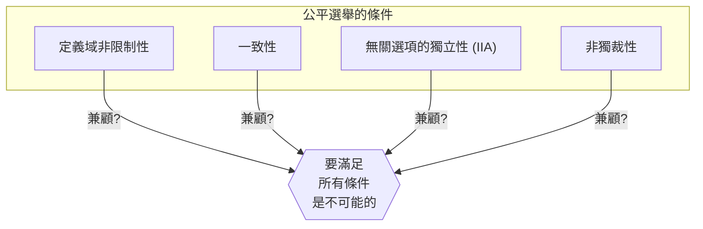
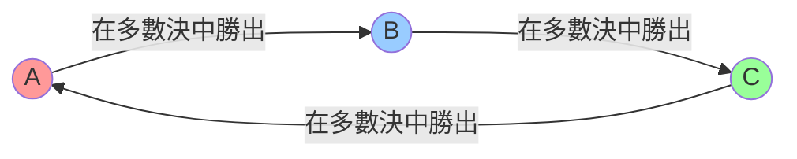
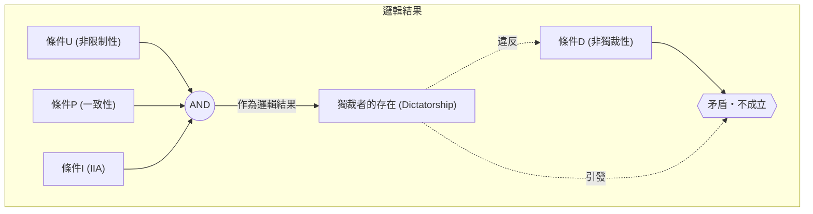

# 前言：能制定出「完美的選舉」嗎？

當我們在社會中要決定某件事時，最常使用的是「選舉」或「多數決」。但是， **多數決** 真的總是能準確反映民意嗎？或者，如果導入其他的規則，是否就能創造出「讓所有人都心服口服的完美選舉制度」呢？

其實，這個問題在數學上的答案是 **「否」** 。

1951年，經濟學家肯尼斯·阿羅（Kenneth Arrow）在數學上證明了：滿足一定合理條件的完美決策規則是不存在的。這就是 **「[阿羅不可能定理](https://kenji.blog/zh-tw/p/arrows-impossibility-theorem/)（[Arrow's Impossibility Theorem](https://kenji.blog/zh-tw/p/arrows-impossibility-theorem/)）」** 。阿羅因包含這項成就在內的社會選擇理論的貢獻，於1972年榮獲諾貝爾經濟學獎。

本文將透過具體例子、數學公式與圖解，詳細解說這個定理所代表的意義。

## 1. 什麼是[阿羅不可能定理](https://kenji.blog/zh-tw/p/arrows-impossibility-theorem/)？

用一句話來說，[阿羅不可能定理](https://kenji.blog/zh-tw/p/arrows-impossibility-theorem/)就是 **「當3個以上的投票者從3個以上的選項中進行選擇時，要同時滿足『公平選舉（決策規則）』所應具備的多項條件，是不可能的」** 。

這裡的「公平選舉」，是指我們直覺上認為「這樣才公平」的幾個條件。阿羅定義了社會應該滿足的最低限度的合理條件，並指出這些條件在邏輯上是無法同時成立的。

### 定理的前提條件

在思考這個定理時，我們設定以下的情況：

- 選項集合 $X = \{A, B, C, \dots\}$ （※選項有3個以上）
- 投票者集合 $V = \{1, 2, \dots, n\}$ （※投票者有3人以上）
- 每位投票者對選項都有自己的「偏好順序（排名）」。
-  **社會福利函數（Social Welfare Function）** $F$：將所有人的偏好順序作為輸入，並輸出整個社會的偏好順序的函數（也就是選舉的計票規則）。

## 2. 「公平選舉」應滿足的4個條件

阿羅提出了理想的社會福利函數 $F$ 應滿足的以下4個（或擴充為5個）條件。這些條件看起來都是「民主選舉理所當然應該具備的」。

### 條件1：定義域非限制性（Unrestricted Domain）
這個條件是指，選民可以擁有任何的偏好順序（排名）。
例如，「A > B > C」的意見或是「C > A > B」的意見，無論是什麼樣的順序，計票系統都必須接受，並且在不發生錯誤的情況下決定出整個社會的順序。

### 條件2：一致性（Pareto Principle / Unanimity）
如果所有人都認為「選項A比選項B更好（A > B）」，那麼整個社會的結果也必須是「A > B」。這似乎是非常理所當然的要求。

### 條件3：無關選項的獨立性（Independence of Irrelevant Alternatives, IIA）
某兩個選項 A 和 B 之間的社會排名，應該只由個別選民對 A 和 B 的相對排名來決定，不應該受到無關的第三個選項 C 的存在，或對 C 的排名所影響。

### 條件4：非獨裁性（Non-dictatorship）
這項條件規定，系統不能無論其他所有人的意見如何，總是讓特定一人（獨裁者）的意見直接成為整個社會的決定。

---

[阿羅不可能定理](https://kenji.blog/zh-tw/p/arrows-impossibility-theorem/)在數學上證明了一個令人震驚的事實： **「同時滿足這4個條件的社會福利函數是不存在的（只要要求非獨裁性就必然會產生矛盾）」** 。

## 3. 具體例子：為什麼條件會產生矛盾？

為什麼這些看似理所當然的條件會產生矛盾呢？讓我們透過著名的「孔多塞悖論（Condorcet Paradox）」和「波達計數法（Borda Count）的問題點」來看看。

### 孔多塞悖論（多數決的陷阱）

假設有3位選民（X先生、Y先生、Z先生）對3項政策（A、B、C）進行投票。各自的偏好順序如下：

- X先生： **A > B > C** 
- Y先生： **B > C > A** 
- Z先生： **C > A > B** 

我們用1對1的多數決（循環賽）來決定看看。

1. **A vs B** ： X先生和Z先生偏好 A （因為Z先生是 C > A > B ，所以 A 和 B 相比選 A ），而Y先生偏好 B 。結果，以2比1得出 **A獲勝（A > B）** 。
2. **B vs C** ： X先生和Y先生偏好 B ，而Z先生偏好 C 。結果，以2比1得出 **B獲勝（B > C）** 。
3. **C vs A** ： Y先生和Z先生偏好 C ，而X先生偏好 A 。結果，以2比1得出 **C獲勝（C > A）** 。

對整個社會來說，陷入了 **A > B > C > A ...** 的無限迴圈狀態，無法決定出排名。這被稱為 **孔多塞悖論（Condorcet Paradox）** 。為了滿足「定義域非限制性（可以擁有任何意見）」，多數決就會變得無法進行正確的計票。

### 波達計數法與「獨立性 (IIA)」的破滅

那麼，為了避免無限迴圈，我們來導入「積分制（波達計數法）」。第1名給3分，第2名給2分，第3名給1分，以總分來競爭。

假設有5名選民，並且有以下的偏好：

- 3人： **A > B > C** (A: 3分, B: 2分, C: 1分)
- 2人： **B > C > A** (B: 3分, C: 2分, A: 1分)

計算總分。
- A的得分： $(3 \times 3) + (1 \times 2) = 11$ 分
- B的得分： $(2 \times 3) + (3 \times 2) = 12$ 分
- C的得分： $(1 \times 3) + (2 \times 2) = 7$ 分

結果是 **B > A > C** ，由 B 成為勝者。

現在，假設選項C因為某種原因從候選中被排除了。根據條件3的「無關選項的獨立性 (IIA)」，即使C消失了，A和B的勝負（排名）也不應該改變。

在C消失的狀態下（只有A和B），我們再次用積分制（第1名2分，第2名1分）來計算看看。
- 3人： **A > B** 
- 2人： **B > A** 

- A的得分： $(2 \times 3) + (1 \times 2) = 8$ 分
- B的得分： $(1 \times 3) + (2 \times 2) = 7$ 分

結果變成 **A > B** ，勝者逆轉成了A！
這意味著，作為第三個選項的C的存在，影響了A和B之間的勝負。也就是說，積分制的選舉 **無法滿足「無關選項的獨立性」** 。

## 4. 透過數學公式與邏輯公式的表達

我們試著使用數學公式和邏輯公式，更嚴謹地表達[阿羅不可能定理](https://kenji.blog/zh-tw/p/arrows-impossibility-theorem/)。

設選民集合為 $V = \{1, 2, \dots, n\}$ ，選項集合為 $X$ （ $|X| \ge 3$ ）。
設選民 $i$ 的偏好為 $\succeq_i$ ，全體選民偏好的組合（配置）為 $P = (\succeq_1, \succeq_2, \dots, \succeq_n)$ 。
設社會福利函數為 $F$ ，整個社會的偏好記為 $\succeq = F(P)$ 。

阿羅的條件可以公式化如下：

1. **定義域非限制性 (U)** ：
   $F$ 是對於所有的可能配置 $P$ 都有定義的，其中每個 $\succeq_i$ 都是 $X$ 上任意的完備且遞移的二元關係。

2. **一致性 (P)** ：
   對於任意選項 $x, y \in X$ ，如果對所有選民 $i \in V$ 都滿足 $x \succ_i y$ ，那麼在 $F(P)$ 中也會是 $x \succ y$ 。
   $$ \forall x, y \in X, \ (\forall i \in V, \ x \succ_i y) \implies x \succ y $$

3. **無關選項的獨立性 (I)** ：
   對於任意兩個配置 $P, P'$ 以及任意的 $x, y \in X$ ，如果在所有選民 $i$ 中， $x, y$ 之間的相對順序關係在 $P$ 和 $P'$ 是相等的，那麼 $F(P)$ 和 $F(P')$ 之中 $x, y$ 的相對順序關係也是相等的。
   $$ \forall x, y \in X, \ (\forall i \in V, \ x \succ_i y \iff x \succ'_i y) \implies (x \succ y \iff x \succ' y) $$

4. **非獨裁性 (D)** ：
   對於任何的配置 $P$ ，都不存在一個獨裁者 $d \in V$ ，可以無論其他選民的偏好為何，總是能將自己強烈的偏好決定為社會的偏好。
   $$ \neg \exists d \in V \text{ s.t. } \forall P, \forall x, y \in X, \ (x \succ_d y \implies x \succ y) $$

**阿羅定理的主張** ：
當 $|X| \ge 3$ 且 $|V| \ge 2$ 時，滿足條件(U), (P), (I) 的社會福利函數 $F$ ，必然會有獨裁者（違反條件(D)）。
換句話說，同時滿足 (U), (P), (I), (D) 的 $F$ 是不存在的。

## 5. 結論：民主無法運作嗎？

「既然不存在完美的選舉制度，民主是不是充滿缺陷而毫無意義呢？」

當知道這個定理時，許多人可能會這麼覺得。然而，在經濟學和政治學領域，人們將這個定理視為 **「不是用來追求完美，而是用來尋找現實妥協點的指標」** 。

實際上，我們的社會是透過稍微放寬定理中的某些「條件」來運作的。

1. **放寬定義域非限制性** ：
   在現實政治中，選民的意見（偏好）並非完全分散，通常會有某種程度的傾向（如右派、左派等，被稱為單峰偏好的性質）。已經證明在這種有限的情況下，多數決（中位選民定理）可以發揮良好的作用。

2. **放寬獨立性 (IIA)** ：
   前述的波達計數法，或是帶有決選的多數決等，雖然無法滿足 IIA 的條件，但作為「現實的選舉規則」在世界各地被廣泛採用。這是透過接受發生少許策略性投票（為了避免廢票而投票給非首選等）的風險，來換取排除獨裁的可能。

3. **不僅測量順序，還測量「強度」** ：
   阿羅定理的前提是只統計「喜歡 A 勝過 B」的順序。近年來，也有研究探討透過引入偏好的「強度」或「容忍度」來迴避悖論的制度，例如為每個選項評分的「評分投票法（Range Voting）」或「認可投票法（Approval Voting）」。

## 結語

[阿羅不可能定理](https://kenji.blog/zh-tw/p/arrows-impossibility-theorem/)使用數學這種冷靜的語言，證明了 **「對所有人而言完美的規則是不存在的」** 。但這並不代表民主的失敗。

相反地，我們應該將其視為一個非常積極且具有教訓意義的訊息： **「任何制度都必然有其弱點，因此重要的是，在了解這些弱點的基礎上，選擇最適合情況的規則，並進行充分的討論」** 。

正因為不存在完美的系統，我們才必須不斷地思考、討論，並持續更新我們的社會。
