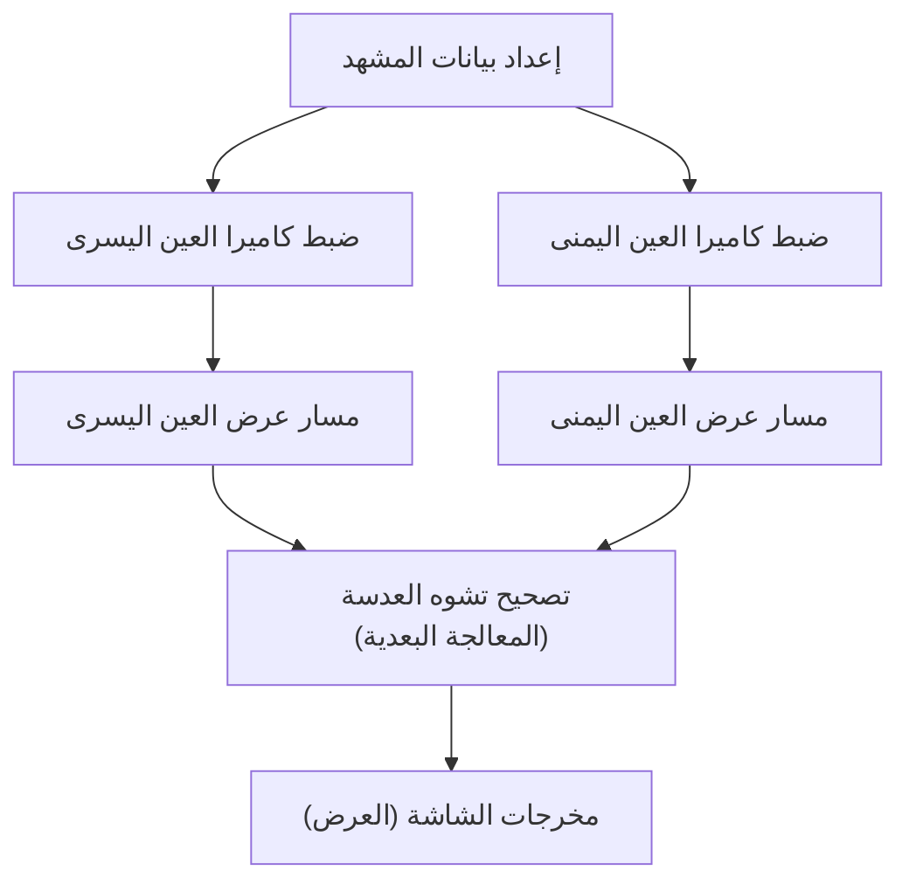

# طليعة تقنيات العرض (الرندرة) التي تدعم التجارب الغامرة

لم تعد تقنيات الواقع المعزز (AR) والواقع الافتراضي (VR) مجرد ضرب من خيال الخيال العلمي، بل أصبحت حقيقة ملموسة تعيد تشكيل عالمنا من جذوره؛ بدءًا من الصناعة والطب، مرورًا بقطاع الترفيه، ووصولاً إلى تفاصيل حياتنا اليومية. ولكن، لكي تتمكن هذه التقنيات من تقديم "انغماس" حقيقي وشامل، فإنها تتطلب آليات توليد صور بالغة الدقة وأنظمة تتبع معقدة قادرة على خداع الدماغ البشري بشكل كامل وإقناعه بواقعية ما يراه.

في هذا المقال، سنغوص بعمق في التقنيات الأساسية التي تدعم الواقع المعزز والواقع الافتراضي، ونستكشف آليات العرض (الرندرة)، وتقنيات الإدراك المكاني، بالإضافة إلى أحدث المنهجيات المتبعة لتقليل العبء الحسابي والوصول إلى أداء سلس.

## آلية الرؤية المجسمة ثنائية العينين (العرض الاستريو) في الواقع الافتراضي

أحد العوامل الرئيسية التي يعتمد عليها الإنسان في إدراك الأجسام ثلاثية الأبعاد هو "التفاوت بين العينين" (Binocular Disparity). نظرًا لأن العين اليمنى والعين اليسرى تفصل بينهما مسافة بضعة سنتيمترات، فإن كل عين ترى العالم من زاوية مختلفة قليلاً عن الأخرى. تقوم نظارات الواقع الافتراضي (VR Headsets) بخلق هذا التفاوت بشكل مصطنع، مما يولد إحساسًا بالعمق على شاشات مسطحة تمامًا.

### مسار عمل العرض الاستريو (Stereo Rendering Pipeline)

في عملية العرض الاستريو، يتطلب الأمر من حيث المبدأ عرض المشهد ذاته مرتين: مرة مخصصة للعين اليسرى، ومرة أخرى مخصصة للعين اليمنى.

نظرًا لأن إجراء عملية العرض مرتين بشكل مبسط سيؤدي حتمًا إلى مضاعفة التكلفة الحسابية، فقد تبنت واجهات برمجة تطبيقات الرسومات الحديثة (مثل Vulkan و DirectX 12) ومحركات الألعاب تقنيات تحسين متطورة، مثل (Single Pass Stereo) والعرض متعدد الرؤى (Multiview). بفضل هذه التقنيات، تتم معالجة الأشكال الهندسية (Geometry) مرة واحدة فقط، ويتم حساب الفروق بين اليمين واليسار حصريًا في مرحلة تظليل البكسل (Pixel Shader)، مما يؤدي إلى تحسن هائل في الأداء وتوفير كبير في الموارد.

## أهمية زمن الانتقال من الحركة إلى الفوتون (Motion-to-Photon) ودوار الواقع الافتراضي

يُعد "زمن الانتقال من الحركة إلى الفوتون" (Motion-to-Photon Latency) أحد أكثر المؤشرات حرجًا في عالم الواقع الافتراضي. ويشير هذا المصطلح إلى التأخير الزمني الذي يحدث منذ اللحظة التي يحرك فيها المستخدم رأسه، وحتى وصول الصورة التي تعكس تلك الحركة إلى عينيه في شكل ضوء (فوتونات) على الشاشة.

### آلية دوار الواقع الافتراضي (مرض المحاكاة)

عندما يحدث تباين أو عدم توافق بين النظام الدهليزي البشري (حاسة التوازن الموجودة في القنوات نصف الدائرية في الأذن الداخلية) والمعلومات البصرية التي تتلقاها العين، يصاب الدماغ بحالة من الارتباك، مما يؤدي إلى ظهور أعراض ما يُعرف بـ "دوار الواقع الافتراضي"، والذي يشمل الغثيان والدوخة. وبشكل عام، تشير الدراسات إلى أنه عندما يتجاوز زمن (Motion-to-Photon) حاجز الـ 20 مللي ثانية، يبدأ الإنسان في ملاحظة هذا التباين بشكل واضح.

ولتقليل زمن الانتقال ومعالجة هذه المشكلة، يتم استخدام تقنيات متقدمة، من أبرزها:

- **الالتواء الزمني غير المتزامن (Asynchronous Timewarp - ATW):** تقنية تعمل حتى في حال انخفاض معدل الإطارات (Frame Rate)، حيث تستخدم أحدث بيانات دوران الرأس لتشويه الصورة التي تم عرضها مسبقًا، مما يساهم في إخفاء التأخير البصري والحفاظ على سلاسة التجربة.
- **الالتواء المكاني غير المتزامن (Asynchronous Spacewarp - ASW):** تقنية لا تقتصر على توقع الدوران فحسب، بل تتنبأ أيضًا بالحركة الانتقالية (تغير الموضع المكاني) للرأس، وتقوم بتوليد إطارات وسطية لضمان استمرارية الحركة بنعومة.

## تقنية SLAM ورسم خرائط البيئة في الواقع المعزز

في حين أن الواقع الافتراضي يقوم برسم عالم افتراضي مصطنع بالكامل، فإن الواقع المعزز (AR) يعمل على تراكب المعلومات الرقمية فوق العالم الحقيقي. ولتحقيق ذلك بدقة، يجب أن يكون الجهاز قادرًا على الإدراك الدقيق لـ "موقعه الفعلي في العالم الحقيقي". التقنية الجوهرية التي تجعل هذا الأمر ممكنًا هي تقنية SLAM (التموضع ورسم الخرائط المتزامن).

### المبادئ الأساسية لتقنية SLAM

تُعد تقنية SLAM نظامًا متكاملاً يتيح للجهاز تقدير موقعه الذاتي (Localization) وإنشاء خريطة للبيئة المحيطة (Mapping) في وقت واحد، وذلك أثناء التنقل في بيئة غير مألوفة.

تعتمد الهواتف الذكية (عبر تقنيات مثل ARKit و ARCore) ونظارات الواقع المعزز بشكل أساسي على منهجية تُعرف باسم (Visual-Inertial SLAM) أو اختصارًا (VI-SLAM). تعتمد هذه المنهجية على دمج (Sensor Fusion) المعلومات البصرية المستمدة من الكاميرا مع بيانات التسارع والسرعة الزاوية المستمدة من وحدة القياس بالقصور الذاتي (IMU)، مما يوفر تتبعًا عالي السرعة والدقة. في السنوات الأخيرة، انتشرت الأجهزة المزودة بماسحات LiDAR بشكل واسع، مما أتاح إمكانية رسم خرائط مستقرة حتى في الأماكن المظلمة أو على الجدران التي تفتقر إلى معالم بارزة.

## تتبع العين والعرض المُرَكَّز (Foveated Rendering)

مع التطور المستمر وارتفاع دقة الشاشات لتصل إلى 4K و 8K، يزداد العبء الواقع على وحدة معالجة الرسومات (GPU) بشكل أسي. ولتجاوز هذا التحدي، برزت تقنية "العرض المُرَكَّز" (Foveated Rendering) كحل جذري وثوري.

### التحسين باستخدام الخصائص البصرية البشرية

في شبكية العين البشرية، توجد منطقة ضيقة جدًا تُعرف باسم "النقرة" أو "المركز البصري" (Fovea) (وتشغل حوالي 1 إلى 2 درجة فقط من مجال الرؤية)، وهي المنطقة الوحيدة التي تتمتع بأعلى دقة وقدرة على تمييز الألوان بوضوح فائق. في المقابل، تكون الرؤية المحيطية شديدة الحساسية للحركة، ولكن قدرتها على تمييز التفاصيل والألوان تنخفض بشكل كبير.

تستغل تقنية العرض المُرَكَّز (Foveated Rendering) هذه الخاصية الفسيولوجية لصالحها، حيث تقوم بعرض الجزء المركزي الذي يركز عليه المستخدم فقط بدقة عالية جدًا، بينما تقوم بخفض دقة الأجزاء المحيطية بشكل متعمد ومدروس.

1. **تتبع العين (Eye Tracking):** تقوم كاميرات تعمل بالأشعة تحت الحمراء، والمدمجة داخل النظارة، بتتبع حركات حدقة عين المستخدم بدقة تصل إلى أجزاء من الألف من الثانية.
2. **تظليل بمعدل متغير (Variable Rate Shading - VRS):** بناءً على بيانات تتبع العين، يتم تقسيم الشاشة إلى مناطق متعددة. تقوم المنطقة المركزية بحساب التظليل لكل بكسل على حدة، بينما تقوم المناطق المحيطية بدمج عدة بكسلات معًا وحسابها دفعة واحدة.

تتيح هذه العملية تقليل العبء الحسابي لعملية العرض بشكل هائل (قد يتجاوز 50% في بعض الحالات) دون أن يشعر المستخدم بأي انخفاض في الجودة البصرية.

## الخلاصة

إن تقنيات العرض في مجالي الواقع المعزز والواقع الافتراضي تتطور في مسار يتشابك فيه تطور الأجهزة (الهاردوير) بشكل وثيق مع تحسينات البرمجيات. إن هذا المزيج المتكامل من التقنيات – والذي يضم كفاءة العرض الاستريو، والحد الأقصى لتقليل زمن الانتقال، والإدراك المكاني المتقدم عبر تقنية SLAM، بالإضافة إلى تقليل العبء الحسابي بالاعتماد على تتبع العين – هو ما ينجح في خداع أدمغتنا وخلق حالة عميقة من الانغماس في عوالم بديلة.

في المستقبل القريب، ومع ظهور تقنيات العرض العصبي (Neural Rendering) المدعومة بالذكاء الاصطناعي (التعلم الآلي)، فضلاً عن شاشات الجيل القادم التي تتميز بخفة الوزن وانخفاض استهلاك الطاقة، فإن الواقع المعزز والواقع الافتراضي سيواصلان تطورهما ليصبحا بنية تحتية أساسية ومألوفة تندمج بسلاسة تامة في نسيج حياتنا اليومية.
