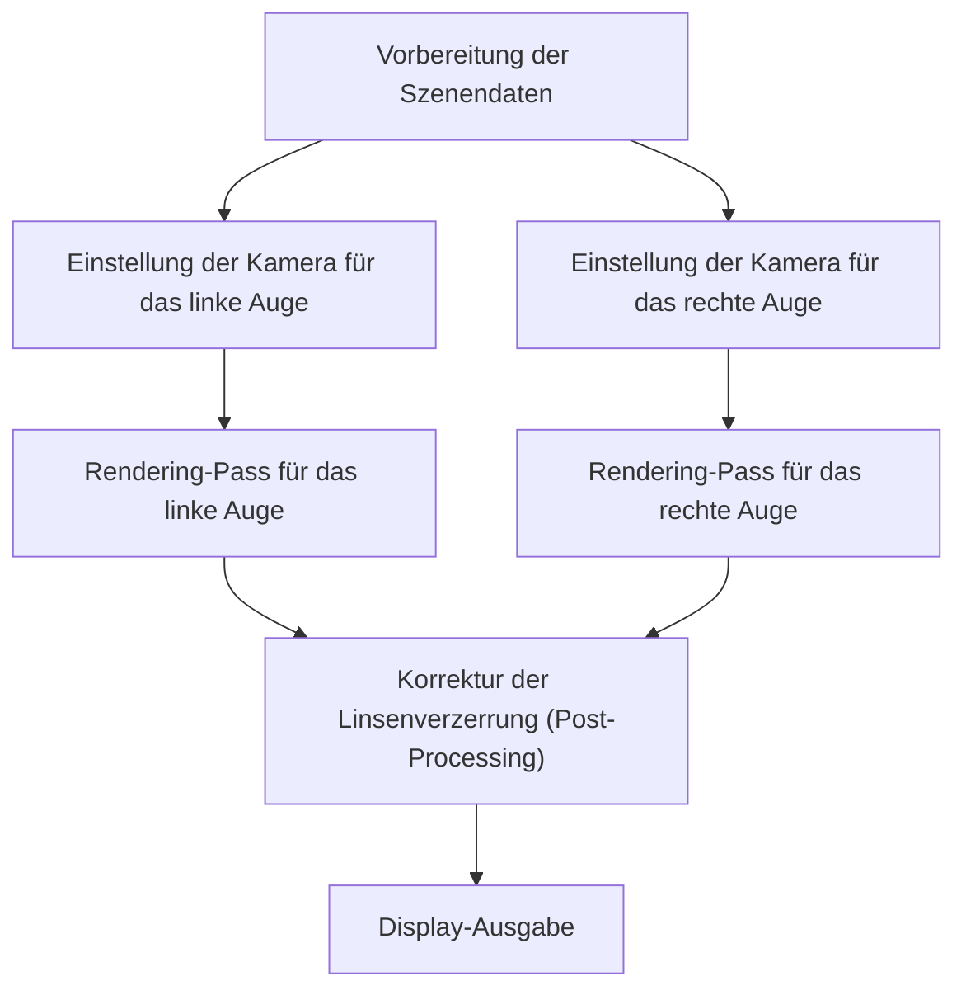
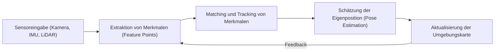

# Die vorderste Front der Rendering-Technologien für immersive Erlebnisse

AR (Augmented Reality, erweiterte Realität) und VR (Virtual Reality, virtuelle Realität) sind längst keine reinen Science-Fiction-Konzepte mehr. Von der Industrie über die Medizin und Unterhaltungsbranche bis hin zu unserem alltäglichen Leben verändern sie unsere Welt von Grund auf. Damit diese Technologien jedoch eine echte „Immersion“ – also das vollkommene Eintauchen in eine Welt – bieten können, sind hochkomplexe Bildgenerierungs- und Tracking-Verfahren notwendig, die präzise genug sind, um das menschliche Gehirn vollständig zu täuschen.

In diesem Artikel werden wir tief in die Kerntechnologien eintauchen, die AR und VR stützen. Dazu gehören die genaue Funktionsweise des Renderings, Technologien zur räumlichen Wahrnehmung sowie die neuesten Ansätze zur Reduzierung des Rechenaufwands.

## Die Funktionsweise der binokularen Stereoskopie (Stereo-Rendering) in der VR

Einer der wichtigsten Faktoren, durch die der Mensch dreidimensionale Räume wahrnimmt, ist die „binokulare Disparität“ (Querdisparation). Da das rechte und das linke Auge einige Zentimeter voneinander entfernt sind, betrachten sie die Welt aus jeweils leicht unterschiedlichen Blickwinkeln. Ein VR-Headset erzeugt diese binokulare Disparität künstlich, um auf einem eigentlich flachen Display ein Gefühl von Tiefe zu erzeugen.

### Die Pipeline des Stereo-Renderings

Beim Stereo-Rendering muss im Grunde dieselbe Szene zweimal gerendert werden: einmal für das linke und einmal für das rechte Auge.

Wenn man die Szene einfach zweimal separat rendert, verdoppeln sich die Rechenkosten. Um dies zu vermeiden, setzen moderne Grafik-APIs (wie Vulkan oder DirectX 12) und Game-Engines auf Optimierungstechniken wie Single Pass Stereo oder Multiview. Durch diese Methoden wird die Geometrieverarbeitung (Geometry Processing) nur ein einziges Mal durchgeführt. Erst in der Phase der Pixel-Shader werden die Unterschiede zwischen links und rechts berechnet, was zu einer erheblichen Leistungssteigerung führt.

## Die Bedeutung der Motion-to-Photon-Latenz und VR-Übelkeit (Motion Sickness)

Eine der kritischsten Kennzahlen im Bereich der Virtual Reality ist die sogenannte „Motion-to-Photon-Latenz“. Diese Metrik beschreibt die Verzögerungszeit von dem Moment an, in dem der Benutzer seinen Kopf bewegt, bis zu dem Zeitpunkt, an dem das diese Bewegung widerspiegelnde Bild als Licht (Photonen) auf dem Display erscheint und das Auge erreicht.

### Die Mechanismen der VR-Übelkeit (Simulatorkrankheit)

Wenn eine Diskrepanz zwischen dem vestibulären System des Menschen (dem Gleichgewichtssinn im Innenohr) und den aufgenommenen visuellen Informationen entsteht, gerät das Gehirn in Verwirrung. Dies führt zu Symptomen wie Übelkeit oder Schwindel, die allgemein als „VR-Übelkeit“ bezeichnet werden. Im Allgemeinen geht man davon aus, dass der Mensch diese Abweichungen sehr viel leichter wahrnimmt, wenn die Motion-to-Photon-Latenz 20 Millisekunden (ms) überschreitet.

Um diese Latenz zu verringern, kommen unter anderem die folgenden Technologien zum Einsatz:

- **Asynchronous Timewarp (ATW)**: Selbst wenn die Bildwiederholrate (Framerate) einbricht, nutzt diese Technologie die allerneuesten Rotationsdaten des Kopfes, um das bereits gerenderte Bild leicht zu verzerren und so die visuelle Verzögerung geschickt zu kaschieren.
- **Asynchronous Spacewarp (ASW)**: Hierbei wird nicht nur die Rotation berücksichtigt, sondern auch die Translation (Positionsveränderung) des Kopfes vorhergesagt, um komplett neue Zwischenbilder (Frames) zu generieren.

## SLAM und Environment Mapping (Umgebungskartierung) in der AR

Während die VR eine vollständig künstliche, virtuelle Welt rendert, legt die AR digitale Informationen als Overlay über die reale Welt. Dafür ist es zwingend erforderlich, dass das Gerät exakt erkennt, wo in der realen Welt es sich gerade befindet. Die Kerntechnologie, die dies ermöglicht, heißt SLAM (Simultaneous Localization and Mapping).

### Grundprinzipien von SLAM

SLAM ist eine Technologie, die es einem System ermöglicht, sich durch eine unbekannte Umgebung zu bewegen und dabei gleichzeitig seine eigene Position zu schätzen (Localization) und eine Karte dieser Umgebung zu erstellen (Mapping).

Smartphones (mittels ARKit oder ARCore) und AR-Brillen verwenden hauptsächlich eine Methode namens Visual-Inertial SLAM (VI-SLAM). Dabei werden visuelle Daten der Kamera mit Beschleunigungs- und Winkelgeschwindigkeitsdaten der IMU (Inertial Measurement Unit) fusioniert (Sensor Fusion), was ein äußerst schnelles und präzises Tracking ermöglicht. In jüngster Zeit haben sich auch Geräte mit integrierten LiDAR-Scannern verbreitet, was ein stabiles Mapping selbst in dunklen Umgebungen oder an strukturlosen Wänden (ohne markante Feature Points) gewährleistet.

## Eye-Tracking und Foveated Rendering

Mit der stetigen Erhöhung der Display-Auflösungen auf 4K, 8K und darüber hinaus wächst die Belastung für die GPU exponentiell. Als vielversprechender Durchbruch, um diese Leistungsgrenzen zu überwinden, gilt das sogenannte „Foveated Rendering“ (foveales Rendering).

### Optimierung durch die Nutzung menschlicher Seh-Eigenschaften

Im menschlichen Auge (genauer gesagt auf der Netzhaut) gibt es nur einen sehr kleinen Bereich – die „Fovea centralis“ (Sehgrube), die etwa 1 bis 2 Grad des Sichtfeldes ausmacht –, in dem die Auflösung und die Farbwahrnehmung am höchsten sind. Das periphere Sichtfeld ist zwar extrem empfindlich für Bewegungen, jedoch nehmen die Sehschärfe und die Fähigkeit zur Farbunterscheidung dort drastisch ab.

Foveated Rendering nutzt genau diese biologische Eigenschaft aus: Nur der zentrale Bereich, den der Benutzer gerade fixiert, wird in hochauflösender Qualität gerendert, während die Auflösung der peripheren Bereiche absichtlich und drastisch reduziert wird.

1. **Eye-Tracking**: Eine im Headset integrierte Infrarotkamera verfolgt die Bewegungen der Pupillen des Benutzers auf die Millisekunde genau.
2. **Variable Rate Shading (VRS)**: Basierend auf den Eye-Tracking-Daten wird der Bildschirm in verschiedene Zonen unterteilt. Im zentralen Sichtbereich wird der Shader für jeden einzelnen Pixel berechnet, während in den Randbereichen mehrere Pixel zu einer einzigen Berechnung zusammengefasst werden.

Dadurch kann die Rechenlast des Renderings drastisch gesenkt werden (in manchen Fällen um mehr als 50 %), ohne dass der Benutzer auch nur die geringste visuelle Qualitätseinbuße bemerkt.

## Fazit

Die Rendering-Technologien für AR und VR entwickeln sich durch ein enges Zusammenspiel von Hardware-Fortschritten und Software-Optimierungen stetig weiter. Die Effizienzsteigerung beim Stereo-Rendering, die extreme Reduzierung der Latenz, das hochkomplexe räumliche Verständnis durch SLAM sowie die Einsparung von Rechenleistung mittels Eye-Tracking – all diese Technologien wirken zusammen, um unser Gehirn zu täuschen und eine tiefe Immersion zu erzeugen.

Mit dem zukünftigen Einsatz von KI (Maschinelles Lernen) für Neural Rendering und dem Aufkommen noch leichterer, energieeffizienterer Display-Technologien werden sich AR und VR unweigerlich zu einer selbstverständlichen Infrastruktur entwickeln, die nahtlos in unseren Alltag integriert ist.
