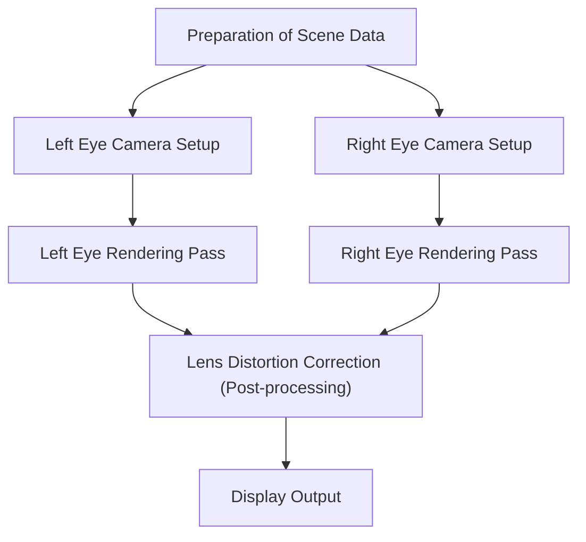
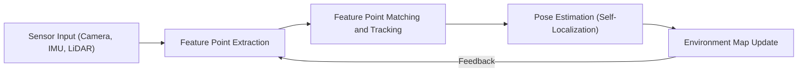

# The Forefront of Rendering Technologies Behind Immersive Experiences

Augmented Reality (AR) and Virtual Reality (VR) are no longer technologies confined to the realm of science fiction. From industrial applications, healthcare, and entertainment, all the way to our daily routines, they are fundamentally transforming our world. However, for these technologies to deliver a truly "immersive" sensation, they require sophisticated image generation and highly precise tracking systems capable of comprehensively deceiving the human brain.

In this article, we will delve deeply into the core mechanisms that support AR and VR—specifically, the intricacies of rendering architectures, spatial awareness technologies, and state-of-the-art computational reduction methods.

## The Mechanism of Binocular Stereopsis (Stereo Rendering) in VR

One of the primary factors enabling humans to perceive three-dimensional depth is "binocular disparity." Because our right and left eyes are separated by a few centimeters, each eye views the world from a slightly different angle. VR headsets artificially replicate this binocular disparity to create a profound sense of depth on what are essentially flat 2D displays.

### The Stereo Rendering Pipeline

In traditional stereo rendering, a system is fundamentally required to render the exact same scene twice: once for the left eye, and once for the right eye.

Since rendering the environment twice naively doubles the computational cost, modern graphics APIs (such as Vulkan and DirectX 12) and advanced game engines employ sophisticated optimization techniques like Single Pass Stereo or Multiview. These innovations allow geometry processing to be executed only once, confining the calculation of left-right disparities solely to the pixel shader stage. This strategic shift translates into a dramatic improvement in overall rendering performance.

## The Importance of Motion-to-Photon Latency and VR Sickness

One of the most critical metrics in VR performance is "Motion-to-Photon Latency." This refers to the time delay from the exact moment a user moves their head to the precise instant the updated image reflecting that movement reaches their eyes via the display (as photons).

### The Mechanism of VR Sickness (Simulator Sickness)

When there is a noticeable discrepancy between a human's vestibular system (the sense of balance governed by the inner ear) and the visual information presented to the eyes, the brain experiences confusion. This sensory conflict triggers "VR sickness," characterized by symptoms like nausea and dizziness. Generally, it is said that if the Motion-to-Photon latency exceeds 20 milliseconds (ms), humans become highly susceptible to perceiving this sensory lag.

To aggressively mitigate latency, the following specialized techniques are widely utilized:

- **Asynchronous Timewarp (ATW)**: A technique where, even if the frame rate drops, the system uses the most recently acquired head rotation data to warp the already rendered image just before it is displayed, effectively masking the visual latency.
- **Asynchronous Spacewarp (ASW)**: A more advanced progression of ATW that predicts not only head rotation but also positional translation (movement in physical space), intelligently generating entirely new intermediate frames based on predicted motion vectors.

## SLAM and Environmental Mapping in AR

While VR renders entirely artificial virtual worlds, AR superimposes digital information onto the actual physical world. To achieve this convincingly, the AR device must precisely understand "where it is currently located within the real world." The core technology making this possible is SLAM (Simultaneous Localization and Mapping).

### The Fundamental Principles of SLAM

SLAM is a complex algorithmic process that simultaneously estimates the device's own position (Localization) and creates a comprehensive map of the surrounding environment (Mapping) while moving through an unknown space.

Modern smartphones (utilizing frameworks like ARKit or ARCore) and AR glasses predominantly employ a method known as Visual-Inertial SLAM (VI-SLAM). This approach seamlessly integrates visual data captured from the camera with acceleration and angular velocity data derived from the IMU (Inertial Measurement Unit) through a process called sensor fusion, resulting in remarkably fast and highly accurate tracking. In recent years, devices equipped with LiDAR scanners have become increasingly common, enabling robust, stable mapping even in challenging conditions such as dark environments or facing featureless blank walls.

## Eye Tracking and Foveated Rendering

As display resolutions inexorably march higher toward 4K, 8K, and beyond, the computational burden on the GPU increases exponentially. The breakthrough widely anticipated to overcome this hardware limitation is "Foveated Rendering."

### Optimization Leveraging Human Visual Characteristics

Within the human eye (specifically the retina), the only area capable of recognizing shapes in high resolution and vivid color is an incredibly narrow region known as the "fovea" (which covers roughly a mere 1 to 2 degrees of the visual field). While our peripheral vision is exquisitely sensitive to movement, its capacity for high resolution and precise color discrimination is significantly lower.

Foveated rendering deliberately exploits these physiological characteristics by rendering only the exact central area where the user is looking at maximum resolution, while intentionally and dynamically degrading the resolution in the peripheral areas.

1. **Eye Tracking**: Infrared cameras intricately embedded within the headset continuously track the microscopic movements of the user's pupils in milliseconds.
2. **Variable Rate Shading (VRS)**: Driven by the real-time eye-tracking data, the screen is dynamically divided into multiple distinct regions. The central focal area calculates shaders on a precise 1-pixel-per-shader basis, whereas the peripheral regions drastically save computation by calculating shaders for clusters of multiple pixels simultaneously.

By orchestrating these systems, computational rendering loads can be dramatically reduced (in some scenarios by over 50%), entirely without the user perceiving any degradation in visual fidelity or quality.

## Conclusion

The rendering technologies fueling AR and VR are rapidly evolving through an intimately entwined relationship between hardware advancements and software optimizations. The aggregation of these disparate technologies—ranging from the streamlining of stereo rendering and the relentless reduction of latency, to advanced spatial awareness via SLAM and extreme computational savings achieved through eye-tracking—work in concert to deceive our brains, ultimately birthing profoundly deep immersive experiences.

Looking toward the horizon, as neural rendering powered by AI (machine learning) matures and significantly lighter, lower-power display technologies emerge, we can confidently expect AR and VR to evolve from niche technologies into ubiquitous infrastructure seamlessly integrated into the very fabric of our daily lives.
