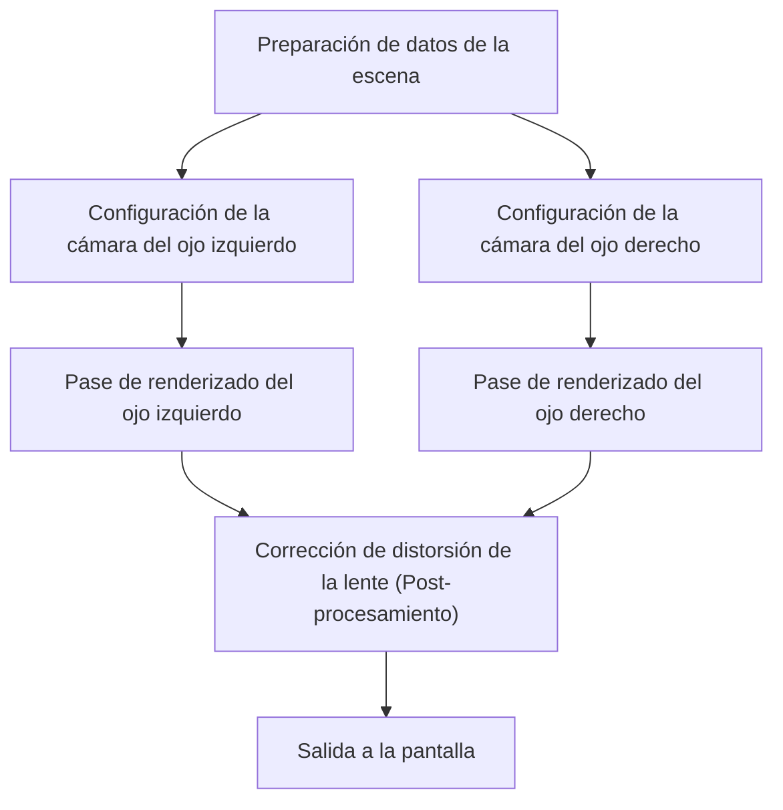

# La vanguardia de las tecnologías de renderizado que sustentan las experiencias inmersivas

La Realidad Aumentada (AR) y la Realidad Virtual (VR) ya no son tecnologías exclusivas de la ciencia ficción. Están transformando fundamentalmente nuestro mundo, abarcando desde la industria, la medicina y el entretenimiento hasta nuestra vida cotidiana. Sin embargo, para que estas tecnologías ofrezcan una verdadera sensación de "inmersión", se requiere de una generación de imágenes y un seguimiento (tracking) tan precisos que logren engañar por completo al cerebro humano.

En este artículo, profundizaremos detalladamente en los mecanismos de renderizado que conforman la tecnología central de la AR y la VR, así como en las tecnologías de reconocimiento espacial y los últimos métodos para la reducción de la carga computacional.

## El mecanismo de la visión estereoscópica binocular (Renderizado Estéreo) en la VR

Uno de los principales factores que permite a los seres humanos percibir la tridimensionalidad es la "disparidad binocular". Debido a que el ojo derecho y el izquierdo están separados por unos pocos centímetros, cada uno percibe el mundo desde un ángulo ligeramente distinto. Los cascos de realidad virtual (VR headsets) crean artificialmente esta disparidad binocular para generar una sensación de profundidad en una pantalla plana.

### Pipeline del renderizado estéreo

En el renderizado estéreo, fundamentalmente es necesario renderizar la misma escena dos veces: una para el ojo izquierdo y otra para el ojo derecho.

Dado que renderizar dos veces de manera simple duplica el coste computacional, las APIs gráficas modernas (como Vulkan, DirectX 12) y los motores de videojuegos han adoptado técnicas de optimización como el Single Pass Stereo (Estéreo de un solo pase) y el Multiview. Gracias a esto, el procesamiento de la geometría se realiza una sola vez y las diferencias entre la izquierda y la derecha se calculan únicamente en la etapa de los pixel shaders, logrando así una mejora drástica en el rendimiento.

## La importancia de la latencia Motion-to-Photon y el mareo en la VR

Uno de los indicadores más críticos en la realidad virtual es la "latencia Motion-to-Photon" (del movimiento a los fotones). Esto se refiere al tiempo de retraso que transcurre desde que el usuario mueve la cabeza hasta que la imagen que refleja ese movimiento llega a los ojos a través de la pantalla (en forma de fotones).

### El mecanismo del mareo en la VR (Simulator Sickness)

Cuando se produce una discrepancia entre el sentido vestibular humano (el sentido del equilibrio proporcionado por los canales semicirculares, etc.) y la información visual, el cerebro experimenta confusión, lo que provoca el "mareo de la VR", acompañado de náuseas y vértigo. Generalmente, se dice que cuando la latencia Motion-to-Photon supera los 20 milisegundos (ms), a los seres humanos les resulta más fácil percibir esta discrepancia.

Para reducir esta latencia, se utilizan enfoques y tecnologías como los siguientes:

- **Asynchronous Timewarp (ATW)**: Una tecnología que, incluso si la tasa de fotogramas disminuye, utiliza la información más reciente de la rotación de la cabeza para distorsionar la imagen ya renderizada, ocultando así el retraso visual.
- **Asynchronous Spacewarp (ASW)**: Una tecnología que predice no solo la rotación, sino también el movimiento de traslación (cambio de posición) de la cabeza para generar fotogramas intermedios.

## SLAM y el mapeo del entorno en la AR

Mientras que la VR renderiza un mundo virtual completamente artificial, la AR superpone información digital sobre el mundo real. Para lograr esto, el dispositivo necesita comprender con precisión "dónde se encuentra a sí mismo en el mundo real". La tecnología central que hace esto posible es SLAM (Simultaneous Localization and Mapping).

### Principios básicos de SLAM

SLAM es una tecnología que realiza simultáneamente la estimación de la propia posición (Localization) y la creación de un mapa del entorno (Mapping) mientras el dispositivo se mueve por un entorno desconocido.

Los teléfonos inteligentes (con ARKit o ARCore) y las gafas de AR utilizan principalmente un método llamado Visual-Inertial SLAM (VI-SLAM). Este método logra un seguimiento de alta velocidad y gran precisión mediante la integración (fusión de sensores) de la información visual proveniente de la cámara y de los datos de aceleración y velocidad angular de la IMU (Unidad de Medición Inercial). En los últimos años, los dispositivos equipados con escáneres LiDAR también se han popularizado, permitiendo un mapeo estable incluso en lugares oscuros o en paredes que carecen de características distintivas.

## Seguimiento ocular (Eye Tracking) y el Renderizado Foveado

A medida que las resoluciones de las pantallas mejoran a 4K y 8K, la carga sobre la GPU aumenta de manera exponencial. Un avance que está llamando la atención para superar este límite es el "Renderizado Foveado" (Foveated Rendering).

### Optimización aprovechando las características visuales humanas

En el ojo humano (específicamente en la retina), el área donde la resolución es más alta y los colores se perciben con mayor nitidez es una región extremadamente estrecha llamada "Fóvea" (Fovea), que abarca aproximadamente de 1 a 2 grados del campo visual. La visión periférica es muy sensible al movimiento, pero su capacidad para distinguir resoluciones y colores disminuye notablemente.

El Renderizado Foveado saca provecho de esta característica anatómica, renderizando en alta resolución únicamente el área central hacia la cual el usuario está mirando fijamente, mientras que reduce intencionalmente la resolución de las áreas periféricas.

1. **Seguimiento ocular (Eye Tracking)**: Una cámara infrarroja integrada en el casco de realidad virtual rastrea los movimientos de las pupilas del usuario en cuestión de milisegundos.
2. **Sombreado de tasa variable (Variable Rate Shading, VRS)**: Basándose en los datos del seguimiento ocular, la pantalla se divide en múltiples regiones; los shaders calculan cada píxel individualmente en el área central, mientras que en las áreas periféricas se agrupan varios píxeles para calcularlos en conjunto.

De este modo, es posible reducir drásticamente la carga de cálculo de renderizado (en algunos casos más del 50%), sin que el usuario perciba ninguna degradación en la calidad visual.

## Conclusión

Las tecnologías de renderizado para AR y VR están evolucionando gracias a una estrecha interrelación entre los avances del hardware y la optimización del software. El conjunto de estas tecnologías —que incluye la mejora en la eficiencia del renderizado estéreo, la reducción extrema de la latencia, el reconocimiento espacial avanzado mediante SLAM y la disminución de la carga computacional gracias al seguimiento ocular— engaña a nuestro cerebro para generar una profunda sensación de inmersión.

En el futuro, con la llegada del renderizado neuronal (Neural Rendering) impulsado por inteligencia artificial (Machine Learning) y de tecnologías de visualización más ligeras y de menor consumo energético, es muy probable que la AR y la VR sigan evolucionando hasta convertirse en infraestructuras cotidianas perfectamente integradas en nuestra vida diaria.
