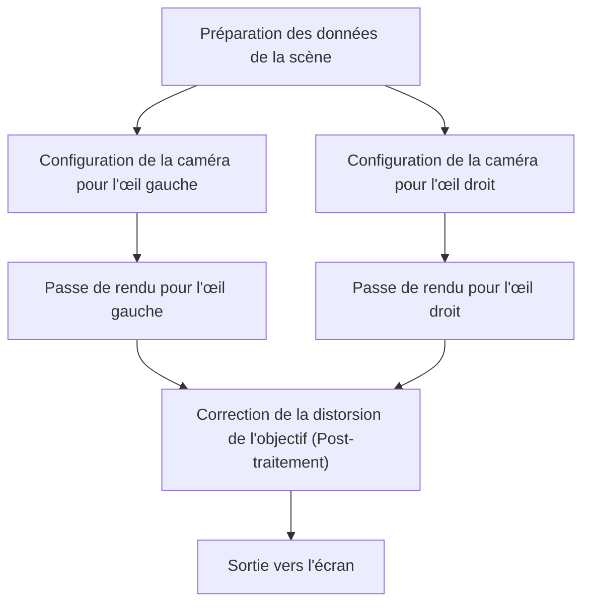
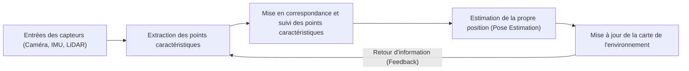

# L'avant-garde des Technologies de Rendu Soutenant les Expériences Immersives

La réalité augmentée (AR) et la réalité virtuelle (VR) ne relèvent plus du domaine de la science-fiction. Ces technologies sont en train de transformer fondamentalement notre monde, touchant à l'industrie, à la médecine, au divertissement, et même à notre vie quotidienne. Cependant, pour que ces technologies offrent un véritable sentiment d'« immersion », elles requièrent une génération d'images et un suivi d'une telle sophistication qu'ils parviennent à tromper complètement le cerveau humain.

Dans cet article, nous allons plonger au cœur des mécanismes de rendu qui constituent la technologie fondamentale de l'AR et de la VR, ainsi que des technologies de reconnaissance spatiale et des méthodes les plus récentes de réduction de la complexité des calculs.

## Le Mécanisme de la Vision Stéréoscopique (Rendu Stéréo) en VR

L'un des facteurs principaux permettant aux humains de percevoir la tridimensionnalité est la « disparité binoculaire ». Puisque l'œil droit et l'œil gauche sont séparés de quelques centimètres, chacun perçoit le monde sous un angle légèrement différent. Les casques de réalité virtuelle créent artificiellement cette disparité binoculaire pour générer de la profondeur sur un écran plat.

### Le Pipeline de Rendu Stéréoscopique

Dans le rendu stéréoscopique, il est fondamentalement nécessaire de faire le rendu de la même scène deux fois : une fois pour l'œil gauche et une fois pour l'œil droit.

Puisqu'un simple double rendu doublerait le coût de calcul, les API graphiques modernes (telles que Vulkan, DirectX 12) et les moteurs de jeux adoptent des techniques d'optimisation comme le Single Pass Stereo (stéréo en passe unique) ou le Multiview. Grâce à ces méthodes, le traitement de la géométrie n'est effectué qu'une seule fois, et les différences entre la gauche et la droite ne sont calculées qu'au stade du pixel shader, ce qui entraîne une amélioration drastique des performances.

## L'importance de la Latence Motion-to-Photon et le Mal de la VR

L'un des indicateurs les plus critiques en matière de VR est la « latence Motion-to-Photon » (du mouvement au photon). Cela fait référence au temps de retard qui s'écoule entre le moment où l'utilisateur bouge la tête et le moment où l'image reflétant ce mouvement atteint ses yeux via l'écran (les photons).

### Le Mécanisme du Mal de la VR (Mal des Simulateurs)

Lorsqu'un décalage se produit entre le système vestibulaire humain (le sens de l'équilibre géré par des organes tels que les canaux semi-circulaires) et les informations visuelles, le cerveau devient confus, provoquant le « mal de la VR », caractérisé par des nausées et des vertiges. Il est généralement admis que si la latence Motion-to-Photon dépasse 20 millisecondes (ms), les humains commencent à percevoir ce décalage de manière beaucoup plus flagrante.

Pour réduire cette latence, les technologies suivantes sont couramment utilisées :

- **Asynchronous Timewarp (ATW)** : Une technologie qui, même en cas de baisse du taux de rafraîchissement (framerate), masque le retard visuel en déformant l'image déjà rendue en utilisant les toutes dernières informations de rotation de la tête.
- **Asynchronous Spacewarp (ASW)** : Une technologie qui va au-delà de la simple rotation en prédisant également le mouvement de translation (changement de position) de la tête, générant ainsi des images intermédiaires pour maintenir la fluidité.

## SLAM et Cartographie de l'Environnement en AR

Alors que la VR restitue un monde virtuel entièrement artificiel, l'AR superpose des informations numériques sur le monde réel. Pour y parvenir, l'appareil doit déterminer avec précision « où il se trouve exactement dans le monde réel ». La technologie centrale rendant cela possible est le SLAM (Simultaneous Localization and Mapping, soit Localisation et Cartographie Simultanées).

### Les Principes Fondamentaux du SLAM

Le SLAM est une technologie qui réalise simultanément l'estimation de sa propre position (Localization) et la création d'une carte de l'environnement (Mapping) tout en se déplaçant dans un environnement inconnu.

Les smartphones (utilisant ARKit ou ARCore) et les lunettes AR utilisent principalement une méthode appelée Visual-Inertial SLAM (VI-SLAM). Cela intègre (via la fusion de capteurs) les informations visuelles provenant des caméras avec les données d'accélération et de vitesse angulaire provenant de l'IMU (Unité de Mesure Inertielle), permettant un suivi extrêmement rapide et précis. Récemment, les appareils équipés de scanners LiDAR se sont généralisés, permettant une cartographie stable même dans des endroits sombres ou face à des murs dépourvus de caractéristiques distinctives.

## Suivi Oculaire et Rendu Fovéal (Foveated Rendering)

À mesure que les résolutions d'écran augmentent pour atteindre la 4K et la 8K, la charge de travail imposée au processeur graphique (GPU) s'accroît de manière exponentielle. Le « rendu fovéal » (Foveated Rendering) est sous les feux de la rampe comme la percée majeure permettant de surmonter cette limitation physique.

### Optimisation Utilisant les Caractéristiques Visuelles Humaines

Dans l'œil humain (la rétine), la zone offrant la plus haute résolution et capable de percevoir les couleurs de manière vive se limite à une région extrêmement étroite (environ 1 à 2 degrés de champ de vision) appelée la « fovéa » (Fovea). Bien que la vision périphérique soit très sensible au mouvement, sa capacité à résoudre les détails et à identifier les couleurs est considérablement réduite.

Le rendu fovéal tire parti de cette caractéristique physiologique en effectuant le rendu de la zone centrale que l'utilisateur regarde en haute résolution, tout en abaissant intentionnellement la qualité et la résolution des zones périphériques.

1. **Suivi oculaire (Eye Tracking)** : Des caméras infrarouges intégrées dans le casque suivent les mouvements des pupilles de l'utilisateur à la milliseconde près.
2. **Ombrage à Taux Variable (Variable Rate Shading - VRS)** : En se basant sur les données du suivi oculaire, l'écran est divisé en plusieurs régions. La zone centrale calcule l'ombrage pour chaque pixel individuellement, tandis que les zones périphériques regroupent plusieurs pixels pour effectuer un seul calcul conjoint.

Grâce à cette approche ingénieuse, il est possible de réduire drastiquement la charge de calcul du rendu (parfois de plus de 50 %), et ce, sans que l'utilisateur ne ressente la moindre dégradation de la qualité visuelle.

## Conclusion

Les technologies de rendu pour l'AR et la VR évoluent grâce à une interaction étroite et synergique entre les avancées matérielles (hardware) et les optimisations logicielles (software). L'efficacité accrue du rendu stéréoscopique, la réduction de la latence poussée à son extrême limite, la reconnaissance spatiale avancée alimentée par le SLAM, et l'économie impressionnante de calcul rendue possible par le suivi oculaire : l'agrégation de toutes ces technologies parvient à tromper efficacement notre cerveau et à engendrer une sensation d'immersion profonde.

À l'avenir, avec l'émergence du rendu neuronal s'appuyant sur l'intelligence artificielle (apprentissage automatique) et l'apparition de technologies d'affichage plus légères et plus économes en énergie, l'AR et la VR continueront de se développer pour devenir une infrastructure omniprésente, s'intégrant naturellement et sans effort dans notre quotidien.
