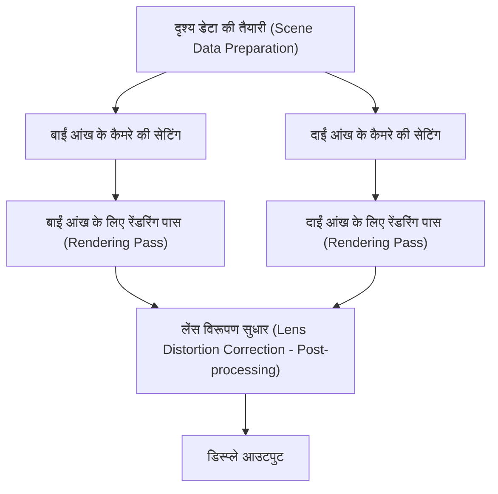
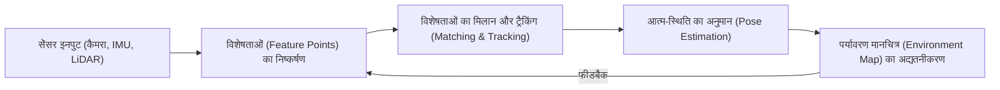

# इमर्सिव अनुभव (Immersive Experience) को आधार देने वाली रेंडरिंग तकनीक का अग्रिम मोर्चा

एआर (ऑगमेंटेड रियलिटी) और वीआर (वर्चुअल रियलिटी) अब केवल विज्ञान कथा (sci-fi) की दुनिया की तकनीकें नहीं रह गई हैं। ये उद्योग, चिकित्सा, मनोरंजन और यहां तक कि हमारे दैनिक जीवन को बुनियादी तौर पर बदल रही हैं। हालाँकि, इन तकनीकों द्वारा एक सच्चा 'इमर्सिव' (Immersive) या डूब जाने वाला अनुभव प्रदान करने के लिए, इतनी परिष्कृत छवि निर्माण और ट्रैकिंग की आवश्यकता होती है जो मानव मस्तिष्क को पूरी तरह से धोखा दे सके।

इस लेख में, हम एआर और वीआर का समर्थन करने वाली मुख्य तकनीकों जैसे रेंडरिंग तंत्र, स्थानिक मान्यता (Spatial Recognition) तकनीक और गणना की मात्रा (Computational Load) को कम करने के नवीनतम तरीकों पर गहराई से चर्चा करेंगे।

## वीआर में बायनेक्युलर स्टीरियोस्कोपिक विजन (स्टीरियो रेंडरिंग) का तंत्र

मानव द्वारा 3D (त्रि-आयामी) वस्तुओं को पहचानने का एक प्रमुख कारण 'बायनेक्युलर पैरलेक्स' (Binocular Parallax) या द्विनेत्रीय विसंगति है। क्योंकि हमारी दाईं और बाईं आंखें एक-दूसरे से कुछ सेंटीमीटर की दूरी पर होती हैं, वे दोनों दुनिया को थोड़े अलग कोण से देखती हैं। वीआर हेडसेट कृत्रिम रूप से इसी बायनेक्युलर पैरलेक्स को उत्पन्न करके एक फ्लैट डिस्प्ले में गहराई (Depth) का भ्रम पैदा करते हैं।

### स्टीरियो रेंडरिंग की पाइपलाइन (Stereo Rendering Pipeline)

स्टीरियो रेंडरिंग में, मूल रूप से एक ही दृश्य (Scene) को दो बार रेंडर करना आवश्यक होता है: एक बार बाईं आंख के लिए और एक बार दाईं आंख के लिए।

चूंकि दृश्य को दो बार रेंडर करने से गणना की लागत (Computational Cost) दोगुनी हो जाती है, इसलिए आधुनिक ग्राफिक्स एपीआई (जैसे Vulkan, DirectX 12) और गेम इंजन सिंगल पास स्टीरियो (Single Pass Stereo) या मल्टीव्यू (Multiview) जैसी अनुकूलन (Optimization) तकनीकों का उपयोग करते हैं। इससे ज्यामिति (Geometry) का प्रसंस्करण केवल एक बार किया जाता है, और पिक्सेल शेडर के स्तर पर केवल बाएँ और दाएँ के बीच के अंतर की गणना की जाती है, जिससे प्रदर्शन में उल्लेखनीय सुधार होता है।

## मोशन-टू-फोटॉन लेटेंसी का महत्व और वीआर सिकनेस (VR Sickness)

वीआर में सबसे महत्वपूर्ण मेट्रिक्स में से एक 'मोशन-टू-फोटॉन लेटेंसी' (Motion-to-Photon Latency) है। यह वह विलंब समय (Delay time) है जो उपयोगकर्ता द्वारा अपना सिर हिलाने और उस गति को दर्शाने वाली छवि के डिस्प्ले (फोटॉन या प्रकाश कण) के माध्यम से आँखों तक पहुँचने के बीच लगता है।

### वीआर सिकनेस (सिम्युलेटर सिकनेस) का तंत्र

जब मानव की वेस्टिबुलर प्रणाली (आंतरिक कान के अर्धवृत्ताकार नलिकाओं आदि द्वारा संतुलन की भावना) और दृश्य सूचना के बीच कोई विसंगति होती है, तो मस्तिष्क भ्रमित हो जाता है, जिससे मतली और चक्कर आना जैसे 'वीआर सिकनेस' के लक्षण उत्पन्न होते हैं। आमतौर पर, यह माना जाता है कि यदि मोशन-टू-फोटॉन लेटेंसी 20 मिलीसेकंड (ms) से अधिक हो जाती है, तो मनुष्य इस विसंगति को आसानी से महसूस करने लगता है।

लेटेंसी (Latency) को कम करने के लिए निम्नलिखित तकनीकों का उपयोग किया जाता है:

- **एसिंक्रोनस टाइमवार्प (Asynchronous Timewarp - ATW)**: यह एक ऐसी तकनीक है जिसमें यदि फ्रेम रेट गिर भी जाता है, तो सिर के घुमाव (Rotation) की नवीनतम जानकारी का उपयोग करके पहले से रेंडर की गई छवि को विकृत कर दिया जाता है, जिससे दृश्य विलंब छिप जाता है।
- **एसिंक्रोनस स्पेसवार्प (Asynchronous Spacewarp - ASW)**: यह न केवल घुमाव की भविष्यवाणी करता है, बल्कि सिर के स्थानांतरीय विस्थापन (Translation movement या स्थिति परिवर्तन) का भी अनुमान लगाता है और मध्यवर्ती फ्रेम उत्पन्न करता है।

## एआर में SLAM और एनवायरनमेंट मैपिंग

जहाँ वीआर एक पूरी तरह से कृत्रिम आभासी दुनिया का निर्माण और चित्रण करता है, वहीं एआर वास्तविक दुनिया के ऊपर डिजिटल जानकारी को ओवरले (Overlay) करता है। इसके लिए, यह आवश्यक है कि डिवाइस सटीक रूप से यह समझे कि 'वह वास्तविक दुनिया में कहाँ स्थित है'। इसे संभव बनाने वाली मुख्य तकनीक SLAM (सिमल्टेनियस लोकलाइजेशन एंड मैपिंग - Simultaneous Localization and Mapping) है।

### SLAM के मूल सिद्धांत

SLAM एक ऐसी तकनीक है जो किसी अज्ञात वातावरण में घूमते समय एक साथ आत्म-स्थिति का अनुमान (Localization) लगाती है और उस वातावरण का नक्शा (Mapping) बनाती है।

स्मार्टफोन (जैसे ARKit, ARCore) और एआर ग्लास मुख्य रूप से विजुअल-इनर्शियल SLAM (Visual-Inertial SLAM या VI-SLAM) नामक एक विधि का उपयोग करते हैं। यह कैमरे से मिलने वाली दृश्य सूचनाओं को IMU (इनर्शियल मेजरमेंट यूनिट) से प्राप्त त्वरण और कोणीय वेग डेटा के साथ एकीकृत (सेंसर फ्यूजन) करता है, जिससे उच्च गति और उच्च सटीकता वाली ट्रैकिंग प्राप्त होती है। हाल के वर्षों में, LiDAR स्कैनर से लैस उपकरणों का चलन भी बढ़ा है, जो अंधेरे स्थानों या बिना किसी विशिष्ट विशेषता वाली दीवारों पर भी स्थिर मैपिंग को संभव बनाता है।

## आई ट्रैकिंग और फोविएटेड रेंडरिंग (Foveated Rendering)

जैसे-जैसे डिस्प्ले का रिज़ॉल्यूशन 4K और 8K तक बढ़ता जा रहा है, GPU पर लोड भी तेजी से (घातीय रूप से) बढ़ता है। इस सीमा को पार करने के लिए एक महत्वपूर्ण सफलता (Breakthrough) के रूप में जिस तकनीक पर ध्यान केंद्रित किया जा रहा है, वह है 'फोविएटेड रेंडरिंग' (Foveated Rendering)।

### मानव दृश्य विशेषताओं का उपयोग करके अनुकूलन (Optimization)

मानव आंख (रेटिना) में, सबसे उच्च रिज़ॉल्यूशन और रंगों को स्पष्ट रूप से पहचानने की क्षमता केवल एक बहुत ही संकीर्ण क्षेत्र में होती है जिसे 'फोविया' (Fovea) कहा जाता है (जो दृश्य कोण का लगभग 1 से 2 डिग्री होता है)। हमारी परिधीय दृष्टि (Peripheral Vision) गति के प्रति बहुत संवेदनशील होती है, लेकिन इसके रिज़ॉल्यूशन और रंग पहचान क्षमता में भारी कमी आ जाती है।

फोविएटेड रेंडरिंग इसी विशेषता का लाभ उठाती है; यह केवल उस केंद्रीय भाग को उच्च रिज़ॉल्यूशन में रेंडर करती है जिसे उपयोगकर्ता देख रहा होता है, और परिधीय भागों के रिज़ॉल्यूशन को जानबूझकर कम कर देती है।

1. **आई ट्रैकिंग (Eye Tracking)**: हेडसेट में निर्मित एक इन्फ्रारेड कैमरा मिलीसेकंड के स्तर पर उपयोगकर्ता की पुतलियों की गति को ट्रैक करता है।
2. **वेरिएबल रेट शेडिंग (VRS - Variable Rate Shading)**: आई ट्रैकिंग डेटा के आधार पर, स्क्रीन को कई क्षेत्रों में विभाजित किया जाता है। केंद्र के लिए प्रत्येक पिक्सेल पर शेडर की गणना की जाती है, जबकि परिधि (किनारों) के लिए कई पिक्सेल को एक साथ मिलाकर गणना की जाती है।

इससे रेंडरिंग के दौरान होने वाले कम्प्यूटेशनल लोड को नाटकीय रूप से (कुछ मामलों में 50% से अधिक) कम करना संभव हो जाता है, बिना उपयोगकर्ता को दृश्य गुणवत्ता में किसी भी प्रकार की गिरावट का अनुभव कराए।

## निष्कर्ष

एआर और वीआर की रेंडरिंग तकनीकें हार्डवेयर इवोल्यूशन और सॉफ्टवेयर ऑप्टिमाइजेशन के साथ गहराई से जुड़कर विकसित हो रही हैं। स्टीरियो रेंडरिंग की दक्षता, लेटेंसी को न्यूनतम संभव स्तर तक कम करना, SLAM के माध्यम से उन्नत स्थानिक पहचान, और आई ट्रैकिंग का उपयोग करके कम्प्यूटेशनल लोड को कम करना — इन सभी तकनीकों का समामेलन हमारे मस्तिष्क को धोखा देने और एक गहरा इमर्सिव अनुभव उत्पन्न करने का कार्य करता है।

भविष्य में, एआई (मशीन लर्निंग) का उपयोग करने वाली न्यूरल रेंडरिंग और हल्के, कम-बिजली खपत वाले डिस्प्ले तकनीकों के आने के साथ, एआर और वीआर और भी अधिक विकसित होंगे और हमारे रोजमर्रा के जीवन के बुनियादी ढांचे में पूरी तरह से घुलमिल जाएंगे।
