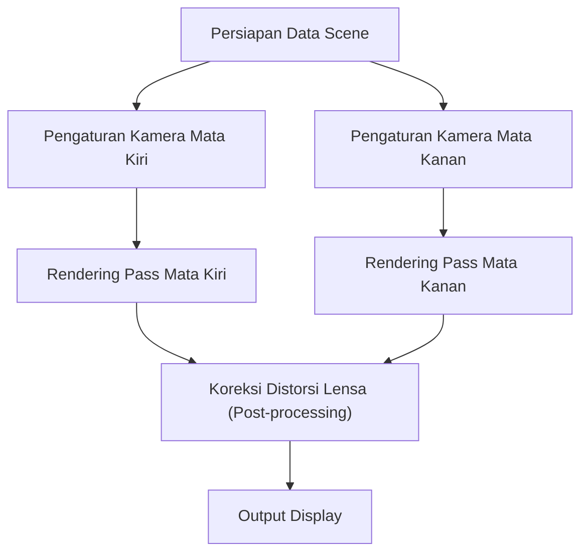
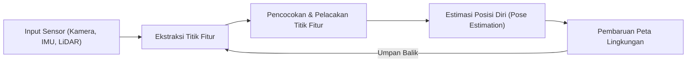

# Garis Depan Teknologi Rendering yang Mendukung Pengalaman Imersif

Augmented Reality (AR) dan Virtual Reality (VR) kini bukan lagi sekadar teknologi dari dunia fiksi ilmiah (sci-fi). Dari sektor industri, medis, hiburan, hingga kehidupan kita sehari-hari, teknologi-teknologi ini sedang bertransformasi dan mengubah dunia kita secara fundamental. Namun, agar teknologi ini dapat memberikan rasa "imersif" yang sesungguhnya, diperlukan sistem pelacakan (tracking) dan pembuatan citra visual yang begitu presisi dan canggih, sedemikian rupa hingga mampu mengelabui otak manusia secara sempurna.

Dalam artikel ini, kita akan menggali lebih dalam dan membahas secara komprehensif mengenai mekanisme rendering yang menjadi inti dari teknologi pendukung AR dan VR, teknologi pengenalan ruang (spatial awareness), serta metode-metode terbaru untuk mengurangi beban komputasi.

## Mekanisme Penglihatan Stereoskopik Binokular (Stereo Rendering) pada VR

Salah satu faktor utama yang memungkinkan manusia mengenali objek dalam tiga dimensi adalah "disparitas binokular" (binocular disparity). Karena mata kanan dan mata kiri terpisah sejauh beberapa sentimeter, masing-masing mata melihat dunia dari sudut pandang yang sedikit berbeda. Headset VR menciptakan disparitas binokular ini secara buatan untuk menghasilkan ilusi kedalaman ruang pada layar layar datar.

### Pipeline dari Stereo Rendering

Dalam proses stereo rendering, pada dasarnya kita harus melakukan rendering pada adegan (scene) yang sama sebanyak dua kali, yakni satu untuk mata kiri dan satu lagi untuk mata kanan.

Jika kita hanya secara sederhana merender dua kali, biaya komputasi yang dibutuhkan juga akan meningkat dua kali lipat. Oleh karena itu, API grafis modern (seperti Vulkan, DirectX 12, dll.) serta berbagai game engine mengadopsi teknologi optimasi tingkat lanjut seperti Single Pass Stereo atau Multiview. Dengan teknik ini, pemrosesan geometri hanya perlu dilakukan satu kali saja, dan perbedaan tampilan antara mata kiri dan kanan hanya akan dihitung pada tahap pixel shader. Hal ini menghasilkan peningkatan performa yang sangat signifikan tanpa mengorbankan kualitas visual.

## Pentingnya Latensi Motion-to-Photon dan Efek Mabuk VR (VR Sickness)

Salah satu metrik yang paling kritis dalam dunia VR adalah latensi "Motion-to-Photon". Istilah ini merujuk pada waktu jeda atau penundaan sejak pengguna menggerakkan kepalanya, hingga citra visual yang mencerminkan gerakan tersebut berhasil dipancarkan oleh layar sebagai partikel cahaya (Foton) dan masuk ke dalam mata pengguna.

### Mekanisme Mabuk VR (Simulator Sickness)

Ketika terjadi ketidaksesuaian atau diskrepansi antara informasi visual yang diterima oleh mata dan sistem vestibular (indra keseimbangan melalui saluran semisirkular di telinga dalam), otak manusia akan mengalami kebingungan. Hal ini memicu gejala mual dan pusing yang sering kita kenal dengan istilah "mabuk VR" (VR sickness). Secara umum, apabila latensi Motion-to-Photon melebihi ambang batas 20 milidetik (ms), manusia akan dengan mudah merasakan dan menyadari ketidakselarasan tersebut, yang pada akhirnya memicu rasa tidak nyaman.

Sebagai upaya dan pendekatan untuk meminimalisir latensi ini, beberapa teknologi canggih berikut telah diterapkan secara luas:

- **Asynchronous Timewarp (ATW)**: Sebuah teknologi mutakhir di mana, meskipun frame rate mengalami penurunan, sistem akan menggunakan data informasi rotasi kepala terbaru untuk mendistorsi (memelintir) gambar yang telah dirender sebelumnya. Tujuannya adalah untuk menyembunyikan atau menutupi keterlambatan visual agar pergerakan tetap terasa responsif.
- **Asynchronous Spacewarp (ASW)**: Tidak hanya memperhitungkan rotasi, teknologi ini juga memprediksi pergeseran translasional dari kepala (perubahan posisi dalam ruang 3D) untuk menyintesis atau menghasilkan frame-frame perantara (interpolasi), menjaga kelancaran animasi secara utuh.

## SLAM dan Pemetaan Lingkungan pada AR

Berbeda dengan VR yang merender dan menggambar sebuah dunia maya yang sepenuhnya buatan, AR (Augmented Reality) bekerja dengan cara menempatkan dan menumpuk informasi digital di atas dunia nyata. Untuk dapat melakukan hal ini dengan mulus, perangkat harus mampu secara presisi memahami "di mana posisi dirinya sendiri berada di dalam dunia nyata". Teknologi inti yang merealisasikan kemampuan ini disebut SLAM (Simultaneous Localization and Mapping).

### Prinsip Dasar SLAM

SLAM adalah teknologi yang memungkinkan sebuah sistem atau perangkat untuk bergerak menelusuri lingkungan yang belum dipetakan sebelumnya, seraya secara bersamaan melakukan estimasi posisi dirinya sendiri (Localization) sekaligus membangun peta lingkungan di sekitarnya (Mapping).

Perangkat seperti ponsel pintar (menggunakan ARKit, ARCore) serta kacamata pintar AR umumnya memanfaatkan metode yang dikenal sebagai Visual-Inertial SLAM (VI-SLAM). Metode ini bekerja dengan menggabungkan (melalui proses sensor fusion) informasi visual yang didapat dari kamera dengan data percepatan dan kecepatan sudut dari sensor IMU (Inertial Measurement Unit). Kombinasi ini menghasilkan sistem pelacakan yang tidak hanya sangat cepat tetapi juga memiliki tingkat akurasi yang tinggi. Dalam beberapa tahun terakhir, penyebaran perangkat yang telah dilengkapi dengan pemindai LiDAR semakin masif, yang memungkinkan proses pemetaan berjalan dengan sangat stabil bahkan di kondisi lingkungan minim cahaya (gelap) atau pada permukaan dinding polos yang minim titik fitur (feature points).

## Pelacakan Mata (Eye Tracking) dan Foveated Rendering

Seiring dengan peningkatan resolusi layar secara drastis, mulai dari 4K hingga mencapai 8K, beban kerja (workload) komputasi yang ditanggung oleh GPU (Graphics Processing Unit) ikut meningkat secara eksponensial. Terobosan yang tengah menjadi sorotan utama untuk menembus batasan performa ini adalah apa yang disebut dengan "Foveated Rendering" (Rendering berbasis Fovea atau penglihatan sentral).

### Optimasi Melalui Pemanfaatan Karakteristik Visual Manusia

Pada anatomi mata manusia (khususnya retina), area yang memiliki ketajaman (resolusi) tertinggi dan kemampuan paling peka dalam mengenali warna secara presisi adalah area sangat sempit yang dinamakan "Fovea" (mencakup sudut pandang pandangan sentral hanya sekitar 1 hingga 2 derajat). Sementara itu, meskipun area penglihatan perifer (tepi) sangat sensitif terhadap suatu gerakan, namun kemampuannya untuk mendeteksi detail, ketajaman, atau membedakan warna menurun secara drastis.

Foveated rendering memanfaatkan karakteristik biologis penglihatan ini. Teknologi ini bekerja dengan memfokuskan proses rendering pada resolusi sangat tinggi hanya di titik pusaran di mana pengguna sedang menatap langsung, dan secara sengaja menurunkan tingkat resolusi grafis pada area pandangan perifer (pinggiran) yang tidak terlalu diperhatikan secara detail.

1. **Pelacakan Mata (Eye Tracking)**: Kamera inframerah yang disematkan dan terintegrasi di dalam headset akan terus melacak serta memantau pergerakan pupil mata dari pengguna dengan tingkat presisi hingga orde milidetik (millisecond).
2. **Variable Rate Shading (VRS)**: Berdasarkan aliran data berkecepatan tinggi dari pelacakan mata, layar kemudian dibagi menjadi sejumlah zona berbeda. Pada zona sentral fovea, shader dikalkulasi secara presisi untuk setiap piksel individu, sementara di zona pinggiran pandangan, shader akan dikelompokkan dan dikalkulasi secara gabungan untuk memangkas pemrosesan.

Berkat sistem ini, pengguna tidak akan merasakan atau menyadari adanya penurunan kualitas maupun detail visual sama sekali. Akan tetapi, di balik layar, beban komputasi rendering pada GPU berhasil dipangkas secara dramatis (bahkan bisa melebihi 50% dalam berbagai skenario aplikasi).

## Kesimpulan

Teknologi rendering yang menjadi tulang punggung AR dan VR terus berevolusi dan berkembang secara dinamis, dipacu oleh sinergi yang erat antara inovasi perangkat keras (hardware) dan optimasi perangkat lunak (software). Segala hal mulai dari efisiensi yang didapat melalui stereo rendering yang canggih, pemangkasan ekstrem pada tingkat latensi visual, pengenalan serta pemetaan tata ruang tingkat tinggi dengan dukungan sistem SLAM, hingga pengurangan cerdas atas beban kalkulasi yang difasilitasi oleh pelacakan mata (eye tracking)—seluruh akumulasi dan fusi dari berbagai teknologi mutakhir inilah yang pada akhirnya mampu memanipulasi serta mengelabui kinerja persepsi otak kita untuk melahirkan tingkat keimersifan (immersion) yang begitu memukau dan realistis.

Di masa depan, seiring dengan kehadiran inovasi-inovasi luar biasa seperti neural rendering yang digerakkan oleh kecerdasan buatan (Machine Learning) beserta penemuan teknologi panel layar super ringan berdaya rendah, AR dan VR diperkirakan akan bertransformasi dari sekadar alat mutakhir menjadi bagian dari infrastruktur mendasar—menyatu dengan sangat alami ke dalam rutinitas keseharian kita dan memberikan pengalaman digital tanpa batas yang tidak pernah terbayangkan sebelumnya.
