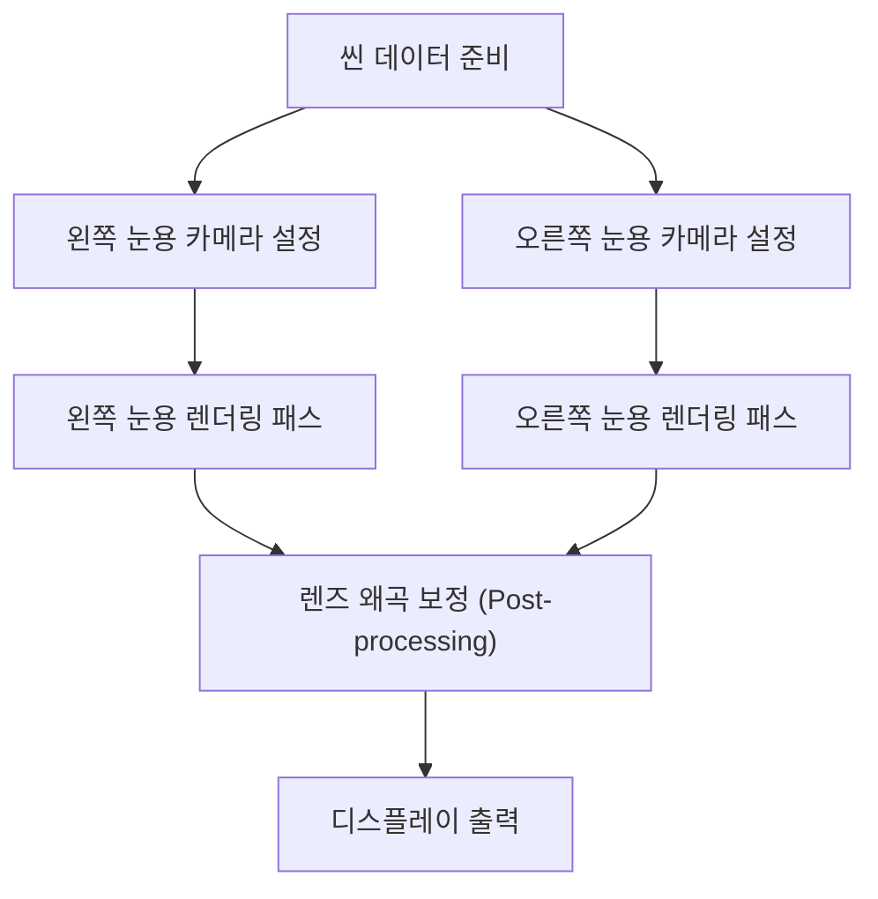
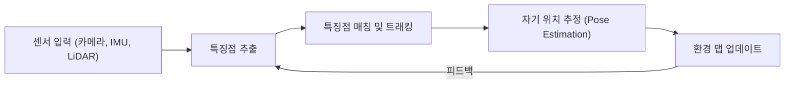

# 몰입형 경험을 뒷받침하는 렌더링 기술의 최전선

AR(증강현실)과 VR(가상현실)은 더 이상 공상과학(SF) 세계만의 기술이 아닙니다. 산업, 의료, 엔터테인먼트, 그리고 일상생활에 이르기까지 우리의 세계를 근본적으로 변화시키고 있습니다. 하지만 이러한 기술들이 진정한 '몰입감'을 제공하기 위해서는 인간의 뇌를 완전히 속일 수 있을 만큼 정교한 영상 생성과 트래킹 기술이 필수적입니다.

본 기사에서는 AR 및 VR을 지탱하는 핵심 기술인 렌더링의 원리, 공간 인식 기술, 그리고 최신 연산량 절감 기법에 대해 깊이 있게 파헤치고 상세히 해설합니다.

## VR에서의 양안 입체시(스테레오 렌더링)의 원리

인간이 입체를 인식하는 주요 요인 중 하나가 바로 '양안 시차'입니다. 오른쪽 눈과 왼쪽 눈은 수 센티미터 떨어져 있기 때문에, 각각 아주 약간 다른 각도에서 세상을 바라보게 됩니다. VR 헤드셋은 이러한 양안 시차를 인공적으로 만들어냄으로써 평면 디스플레이에 깊이감을 부여합니다.

### 스테레오 렌더링 파이프라인

스테레오 렌더링에서는 기본적으로 동일한 씬(Scene)을 왼쪽 눈용과 오른쪽 눈용으로 총 2회 렌더링해야 합니다.

단순히 2회 렌더링을 수행하면 연산 비용이 2배로 증가하므로, 현대의 그래픽스 API(Vulkan, DirectX 12 등)나 게임 엔진들은 Single Pass Stereo(싱글 패스 스테레오)나 Multiview와 같은 최적화 기술을 채택하고 있습니다. 이를 통해 지오메트리 처리를 단 1회로 끝내고 픽셀 셰이더 단계에서만 좌우의 차이를 계산하도록 하여, 대폭적인 성능 향상을 도모하고 있습니다.

## Motion-to-Photon 지연시간의 중요성과 VR 멀미

VR에서 가장 중요하고 결정적인 지표 중 하나가 바로 'Motion-to-Photon 지연시간(레이턴시)'입니다. 이는 사용자가 머리를 움직인 순간부터, 그 움직임이 반영된 영상이 디스플레이(광자=Photon)를 통해 눈에 도달하기까지의 지연 시간을 의미합니다.

### VR 멀미(시뮬레이터 멀미)의 메커니즘

인간의 전정 감각(반고리관 등에 의한 평형 감각)과 시각 정보 사이에 괴리가 발생하면, 뇌는 혼란을 겪게 되고 구역질이나 현기증과 같은 'VR 멀미'를 일으키게 됩니다. 일반적으로 Motion-to-Photon 지연시간이 20밀리초(ms)를 초과하게 되면, 인간은 이러한 괴리감을 쉽게 인지하게 된다고 알려져 있습니다.

지연시간을 줄이기 위한 접근법으로서 다음과 같은 기술들이 사용되고 있습니다.

- **비동기 타임워프 (Asynchronous Timewarp, ATW)**: 프레임 속도(프레임 레이트)가 저하된 경우에도 최신의 머리 회전 정보를 사용하여 이미 렌더링된 이미지를 왜곡시킴으로써, 시각적인 지연을 은폐하는 기술입니다.
- **비동기 스페이스워프 (Asynchronous Spacewarp, ASW)**: 머리의 회전뿐만 아니라 병진 운동(위치의 변화)까지 예측하여 중간 프레임을 생성해내는 기술입니다.

## AR에서의 SLAM과 환경 매핑

VR이 완전히 인공적인 가상 세계를 렌더링하는 반면, AR은 현실 세계 위에 디지털 정보를 겹쳐서 표시합니다. 이를 위해서는 기기가 '자기 자신이 현실 세계의 어디에 위치해 있는지'를 정확하게 파악해야만 합니다. 이것을 실현하는 핵심 기술이 바로 SLAM(Simultaneous Localization and Mapping, 동시적 위치 추정 및 지도 작성)입니다.

### SLAM의 기본 원리

SLAM은 미지의 환경을 이동하면서 자기 위치의 추정(Localization)과 환경 지도의 작성(Mapping)을 동시에 수행하는 기술입니다.

스마트폰(ARKit, ARCore)이나 AR 글래스는 Visual-Inertial SLAM(VI-SLAM)이라고 불리는 기법을 주로 사용합니다. 이는 카메라로부터 얻은 시각 정보와 IMU(관성 측정 장치)로부터 얻은 가속도 및 각속도 정보를 통합(센서 퓨전)함으로써, 고속이면서도 고정밀의 트래킹을 실현하는 방식입니다. 최근에는 LiDAR 스캐너를 탑재한 기기도 보급되어, 어두운 장소나 특징점이 없는 밋밋한 벽 등에서도 안정적인 매핑이 가능해졌습니다.

## 시선 추적(Eye Tracking)과 포비티드 렌더링(Foveated Rendering)

디스플레이의 해상도가 4K, 8K로 향상됨에 따라 GPU에 가해지는 부하는 지수함수적으로 증대됩니다. 이러한 물리적 한계를 돌파하기 위한 혁신적인 브레이크스루로서 주목받고 있는 것이 바로 '포비티드 렌더링(Foveated Rendering, 중심와 렌더링)'입니다.

### 인간의 시각 특성을 이용한 최적화

인간의 눈(망막)에서 가장 해상도가 높고 색상을 선명하게 인식할 수 있는 부위는 '중심와(Fovea)'라고 불리는 아주 좁은 영역(시야각으로 따지면 약 1~2도)뿐입니다. 주변 시야는 움직임에는 민감하게 반응하지만, 해상도나 색상 식별 능력은 현저하게 떨어집니다.

포비티드 렌더링은 이러한 시각적 특성을 역이용하여, 사용자가 응시하고 있는 중심 부분만을 고해상도로 렌더링하고, 주변 부분의 해상도는 의도적으로 낮추는 기술입니다.

1. **시선 추적 (Eye Tracking)**: 헤드셋에 내장된 적외선 카메라가 사용자의 동공 움직임을 밀리초 단위로 정밀하게 추적합니다.
2. **가변 비율 셰이딩 (Variable Rate Shading, VRS)**: 시선 추적 데이터를 기반으로 화면을 여러 영역으로 분할하여, 중심부는 1픽셀마다 셰이더 연산을 수행하고, 주변부는 여러 픽셀을 묶어서 한 번에 연산합니다.

이를 통해 사용자에게는 시각적인 품질 저하를 느끼게 하지 않으면서도, 렌더링의 연산 부하를 극적으로 절감(경우에 따라서는 50% 이상)하는 것이 가능해집니다.

## 요약 및 결론

AR 및 VR의 렌더링 기술은 하드웨어의 진화와 소프트웨어의 최적화가 긴밀하게 얽혀 상호 작용하며 발전하고 있습니다. 스테레오 렌더링의 효율화, 지연시간의 극단적인 절감, SLAM을 통한 고도화된 공간 인식, 그리고 시선 추적을 활용한 연산량 절감 등, 이러한 첨단 기술들의 집합체가 우리의 뇌를 완벽하게 속이고 깊은 몰입감을 창출해 내고 있습니다.

앞으로 AI(기계 학습)를 적극적으로 활용한 뉴럴 렌더링이나 더욱 경량화되고 소비 전력이 낮은 디스플레이 기술이 등장함에 따라, AR과 VR은 한층 더 일상 속에 자연스럽게 녹아든 당연한 인프라로 진화해 나갈 것입니다.
